# 桌面端 OAuth 登录分析报告

## 一、现有实现分析

### 当前 OneKey 桌面端 OAuth 架构

根据 [`openOAuthPopupDesktop.tsx`](packages/kit/src/components/OneKeyAuth/openOAuthPopupDesktop.tsx) 和 [`apps/desktop/app/app.ts`](apps/desktop/app/app.ts)，当前实现了两种方式：

```mermaid
flowchart TB
    subgraph DesktopOAuth [Desktop OAuth Methods]
        direction TB
        
        subgraph WebviewMethod [WEBVIEW Method - Recommended]
            W1[Create Overlay Container] --> W2[Embed Webview Element]
            W2 --> W3[Load OAuth URL in Webview]
            W3 --> W4[Listen did-start-navigation]
            W4 --> W5{URL matches callback?}
            W5 -->|Yes| W6[Stop Navigation & Extract Tokens]
            W5 -->|No| W4
        end
        
        subgraph DeepLinkMethod [DEEP_LINK Method]
            D1[Register IPC Listener] --> D2[Open System Browser]
            D2 --> D3[User Completes OAuth]
            D3 --> D4[Browser Redirects to onekey-wallet://]
            D4 --> D5[System Routes to Electron App]
            D5 --> D6[IPC Event Received]
            D6 --> D7[Extract Tokens from URL]
        end
    end
```

**方式 1: WEBVIEW (推荐)**

- 在应用内创建 `<webview>` 元素加载 OAuth 页面
- 监听 `did-start-navigation` 事件拦截回调 URL
- 当 URL 匹配 `onekey-wallet://auth/callback` 时停止导航并提取 token
- 优点：用户体验好，无需系统级协议注册

**方式 2: DEEP_LINK**

- 打开系统浏览器完成 OAuth
- 通过 `app.setAsDefaultProtocolClient('onekey-wallet')` 注册协议
- 系统将 `onekey-wallet://auth/callback` 路由回 Electron 应用
- 通过 IPC (`EVENT_OPEN_URL`) 接收回调

### file:// 协议的影响

当前桌面端应用在生产环境使用 `file://` 协议加载：

```typescript
// apps/desktop/app/app.ts (line 555-561)
const src = isDev
  ? 'http://localhost:3001/'
  : formatUrl({
      pathname: bundleIndexHtmlPath || 'index.html',
      protocol: 'file',
      slashes: true,
    });
```

**关键点**：`file://` 协议本身不影响 OAuth 流程，因为：

1. **WEBVIEW 方式**：webview 独立加载远程 OAuth URL，与主窗口协议无关
2. **DEEP_LINK 方式**：系统浏览器独立工作，回调通过操作系统协议处理器

---

## 二、Claude Code CLI 登录原理

Claude Code CLI 使用的是 **本地 HTTP 服务器 + 浏览器回调** 模式：

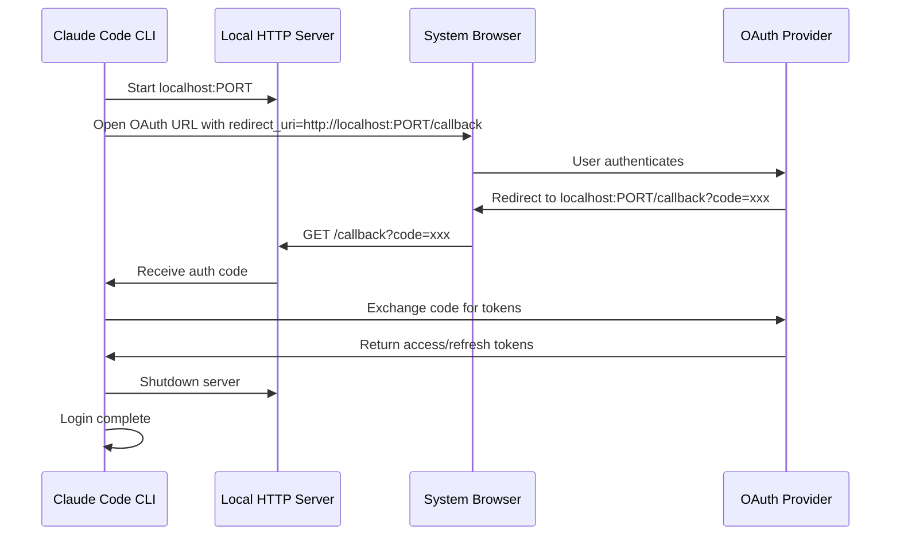


### 核心原理

1. **启动本地 HTTP 服务器**：CLI 在本地随机端口启动临时 HTTP 服务器
2. **构造 redirect_uri**：使用 `http://localhost:PORT/callback` 或 `http://127.0.0.1:PORT/callback`
3. **打开浏览器**：用户在系统浏览器中完成 OAuth 授权
4. **接收回调**：OAuth 服务器重定向到本地服务器，服务器接收授权码
5. **交换 Token**：使用授权码交换 access_token
6. **关闭服务器**：登录完成后关闭临时服务器

### 为什么这种方式有效

- **localhost 是特殊的**：OAuth 规范 (RFC 8252) 允许本地应用使用 `http://localhost` 作为 redirect_uri
- **无需 HTTPS**：本地回环地址不要求 HTTPS
- **跨平台兼容**：所有操作系统都支持本地 HTTP 服务器

---

## 三、Gemini CLI 登录原理

Gemini CLI 同样采用 **本地 HTTP 服务器 + OAuth 授权码流程**，与 Claude Code CLI 几乎一致：

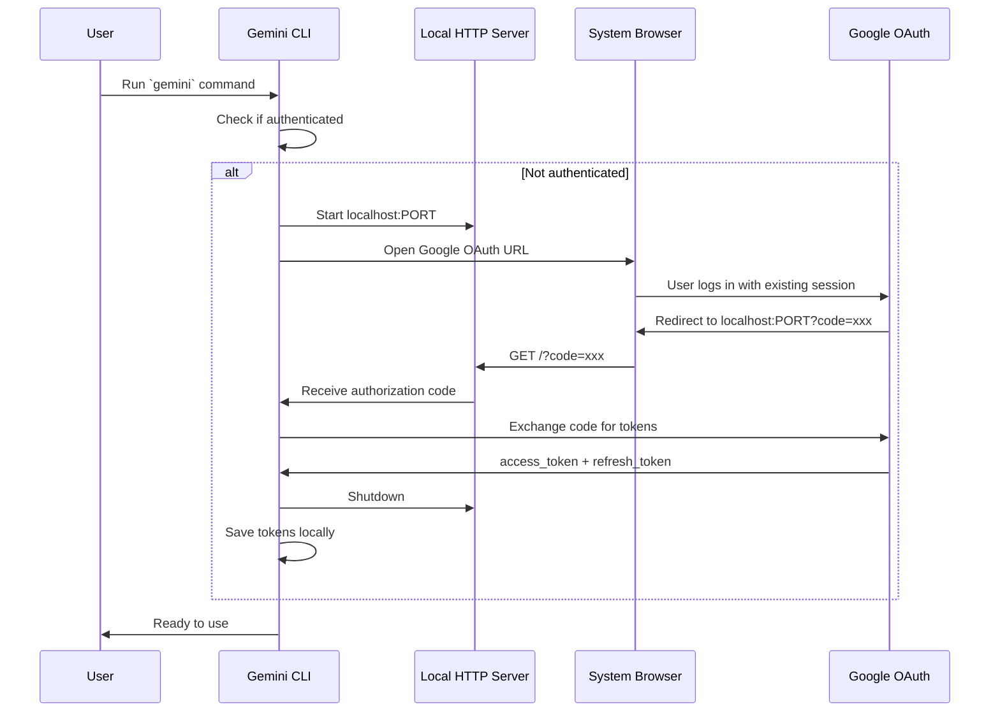


### Gemini CLI 的特点

1. **复用 Google 登录态**：使用系统默认浏览器，用户无需重新输入 Google 账号密码
2. **本地 HTTP 服务器回调**：监听 `localhost` 端口接收授权码
3. **授权码交换**：使用标准 OAuth 2.0 授权码流程交换 access_token

### 无图形界面环境的降级方案

Gemini CLI 还提供了 **手动复制粘贴** 的降级方案，适用于无浏览器的服务器环境：

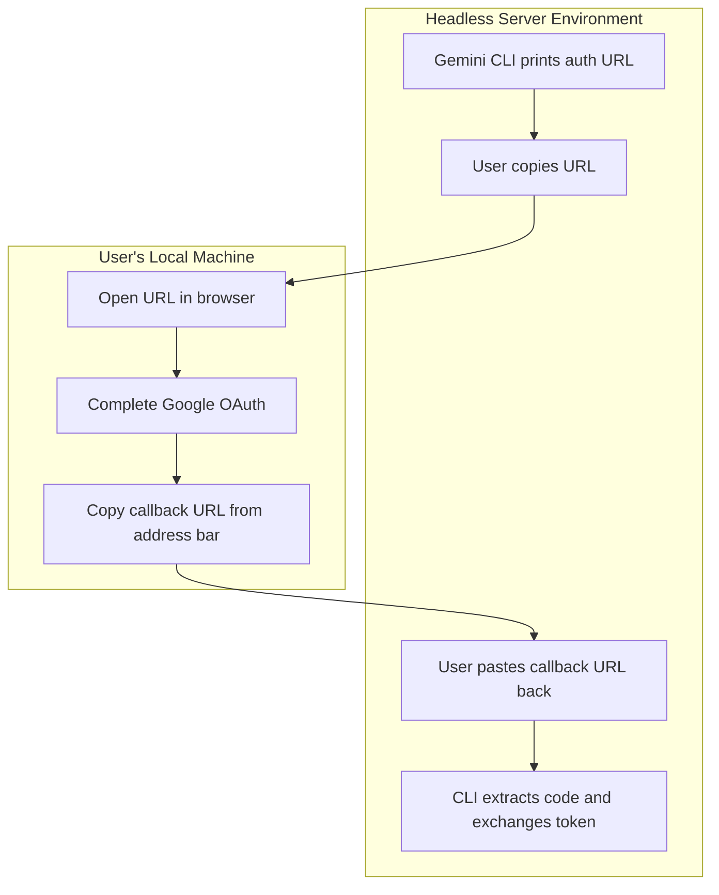

**流程**：

1. CLI 显示授权 URL
2. 用户复制 URL 到本地浏览器打开
3. 完成 OAuth 后，浏览器重定向到 `localhost:PORT?code=xxx`
4. 由于本地没有服务器，浏览器显示无法访问
5. 用户从浏览器地址栏复制完整 URL
6. 粘贴回服务器终端，CLI 从中提取授权码

### 主流 CLI/IDE OAuth 方式对比

| 工具 | OAuth 方式 | 回调机制 | 复用浏览器登录态 | 安全性 ||------|-----------|----------|-----------------|--------|| **Claude Code CLI** | 本地 HTTP 服务器 | `http://localhost:PORT` | 是 | 高（localhost 安全） || **Gemini CLI** | 本地 HTTP 服务器 | `http://localhost:PORT` | 是 | 高（localhost 安全） || **GitHub CLI** | 设备代码流 | 轮询（无回调） | 是 | 高（无回调风险） || **VSCode** | 自定义协议 | `vscode://` | 是 | 中（协议可被劫持） |

### 三种 OAuth 方式详解

**1. 本地 HTTP 服务器（Claude Code CLI / Gemini CLI）**

- 启动临时 HTTP 服务器监听 `localhost:PORT`
- 浏览器完成授权后重定向到本地服务器
- 优点：安全（localhost 只能本机访问）、用户体验好
- 缺点：需要启动服务器

**2. 设备代码流（GitHub CLI）**

- 显示一次性代码（如 `ABCD-1234`），用户在浏览器中输入
- CLI 轮询服务器检查授权状态
- 优点：无需本地服务器、无需回调
- 缺点：用户需要手动输入代码

**3. 自定义协议（VSCode）**

- 使用 `vscode://` 协议接收回调
- 与 Deep Link 机制相同
- 优点：实现简单
- 缺点：存在协议劫持风险（与 `onekey-wallet://` 问题相同）

### 关键结论

**对于桌面应用 OAuth，推荐本地 HTTP 服务器方案**：

- Claude Code CLI、Gemini CLI 采用此方案
- 符合 RFC 8252 (OAuth 2.0 for Native Apps) 推荐
- 比设备代码流用户体验更好（无需手动输入代码）
- 比自定义协议更安全（无协议劫持风险）

注意：GitHub CLI 使用设备代码流，VSCode 使用自定义协议，它们并非使用 localhost 方式。---

## 四、OneKey 现有方案的安全与体验问题

### 问题 1: In-App Webview - 无法复用浏览器登录态

**问题描述**：Webview 是独立的浏览器实例，与系统 Chrome 浏览器不共享 Cookie 和登录状态。用户即使在 Chrome 中已登录 Google 账户，仍需在 Webview 中重新登录。

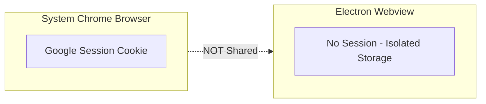

**影响**：

- 用户体验差，需要额外输入账号密码
- 可能触发 Google 的安全验证（陌生设备登录）
- 无法使用已保存的密码管理器

### 问题 2: Deep Link - 协议劫持风险

**问题描述**：自定义 URL Scheme（如 `onekey-wallet://`）可被多个应用注册。恶意应用可以注册相同协议，劫持 OAuth 回调中的 accessToken。

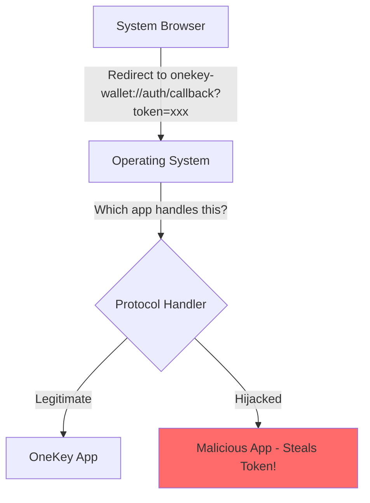

**安全风险**：

- Windows/macOS 不保证协议处理的唯一性
- 后安装的应用可能覆盖协议注册
- accessToken 可能被黑客应用截获
- 用户无感知，难以发现

---

## 五、桌面端 OAuth 方案对比（更新版）

| 方案 | 优点 | 缺点 | 安全性 | 推荐度 ||------|------|------|--------|--------|| **In-App Webview** | 应用内完成，无需外部依赖 | 无法复用浏览器登录态，需重新登录 | 高 | 中 || **Deep Link** | 可用系统浏览器，复用登录态 | 协议劫持风险，token 可能被盗 | 低 | 不推荐 || **本地 HTTP 服务器** | 复用浏览器登录态，无协议注册风险 | 需启动服务器，端口可能冲突 | 高 | **推荐** || **设备代码流** | 无需本地服务器 | 需轮询，体验稍差 | 高 | 备选 |---

## 六、推荐方案：本地 HTTP 服务器（Claude Code / Gemini CLI 方式）

### 为什么是最佳选择

1. **复用浏览器登录态**：使用系统默认浏览器，可直接使用已登录的 Google 账户
2. **无协议劫持风险**：`http://localhost` 由操作系统保证只能本机访问
3. **符合 OAuth 规范**：RFC 8252 (OAuth 2.0 for Native Apps) 推荐此方案
4. **跨平台一致**：Windows/macOS/Linux 行为一致

### 安全保障

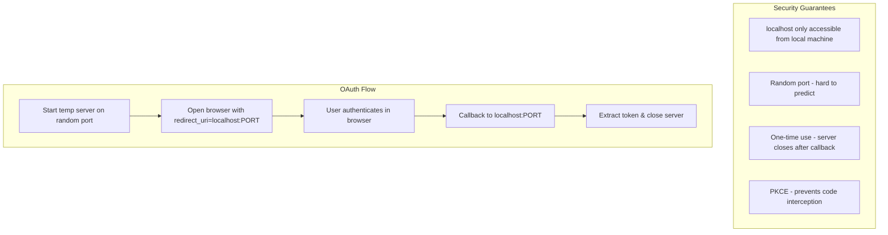


### 实现要点

1. **在 Electron 主进程启动 HTTP 服务器**（渲染进程无法启动服务器）
2. **使用随机端口**：`server.listen(0)` 让系统分配可用端口
3. **设置超时**：防止服务器长时间占用端口
4. **通过 IPC 通信**：主进程收到回调后通知渲染进程
5. **使用 PKCE**：增强授权码交换的安全性

---

## 七、本地 HTTP 服务器安全风险分析与防护

### 潜在安全风险

#### 风险 1: 端口抢占攻击 (Port Stealing)

**攻击场景**：恶意程序在 OneKey 启动 OAuth 服务器之前，抢先监听相同端口。

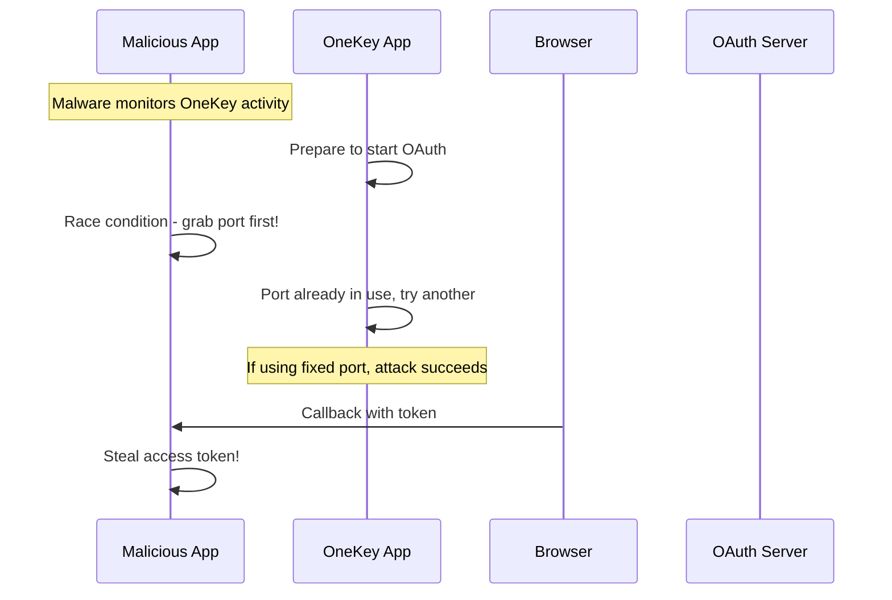

**风险级别**：中（需要恶意软件已在用户电脑上运行）

#### 风险 2: 本地网络嗅探

**攻击场景**：本机其他程序嗅探 localhost 流量。**风险级别**：低（localhost 流量通常不经过网络栈，难以嗅探）

#### 风险 3: 授权码截获 (Authorization Code Interception)

**攻击场景**：攻击者获取授权码后，在合法应用之前使用它交换 token。**风险级别**：中（PKCE 可完全防护此攻击）

### 安全防护措施

#### 措施 1: 使用随机端口（必须）

```typescript
// 使用端口 0 让系统分配随机可用端口
server.listen(0, '127.0.0.1', () => {
  const port = (server.address() as AddressInfo).port;
  // port 是系统分配的随机端口，如 52341
});
```

**效果**：攻击者无法预测端口号，无法提前抢占

#### 措施 2: 使用 PKCE（强烈推荐）

PKCE (Proof Key for Code Exchange) 是防止授权码截获的关键机制：

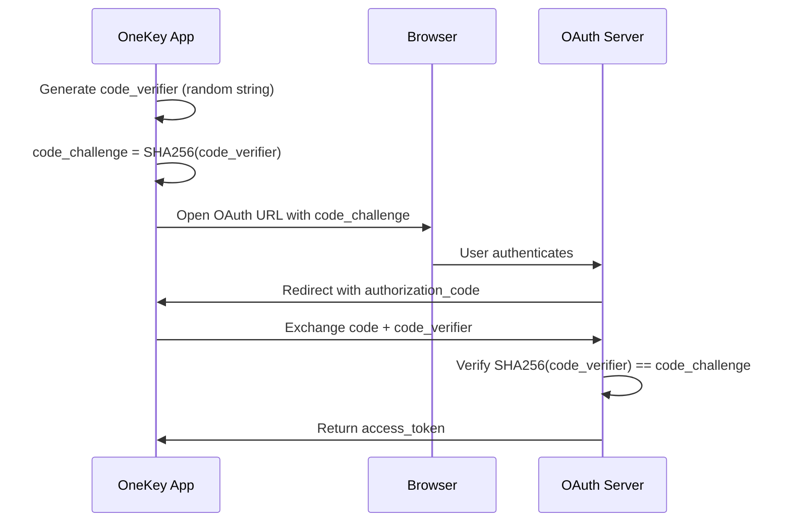
```typescript
import crypto from 'crypto';

// 生成 code_verifier
function generateCodeVerifier(): string {
  return crypto.randomBytes(32).toString('base64url');
}

// 生成 code_challenge
function generateCodeChallenge(verifier: string): string {
  return crypto
    .createHash('sha256')
    .update(verifier)
    .digest('base64url');
}

// 使用示例
const codeVerifier = generateCodeVerifier();
const codeChallenge = generateCodeChallenge(codeVerifier);

// OAuth URL 中添加 code_challenge
const authUrl = `${oauthUrl}?code_challenge=${codeChallenge}&code_challenge_method=S256`;

// 交换 token 时需要 code_verifier
const tokenResponse = await exchangeCodeForToken(authCode, codeVerifier);
```

**效果**：即使攻击者截获授权码，没有 code_verifier 也无法交换 token

#### 措施 3: 使用 state 参数防止 CSRF

```typescript
// 生成随机 state
const state = crypto.randomBytes(16).toString('hex');

// 存储 state 用于验证
pendingOAuthState = state;

// OAuth URL 中添加 state
const authUrl = `${oauthUrl}?state=${state}`;

// 回调时验证 state
server.on('request', (req, res) => {
  const url = new URL(req.url, 'http://localhost');
  const returnedState = url.searchParams.get('state');
  
  if (returnedState !== pendingOAuthState) {
    // CSRF 攻击！拒绝此请求
    res.writeHead(400);
    res.end('Invalid state parameter');
    return;
  }
  // 继续处理...
});
```

**效果**：防止跨站请求伪造攻击

#### 措施 4: 严格绑定 127.0.0.1

```typescript
// 只绑定 127.0.0.1，不要使用 0.0.0.0
server.listen(0, '127.0.0.1', callback);
```

**效果**：确保只接受本机请求，不暴露到局域网

#### 措施 5: 立即关闭服务器

```typescript
server.on('request', (req, res) => {
  // 处理回调后立即关闭
  handleCallback(req, res);
  
  // 发送响应后关闭服务器
  res.on('finish', () => {
    server.close();
  });
});

// 超时自动关闭
setTimeout(() => {
  server.close();
}, 5 * 60 * 1000); // 5 分钟超时
```

**效果**：最小化攻击窗口

#### 措施 6: 验证回调来源

```typescript
server.on('request', (req, res) => {
  // 只接受 GET 请求
  if (req.method !== 'GET') {
    res.writeHead(405);
    res.end();
    return;
  }
  
  // 只接受特定路径
  const url = new URL(req.url, 'http://localhost');
  if (url.pathname !== '/auth/callback') {
    res.writeHead(404);
    res.end();
    return;
  }
  
  // 继续处理...
});
```


### 安全措施总结

| 措施 | 防护目标 | 优先级 | 实现难度 ||------|----------|--------|----------|| 随机端口 | 端口抢占攻击 | 必须 | 简单 || PKCE | 授权码截获 | 强烈推荐 | 中等 || state 参数 | CSRF 攻击 | 推荐 | 简单 || 绑定 127.0.0.1 | 网络暴露 | 必须 | 简单 || 立即关闭服务器 | 减少攻击窗口 | 推荐 | 简单 || 验证回调 | 恶意请求 | 推荐 | 简单 |

### 与 Deep Link 方案的安全性对比

| 安全维度 | localhost HTTP 服务器 | Deep Link (onekey-wallet://) ||----------|----------------------|------------------------------|| 协议劫持 | 不可能（localhost 由 OS 保护） | 可能（任何应用可注册相同协议） || 端口抢占 | 用随机端口可防护 | 不适用 || 授权码截获 | PKCE 完全防护 | PKCE 完全防护 || 总体安全性 | **高** | **低** |

### 结论

本地 HTTP 服务器方案在采取适当防护措施后是安全的：

1. **必须实现**：随机端口 + 绑定 127.0.0.1
2. **强烈推荐**：PKCE（Supabase 默认支持）
3. **推荐实现**：state 参数 + 立即关闭 + 请求验证

这些措施已被 Claude Code CLI、Gemini CLI 等主流工具验证，符合 RFC 8252 安全建议。---

## 八、本地 HTTP 服务器方案实现架构

### 整体架构

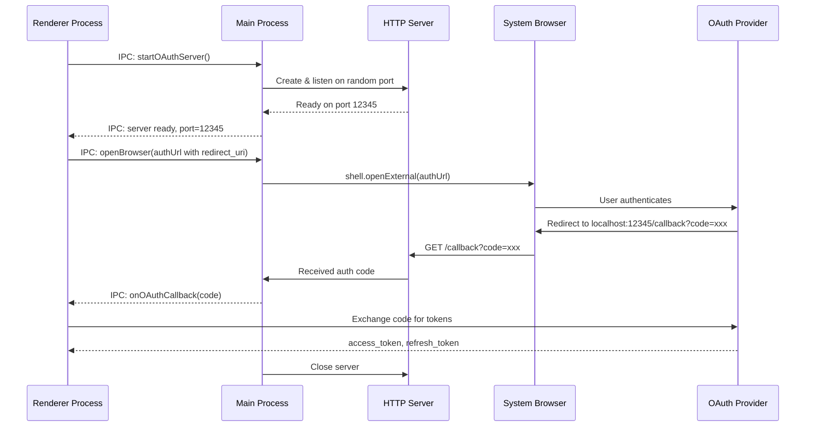


### 代码实现示例

**1. 主进程 OAuth 服务器 (`apps/desktop/app/oauth-server.ts`)**

```typescript
import http from 'http';
import { ipcMain, shell } from 'electron';

let oauthServer: http.Server | null = null;

export function setupOAuthIPC() {
  // Start OAuth server
  ipcMain.handle('oauth:startServer', async () => {
    return new Promise((resolve, reject) => {
      oauthServer = http.createServer((req, res) => {
        const url = new URL(req.url!, `http://localhost`);
        
        if (url.pathname === '/auth/callback') {
          // Extract tokens from URL (Supabase uses hash fragments)
          const accessToken = url.searchParams.get('access_token') 
            || url.hash.match(/access_token=([^&]+)/)?.[1];
          const refreshToken = url.searchParams.get('refresh_token')
            || url.hash.match(/refresh_token=([^&]+)/)?.[1];
          
          // Send success page to browser
          res.writeHead(200, { 'Content-Type': 'text/html; charset=utf-8' });
          res.end(`
            <html>
              <head><title>Login Successful</title></head>
              <body style="font-family: system-ui; text-align: center; padding: 50px;">
                <h1>Login Successful!</h1>
                <p>You can close this window and return to OneKey.</p>
                <script>setTimeout(() => window.close(), 2000);</script>
              </body>
            </html>
          `);
          
          // Notify renderer process
          mainWindow?.webContents.send('oauth:callback', {
            accessToken,
            refreshToken,
          });
          
          // Close server after callback
          setTimeout(() => {
            oauthServer?.close();
            oauthServer = null;
          }, 1000);
        }
      });
      
      // Listen on random available port
      oauthServer.listen(0, '127.0.0.1', () => {
        const address = oauthServer!.address();
        const port = typeof address === 'object' ? address?.port : 0;
        resolve({ port });
      });
      
      oauthServer.on('error', reject);
      
      // Auto-close after 5 minutes
      setTimeout(() => {
        oauthServer?.close();
        oauthServer = null;
      }, 5 * 60 * 1000);
    });
  });
  
  // Open URL in system browser
  ipcMain.handle('oauth:openBrowser', async (_, url: string) => {
    await shell.openExternal(url);
  });
  
  // Stop OAuth server
  ipcMain.handle('oauth:stopServer', async () => {
    oauthServer?.close();
    oauthServer = null;
  });
}
```

**2. 渲染进程调用 - 方案 C：直接 Google OAuth + signInWithIdToken（推荐）**(`packages/kit/src/components/OneKeyAuth/openOAuthPopupDesktopLocalhost.ts`)

```typescript
import { createTemporarySupabaseClient } from './supabase/supabaseClient';

const GOOGLE_CLIENT_ID = 'YOUR_DESKTOP_OAUTH_CLIENT_ID.apps.googleusercontent.com';

export async function openOAuthPopupDesktopLocalhost(options: {
  handleSessionPersistence: (params: IHandleOAuthSessionPersistenceParams) => Promise<void>;
  persistSession: boolean;
}): Promise<IOAuthPopupResult> {
  const { handleSessionPersistence, persistSession } = options;

  // 1. Generate nonce for security (same as Extension)
  const rawNonce = crypto.randomUUID();
  const encoder = new TextEncoder();
  const nonceData = encoder.encode(rawNonce);
  const hashBuffer = await crypto.subtle.digest('SHA-256', nonceData);
  const hashArray = Array.from(new Uint8Array(hashBuffer));
  const hashedNonce = hashArray.map((b) => b.toString(16).padStart(2, '0')).join('');

  // 2. Start local OAuth server (随机端口)
  const { port } = await globalThis.desktopApi.invoke('oauth:startServer');
  const redirectUri = `http://127.0.0.1:${port}/callback`;

  // 3. Build Google OAuth URL directly (不经过 Supabase)
  const authUrl = new URL('https://accounts.google.com/o/oauth2/auth');
  authUrl.searchParams.set('client_id', GOOGLE_CLIENT_ID);
  authUrl.searchParams.set('response_type', 'id_token'); // 关键：直接获取 id_token
  authUrl.searchParams.set('redirect_uri', redirectUri);
  authUrl.searchParams.set('scope', 'openid email profile');
  authUrl.searchParams.set('nonce', hashedNonce);
  authUrl.searchParams.set('prompt', 'select_account');

  return new Promise(async (resolve, reject) => {
    try {
      // 4. Listen for callback with id_token
      const handleCallback = async (
        _event: Event,
        data: { idToken: string }
      ) => {
        globalThis.desktopApi.removeIpcEventListener('oauth:callback', handleCallback);

        if (!data.idToken) {
          resolve({ success: false, session: undefined });
          return;
        }

        // 5. Exchange id_token for Supabase session
        const tempClient = createTemporarySupabaseClient();
        const { data: authData, error } = await tempClient.auth.signInWithIdToken({
          provider: 'google',
          token: data.idToken,
          nonce: rawNonce, // 传原始 nonce（非 hash）
        });

        if (error || !authData.session) {
          resolve({ success: false, session: undefined });
          return;
        }

        const { access_token: accessToken, refresh_token: refreshToken } = authData.session;

        // 6. Handle session persistence
        await handleSessionPersistence({
          accessToken,
          refreshToken,
          persistSession,
        });

        resolve({
          success: true,
          session: { accessToken, refreshToken },
        });
      };

      globalThis.desktopApi.addIpcEventListener('oauth:callback', handleCallback);

      // 7. Open Google OAuth in system browser
      await globalThis.desktopApi.invoke('oauth:openBrowser', authUrl.href);

      // 8. Timeout after 5 minutes
      setTimeout(() => {
        globalThis.desktopApi.removeIpcEventListener('oauth:callback', handleCallback);
        globalThis.desktopApi.invoke('oauth:stopServer');
        reject(new Error('OAuth sign-in timed out'));
      }, 5 * 60 * 1000);
    } catch (error) {
      reject(error);
    }
  });
}
```

**3. 主进程 OAuth 服务器更新（提取 id_token 而非 access_token）**

```typescript
// apps/desktop/app/oauth-server.ts
oauthServer = http.createServer((req, res) => {
  const url = new URL(req.url!, `http://localhost`);

  if (url.pathname === '/callback') {
    // Google OAuth 返回 id_token 在 URL hash 中
    // 但 hash 不会发送到服务器，需要用 JS 提取
    res.writeHead(200, { 'Content-Type': 'text/html; charset=utf-8' });
    res.end(`
      <html>
        <head><title>Login Successful</title></head>
        <body style="font-family: system-ui; text-align: center; padding: 50px;">
          <h1>Login Successful!</h1>
          <p>You can close this window and return to OneKey.</p>
          <script>
            // 从 URL hash 提取 id_token
            const hash = window.location.hash.substring(1);
            const params = new URLSearchParams(hash);
            const idToken = params.get('id_token');
            
            // 发送到本地服务器的另一个端点
            fetch('/complete', {
              method: 'POST',
              headers: { 'Content-Type': 'application/json' },
              body: JSON.stringify({ idToken }),
            }).then(() => {
              setTimeout(() => window.close(), 2000);
            });
          </script>
        </body>
      </html>
    `);
  } else if (url.pathname === '/complete' && req.method === 'POST') {
    let body = '';
    req.on('data', (chunk) => { body += chunk; });
    req.on('end', () => {
      const { idToken } = JSON.parse(body);
      
      // 通知渲染进程
      mainWindow?.webContents.send('oauth:callback', { idToken });
      
      res.writeHead(200);
      res.end('OK');
      
      // 关闭服务器
      setTimeout(() => {
        oauthServer?.close();
        oauthServer = null;
      }, 1000);
    });
  }
});
```

---**旧方案参考（方案 B：Supabase OAuth 流程，需要预注册端口）**

```typescript
// 如果需要使用 Supabase OAuth 流程，需要预注册 5 个端口
export async function openOAuthPopupDesktopLocalhostLegacy(options: {
  getAuthUrl: (redirectUri: string) => Promise<string>;
  handleSessionPersistence: (params: IHandleOAuthSessionPersistenceParams) => Promise<void>;
  persistSession: boolean;
}): Promise<IOAuthPopupResult> {
  const { getAuthUrl, handleSessionPersistence, persistSession } = options;
  
  return new Promise(async (resolve, reject) => {
    try {
      // 1. Start local OAuth server
      const { port } = await globalThis.desktopApi.invoke('oauth:startServer');
      const redirectUri = `http://127.0.0.1:${port}/auth/callback`;
      
      // 2. Get OAuth URL with our localhost redirect
      const authUrl = await getAuthUrl(redirectUri);
      
      // 3. Listen for callback
      const handleCallback = async (_event: Event, data: { accessToken: string; refreshToken: string }) => {
        globalThis.desktopApi.removeIpcEventListener('oauth:callback', handleCallback);
        
        if (data.accessToken && data.refreshToken) {
          await handleSessionPersistence({
            accessToken: data.accessToken,
            refreshToken: data.refreshToken,
            persistSession,
          });
          
          resolve({
            success: true,
            session: {
              accessToken: data.accessToken,
              refreshToken: data.refreshToken,
            },
          });
        } else {
          resolve({ success: false, session: undefined });
        }
      };
      
      globalThis.desktopApi.addIpcEventListener('oauth:callback', handleCallback);
      
      // 4. Open system browser
      await globalThis.desktopApi.invoke('oauth:openBrowser', authUrl);
      
      // 5. Timeout handling
      setTimeout(() => {
        globalThis.desktopApi.removeIpcEventListener('oauth:callback', handleCallback);
        globalThis.desktopApi.invoke('oauth:stopServer');
        reject(new OneKeyLocalError('OAuth sign-in timed out'));
      }, 5 * 60 * 1000);
      
    } catch (error) {
      reject(error);
    }
  });
}
```

---

## 九、Supabase 与 Google OAuth 配置

### 随机端口的配置挑战

使用随机端口时，`http://localhost:*/auth/callback` 这种通配符写法**大多数 OAuth 服务器不支持**。根据 **RFC 8252** 规范：> 授权服务器 **必须** 允许 localhost/127.0.0.1 使用任意端口，无需预先注册但实际支持情况因服务商而异。

### Supabase 对 localhost 端口的支持情况（已确认）

经查证：**Supabase 不支持 localhost 随机端口，必须预先注册所有可能的 redirect URL**。| 服务商 | 是否支持 localhost 任意端口 | 说明 |

|--------|---------------------------|------|

| **Supabase** | ❌ 否 | 必须在 Dashboard 预先注册所有端口 |

| **Google OAuth** | ✅ 是（Desktop App 类型） | 但我们不直接用，Google 回调到 Supabase |

| **Azure AD** | ✅ 是 | localhost 端口自动忽略匹配 |

| **Auth0** | ❌ 否 | 必须精确匹配端口 |**Supabase 配置方式**：在 Supabase Dashboard > Authentication > URL Configuration 中添加：

```javascript
http://127.0.0.1:19800/auth/callback
http://127.0.0.1:19801/auth/callback
http://127.0.0.1:19802/auth/callback
http://127.0.0.1:19803/auth/callback
http://127.0.0.1:19804/auth/callback
```

或在 `config.toml` 中配置：

```toml
[auth]
additional_redirect_urls = [
  "http://127.0.0.1:19800/auth/callback",
  "http://127.0.0.1:19801/auth/callback",
  "http://127.0.0.1:19802/auth/callback",
  "http://127.0.0.1:19803/auth/callback",
  "http://127.0.0.1:19804/auth/callback"
]
```

**结论**：必须使用**方案 B（多端口备选）**

### 重要澄清：Supabase OAuth 的两段跳转流程

使用 Supabase 时，OAuth 流程是**两段跳转**：

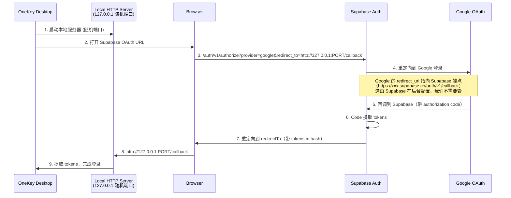

**关键理解**：

- ❌ Google **不会**直接跳转到我们的 localhost
- ✅ Google 跳转到 **Supabase 的端点**
- ✅ **Supabase** 再跳转到我们的 `redirectTo`（localhost）
- 所以我们需要配置的是 **Supabase 的 Redirect URLs**，而不是 Google 的

### 推荐方案：注册多个固定端口

由于 Supabase 不支持动态端口，需要**预先注册一组固定端口**，代码中按顺序尝试使用第一个可用端口。**Supabase Dashboard 配置**：在 Authentication > URL Configuration > Redirect URLs 中添加：

```javascript
http://127.0.0.1:19800/auth/callback
http://127.0.0.1:19801/auth/callback
http://127.0.0.1:19802/auth/callback
http://127.0.0.1:19803/auth/callback
http://127.0.0.1:19804/auth/callback
```

**代码实现**（尝试多个端口）：

```typescript
const OAUTH_PORTS = [19800, 19801, 19802, 19803, 19804];

async function startOAuthServer(): Promise<{ port: number; server: http.Server }> {
  for (const port of OAUTH_PORTS) {
    try {
      const server = await tryStartServer(port);
      return { port, server };
    } catch (e) {
      // 端口被占用，尝试下一个
      continue;
    }
  }
  throw new Error('All OAuth ports are occupied');
}

function tryStartServer(port: number): Promise<http.Server> {
  return new Promise((resolve, reject) => {
    const server = http.createServer(handleRequest);
    server.on('error', reject);
    server.listen(port, '127.0.0.1', () => resolve(server));
  });
}
```


### 方案 C：使用 Supabase 作为中间跳转（最稳妥）

让 Supabase 处理 Google 回调，然后再跳转到本地：

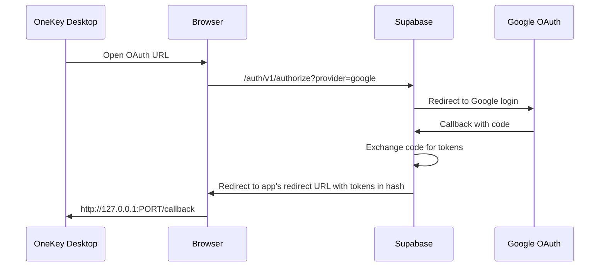

**Supabase 配置**：

```javascript
http://127.0.0.1/auth/callback
```

**代码实现**：

```typescript
// Supabase 会在 hash 中返回 tokens
// 本地服务器只需要提取 hash 参数
server.on('request', (req, res) => {
  // 返回一个页面，用 JS 提取 hash 并发送回服务器
  res.writeHead(200, { 'Content-Type': 'text/html' });
  res.end(`
    <html>
      <body>
        <script>
          // 从 URL hash 提取 tokens
          const hash = window.location.hash.substring(1);
          // 发送到服务器
          fetch('/complete?' + hash, { method: 'POST' });
          // 显示成功消息
          document.body.innerHTML = '<h1>Login successful! You can close this window.</h1>';
        </script>
      </body>
    </html>
  `);
});
```


### 方案 C：直接 Google OAuth + signInWithIdToken（推荐 ⭐）

参考 Extension 的做法，**绕过 Supabase 的 redirect URL 限制**：

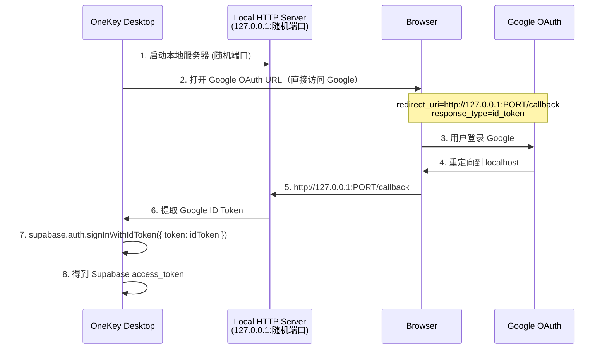

**核心优势**：

- ✅ **Google OAuth Desktop App 类型支持任意 localhost 端口**（符合 RFC 8252）
- ✅ **不需要在 Supabase 配置任何 redirect URL**
- ✅ 可以使用真正的随机端口
- ✅ 与 Extension 实现逻辑一致，代码可复用

**为什么 Google 支持随机端口但 Supabase 不支持？**| 服务商 | 角色 | 对 localhost 端口的处理 |

|--------|------|-------------------------|

| **Google OAuth** | OAuth Provider | Desktop App 类型自动允许任意 localhost 端口 |

| **Supabase** | OAuth 中间层 | 作为 Web 服务，要求精确匹配预注册 URL |**Extension 实现参考**（`openOAuthPopupExt.tsx`）：

```typescript
// 1. 直接构建 Google OAuth URL（不经过 Supabase）
const authUrl = new URL('https://accounts.google.com/o/oauth2/auth');
authUrl.searchParams.set('client_id', googleClientId);
authUrl.searchParams.set('response_type', 'id_token'); // 关键：直接获取 id_token
authUrl.searchParams.set('redirect_uri', `http://127.0.0.1:${port}/callback`);
authUrl.searchParams.set('scope', 'openid email profile');
authUrl.searchParams.set('nonce', hashedNonce); // 安全：防重放攻击

// 2. Google 登录成功后，从 URL hash 提取 id_token
const hashParams = new URLSearchParams(url.hash.substring(1));
const idToken = hashParams.get('id_token');

// 3. 用 id_token 登录 Supabase
const { data, error } = await supabase.auth.signInWithIdToken({
  provider: 'google',
  token: idToken,
  nonce: rawNonce, // 传原始 nonce（非 hash）
});

// 4. 得到 Supabase session
const accessToken = data.session.access_token;
const refreshToken = data.session.refresh_token;
```

**Google Cloud Console 配置**：

1. 创建 OAuth 2.0 客户端，类型选择 **Desktop App**
2. 无需添加 redirect URI（Google 自动允许 localhost 任意端口）

**Supabase 配置**：无需配置 redirect URL！只需确保 Google Provider 已启用。

### 最终推荐方案

| 方案 | 是否需要 Supabase 配置 redirect URL | 是否支持随机端口 | 推荐程度 |

|------|-------------------------------------|------------------|----------|

| **方案 C：直接 Google OAuth + signInWithIdToken** | ❌ 不需要 | ✅ 支持 | ⭐⭐⭐ 推荐 |

| 方案 B：多端口备选 | ✅ 需要配置 5 个 | ❌ 固定端口 | ⭐⭐ 备选 |

| 方案 A：Supabase OAuth 流程 | ✅ 需要配置 | ❌ 不支持 | ⭐ 不推荐 |**实施清单（方案 C）**：

1. ✅ Google Cloud Console：确保已有 Desktop App 类型的 OAuth 客户端
2. ✅ 代码：复用 Extension 的 Google OAuth URL 构建逻辑
3. ✅ 代码：本地 HTTP 服务器提取 `id_token`
4. ✅ 代码：使用 `signInWithIdToken` 换取 Supabase session
5. ❌ **无需配置 Supabase redirect URL**

---

## 十、总结与建议

### 方案选择建议

| 场景 | 推荐方案 ||------|----------|| 最佳用户体验 + 安全性 | **本地 HTTP 服务器**（新增） || 快速实现，接受重新登录 | In-App Webview（现有） || 需要外部唤起应用 | Deep Link（现有，但有安全风险） |

### 实施建议

1. **新增本地 HTTP 服务器方案**：作为桌面端默认 OAuth 方式
2. **保留 Webview 方案**：作为备选（用户无法打开系统浏览器时）
3. **移除或弱化 Deep Link 方案**：由于安全风险，不建议用于 OAuth 回调