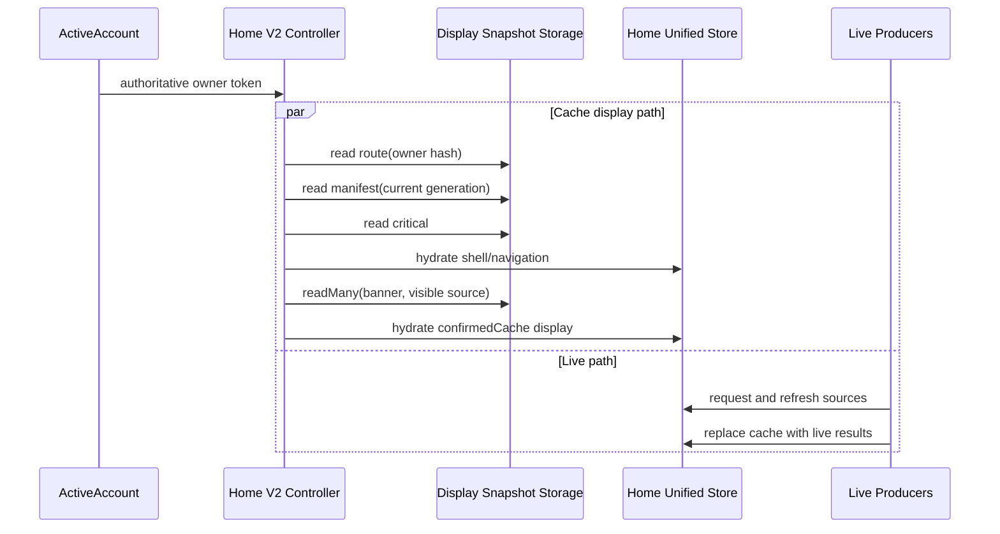

# Display Snapshot Storage V2 / Home Cache V2 Handoff

> Status: implemented and verified on an iOS Debug simulator.
>
> Date: 2026-07-23
>
> First consumer: Home Unified Store.
>
> V1 relationship: no migration, no fallback, and no V1 key cleanup. V1 keys
> and the old controller can be retired independently.

## 1. Final decisions

Display Snapshot Storage V2 is a page-scoped, owner-partitioned, chunked cache
for rebuildable UI snapshots.

The implemented Home behavior is:

1. Wait for ActiveAccount to produce the authoritative Home owner.
2. Hash the full owner scope into a storage partition ID.
3. Exact-read only the route, manifest, critical chunk, banner, and currently
   visible section.
4. Keep every other owner, account, chain, and section chunk on disk until it
   is explicitly requested.
5. Hydrate only display state into the Home Unified Store.
6. Let live producers refresh and replace the cached display state.
7. Observe every Unified Store commit, but debounce and coalesce physical
   writes asynchronously.

There is deliberately no provisional owner locator. Waiting for ActiveAccount
keeps the partition identity exact and avoids showing another account or
network. Explicit account, network, and derive-type selections bypass the
legacy trailing reload delay; automatic events still use trailing coalescing.
The V2 exact-read and decode remain sub-second.

## 2. V1 and V2

V2 is a new cold-start cache architecture, not a schema migration:

```text
V2 reads only V2
V2 writes only V2
V2 miss falls through to live loading
V1 keys are not migrated, converted, deleted, or used as fallback
```

The V2 characteristics are:

- page-level physical separation;
- owner/account/network partitioning;
- independently readable chunks;
- lazy storage initialization and lazy chunk loading;
- a unified asynchronous API across native MMKV and IndexedDB;
- no whole-cache enumeration or startup preload.

## 3. Runtime topology

### iOS and Android

- Runtime scope: Home Store, the V2 controller, and the V2 writer run in
  `main`.
- The `bg` runtime continues to own business services and live producers.
- `main` and `bg` have separate JS heaps and initialize independently.
- MMKV is a native resource, but this Home namespace has a single logical
  writer in `main`.
- Snapshot JSON is deserialized only for exact keys requested by `main`.
- Home V2 does not add a main-to-background storage RPC.

### Web and Desktop

- These targets use a single JS runtime for this path.
- The backend is a dedicated IndexedDB database and object store.
- Reads are exact-key requests; no startup-wide in-memory mirror is created.

### Browser extension

- The UI and background service worker are split runtimes.
- Home V2 belongs to the UI runtime and uses IndexedDB there.
- It does not depend on service-worker readiness or lifetime.

## 4. Implemented modules

### Generic cross-platform storage

Directory:

```text
packages/shared/src/storage/DisplaySnapshotStorage/
```

The public interface is:

```ts
interface IDisplaySnapshotStorage {
  read(key: string): Promise<string | undefined>;
  readMany(keys: readonly string[]): Promise<ReadonlyMap<string, string>>;
  commit(input: IDisplaySnapshotCommit): Promise<void>;
  remove(keys: readonly string[]): Promise<void>;
  clearNamespace(): Promise<void>;
  compact(): Promise<void>;
}
```

Structural constraints:

- no `getAll`, `getAllKeys`, `entries`, or enumeration API;
- key and record sizes are validated;
- `readMany` has a configured upper bound;
- backend creation is lazy and memoized;
- all platform implementations expose asynchronous semantics.

Backends:

- Native: dedicated MMKV ID `onekey-display-snapshot-home-v2`.
- Web/Desktop/Extension UI: dedicated IndexedDB database
  `onekey-display-snapshot-home-v2`.

Native does not create one JSON file per chunk. One MMKV file holds multiple
independent keys. IndexedDB similarly holds multiple records in one dedicated
object store. In both cases only requested values cross into the JS heap.

### Home V2 codec, repository, and queue

Directory:

```text
packages/kit/src/views/Home/model/cacheV2/
```

Responsibilities:

- `homeDisplaySnapshotKeys.ts`: owner digest and exact-key layout;
- `homeDisplaySnapshotCodec.ts`: bounded JSON codec and validation;
- `homeDisplaySnapshotRepository.ts`: route/manifest/critical/source exact
  reads;
- `homeDisplaySnapshotPersistQueue.ts`: latest-wins batching, generations,
  cleanup, route retention, and lifecycle compaction;
- `homeDisplaySnapshotTypes.ts`: V2 schema and limits.

The Home controller is:

```text
packages/kit/src/views/Home/model/react/HomeDisplaySnapshotController.tsx
```

It is mounted with the Wallet Home source controllers, waits for the Home
session owner, hydrates critical display state first, and then hydrates banner
plus the visible section. Other tabs are loaded when requested.

## 5. Physical data model

One Home MMKV/IndexedDB namespace contains many logical partitions:

```text
index/routes
route/<ownerPartitionHash>
manifest/<ownerPartitionHash>/<generation>
chunk/<ownerPartitionHash>/<generation>/critical
chunk/<ownerPartitionHash>/<generation>/portfolio
chunk/<ownerPartitionHash>/<generation>/banner
chunk/<ownerPartitionHash>/<generation>/defi
chunk/<ownerPartitionHash>/<generation>/nft
chunk/<ownerPartitionHash>/<generation>/history
...
```

The owner scope includes wallet/account/network identity. Raw owner identity is
not placed in physical keys; SHA-256 produces the partition ID.

Current limits:

```text
time expiry:           none
source chunk:          1 MiB
critical chunk:        128 KiB
storage record:        2 MiB
readMany batch:        4 exact keys
retained owner routes: 16
```

The route index is only for bounded retention and eviction. Startup does not
walk it. A known owner goes directly to its hashed route key.

Snapshot age never blocks display hydration. `createdAt` is retained for
observability only; owner LRU, schema admission, structural validation, and
byte limits bound the cache.

## 6. Lazy read path



Hydration acceptance is owner- and session-exact. Source records must also
match an active request token when one already exists. A late cache response
cannot overwrite a ready live result.

The cache and live paths start independently after owner/runtime readiness.
V2 hydration does not suppress, delay, or deduplicate business requests.
Applicable live producers may therefore begin before the async snapshot read
finishes; cached display state remains visible until accepted live results
replace it. Lazy sections continue to follow their existing enablement and
visibility rules.

The cache restores no request sequence, producer instance, session authority,
commands, signing state, transaction state, or authentication state.

### ActiveAccount owner handoff

ActiveAccount remains the only authoritative Home owner. Account selection
uses two reload policies:

- explicit account, network, and derive-type selections publish an immediate
  process-local reload request;
- automatic selection and wallet/account/network events keep the 150 ms
  trailing coalescing policy.

Immediate requests use a monotonic selection revision and a
`pending -> running -> completed` compare-and-set state machine. The selection
revision, effect matching, and pre/post-background freshness checks all use
the same owner identity:

```text
walletId + indexedAccountId + othersWalletAccountId + networkId + deriveType
```

`focusedWallet` is intentionally excluded because browsing the wallet list
does not change the ActiveAccount owner. This also allows a valid in-flight
owner build to commit when only `focusedWallet` changes.

The background runtime only builds the ActiveAccount projection. The main
runtime validates the revision before and after that call, commits
ActiveAccount, then captures the exact selected/active/updateMeta maps for
best-effort legacy cold-start persistence. Home V2 observes only the committed
ActiveAccount owner.

## 7. Asynchronous write path

Every Unified Store commit updates `homeCommitIdentity`. The V2 controller
subscribes to that atom and sends the current state plus dirty-source metadata
to a process-local persist queue.

Queue behavior:

- 1 second trailing debounce;
- 5 second maximum wait under continuous updates;
- jobs are isolated by owner scope;
- dirty source IDs and presentation changes are merged;
- one drain captures one bounded batch;
- commits arriving during serialization use the next debounce window;
- cache-hydration commits are ignored to prevent echo writes;
- lifecycle flush performs at most two bounded passes and then compacts.

Only changed chunks are serialized. Descriptor `contentSignature` values are
fixed-size SHA-256 hashes, not copies of the source JSON. This is important:
storing the full stable JSON in the manifest made large Home manifests exceed
their validation limit and caused route hits to decode as misses.

## 8. Generation and atomicity model

Chunk keys are immutable within a generation. A write:

1. exact-reads the current route and manifest;
2. writes changed chunks under a new generation;
3. writes the new manifest;
4. updates the route index;
5. publishes the route commit marker last;
6. removes superseded and retired keys.

Native MMKV has no multi-key transaction, so marker-last publication prevents
readers from discovering an incomplete generation. IndexedDB performs entries,
removals, and the marker update in one read-write transaction.

An expected commit marker provides compare-and-set behavior. A Web tab that
loses the race rebuilds once against the latest marker.

The route keeps a previous generation as a recovery fallback. Orphan cleanup
tracks replaced descriptors directly, including a chunk whose original
manifest has already retired.

MMKV `remove()` does not shrink its mmap file. `compact()` calls `trim()` only
at a lifecycle boundary. IndexedDB owns its physical compaction, so its method
is a no-op.

## 9. Snapshot-only data rule

The storage entry points carry English comments stating that the namespace is
only for rebuildable display snapshots. Current Home fields are treated as
non-sensitive display data, as confirmed for this implementation.

Future consumers must still keep the same boundary:

- no private keys, mnemonic, seed, passwords, or secret material;
- no auth/session credentials;
- no signatures or raw transactions;
- no cache value may become command or transaction authority.

This is an architectural boundary for future reuse, even though the currently
persisted Home snapshot fields are non-sensitive.

## 10. iOS Debug verification

Environment:

```text
device:       iPhone 17 Pro simulator
iOS:          26.5
build:        Debug
runtime:      Home V2 in main; background initialized independently
network:      Slow 4G test profile, 562.5 ms injected latency
storage:      dedicated native MMKV
```

The test cache was deleted before warming, then the following owners were
loaded and written independently:

- Ethereum;
- Solana;
- Tron;
- TON;
- one additional Linea partition used while validating picker behavior.

The route index contained five owner partitions. Each current manifest
contained only fixed-size signatures and exact chunk descriptors; portfolio
payloads remained separate records.

Measured cache path after ActiveAccount owner readiness:

| Owner    | Result | Manifest | Critical | Visible portfolio hydrate |
| -------- | ------ | -------: | -------: | ------------------------: |
| Ethereum | hit    |      hit |     1 ms |              534 ms total |
| Solana   | hit    |      hit |     2 ms |              432 ms total |
| Tron     | hit    |      hit |     1 ms |              407 ms total |
| TON      | hit    |      hit |     1 ms |              426 ms total |

Cold-start sample:

- route/manifest/critical/portfolio all hit;
- visible portfolio hydration completed in 681 ms after owner readiness;
- the live portfolio response arrived about 1.1 seconds after cached
  hydration;
- the complete Debug app launch was about 5.4 seconds to Home navigation,
  dominated by Debug JS/runtime initialization rather than snapshot loading.

Interpretation:

- once the authoritative owner exists, cached Home data is restored within
  0.4–0.7 seconds in Debug;
- repeated ETH/SOL/TRON/TON reads meet the intended perceptual instant-open
  target for the cache portion;
- before the immediate reload change, explicit selection commit to Home owner
  publication had a measured median of about 1.38 seconds because a nominal
  150 ms trailing callback ran after roughly 1.15–1.58 seconds during modal
  teardown;
- after the change, measured selection commit to Home owner publication was
  about 206–331 ms for ETH/SOL/TRON/TON and 445–463 ms for Account #1/#2;
- first-time owners without a V2 snapshot still wait for live data; a warm
  snapshot avoids that network-dependent loading path;
- Release/Profile startup should be measured separately before setting a
  product-level launch SLO.

Artifacts are under:

```text
.tmp/ui/home-v2-cold-cache-warm-metro.mp4
.tmp/ui/home-v2-warm-multichain-switch.mp4
.tmp/ui/home-v2-warm-ton-switch.mp4
.tmp/ui/home-v2-*-warm-hash.png
```

Temporary `[HOME-V2-CACHE]` console diagnostics were used to collect these
numbers and were removed from the implementation. Production-facing
`perfMark('Home:v2Cache:*')` measurements remain.

Permanent device-local diagnostics use:

```text
defaultLogger.wallet.homeUi.homeDisplaySnapshotCacheV2
```

The event is `@LogToLocal()` only. It is included in exported native log files
but does not create a Mixpanel event. It never includes a snapshot payload or
raw owner scope. `partitionTag` is the first 12 hexadecimal characters of the
owner partition SHA-256 and exists only to correlate one load sequence.

Expected effective-cache sequence:

```text
ownerReady      started
manifest        hit
critical        hit
visibleChunks   hit | partial
initialHydrate  accepted
```

Each record includes stage and outcome, `partitionTag`, elapsed time, record
count, requested/loaded source IDs, manifest generation, whether the critical
chunk participated, and cache age when available. Lazy section reads log as
`lazyChunk`; physical writes log only as `persist accepted`, `retrying`, or
`failed`. No-op persistence attempts are intentionally silent so live price
updates cannot flood the native log.

Interpretation:

- `manifest miss`: this owner has no valid V2 route/manifest;
- `critical miss`: the manifest exists but its critical descriptor/value is
  absent, malformed, or size-mismatched;
- `visibleChunks partial`: only some requested visible chunks were accepted;
- `initialHydrate accepted`: cached display state was actually injected;
- `stale`: the account/network owner changed while the async read was in
  flight, so the result was intentionally discarded;
- `persist accepted`: a new immutable generation was physically committed.

On Debug builds, the `wallet/homeUi` local logger scene must be enabled in the
developer logger configuration. Production builds write `@LogToLocal()` scenes
without that Debug filter.

Verified iOS Debug native-log sample:

```text
ownerReady      started
manifest        hit      elapsedMs=9   generation=46 recordCount=6
critical        hit      elapsedMs=1
visibleChunks   partial  elapsedMs=328 requested=banner,portfolio loaded=portfolio
initialHydrate  accepted elapsedMs=328 criticalIncluded=true
```

This sample is an effective cache hit: the critical display snapshot and
portfolio chunk were injected. `partial` identifies only the missing banner
chunk in that generation, not a failure of the whole Home cache.

## 11. Automated verification

Covered cases include:

- exact reads and bounded `readMany`;
- lazy backend creation;
- native marker-last commits and explicit MMKV trim;
- IndexedDB transactional commits;
- malformed, owner-mismatched, generation-mismatched, and oversized records;
- legacy V2 records remain readable after their old expiry timestamp;
- manifest fallback to the previous generation;
- cache/live races with live-result precedence;
- exact cache/request matching;
- cache never replacing live data;
- immediate explicit reload versus trailing automatic reload;
- compare-and-set request claiming and stale/ABA result rejection;
- owner-identity matching when only `focusedWallet` changes;
- owner isolation and cache-hydration echo suppression;
- coalescing rapid commits into one generation;
- deferring commits observed during a physical write;
- lifecycle compaction;
- superseded chunk cleanup after generation retirement;
- bounded SHA-256 content signatures.

Required final validation commands:

```text
yarn jest <targeted V2 and Home suites> --runInBand
yarn _tsc --pretty false
yarn agent:check --profile commit
```

## 12. Follow-up boundaries

No V1 migration work is required.

Reasonable later follow-ups, if product metrics justify them:

1. add Release/Profile SLO dashboards using the existing `Home:v2Cache:*`
   marks;
2. reuse the generic storage for another page with a different namespace and
   page-specific codec;
3. tune route count and chunk limits from production size telemetry;
4. optimize ActiveAccount owner readiness separately if end-to-end chain
   switching still feels slow after cache hydration.

Do not add a global “current snapshot” blob, enumerate every owner at startup,
or combine unrelated pages into the Home namespace.
