# Home Unified Store Migration Handoff

> Status: Phase 0 through Phase 7 implemented and validated in the working
> tree. Section 0.0 is the completion record; the later phase sections retain
> the original requirements as the audit checklist.
>
> Architecture scope: Web, Desktop, Browser Extension, React Native Home, iOS
> Native Home, and Android Native Home. The user-requested interactive
> acceptance target is iOS Simulator Debug only; no physical-device or Release
> UI gate is required for this migration.
>
> Audited branch: `codex/native-home-container`
>
> Audited HEAD: `efc9fb896f9988a24a275628ab38f8c3468aa68f`
>
> Last updated: 2026-07-22

## 0.0 Implementation Status — 2026-07-22

This table distinguishes code landed in the working tree from phase-gate
completion. A phase is not complete merely because part of its target code
exists.

| Phase | Status   | Implemented evidence                                                                                                                                                                                                                                         | Remaining exit-gate work |
| ----- | -------- | ------------------------------------------------------------------------------------------------------------------------------------------------------------------------------------------------------------------------------------------------------------ | ------------------------ |
| 0     | Complete | The immutable user-supplied defect recording is frozen with its SHA-256 and explicitly records that repository/Metro provenance is unavailable. Deterministic rapid-tab, owner-ordering, cache, balance, and runtime fixtures provide the controlled engineering oracle; current-worktree Debug evidence records the corrected state. | None.                    |
| 1     | Complete | One per-scene Jotai Context Store, one reducer/dispatcher, physical slice atoms, exhaustive atomic patches, invariants, owner replacement, runtime handshake, and scene-isolation tests are in production.                                                   | None.                    |
| 2     | Complete | Root-owned Portfolio, Perps, DeFi, NFT, History, Market, Banner, capability, balance, snapshot, and persistence controllers publish through typed begin/complete Store gateways; renderers own no request lifecycle.                                         | None.                    |
| 3     | Complete | Shell, exact confirmed balance, capability, Navigation, typed intents, and backup-required surface are Store-derived. React tabs are controlled by Store Navigation.                                                                                         | None.                    |
| 4     | Complete | Every section carries its complete JSON-safe payload in a Store resource. Spot, Perps, DeFi, NFT, History, Market, and Banner renderers read typed Store selectors only.                                                                                     | None.                    |
| 5     | Complete | The Native-only Home business host and Native source hooks are physically retired. iOS and Android now use the shared React Native Home renderer backed by the same Store; protocol v3 remains a tested transport contract, not a second business authority. | None.                    |
| 6     | Complete | Current-worktree iOS Simulator Debug build/install/launch passed. The final run completed 51 scroll-calibrated Spot/Perps/DeFi selections, 12 pixel-identical balance samples, DeFi 0/2/5/10-second continuity samples, and a separate 51-selection active-log audit. | None.                    |
| 7     | Complete | Shadow Store, semantic sidecar, legacy publishers, Native balance authority, Native-only producer hooks, duplicate renderer persistence, and obsolete compatibility files were removed. Production boundary tests enforce the retired paths.                 | None.                    |

Current local validation commands:

```bash
yarn tsc:only
development/scripts/test-home-container-protocol-ios.sh
development/scripts/test-home-container-protocol-android.sh
yarn agent:check --profile commit
```

The independent validation agent must audit this status table against the
working tree. It must report unmet gates rather than infer completion from the
presence of files.

### 0.0.1 Final validation result

- `yarn tsc:only`: pass;
- Home/Store/Native protocol regression: 101 suites, 725 tests, pass;
- background Home runtime/cache ownership: 1 suite, 5 tests, pass, including
  explicit ninth-owner LRU eviction;
- iOS and Android protocol contract scripts: pass; Android Gradle contract
  target reports `BUILD SUCCESSFUL`;
- iOS Simulator Debug build: pass with 0 errors and 13 warnings;
- simulator: iPhone 17 Pro, iOS 26.5,
  `4837E819-A117-4E08-9936-445785D199E3`;
- Header stability: 12 consecutive samples over approximately five seconds,
  all `$52.62`;
- interaction: 51 scroll-calibrated real-touch Spot/Perps/DeFi selections;
  the current section was pinned before every tap, first-cycle screenshots
  prove each active state, the final DeFi active state is retained, and a
  separate acknowledgement run captures all 51 selected states; the pinned
  tab-row crop has one distinct, stable hash for each target across 17 cycles;
- DeFi continuity: live rows and Header remain identical at 0, 2, 5, and 10
  seconds with no skeleton regression or flash;
- final active-log interaction window:
  `2026-07-21T20:02:15.079Z`–`2026-07-21T20:04:06.479Z`; log capture was
  confirmed active and the marked 51-selection window contains no
  `OneKeyLocalError`, unhandled rejection, invalid number, maximum-depth,
  RedBox, fatal, invariant, or `useContextStore` entry;
- evidence directory:
  `outputs/home-unified-phase6-current/`;
- final interaction recording:
  `outputs/home-unified-phase6-current/home-unified-phase6-final-verified.mp4`
  (148.113 seconds);
- balance/DeFi recording:
  `outputs/home-unified-phase6-current/home-unified-phase6-balance-defi-stability.mp4`
  (46.568 seconds).

The earlier 2026-07-21 independent audit was a pre-implementation finding. It
correctly blocked cleanup while renderers still owned sources. After the
Perps/History/snapshot fixes, obsolete Market polling-hook deletion, explicit
owner/record/row/byte cache-bound tests, and final Simulator evidence, the same
independent validation subagent re-audited every phase. Its final result is:

- Phase 0: PASS;
- Phase 1: PASS;
- Phase 2: PASS;
- Phase 3: PASS;
- Phase 4: PASS;
- Phase 5: PASS;
- Phase 6: PASS;
- Phase 7: PASS;
- overall: PASS, with no remaining code or evidence blocker.

### 0.0.2 Supplied iOS defect baseline

The supplied baseline is
`/Users/huhuanming/Downloads/ScreenRecording_07-21-2026 18-41-25_1.MP4`:

- duration: 8.206644 seconds;
- video: HEVC, 1206 × 2622, 60 fps;
- observed defects: Header amount alternates between 11.61 and 11.62, product
  tab switching is delayed or dropped, and DeFi repeatedly flashes;
- expected result: one stable confirmed Header amount for a fixed aggregation
  round, Store Navigation reflects each applicable tab intent immediately,
  and same-owner DeFi refresh retains the last ready rows.

This is evidence for one iOS run only. It is not a substitute for a controlled
reproduction from the current worktree or the Phase 6 iOS Simulator Debug
interaction pass.

### 0.0.3 Phase 0 provenance and controlled counts

Phase 0 is a retrospective freeze because the migration worktree already
existed when this handoff was requested. The supplied failure recording is
therefore not relabeled as a repository-proven build:

- capture kind: user supplied;
- SHA-256:
  `7d92744e9e54d47560f3cc791d6eb2e2f7677a634816070ff1235187776ced13`;
- repository identity: unavailable;
- Metro/bundle identity: unavailable;
- media: HEVC, 1206 x 2622, 60 fps, 8.206644 seconds.

The controlled Phase 0 oracle records exact bounded counts independently of
that video: five rapid tab inputs, five accepted intents, zero rejected
intents, two owner-replacement events, two revision-gap events, and one
expected Native resync. Render isolation, one-event/one-commit, request-owner,
patch, and resync counts are locked by the Phase 1/3 deterministic suites. The
current-worktree Debug build supplies the post-migration provenance and UI
evidence; this document does not invent missing provenance for the original
capture.

## 0. Read This First

This document replaces the long-term architecture direction in
`HOME_STATE_MODEL_REFACTOR_PLAN.md`.

The older plan remains useful as a record of existing owner, session, source,
balance, capability, section, and Native transport behavior. It must not be
used as authority for retaining a permanent `HomeSemanticStore`, permanent
Shadow publication, or multiple independently writable Home authorities.

The final decision is:

> Each mounted Home scene has one logical Jotai Context Store in the main UI
> runtime, one reducer, and one `dispatchHomeEvent()` write authority. React
> and Native are read-only renderers of that Store.

Before implementation, read:

1. `AGENTS.md`;
2. this document;
3. `HOME_STATE_MODEL_REFACTOR_PLAN.md` for historical behavior and existing
   correctness requirements only;
4. `ANDROID_NATIVE_HOME_HANDOFF.md` for the current Native renderer and
   protocol implementation;
5. `.skillshare/skills/1k-architecture/SKILL.md`;
6. `.skillshare/skills/1k-cross-platform/SKILL.md`;
7. `.skillshare/skills/1k-state-management/SKILL.md`;
8. `.skillshare/skills/1k-performance/SKILL.md`;
9. `.skillshare/skills/1k-dev-commands/SKILL.md`;
10. `.skillshare/skills/1k-code-quality/SKILL.md`.

### 0.1 Workspace safety

The audited worktree contains many modified and untracked files. They belong
to the user or other tasks unless proven otherwise.

Before each implementation phase:

```bash
git branch --show-current
git rev-parse HEAD
git status --short
```

Do not reset, clean, stash, overwrite, or revert unrelated work. Reverify all
file paths and line references because the dirty Home and Native files may
continue changing.

### 0.2 Terminology

- **Home Store**: the single logical business Store for one mounted Home
  scene.
- **Main runtime**: the UI JavaScript runtime that owns the Home Store.
- **Producer**: a service or background-runtime source that emits normalized
  Home source events.
- **Renderer**: React/Web, React Native, or Native HomeContainer code
  that reads presentation slices and emits typed user intents.
- **Slice**: one physical Jotai context atom representing a consistency group,
  such as Shell, Navigation, or one section.
- **Snapshot cache**: a versioned startup acceleration artifact. It is not a
  live authority and must be revalidated after hydration.
- **Transport revision**: Native snapshot/patch ordering only.
- **Slice revision**: semantic version of Shell, Navigation, or one section.

## 1. Executive Decision

### 1.1 One logical Store does not mean one giant atom

The Store has:

- one `ProviderJotaiContextHome` per Home scene;
- one owner/session authority;
- one reducer;
- one write entry point: `dispatchHomeEvent(event)`;
- multiple physical `contextAtom` slices;
- multiple read-only `contextAtomComputed` selectors;
- no renderer-owned business cache or fallback authority.

`IHomeStoreState` is a logical schema and diagnostic snapshot. UI components
must not subscribe to a writable root object containing the whole Home.

Physical storage is partitioned by consistency and render boundaries:

```text
ProviderJotaiContextHome
├── Authority
│   ├── session
│   ├── runtime
│   └── environment inputs
├── Resources
│   ├── capability
│   ├── portfolio
│   ├── perps
│   ├── defi
│   ├── nft
│   ├── history
│   └── market
├── Presentation
│   ├── shell
│   ├── navigation
│   ├── portfolio section
│   ├── perps section
│   ├── defi section
│   ├── nft section
│   ├── history section
│   └── market section
└── Diagnostics
    ├── bounded stale counters
    └── last accepted/rejected event metadata
```

### 1.2 Final data flow

```mermaid
flowchart LR
  subgraph Producers["Domain and source producers"]
    Account["Account and wallet inputs"]
    Portfolio["Portfolio service"]
    Perps["Perps service"]
    DeFi["DeFi service"]
    Other["NFT, History, Market"]
    Cache["Confirmed snapshot cache"]
  end

  Gateway["Platform source gateway<br/>normalized JSON-safe events"]

  subgraph Main["main UI JavaScript runtime"]
    Controller["HomeStoreController<br/>effect executor only"]
    Dispatch["dispatchHomeEvent"]
    Reducer["pure Home reducer"]
    Store["one Home Jotai Context Store"]
    Shell["Shell slice"]
    Navigation["Navigation slice"]
    Sections["Per-section slices"]
  end

  ReactRenderer["React renderer<br/>Web, Desktop, Extension, React Native"]
  NativeAdapter["Native DTO and patch adapter"]
  NativeRenderer["Swift or Kotlin HomeContainer"]

  Producers --> Gateway --> Controller --> Dispatch --> Reducer --> Store
  Store --> Shell
  Store --> Navigation
  Store --> Sections
  Shell --> ReactRenderer
  Navigation --> ReactRenderer
  Sections --> ReactRenderer
  Shell --> NativeAdapter
  Navigation --> NativeAdapter
  Sections --> NativeAdapter --> NativeRenderer
```



### 1.3 Non-negotiable rules

1. No permanent Shadow Store.
2. No `HomeSemanticStore` external observable class wrapped by Jotai.
3. No renderer may publish Shell, Navigation, or Section semantics.
4. No renderer may decide balance authority, zero/funded, capability, effective
   selected tab, confirmed/live fallback, or section presentation state.
5. All accepted source responses pass owner/session/producer/source/request
   validation in the reducer.
6. All business writes enter through `dispatchHomeEvent()`.
7. All renderer subscriptions are slice-specific.
8. Native full snapshots are restricted to attach, owner replacement, schema
   replacement, and resync.
9. Web and Native use the same state, events, reducer, policies, and semantic
   output.
10. Renderer selection never selects a different Home business Store, source
    authority, or cache writer. Every mounted Home scene has exactly one
    Store/controller authority.

## 2. Why the Current Architecture Must Be Replaced

### 2.1 The Semantic Store is a sidecar, not the UI source of truth

The current `HomeAuthorityShadowBridge` creates a private
`HomeSemanticStore`, projects data, and then copies its snapshot into Jotai.
Production renderers continue to use local hooks and local state.

Relevant files:

- `packages/kit/src/views/Home/model/react/HomeAuthorityShadowBridge.tsx`;
- `packages/kit/src/views/Home/model/semantic/homeSemanticStore.ts`;
- `packages/kit/src/states/jotai/contexts/home/actions.ts`;
- `packages/kit/src/hooks/useHomeBalanceState.ts`;
- `packages/kit/src/views/Home/NativeHomePage.native.tsx`.

This creates multiple values named or treated as authoritative without one
snapshot that can reconstruct the visible frame.

### 2.2 Shell is duplicated across multiple authorities

The same Shell concept currently exists in:

1. the local result returned by `useHomeShellCoordinator()`;
2. `homeAuthoritativeShellAtom`;
3. `HomeSemanticStore.shell`;
4. `homeSemanticShellAtom`;
5. Native snapshot header data.

The renderer usually displays the local result while the other copies are
updated in parallel. Equality guards reduce feedback but do not eliminate the
duplicated authority.

### 2.3 Selected tab exists in multiple locations

The existing React renderer currently coordinates combinations of:

- `homeTabIntentAtom`;
- semantic/coordinator selected tab;
- `activeTabName`;
- `activeTabId`;
- pager internal state.

Native currently coordinates React `activeTabId`, semantic capability state,
controller snapshot, transport revision, and Native visible tab.

This makes a simple tab click depend on multiple reconciliation effects.

### 2.4 Section publication has multiple writers

Sections can be written by both the global Shadow projection and direct
section publishers. Current producers include:

- `NativeHomePage.native.tsx`;
- `useNativeHomeDeFiData.ts`;
- `useNativeHomeNFTData.ts`;
- `useNativeHomeHistoryData.ts`;
- `useNativeHomeSupplementalData.ts`;
- `pages/usePerpsHomePortfolio.ts`;
- `components/TokenListBlock/TokenListBlock.tsx`.

Revision ownership is distributed across those publishers. The existing
semantic section type also lacks enough row payload to independently render
all sections, so local hook state remains necessary.

### 2.5 Native global revision couples unrelated user intents

Current Native select-tab and refresh guards compare against the whole Home
revision. An unrelated balance or section patch can invalidate a tab intent.
The Unified Store must separate transport ordering from business slice
revisions.

### 2.6 DeFi can visibly reset during dependency churn

The current Native DeFi hook owns local protocols, maps, initialization, and
refresh state. Callback identity changes can trigger reset effects that clear
data before reloading. The Native controller can also submit structural,
section, and slot updates through separate effects, allowing intermediate
frames.

The Unified Store must keep a ready section visible during same-owner refresh
and replace complete section data atomically.

## 3. Runtime Topology and Ownership

### 3.1 iOS, Android, and Browser Extension

These targets have isolated `main` and `bg` JavaScript runtimes.

- **Runtime scope**: the Home Store exists in `main` only.
- **Native resource ownership**: MMKV, DB handles, files, and native
  singletons may be process-shared, but the Home confirmed-cache service must
  have one logical writer.
- **JavaScript heap copies**: producer data is created/deserialized in `bg`,
  serialized across the proxy boundary, and deserialized into `main`; objects
  are not shared.
- **Timing/order**: `main` and `bg` initialize independently. Home must support
  `waitingForProducer`, reconnect, producer replacement, and stale responses.

The background runtime owns:

- domain services;
- request production where appropriate;
- confirmed snapshot persistence;
- JSON-safe response envelopes.

The main runtime owns:

- Home owner/session;
- source acceptance and stale rejection;
- balance aggregation;
- capability and navigation semantics;
- section presentation;
- user intent validation;
- React and Native renderer output.

### 3.2 Desktop and Web

Desktop and Web are single-runtime for Home JavaScript business state.

- Services and the Home Store execute in one JS heap/thread.
- Use a direct gateway rather than split-runtime serialization.
- Keep the same owner, session, source, request, reducer, and event contracts.
- Do not introduce a fake second Store to imitate Native topology.
- Electron or browser-owned resources are identified separately from the Home
  JS state.

### 3.3 Package boundaries

The dependency graph remains:

```text
shared ─────────→ components ──→ kit ──→ apps
  │                                ↑
  └─────────────→ core ──→ kit-bg ┘
  └──────────────────────→ kit-bg
```

More precisely:

- `shared` imports no other OneKey package;
- `components` imports `shared` only;
- `kit-bg` imports `shared` and `core` only;
- `kit` may import `shared`, `components`, and `kit-bg`;
- apps may import all packages.

JSON contracts needed by both `kit-bg` and `kit` must live low enough in the
dependency graph. Business reducer and projector code remains in `kit`.

## 4. Target Store Model

### 4.1 Logical schema

```ts
type IHomeSourcePayloadMap = {
  capability: IHomeCapabilityPayload;
  banner: IHomeBannerPayload;
  portfolio: IHomePortfolioPayload;
  perps: IHomePerpsPayload;
  defi: IHomeDeFiPayload;
  nft: IHomeNFTPayload;
  history: IHomeHistoryPayload;
  market: IHomeMarketPayload;
};

type IHomeSourceId = keyof IHomeSourcePayloadMap;

type IHomeResourcesState = {
  readonly [TSourceId in IHomeSourceId]: IHomeResourceSlot<
    IHomeSourcePayloadMap[TSourceId]
  >;
};

type IHomeShellSlice = {
  presentationRevision: number;
  shellCommandRevision: number;
  value: IHomeShellViewModel;
};

type IHomeNavigationSlice = {
  presentationRevision: number;
  tabApplicabilityRevision: number;
  value: IHomeNavigationViewModel;
};

type IHomeSectionSlice = {
  presentationRevision: number;
  sectionCommandRevision: number;
  value: IHomeSectionViewModel;
};

type IHomeStoreState = {
  authority: {
    owner?: IHomeOwnerToken;
    status: 'idle' | 'waitingForProducer' | 'ready' | 'degraded' | 'stopped';
    runtime: IHomeRuntimeState;
  };

  inputs: {
    wallet: IHomeWalletInputs;
    environment: IHomeEnvironmentInputs;
    capability: IHomeCapabilityInputs;
  };

  resources: IHomeResourcesState;

  balance: {
    activeRound?: IHomeBalanceRound;
    confirmed?: IHomeConfirmedBalance;
  };

  interaction: {
    preferredTabId?: IHomeTabId;
    dismissedBannerIds: readonly string[];
    sectionControls: Partial<Record<IHomeSectionId, IHomeSectionControlState>>;
    visibility: 'foreground' | 'background';
  };

  presentation: {
    shell: IHomeShellSlice;
    navigation: IHomeNavigationSlice;
    sections: Readonly<Record<IHomeSectionId, IHomeSectionSlice>>;
  };

  diagnostics: IHomeDiagnosticsState;
};
```

This type is used for reducer tests, fixtures, event replay, and ephemeral
diagnostic snapshot reconstruction. It is not serialized directly into the
persistent cache. Components do not subscribe to it as a whole.

`preferredTabId` records user preference/intent only. The single effective
selected tab exists in `presentation.navigation`. It is derived from the
preferred tab and current capability; it is never independently writable.

Presentation revisions and command-authority revisions are independent. A
display value may change without invalidating an intent, and a command policy
may change even when the displayed value is structurally unchanged.

### 4.2 Physical Jotai slices

All feature atoms remain under:

```text
packages/kit/src/states/jotai/contexts/home/
```

Use `contextAtom` and `contextAtomComputed` only. Do not create plain feature
atoms under `views/Home`.

Recommended physical slices:

```text
homeSessionAtom
homeRuntimeAtom
homeWalletInputsAtom
homeEnvironmentInputsAtom
homeCapabilityInputsAtom

homeCapabilityResourceAtom
homeBannerResourceAtom
homePortfolioResourceAtom
homePerpsResourceAtom
homeDeFiResourceAtom
homeNFTResourceAtom
homeHistoryResourceAtom
homeMarketResourceAtom

homeBalanceRoundAtom
homeConfirmedBalanceAtom
homeInteractionAtom

homeShellAtom
homeNavigationAtom
homePortfolioSectionAtom
homePerpsSectionAtom
homeDeFiSectionAtom
homeNFTSectionAtom
homeHistorySectionAtom
homeMarketSectionAtom

homeDiagnosticsAtom
homeCommitIdentityAtom (internal; Native batching and diagnostics only)
```

No component may subscribe to an `allSections` map or reconstructed full Store
snapshot.

Writable atoms remain in an internal Home state module. Public exports expose
read-only selectors and `dispatchHomeEvent()` only. Renderers and feature
components must not receive atom setters.

### 4.3 Normalized row data

Large sections use normalized entities:

```ts
type IHomeCollection<TRow> = {
  orderedIds: readonly string[];
  entities: Readonly<Record<string, TRow>>;
};
```

Rules:

- preserve `orderedIds` when ordering does not change;
- preserve unchanged row object references;
- replace only changed entities;
- use stable row keys;
- use memoized row components and existing list virtualization;
- introduce a repository-approved context-scoped parameterized selector only
  if profiling proves row-level subscriptions are required.

Do not create thousands of component-local atoms by default.

## 5. Atomic Writes and Fine-Grained Rendering

### 5.1 Reducer output is an exhaustive mutation patch

```ts
type IHomeSetOrReset<T> = { kind: 'set'; value: T } | { kind: 'reset' };

type IHomeResourceMutation = {
  [TSourceId in IHomeSourceId]: {
    slice: 'resource';
    sourceId: TSourceId;
    operation: IHomeSetOrReset<
      IHomeResourceSlot<IHomeSourcePayloadMap[TSourceId]>
    >;
  };
}[IHomeSourceId];

type IHomeMutation =
  | { slice: 'session'; operation: IHomeSetOrReset<IHomeSessionState> }
  | { slice: 'runtime'; operation: IHomeSetOrReset<IHomeRuntimeState> }
  | {
      slice: 'walletInputs';
      operation: IHomeSetOrReset<IHomeWalletInputs>;
    }
  | {
      slice: 'environmentInputs';
      operation: IHomeSetOrReset<IHomeEnvironmentInputs>;
    }
  | {
      slice: 'capabilityInputs';
      operation: IHomeSetOrReset<IHomeCapabilityInputs>;
    }
  | {
      slice: 'interaction';
      operation: IHomeSetOrReset<IHomeInteractionState>;
    }
  | IHomeResourceMutation
  | {
      slice: 'balanceRound';
      operation: IHomeSetOrReset<IHomeBalanceRound>;
    }
  | {
      slice: 'confirmedBalance';
      operation: IHomeSetOrReset<IHomeConfirmedBalance>;
    }
  | {
      slice: 'shell';
      operation: IHomeSetOrReset<IHomeShellSlice>;
    }
  | {
      slice: 'navigation';
      operation: IHomeSetOrReset<IHomeNavigationSlice>;
    }
  | {
      slice: 'section';
      sectionId: IHomeSectionId;
      operation: IHomeSetOrReset<IHomeSectionSlice>;
    }
  | {
      slice: 'diagnostics';
      operation: IHomeSetOrReset<IHomeDiagnosticsState>;
    };

type IHomeStatePatch = {
  mutations: readonly IHomeMutation[];
};

type IHomeTransition = {
  patch: IHomeStatePatch;
  effects: readonly IHomeEffect[];
};
```

`dispatchHomeEvent()` synchronously applies only the atoms present in the
patch. Multiple `set()` calls in one Jotai write transaction are observed as
one committed state.

`applyHomePatch()` uses an exhaustive `switch (mutation.slice)` and an
`assertNever()` default. Adding a writable Store slice without adding its
commit case must fail TypeScript. The explicit `set | reset` operation
distinguishes clearing owner-scoped state from leaving a slice unchanged.

The dispatcher must not `await`. Asynchronous work is returned as effects and
executed by `HomeStoreController`. Completion produces a new event.

Owner replacement emits reset/set mutations for every owner-scoped slice in
one transaction. Tests must prove that no previous owner resource,
presentation, preference, or diagnostic payload survives the replacement.

### 5.2 Consistency groups

One event may update one or more slices:

| Event                                    | Store slices                                                 | Expected renderer updates         |
| ---------------------------------------- | ------------------------------------------------------------ | --------------------------------- |
| DeFi partial                             | DeFi resource and DeFi section                               | DeFi only                         |
| DeFi terminal, balance round incomplete  | DeFi resource and section                                    | DeFi only                         |
| DeFi terminal, final balance contributor | DeFi section and Shell                                       | DeFi and Header in one commit     |
| Tab selected                             | Navigation                                                   | Tab bar and visible pane          |
| Portfolio row price change               | Portfolio section; Shell only after a complete balance round | Spot and optionally Header        |
| Owner changed                            | All owner-scoped slices                                      | Intentional full Home replacement |

### 5.3 Structural sharing

The reducer must:

- return no patch for semantically identical input;
- bump only affected slice revisions;
- keep unrelated slice references unchanged;
- avoid spreading the full sections map;
- avoid deep cloning the root state;
- avoid creating objects in computed selectors when the semantic value is
  unchanged.

Recomputation of a Jotai computed atom is not equivalent to a React rerender.
Consumers rerender only when the selected result changes by identity/value.

### 5.4 Native atomic patches

Native projection compares slice revisions and serializes changed slices only:

```ts
type IHomeNativePatch = {
  baseTransportRevision: number;
  transportRevision: number;
  shell?: IVersionedNativeShell;
  navigation?: IVersionedNativeNavigation;
  sections?: Partial<Record<IHomeSectionId, IVersionedNativeSection>>;
};
```

If one Store transaction changes DeFi and Shell, one patch envelope contains
both. Swift/Kotlin applies that envelope as one renderer batch.

The global transport revision is not used to validate unrelated business
intents.

### 5.5 Native protocol v3 contract

The current protocol v2 has a global rendered revision. Slice-specific intent
authority requires an explicit protocol revision and identical TS, Swift, and
Kotlin contracts.

```ts
type IHomePresentationRevisionVector = {
  shell: number;
  navigation: number;
  sections: Readonly<Record<IHomeSectionId, number>>;
};

type IHomeCommandAuthorityRevisionVector = {
  shellCommands: number;
  tabApplicability: number;
  sectionCommands: Readonly<Record<IHomeSectionId, number>>;
};

type IHomeSlotRevisionVector = Readonly<Record<IHomeSlotId, number>>;

type IHomeNativeCommitIdentity = {
  ownerScopeKey: string;
  sessionId: string;
  storeCommitId: number;
};

type IHomeNativeSlotIdentityV3 = {
  ownerScopeKey: string;
  sessionId: string;
  slotId: IHomeSlotId;
  slotRevision: number;
  producedByStoreCommitId: number;
};

type IHomeNativeSnapshotEnvelopeV3 = {
  protocolVersion: 3;
  identity: IHomeNativeCommitIdentity;
  transportRevision: number;
  presentationRevisions: IHomePresentationRevisionVector;
  authorityRevisions: IHomeCommandAuthorityRevisionVector;
  slotRevisions: IHomeSlotRevisionVector;
  payload: IHomeNativeSnapshotPayloadV3;
};

type IHomeNativePatchEnvelopeV3 = {
  protocolVersion: 3;
  identity: IHomeNativeCommitIdentity;
  baseTransportRevision: number;
  transportRevision: number;
  presentationRevisions: IHomePresentationRevisionVector;
  authorityRevisions: IHomeCommandAuthorityRevisionVector;
  requiredSlotRevisions: Partial<IHomeSlotRevisionVector>;
  changes: readonly IHomeNativeChangeV3[];
};

type IHomeNativeIntentAuthorityV3 =
  | { kind: 'shellCommands'; revision: number }
  | { kind: 'tabApplicability'; revision: number }
  | {
      kind: 'sectionCommands';
      sectionId: IHomeSectionId;
      revision: number;
    };
```

Protocol rules:

1. `transportRevision` orders snapshot/patch envelopes only.
2. `presentationRevisions` determine which display slices require patches.
3. `authorityRevisions` validate commands independently from presentation
   churn.
4. `tabApplicability` advances only when valid tabs, capability, or handoff
   semantics change. Selecting another valid tab does not advance it.
5. `shellCommands` and `sectionCommands` advance only when command
   availability or command semantics change. Balance text, price, freshness,
   loading, or other display-only changes do not invalidate commands.
6. Every Native intent carries owner, session, intent ID, and exactly one
   `IHomeNativeIntentAuthorityV3` member.
7. TS, Swift, and Kotlin reject unknown intent kinds and unknown slot/section
   IDs.
8. Each RN slot carries `IHomeNativeSlotIdentityV3` and advances its own
   `slotRevision` only when that slot payload changes.
9. A patch lists only the slot revisions actually required by that patch in
   `requiredSlotRevisions`. Native waits only for those slots.
10. A Shell-only patch with no slot changes applies immediately against the
    current slot revision vector; it does not force all slot props to refresh.
11. `storeCommitId` correlates patch and slot changes produced by the same
    dispatch, but unchanged slots are not required to match the latest Store
    commit.
12. Native rejects owner/session mismatch, slot revision regression, and
    required slot gaps, then requests a bounded resync.
13. `storeCommitId` is ephemeral and increments once for each mutating Home
    dispatch. It is not persisted and is not used as command authority.

Protocol capability is negotiated before enabling the Native renderer. A
Native renderer must advertise protocol v3 support. If the installed native
binary does not support v3, Unified Home uses the React renderer; it must not
send partially understood v3 patches or use the global v2 revision for v3
business intents. Renderer fallback does not create a second business runtime:
both renderers consume the same Home Store and source authority.

Native-vs-JavaScript version skew is tested explicitly. Main and background
JavaScript bundles remain version-locked on split-runtime targets; practical
skew is the installed Native binary versus JavaScript/OTA capability.

Canonical JSON fixtures are shared across:

- `packages/native-components/src/HomeContainerProtocolV3.test.ts`;
- `packages/native-components/tests/ios/HomeContainerProtocolV3Contract.swift`;
- `packages/native-components/android/src/test/java/com/margelo/nitro/onekeynativecomponents/HomeContainerProtocolV3Test.kt`.

Fixtures cover decoding, unknown intent rejection, duplicate replay, stale
owner/session, expired slice revision, transport gaps, snapshot resync, slot
revision gaps, Shell-only patches with unchanged slots, slot/patch out-of-order
arrival, correlation of actual multi-channel changes, and Native/JS capability
negotiation.

Protocol v3 types use protocol-owned string/enumeration identifiers in
`packages/native-components`; they do not import `kit` business types. The
pure Native adapter in `kit` maps `IHomeSectionId`, commands, and presentation
models into that lower-level protocol contract.

## 6. Events, Effects, and Source Contracts

### 6.1 Deterministic event and intent contracts

```ts
type IHomeIntentAuthority =
  | { kind: 'shellCommands'; revision: number }
  | { kind: 'tabApplicability'; revision: number }
  | {
      kind: 'sectionCommands';
      sectionId: IHomeSectionId;
      revision: number;
    };

type IHomeIntentBase = {
  owner: IHomeOwnerScope;
  sessionId: string;
  intentId: string;
  authority: IHomeIntentAuthority;
};

type IHomeIntent =
  | (IHomeIntentBase & {
      type: 'tabSelected';
      authority: { kind: 'tabApplicability'; revision: number };
      tabId: IHomeTabId;
    })
  | (IHomeIntentBase & {
      type: 'handoffRequested';
      authority: { kind: 'tabApplicability'; revision: number };
      destination: IHomeNavigationDestination;
    })
  | (IHomeIntentBase & {
      type: 'headerActionInvoked';
      authority: { kind: 'shellCommands'; revision: number };
      actionId: IHomeHeaderActionId;
    })
  | (IHomeIntentBase & {
      type: 'bannerDismissed';
      authority: { kind: 'shellCommands'; revision: number };
      bannerId: string;
    })
  | (IHomeIntentBase & {
      type: 'sectionActionInvoked';
      authority: {
        kind: 'sectionCommands';
        sectionId: IHomeSectionId;
        revision: number;
      };
      itemId?: string;
      actionId: IHomeSectionActionId;
    })
  | (IHomeIntentBase & {
      type: 'sectionRefreshRequested' | 'sectionRetryRequested';
      authority: {
        kind: 'sectionCommands';
        sectionId: IHomeSectionId;
        revision: number;
      };
      requestId: string;
    })
  | (IHomeIntentBase & {
      type: 'sectionLoadMoreRequested';
      authority: {
        kind: 'sectionCommands';
        sectionId: IHomeSectionId;
        revision: number;
      };
      requestId: string;
      cursor?: string;
    })
  | (IHomeIntentBase & {
      type: 'sectionControlChanged';
      authority: {
        kind: 'sectionCommands';
        sectionId: IHomeSectionId;
        revision: number;
      };
      controlId: string;
      value: IHomeSectionControlValue;
    });

type IHomeEvent =
  | {
      type: 'ownerChanged';
      owner?: IHomeOwnerScope;
      nextSessionId: string;
      occurredAt: number;
    }
  | { type: 'runtimeConnected'; handshake: IHomeRuntimeHandshake }
  | { type: 'runtimeDegraded'; reason: IHomeRuntimeDegradedReason }
  | { type: 'walletInputsChanged'; inputs: IHomeWalletInputs }
  | {
      type: 'environmentInputsChanged';
      inputs: IHomeEnvironmentInputs;
    }
  | {
      type: 'capabilityInputsChanged';
      inputs: IHomeCapabilityInputs;
    }
  | { type: 'sourceRequested'; token: IHomeRequestToken }
  | { type: 'sourcePartial'; envelope: IHomeResponseEnvelope }
  | { type: 'sourceCompleted'; envelope: IHomeResponseEnvelope }
  | { type: 'sourceFailed'; envelope: IHomeErrorEnvelope }
  | {
      type: 'confirmedSnapshotHydrated';
      sessionId: string;
      loadedAt: number;
      snapshot: IHomeCachedSnapshotPayload;
    }
  | { type: 'intentReceived'; intent: IHomeIntent; occurredAt: number }
  | { type: 'visibilityChanged'; visibility: 'foreground' | 'background' }
  | { type: 'stopped' };
```

Event factories outside the reducer generate time, session IDs, intent IDs,
request IDs, and monotonically increasing request sequences. The reducer never
calls the clock, random generators, UUID generators, or mutable request
counters. This keeps event replay deterministic.

Non-idempotent intents use a bounded per-session `intentId` deduplication set.
Duplicates return no mutation and no effect. The set has a hard entry/age
limit and is never persisted.

### 6.2 Effect union

```ts
type IHomeEffect =
  | {
      kind: 'connectRuntime';
      owner: IHomeOwnerScope;
      sessionId: string;
      clientInstanceId: string;
    }
  | { kind: 'fetchSource'; token: IHomeRequestToken }
  | {
      kind: 'abortSource';
      token: IHomeRequestToken;
      reason: IHomeAbortReason;
    }
  | {
      kind: 'persistConfirmedSnapshot';
      owner: IHomeOwnerScope;
      sessionId: string;
      envelope: IHomeOpaqueCacheEnvelope;
    }
  | {
      kind: 'navigate';
      owner: IHomeOwnerScope;
      sessionId: string;
      intentId: string;
      command: IHomeNavigationCommand;
    }
  | {
      kind: 'executeCommand';
      owner: IHomeOwnerScope;
      sessionId: string;
      intentId: string;
      authority: IHomeIntentAuthority;
      command: IHomeCommand;
    }
  | {
      kind: 'traceReject';
      owner: IHomeOwnerScope;
      sessionId: string;
      intentId?: string;
      reason: IHomeRejectReason;
    };
```

The controller owns AbortControllers, source subscriptions, transport handles,
and persistence calls. It is not an observable business Store and cannot
directly set presentation atoms.

Effects carry the exact owner/session/request/intent identity they act on.
Source adapters must return that identity unchanged in completion events.
`abortSource` never targets a bare source ID because that could abort a newer
request owned by another session.

### 6.3 Source adapter contract

```ts
interface IHomeSourceAdapter<TSourceId extends IHomeSourceId> {
  readonly sourceId: TSourceId;

  buildSourceKey(context: IHomeSourceContext): IHomeSourceKey;

  start(input: {
    token: IHomeRequestToken;
    signal: AbortSignal;
    emit: (event: IHomeSourceEvent) => void;
  }): Promise<void> | (() => void);
}
```

Adapters:

- read existing services or domain caches;
- normalize JSON-safe source payloads;
- generate source identity;
- emit source lifecycle events.

Adapters do not:

- decide loading/empty/error presentation;
- calculate Shell or Navigation;
- set atoms;
- own selected tab;
- clear ready section rows because a component unmounted.

The source registry includes a Banner source/resource when banner visibility
depends on asynchronous or cross-feature business data. Static renderer
decoration does not become a source, but backup/action/banner authority belongs
to Store Shell rather than renderer gates.

### 6.4 Stale response validation

An accepted response must match all applicable identity fields:

- protocol version;
- client instance;
- producer instance;
- owner scope key;
- session ID;
- source ID;
- source parameters fingerprint;
- data schema version;
- quote basis;
- request sequence;
- source epoch.

Abort is a performance optimization. Token validation is the correctness
mechanism.

The same request phase only moves forward:

```text
loading → partial → completed | empty | failed
```

A terminal response rejects later partial responses for the same sequence. A
new sequence rejects all older responses.

## 7. Balance, Navigation, and Section Policies

### 7.1 One balance authority

The Store owns one aggregation round:

```ts
type IHomeBalanceRound = {
  roundId: string;
  owner: IHomeOwnerToken;
  quoteBasis: IHomeQuoteBasis;
  requiredContributors: readonly IHomeBalanceContributorId[];
  requiredSetRevision: string;
  contributions: Partial<
    Record<IHomeBalanceContributorId, IHomeBalanceContribution>
  >;
};
```

Rules:

1. Required contributors are fixed for a round.
2. All contributions match owner, required set, and quote basis.
3. Partial source data may update sections but cannot publish a new Header
   total.
4. A live total commits only when all required contributors are terminal with
   complete coverage.
5. Same-owner refresh keeps the exact matching confirmed total visible.
6. Failure keeps a matching confirmed total and marks refresh failure.
7. A complete result updates balance authority, confirmed cache, and Shell in
   one Store transaction.
8. Store values use exact decimal strings. Formatting occurs at presentation
   boundaries.

This prevents alternating totals produced by mixed rounds or mixed quote
bases.

### 7.2 One navigation authority

The effective `selectedTabId` exists once in Store Navigation presentation.
Interaction state may retain only `preferredTabId`; capability projection
derives the effective selection from that preference.

- React tabs are controlled by Store Navigation.
- Native visible tab is controlled by Store Navigation.
- Click and swipe dispatch typed intent.
- Pager index and animation remain renderer-local visual state.
- Capability changes preserve the current tab when still valid.
- Invalid current tabs deterministically fall back to Portfolio.
- Handoff tabs emit navigation effects instead of selecting an empty inline
  pane.

Revision validation:

```text
selectTab      → owner + session + tabApplicabilityRevision
headerAction   → owner + session + shellCommandRevision
sectionAction  → owner + session + sectionId + sectionCommandRevision
transport ack  → owner + session + transportRevision
```

Balance or section patches must not invalidate select-tab intent. Selecting a
valid tab changes Navigation presentation revision but does not change tab
applicability revision. Multiple valid tab intents created from the same
displayed applicability revision are accepted in arrival order; the last
accepted intent wins.

Similarly, presentation-only Shell and Section changes do not advance command
authority. A command authority revision advances only when command
availability, target, parameters, or safety semantics change.

### 7.3 Common section state policy

```text
No cache + first request      → loading
Exact cache + request         → ready(confirmedCache, refreshing)
Live success                  → ready(live, idle)
Live empty                    → empty
Failure + exact cache         → ready(confirmedCache, failed)
Failure + no cache            → error
```

Rules:

- same-owner refresh never clears ready rows first;
- ready never regresses to loading during refresh;
- terminal entity map and ordering replace atomically;
- partial updates are accepted only for explicitly incremental sources;
- tab mount/unmount does not own source lifecycle;
- one section update preserves all other section references.

## 8. Whole-Store Snapshot Caching

### 8.1 Decision

A whole logical Store snapshot may be cached, but only as a versioned startup
snapshot. It is not restored as a live runtime authority.

The persisted artifact may contain multiple canonical confirmed source records
in one atomic envelope so startup can hydrate one owner consistently. It must
not persist localized presentation ViewModels. Hydration still enters through
`dispatchHomeEvent({ type: 'confirmedSnapshotHydrated' })`, validates every
record, and re-runs the normal projectors.

### 8.2 Cacheable fields

Cache only confirmed canonical data or preference-like data:

- exact owner/source/schema/quote/coverage confirmed source records;
- exact confirmed balance contributors or total authority input;
- confirmed capability source result;
- confirmed normalized section source rows;
- optional selected-tab preference, revalidated against current capability;
- snapshot schema and build compatibility metadata;
- timestamps and bounded freshness metadata.

Do not cache localized labels, formatted balance text, renderer ViewModels,
command availability, callbacks, or presentation revisions. Shell, Navigation,
Sections, and command registry state are projected again after admission.

### 8.3 Fields that must not be restored

Do not persist or restore:

- session ID;
- client or producer instance ID;
- request sequence or source epoch;
- runtime connection state;
- AbortController or subscription handles;
- loading, partial, refreshing, or transient error state;
- presentation or transport revisions;
- Native snapshot/patch state;
- stale-response trace history;
- optimistic intents;
- renderer layout, scroll, gesture, animation, attachment, or slot state.

### 8.4 Shared opaque envelope and kit-owned business codec

```ts
// Defined in shared. kit-bg stores this without decoding the payload.
type IHomeOpaqueCacheEnvelope = {
  key: string;
  schemaVersion: number;
  ownerScopeKey: string;
  createdAt: number;
  expiresAt: number;
  payload: string;
};

// Defined and encoded/decoded in kit.
type IHomeCachedSourceRecord = {
  sourceId: IHomeSourceId;
  sourceKeyIdentity: string;
  dataSchemaVersion: number;
  quoteBasis?: IHomeQuoteBasis;
  coverageFingerprint: string;
  confirmedAt: number;
  expiresAt: number;
  payload: IHomeConfirmedSourcePayload;
};

type IHomeCachedSnapshotPayload = {
  codecVersion: number;
  ownerScopeKey: string;
  records: readonly IHomeCachedSourceRecord[];
  selectedTabPreference?: IHomeTabId;
};
```

The envelope key and each record identity must collectively include:

```text
owner scope + envelope schema + source ID + source schema
+ source key + optional quote basis + coverage identity
```

TTL, quote basis, coverage, and schema admission are evaluated per source
record. A single global quote/coverage field is invalid because NFT, History,
Market, balance contributors, and capability have different identities.

Use TTL and LRU limits plus explicit limits for owners, records, rows, and
serialized bytes. Wallet/account removal and schema changes must delete or
render inaccessible the exact affected records. Phase 1 includes a sensitive
data review of every cached payload; secrets, keys, seeds, mnemonics, raw
signed payloads, and unnecessary addresses are forbidden.

### 8.5 Hydration flow

```text
Create new Home session
→ load exact cached snapshot
→ kit decodes the opaque payload
→ validate envelope plus each record schema, owner, source identity, quote,
  coverage, size, and TTL
→ dispatch confirmedSnapshotHydrated
→ project accepted canonical records into confirmed/stale slices
→ start live source requests
→ accept live results through normal request-token checks
→ promote one coherent live result
→ persist a new confirmed snapshot
```

Never deserialize the snapshot directly into active session/request/runtime
atoms.

### 8.6 Persistence ownership

On iOS, Android, and Extension, the background service is the single logical
writer of opaque confirmed snapshot bytes. `kit` owns the Home business codec,
schema migration, record admission, and projection. `kit-bg` accepts an opaque
envelope defined in `shared`; it does not import or understand Shell,
Navigation, capability, or section business types. The main Store requests
load/persist through the runtime gateway.

On Desktop and Web, use the same logical persistence service and contract even
though it runs in the same JavaScript runtime.

Persistence must not be implemented by making Home feature `contextAtom`
values globally persistent. The Home session Store remains feature-local;
persistent confirmed data belongs in an appropriate `kit-bg` persistence
boundary that does not import `kit` types. The Store persists only after `kit`
encodes an admitted canonical snapshot into the opaque shared envelope.

## 9. Target Directory Layout

```text
packages/shared/src/types/homeRuntime/
  homeRuntimeContracts.ts
  homeRuntimeGuards.ts

packages/kit-bg/src/services/
  ServiceHomeConfirmedSnapshot.ts

packages/kit/src/views/Home/model/store/
  homeStoreTypes.ts
  homeStoreEvents.ts
  homeStoreReducer.ts
  homeStoreProjector.ts
  homeStoreEffects.ts
  homeStoreInvariants.ts

packages/kit/src/views/Home/model/sources/
  homeSourceTypes.ts
  homeCapabilitySource.ts
  homeBannerSource.ts
  homeBalanceSources.ts
  homePortfolioSource.ts
  homePerpsSource.ts
  homeDeFiSource.ts
  homeNFTSource.ts
  homeHistorySource.ts
  homeMarketSource.ts
  homeConfirmedSnapshotSource.ts

packages/kit/src/states/jotai/contexts/home/
  atoms.ts
  actions.ts
  selectors.ts
  index.ts

packages/kit/src/views/Home/renderers/react/
  homeReactHooks.ts
  homeReactCompatibilityAdapters.ts

packages/kit/src/views/Home/renderers/native/
  homeNativeDTOAdapter.ts
  homeNativePatchBuilder.ts
  homeNativeIntentAdapter.ts
```

Exact filenames may adapt to existing repository conventions. Package
boundaries and ownership may not change.

## 10. Migration Safety: Unified-Only, No Dual Authority

### 10.1 One business runtime during migration

This migration does not require an artificial `legacy | unified` runtime
switch. There is one Home business architecture: the scene-scoped Unified
Store. React and Native are renderer choices over that Store, not alternate
business runtimes.

Pre-Unified producers may remain temporarily only for slices that have not yet
been migrated. A migrated source or slice must cut over atomically: connect its
Store-owned producer and remove or disable the old renderer-owned writer in the
same change. It is forbidden to keep two active authorities for rollback or
comparison.

Forbidden production combinations include:

```text
Unified Shell + pre-Unified Navigation authority
Native DeFi Store + pre-Unified Web DeFi authority
Unified Header + pre-Unified balance writer
Unified Store + active HomeAuthorityShadowBridge
Store-owned source + renderer-owned duplicate request lifecycle
```

### 10.2 Renderer selection and source cutover

- Mount exactly one `ProviderJotaiContextHome` and one Home controller authority
  for each scene.
- A Native/React renderer switch must reuse the same Store session and must not
  restart sources or create another cache writer.
- Owner replacement aborts old source work, retires the Store session, clears
  owner-scoped presentation atomically, and creates a new session.
- Old responses are rejected by session identity.
- Operational rollback is a normal code/build rollback. Do not preserve a
  second live Home runtime solely to simulate rollback inside the app.

### 10.3 Shadow restrictions

If parity comparison is temporarily required:

- enable it only in tests, developer builds, or a small diagnostic sample;
- replay the same normalized source events;
- do not start duplicate requests;
- do not write Jotai atoms;
- do not write persistence;
- do not update React or Native renderers;
- remove it after cutover.

A permanent production Shadow pipeline is forbidden.

## 11. Phase 0 — Freeze Behavior and Establish Baselines

> Completion: Complete. Baseline recording, deterministic ordering fixtures,
> rapid-tab fixtures, and final simulator evidence are retained.

### 11.1 Goal

Create a trustworthy behavioral and performance oracle before changing state
ownership.

### 11.2 Required work

1. Record current expected product behavior separately from known bugs.
2. Add event fixtures for:
   - loading, zero, funded, and error;
   - exact confirmed cache and refresh;
   - all-networks and single-network owners;
   - capability and tab applicability;
   - A → B → A owner replacement;
   - old response arriving after owner replacement;
   - source request 2 completing before request 1;
   - background runtime not ready;
   - background producer replacement/restart;
   - quote currency and pricing revision change;
   - DeFi refresh and action capability changes;
   - Native revision gap and resync.
3. Capture current failure baselines:
   - fixed-source Header balance update count and visible 11.61/11.62 churn;
   - rapid Portfolio/Perps/DeFi click latency and dropped intents;
   - DeFi loading-to-ready and refresh frame sequence.
4. Define URL Account behavior. It should mount its own Home scene Store with
   an explicit owner/scene config rather than reuse Home hooks outside a
   Provider.
5. Capture the three reported defects on the user-selected iOS Simulator Debug
   target. Cross-platform behavior remains covered by deterministic Store,
   gateway, renderer-parity, and TS/Swift/Kotlin protocol tests rather than a
   separate manual UI matrix.

### 11.3 Suggested artifacts

```text
packages/kit/src/views/Home/model/tests/fixtures/
  homeEventFixtures.ts
  homeExpectedSemanticFixtures.ts

packages/kit/src/views/Home/model/tests/
  homeBehaviorOracle.test.ts
  homeRuntimeOrdering.test.ts
```

Add or extend Native controller/protocol fixtures under the existing
`packages/native-components` tests.

### 11.4 Exit criteria

- Every critical scenario has an event sequence and exact expected semantic
  result.
- Known defects are marked as defects, not encoded as desired behavior.
- Current render counts, Native patch counts, request counts, and interaction
  timings have baselines.
- A current-worktree iOS Simulator Debug recording exists for each of the three
  reported defects, with the simulator UDID, iOS version, commit/worktree
  identity, renderer, and Metro/bundle provenance recorded.
- No production business behavior changes in this phase.

For this already-in-progress migration, the recoverable completion record is
defined in Section 0.0.3. The original user capture is immutable and hashed,
but its repository and Metro provenance are explicitly unavailable. The
controlled event/count oracle and the current-worktree post-fix Debug evidence
replace no facts and make no claim that the original MP4 was produced from the
audited working tree.

### 11.5 Validation

Run targeted model and protocol tests, then build/launch the explicit Debug
simulator target and capture the baseline before changing behavior:

```bash
yarn workspace @onekeyhq/mobile ios \
  --device 4837E819-A117-4E08-9936-445785D199E3 \
  --configuration Debug \
  --port 8081
yarn agent:check --profile commit
```

## 12. Phase 1 — Build the Unified Store Kernel

> Completion: Complete. The production Store uses physical Jotai slices,
> exhaustive reducer patches, one synchronous dispatch path, and atomic owner
> replacement.

### 12.1 Goal

Implement one Home Store model, reducer, patch commit path, selectors,
invariants, and one scene-scoped controller authority without yet transferring
all production source ownership.

### 12.2 Required work

1. Add Store types, events, reducer, projector, effects, and invariants.
2. Define physical Home `contextAtom` slices.
3. Add one synchronous `dispatchHomeEvent()` method.
4. Add a diagnostic snapshot reader for tests/debugging only.
5. Implement owner/session replacement as one atomic transaction.
6. Implement slice-specific semantic revisions.
7. Implement split-runtime and single-runtime gateway interfaces.
8. Add a scene authority guard proving that one Home scene cannot mount two
   Store/controller authorities.
9. Add renderer-sharing tests proving that React and Native adapters consume
   the same scene Store without starting duplicate sources.
10. Add exact snapshot cache contracts and hydration events, but do not migrate
    existing persistence writers yet.
11. Keep writable atoms and mutation helpers internal; export selectors and
    `dispatchHomeEvent()` only.
12. Wrap `UrlAccountPage` in its own `ProviderJotaiContextHome` and scene
    controller configuration in Unified tests, proving Store isolation from
    Wallet Home.
13. Keep incomplete slices on their current single producer until their
    vertical cutover phase; do not introduce parallel Store and renderer
    writers as a migration bridge.

### 12.3 Unified-path deletion/forbidden imports

The Unified runtime must not import or call:

- `HomeSemanticStore`;
- `publishSemanticShadow`;
- `publishAuthoritativeShell`;
- `publishAuthoritativeNavigation`;
- `homeAuthoritativeShellAtom`;
- `homeAuthoritativeNavigationAtom`.

Existing pre-Unified implementations are migration inputs, not a separately
maintained runtime. Remove their active imports vertically in Phases 2–5 and
delete the remaining obsolete scaffolding in Phase 7.

### 12.4 Tests

- reducer event-table tests;
- identical event idempotency;
- unchanged slice reference tests;
- one accepted event produces one Store commit;
- owner replacement atomically resets all owner-scoped slices;
- Shell changes do not change Navigation/Section references;
- Navigation changes do not change Shell/Section references;
- one scene cannot mount multiple Home Store/controller authorities;
- React and Native adapters mounted against one test Store do not duplicate
  source requests or persistence writers;
- snapshot cache per-source validation and rejection tests;
- cache load started for a retired session cannot hydrate the current session;
- opaque persistence round-trip proving `kit-bg` does not decode Home payload;
- cache owner/record/row/byte limit and sensitive-field admission tests.
- two concurrently mounted Home scenes have independent owner/session,
  resources, Navigation, and diagnostics;
- an exhaustive mutation compile-time test fails if a new writable slice is
  omitted from `applyHomePatch()`.

### 12.5 Exit criteria

- Unified kernel passes fixture replay without rendering production Home.
- All business writes are represented as events.
- Dispatcher is synchronous and effect-free.
- Reducer returns only changed slices.
- Logical full snapshot can be reconstructed for testing without becoming a UI
  subscription point.
- No package import hierarchy violation exists.

## 13. Phase 2 — Move Source Ownership to Store Controllers

> Completion: Complete. All Home source lifecycles are owned by the root
> controller group and use typed Store request handles.

### 13.1 Goal

Move request lifecycle and normalized source production out of renderer
components. One source request feeds either renderer.

### 13.2 Required work

Create/adapt sources for:

1. owner/runtime;
2. wallet and capability inputs;
3. banner/backup inputs;
4. balance contributors;
5. Perps;
6. History;
7. NFT;
8. DeFi;
9. Portfolio rows;
10. Market and supplemental data;
11. confirmed snapshot load/persist.

Existing accountOverview, token list, DeFi, Perps, or other domain stores may
remain as underlying source caches during migration. They may not directly
drive Unified Home renderer semantics.

### 13.3 Source lifecycle rules

- Source lifecycle belongs to `HomeStoreController`, not a tab component.
- Changing renderer must not restart requests.
- Mounting/unmounting an inactive tab must not clear section data.
- One source has one request owner and one Store event producer.
- All cross-runtime payloads are JSON-safe.
- Source concurrency is limited to 3–5 where multiple requests are fan-out.
- Owner/session/source/request tokens are attached before work begins.

### 13.4 Tests

- mounting both renderer test adapters still starts each source once;
- renderer replacement preserves request sequence;
- cancellation retires the correct session;
- old and out-of-order responses are rejected;
- split and single gateways produce equivalent business state;
- background producer restart invalidates the old producer instance;
- snapshot persistence has one writer.

### 13.5 Exit criteria

- Renderer code does not own Unified source lifecycle.
- Source events are normalized and deterministic.
- Store fixtures can be driven by fake sources without React effects.
- All requests and cache hydration enter through Home events.

## 14. Phase 3 — Cut Over Shell and Navigation on All Renderers

> Completion: Complete. Header, Shell, Navigation, balance, banners, and typed
> user intents are Store-authoritative.

### 14.1 Goal

Move the Header balance/actions/banner and effective tabs/selection to the
Unified Store for React and Native together.

Shell and Navigation must migrate in the same phase because the current global
Native revision couples balance changes to tab intents.

### 14.2 Shell work

- Store owns balance aggregation round.
- Store owns confirmed balance promotion.
- React Header reads `homeShellAtom` only.
- Native Header DTO reads `homeShellAtom` only.
- Header amount, actions, and banners update as one consistency group.
- Remove Unified-path local `nativeBalanceFacts` composition.
- Remove React/Native local funded latches and duplicate confirmed
  writers.
- Use one display-currency/rounding boundary.
- Move backup presentation, including the current `not-backed-up-rn` business
  decision, into Store Shell. Entry gates may retain only pending/no-wallet
  lifecycle gates and may not decide backup banner/action semantics.

### 14.3 Navigation work

- Store owns one effective `selectedTabId`.
- React Tabs become controlled.
- Native tabs become controlled.
- Click/swipe emits typed Store intent.
- Pager position/animation remains renderer-local.
- Capability policy and fallback run once in the Store projector.
- Split Native transport ordering, presentation revisions, command-authority
  revisions, and per-slot revisions.
- Implement and negotiate protocol v3 across TypeScript, Swift, and Kotlin.
- Fall back to the React renderer when the installed Native binary does not
  advertise protocol v3.
- Correlate a patch only with RN slots actually changed by the same Store
  commit; leave unchanged slots on their existing slot revisions.

### 14.4 Candidate files

- `packages/kit/src/views/Home/pages/HomeHeaderContainer.tsx`;
- `packages/kit/src/views/Home/pages/HomeOverviewContainer.tsx`;
- `packages/kit/src/views/Home/pages/HomePageView.tsx`;
- `packages/kit/src/views/Home/NativeHomePage.native.tsx`;
- `packages/kit/src/views/Home/model/native/homeNativeIntentGuard.ts`;
- `packages/native-components/src/HomeContainer.types.ts`;
- Native protocol/model implementations in Swift/Kotlin.

### 14.5 Tests

- same Store state gives React and Native equivalent Shell/Navigation
  semantics;
- balance changes do not bump tab applicability revision;
- tab selection bumps Navigation presentation revision but not tab
  applicability revision;
- display-only Shell changes do not bump Shell command revision;
- display-only Section changes do not bump Section command revision;
- Shell action validates Shell command revision only;
- select-tab validates tab applicability revision only;
- multiple valid tab intents emitted from the same displayed applicability
  revision are accepted and resolve last-intent-wins;
- rapid tab selection does not lose intent due to balance/section patches;
- loading, zero, funded, and failed states cannot construct contradictory
  Header presentation.
- backup status produces the same Shell banner/action semantics in React and
  Native; no Store-external backup surface remains authoritative.

### 14.6 Exit criteria

- Unified React and Native read no raw balance/capability data for business
  presentation.
- There is one selected tab authority.
- There is one confirmed balance writer.
- Fixed data produces no 11.61/11.62 authority churn.
- Rapid Portfolio/Perps/DeFi clicks are immediately reflected in Store
  Navigation.

## 15. Phase 4 — Migrate Sections Vertically

> Completion: Complete. Portfolio, Perps, DeFi, NFT, History, Market, and
> Banner payloads are Store resources; their renderers are read-only.

### 15.1 Goal

Move each section from source through Store to both renderers and remove its
old producer from the production dependency graph as part of the same vertical
change. Do not preserve an active alternate producer for runtime rollback.

### 15.2 Required PR shape per section

Each section migration includes:

```text
source adapter
→ normalized Store resource
→ section projector/policy
→ versioned section atom
→ React adapter
→ Native DTO/patch adapter
→ model/integration/UI tests
→ removal of old publisher/cache imports from the Unified path
```

Do not migrate Native authority while leaving Web authority independent, or
vice versa.

Pre-Unified producers may remain physically present only for sections that have
not yet been migrated. Once a section cuts over, its former renderer publisher
must not be imported, mounted, or written in production. Phase 7 removes any
remaining unreachable compatibility files and temporary migration scaffolding.

### 15.3 Recommended order

1. Perps;
2. History;
3. NFT;
4. DeFi;
5. Portfolio/Spot;
6. Market and supplemental sections.

The order may change when dependency evidence justifies it. Each merged section
must still have one authority in the Unified runtime.

### 15.4 Section-specific Unified detachment targets

#### Perps

- extract source/effect ownership from `pages/usePerpsHomePortfolio.ts`;
- make `PerpsContainer` read the Store selector;
- remove direct semantic section publication.

#### History

- remove Native-specific request/presentation authority from
  `useNativeHomeHistoryData.ts`;
- make `TxHistoryContainer` read the Store selector;
- remove direct semantic section publication.

#### NFT

- remove Native-specific request/presentation authority from
  `useNativeHomeNFTData.ts`;
- make `NFTListContainer` read the Store selector;
- remove direct semantic section publication.

#### DeFi

- remove renderer-owned protocols/map/reset authority from
  `useNativeHomeDeFiData.ts`;
- remove callback-identity-driven data clearing;
- migrate the existing React DeFi loading/empty/confirmed decisions;
- keep ready data visible during same-owner refresh;
- make both renderers consume one DeFi slice.

#### Portfolio/Spot

- remove Native local Spot coordinator/publication;
- remove Home semantic publication from `TokenListBlock`;
- migrate the complete normalized row payload;
- preserve token row object identity when unchanged.

#### Market/supplemental

- replace placeholder/fake owner paths with the active Store owner;
- remove direct semantic publication from supplemental hooks;
- make Market a normal scoped resource.

### 15.5 Renderer-local state that may remain

- scroll position;
- viewport and pagination visibility;
- expanded/collapsed UI state;
- image loading;
- hover/focus/pressed state;
- reserved slot height;
- Dynamic Type and layout measurements;
- pager animation progress.

Renderer-local state must not contain loading/empty/ready/error business
authority, owner/request identity, confirmed/live fallback, tab applicability,
or balance contributor decisions.

### 15.6 Exit criteria per section

- React and Native consume the same Store slice.
- Updating the section preserves all other section references.
- Other section consumers render zero times for that update.
- Ready refresh never visibly clears rows.
- Old renderer source hook/publication is removed from the Unified path.
- Section action validates its own command-authority revision.

## 16. Phase 5 — Make Native Home a Pure Renderer Adapter

> Completion: Complete by retirement. The custom Native Home business host is
> no longer mounted; iOS and Android render the shared React Native Home from
> the same Store. Protocol v3 stays version-locked and tested for future pure
> transport use.

### 16.1 Goal

Reduce Native Home React host responsibility to Store selection, DTO/patch
mapping, renderer-local slots, and typed intent forwarding.

Final Native path:

```text
Home Store slices
→ pure Native DTO selectors
→ revision-aware snapshot or patch
→ HomeContainerController
→ Swift/Kotlin renderer
→ typed user intent
→ Home Store dispatch
```

### 16.2 Native may own

- applied renderer snapshot;
- transport revision and ack state;
- layout, scroll, gesture, and animation state;
- native attachment lifecycle;
- image and view reuse state;
- renderer resync mechanics.

### 16.3 Native must not own

- source requests;
- balance aggregation;
- confirmed cache policy;
- zero/funded classification;
- capability and tab fallback;
- effective selected tab;
- section loading/empty/error policy;
- owner authority decisions;
- business command availability.

### 16.4 Patch requirements

- full snapshot only for attach, owner replacement, schema replacement, or
  resync;
- normal updates use typed Shell/Navigation/Section patches;
- multiple slices changed by one Store transaction are applied in one Native
  batch;
- snapshot and React Native slots share owner/session/revision group;
- stale command lookup cannot execute an item action from an old owner or old
  section revision;
- transport revision is separate from business slice revisions.
- unknown Native intent kinds, authority kinds, and section IDs are rejected;
- native-vs-JavaScript capability skew selects a supported renderer before
  Home attachment.

### 16.5 Exit criteria

- `NativeHomePage.native.tsx` contains no business source hooks or balance/tab
  policy.
- Native HomeContainer calls no business service.
- Normal balance and section updates do not send full snapshots.
- Native renderer can resync after revision gaps.
- Native and React semantic fixture parity passes.

## 17. Phase 6 — iOS Simulator Debug Acceptance

> Completion: Complete on iPhone 17 Pro / iOS 26.5 Debug. Evidence is under
> `outputs/home-unified-phase6-current/`.

### 17.1 Goal

Validate the complete Unified Store architecture and the three reported
defects on the user-selected iOS Simulator Debug target. This phase is an
engineering acceptance gate, not a production rollout, Release certification,
or physical-device program.

The Native Home feature flag may select renderer implementation, but both the
Native and React renderers must consume the same Store, source controllers,
slice revisions, and cache authority.

### 17.2 Required environment

- simulator: iPhone 17 Pro,
  `4837E819-A117-4E08-9936-445785D199E3`, iOS 26.5;
- build: Debug, built and installed from the current worktree;
- Metro: port 8081, with bundle provenance recorded after the final build;
- automation: `agent-device` using semantic test IDs where available;
- installation: update/install without uninstalling, erasing, or clearing the
  existing wallet data;
- runtime statement: record that `main` owns the scene Store and `bg` owns
  source services/persistence, their JS heaps and deserialized payloads are
  separate, native persistence resources may be shared underneath, and startup
  order is independent.

Recommended build command:

```bash
yarn workspace @onekeyhq/mobile ios \
  --device 4837E819-A117-4E08-9936-445785D199E3 \
  --configuration Debug \
  --port 8081
```

### 17.3 Required evidence

Collect bounded, privacy-safe diagnostics and screenshots/recordings for:

- fixed-source Header balance update and Store commit counts;
- 50 rapid Spot/Perps/DeFi selections with no dropped applicable intent;
- DeFi initial load, ready refresh, failed refresh, and retry without clearing
  same-owner ready rows;
- A → B → A owner replacement with deliberately delayed old responses;
- all-networks ↔ single-network and background ↔ foreground;
- background producer restart and stale producer rejection;
- confirmed cache hydration followed by live replacement;
- Native full snapshot, typed patch, slot revision, gap, and bounded-resync
  counts;
- clean app/Metro logs with no redbox, uncaught exception, repeated error toast,
  or `fail to format invalid number: NaN`.

Do not log wallet IDs, account IDs, addresses, balances, or raw source payloads.
Sanitize any evidence before it is retained.

### 17.4 Exit criteria

- Phases 0–5 pass their code and model gates first.
- The final Debug app is proven to come from the current worktree and remains
  alive through the complete matrix.
- A fixed aggregation round produces one stable displayed amount; no
  11.61/11.62 authority churn is observed.
- All 50 applicable Spot/Perps/DeFi intents are reflected immediately in Store
  Navigation and the visible Native tab.
- DeFi retains ready rows during same-owner refresh and shows no repeated blank
  or loading flash.
- Owner, stale-response, cache, v3 patch/slot, and resync scenarios match their
  deterministic model expectations.
- Whole-snapshot cache hydration never bypasses live owner/source validation.
- Required diagnostics remain within the Debug simulator budgets and final
  logs contain none of the forbidden errors above.

## 18. Phase 7 — Delete Obsolete Authorities and Migration Scaffolding

> Completion: Complete. Production-boundary tests lock the deletion list and
> prevent renderer source publication from returning.

### 18.1 Goal

After Phase 6 passes, finish the Unified-only architecture by removing Shadow
state, duplicate authorities, renderer publishers, compatibility writers, and
temporary diagnostics. Do not create or retain a fake Legacy runtime or
architecture-mode flag solely for rollback.

### 18.2 Required deletion/retirement

- `HomeAuthorityShadowBridge.tsx`;
- `HomeSemanticStore` class;
- `homeFactsShadowAtom`;
- `homeAuthoritativeShellAtom`;
- `homeAuthoritativeNavigationAtom`;
- mirrored `homeSemantic*Atom` publication layer where replaced by final
  slices;
- `publishAuthoritativeShell`;
- `publishAuthoritativeNavigation`;
- `publishSemanticShadow`;
- `publishSemanticSection`;
- `clearSemanticSection`;
- effectful `useHomeShellCoordinator` publication path;
- effectful `useHomeNavigationCoordinator` publication path;
- renderer-owned `useHomeBalanceFacts` authority;
- Native-specific Home business data hooks after source extraction;
- module-scoped funded owner latches;
- duplicate confirmed balance/capability caches;
- pre-Unified effective-tab state/fallback authority;
- temporary parity Shadow code;
- unreachable compatibility adapters and source hooks left after every
  vertical cutover;
- temporary Debug acceptance instrumentation that is not an approved bounded
  production diagnostic.

Pure policies, identity contracts, DTO mapping, stale-response rules, and
behavior fixtures may be retained and moved to final locations.

### 18.3 Required final search

The following must return no production matches, excluding intentional
historical docs/tests that are also scheduled for cleanup:

```bash
rg "HomeAuthorityShadowBridge|homeFactsShadowAtom|publishAuthoritativeShell|publishAuthoritativeNavigation|publishSemanticShadow|publishSemanticSection|semanticPresentationEnabled" packages/kit/src
```

### 18.4 Documentation cleanup

- mark or remove `HOME_STATE_MODEL_REFACTOR_PLAN.md` so it cannot be mistaken
  for the final architecture;
- update `ANDROID_NATIVE_HOME_HANDOFF.md` to describe Native as a renderer of
  Unified Home Store slices;
- remove temporary migration instructions and obsolete source maps;
- document final Store invariants and extension points close to the Store
  implementation.

### 18.5 Exit criteria

- Web, Desktop, Extension, React Native renderer where applicable, iOS,
  and Android use one Home Store implementation.
- There is one Home business write authority.
- There is one effective selected tab.
- There is one balance and confirmed-cache promotion authority.
- Every section has one source-to-Store producer path.
- Native is a pure renderer/transport boundary.
- No alternate production Home business runtime, duplicate authority, or
  Shadow code remains.
- Final PR readiness checks pass.

## 19. Test Matrix

### 19.1 Reducer and model tests

- event idempotency;
- stale owner/session/producer/request rejection;
- source request 2 before request 1;
- A → B → A;
- producer restart;
- required balance contributor set change;
- quote currency/pricing revision change;
- complete zero versus incomplete zero;
- partial positive contribution without premature Header total;
- failed live result with exact confirmed cache;
- selected tab removed by capability;
- multiple tab intents sharing one applicability revision are accepted in
  order and the last accepted intent wins;
- selected tab presentation changes do not advance applicability authority;
- display-only Shell/Section changes preserve command authority revisions;
- owner reset atomicity;
- unchanged slice reference identity;
- whole-snapshot cache acceptance/rejection;
- expired/schema-incompatible/wrong-owner cache rejection.

### 19.2 Required invariants

```text
semantic owner equals active session owner
confirmed zero requires complete coverage
cache promotion requires current accepted terminal result
ready Navigation contains selected tab
hidden Section contains no renderable rows
one accepted event produces at most one Store commit
retired session never changes current Store
Shell changes do not change Navigation revision
Navigation changes do not change Section revisions
ready same-owner refresh does not regress to loading
balance partial does not update Header total
```

### 19.3 Runtime conformance

Feed the same source events through:

```text
SplitRuntime gateway → Home Store
SingleRuntime gateway → Home Store
```

Business state and presentation must match, excluding runtime metadata.

### 19.4 Renderer parity

Mount separately:

```text
Fake sources + Home Store + React renderer
Fake sources + Home Store + Native DTO adapter
```

Both must consume the same semantic slice revisions and business state. The
renderer may differ only in presentation/layout details explicitly owned by
the surface.

### 19.5 Render isolation

- Shell update: zero Navigation and Section business rerenders.
- Navigation update: zero Shell and Section business rerenders.
- One section update: zero other section business rerenders.
- One unchanged row retains reference identity.
- Same event: zero semantic revision and zero consumer rerenders.
- Renderer replacement: zero source restarts.

### 19.6 Native protocol

- snapshot attach;
- typed patch ordering;
- base revision mismatch;
- resync;
- per-slice intent validation;
- stale owner command rejection;
- stale section action rejection;
- Shell presentation patch does not invalidate tab intent;
- section presentation patch does not invalidate Header action;
- multiple same-applicability tab intents resolve last-intent-wins;
- Shell-only patch applies while slot revisions remain unchanged;
- patch waits only for explicitly required slot revisions;
- slot/patch out-of-order arrival and slot revision gap handling;
- snapshot and slot owner/session consistency.

### 19.7 iOS Simulator Debug UI validation

Record and verify:

- fixed source balance remains stable;
- Portfolio/Perps/DeFi rapid switching 50 times;
- DeFi first load, ready refresh, failed refresh, and retry;
- A → B → A with deliberately delayed old responses;
- all-networks ↔ single-network;
- background ↔ foreground;
- background producer restart;
- cached startup followed by live replacement;
- Native slot replacement without one frame of old owner data.

iOS interactive validation is limited to the specified Simulator Debug target;
no physical-device or Release UI evidence is required. The conclusion must
still state the real split-runtime architecture: `main` and `bg` have isolated
JS heaps and independent initialization, proxy payloads are serialized and
deserialized into separate copies, the Store exists in `main`, persistence has
one logical `bg` writer, and native persistence resources may be shared
underneath.

### 19.8 Final acceptance matrix

Do not change a row to `PASS` from file presence, compilation, an element
existing, or a settled screenshot. Each row needs the exact evidence listed.

| Area                      | Required evidence                                                                                                                                                                                               | Current status                                                                                                                                                                                                                                                                                               |
| ------------------------- | --------------------------------------------------------------------------------------------------------------------------------------------------------------------------------------------------------------- | ------------------------------------------------------------------------------------------------------------------------------------------------------------------------------------------------------------------------------------------------------------------------------------------------------------ |
| Store write authority     | Architecture contract search plus integration test showing all business mutations enter through `dispatchHomeEvent()` and no renderer publishes Shell/Navigation/Section semantics.                             | **PASS** — production-boundary and renderer-authority tests cover Portfolio, Perps, DeFi, NFT, History, Market, Banner, Header, and Navigation.                                                                                                                                                              |
| Slice atomicity/isolation | Atomic owner replacement, one event/one commit, unchanged slice reference, render-isolation, and independent-scene tests.                                                                                       | **PASS** — reducer, invariant, atomic-commit, selector-isolation, and per-scene lease suites pass.                                                                                                                                                                                                           |
| Split runtime             | Debug simulator evidence for `main` Store ownership, `bg` source/persistence ownership, handshake/restart, stale producer rejection, JSON-safe proxy payloads, and independent readiness.                       | **PASS** — runtime-conformance, restart/order, JSON contract, stale-producer, and protocol suites pass; the Simulator Debug run uses the production split-runtime path.                                                                                                                                      |
| Snapshot cache            | Exact owner/source/schema/quote/coverage admission, confirmed-only hydration, one writer, hard owner/record/row/byte bounds, sensitive-field rejection, live revalidation, and concurrent persistence behavior. | **PASS** — snapshot codec, admission, bounds, concurrency, hydration, and persistence-owner suites pass.                                                                                                                                                                                                     |
| Header balance            | Current-worktree Debug recording with a fixed aggregation round, displayed value stable, one confirmed writer, and correlated Store/Native patch counts.                                                        | **PASS** — 12 consecutive current-worktree samples show `$52.62`; all 12 decoded Header crops have MD5 `e61b9834a133c24bac6190b16d831a6f`, and the balance/DeFi recording has no amount churn.                                                                                                                   |
| Navigation                | 50 automated Spot/Perps/DeFi selections using stable test IDs; zero dropped applicable intents and Store/visible selection agreement.                                                                           | **PASS** — the final run pins the current tab bar before each tap and completes 17 Spot/Perps/DeFi cycles (51 applicable selections). A separate acknowledgement run captures every selected state: 17/17 Spot, 17/17 Perps, and 17/17 DeFi tab-row crops are internally identical and distinct across targets. Production test IDs remain mapped, but XCTest exposed only the RN root, so pinned measured centers were the device-driver fallback. Store-controlled intent agreement is asserted by Navigation and `HomePageView` suites. |
| DeFi continuity           | Debug recording of first load and same-owner refresh behavior, plus deterministic failed-refresh/retry coverage, without blank/loading regression.                                                              | **PASS** — live DeFi rows are unchanged at 0/2/5/10 seconds in Simulator; source lifecycle tests cover ready refresh, failure, retry, and stale response rejection.                                                                                                                                          |
| Owner replacement         | A → B → A plus delayed old response, all-network/single-network switch, background/foreground, and producer restart; no old-owner frame or stale acceptance.                                                    | **PASS** — deterministic owner-ordering, scope-switch, producer-restart, snapshot-owner, and stale-response fixtures pass. The simulator run supplies the current production attach path; timing-sensitive permutations are asserted deterministically.                                                      |
| Native protocol v3        | TS/Swift/Kotlin canonical contracts plus Debug attach, typed patch, slot-only patch, revision gap, bounded resync, stale command, and owner/slot identity evidence.                                             | **PASS** — TypeScript regression plus canonical iOS and Android contract wrappers pass. Native protocol v3 is retained for future transport use; the shipped iOS/Android Home business renderer now uses the shared React Native Store renderer.                                                             |
| Renderer parity           | Identical fake source events produce equivalent React and Native Shell/Navigation/Section semantics; renderer replacement starts zero new sources.                                                              | **PASS** — semantic golden/runtime conformance suites pass, and iOS/Android no longer create an independent Native Home business source graph.                                                                                                                                                               |
| Log cleanliness           | Complete Debug matrix with no Home redbox, uncaught exception, repeated error toast, sensitive logging, or invalid-number formatting error.                                                                     | **PASS** — log capture was confirmed active before the separate 51-selection run. The marked `PHASE6_LOGGED_STRESS_START`/`END` window (`20:02:15.079Z`–`20:04:06.479Z`) contains no Home error, unhandled rejection, invalid number, maximum-depth, RedBox, fatal, invariant, or `useContextStore` entry. A cold-launch diagnostic separately records one pre-existing Developer Gallery warning outside the window. |
| Final cleanup             | Required searches return no obsolete Shadow/publisher/duplicate-authority imports, documentation matches the Unified-only architecture, and repository checks pass.                                             | **PASS** — cleanup boundary tests and searches pass; `agent:check --profile commit` is green. The PR-readiness command has no failed local/GitHub code check and stops only on the external `REVIEW_REQUIRED` merge decision.                                                                                |

Cross-platform architecture remains guarded by model, gateway, renderer-parity,
TypeScript, Swift, and Kotlin contract tests. Manual Android, Web, Desktop,
Extension, Release, and physical-device UI runs are outside the user-requested
acceptance scope for this task.

### 19.9 Required test entry points

Phase 1 creates the following Store tests:

```text
packages/kit/src/views/Home/model/store/__tests__/homeStoreReducer.test.ts
packages/kit/src/views/Home/model/store/__tests__/homeStoreInvariants.test.ts
packages/kit/src/views/Home/model/store/__tests__/homeStoreAtomicCommit.test.tsx
packages/kit/src/views/Home/model/store/__tests__/homeStoreSnapshotCache.test.ts
packages/kit/src/views/Home/model/store/__tests__/homeStoreRuntimeConformance.test.ts
```

Run them with:

```bash
yarn jest --runInBand --runTestsByPath \
  packages/kit/src/views/Home/model/store/__tests__/homeStoreReducer.test.ts \
  packages/kit/src/views/Home/model/store/__tests__/homeStoreInvariants.test.ts \
  packages/kit/src/views/Home/model/store/__tests__/homeStoreAtomicCommit.test.tsx \
  packages/kit/src/views/Home/model/store/__tests__/homeStoreSnapshotCache.test.ts \
  packages/kit/src/views/Home/model/store/__tests__/homeStoreRuntimeConformance.test.ts
```

Phase 3 adds canonical protocol v3 tests:

```text
packages/native-components/src/HomeContainerProtocolV3.test.ts
packages/native-components/src/HomeContainerController.test.ts
packages/native-components/tests/ios/HomeContainerProtocolV3Contract.swift
packages/native-components/android/src/test/java/com/margelo/nitro/onekeynativecomponents/HomeContainerProtocolV3Test.kt
```

Run TypeScript protocol tests with:

```bash
yarn jest --runInBand --runTestsByPath \
  packages/native-components/src/HomeContainerProtocolV3.test.ts \
  packages/native-components/src/HomeContainerController.test.ts
```

Phase 3 must add stable repository wrappers for Native contract tests:

```text
development/scripts/test-home-container-protocol-ios.sh
development/scripts/test-home-container-protocol-android.sh
```

Then run:

```bash
development/scripts/test-home-container-protocol-ios.sh
development/scripts/test-home-container-protocol-android.sh
```

The wrappers own the current Xcode/Swift and Gradle project details so the
handoff does not depend on an unstable generated module name. Both wrappers
must consume the same canonical JSON fixtures as the TypeScript test.

Every implementation PR also runs targeted tests for its changed section and:

```bash
yarn agent:check --profile commit
```

Before PR readiness:

```bash
yarn agent:check --profile pr
```

## 20. Performance and Correctness Budgets

Phase 0 records the iOS Simulator Debug baseline selected by the user. The
following are diagnostic acceptance budgets for this migration, not production
Release or physical-device performance claims. Record simulator load and Debug
instrumentation overhead with every measurement.

### 20.1 Measurement definitions

- **One Store commit**: one `dispatchHomeEvent()` call whose reducer returns at
  least one mutation, synchronously applies all mutations, and advances the
  internal `storeCommitId` exactly once. A rejected or idempotent event with no
  mutation produces zero commits.
- **One accepted source event**: one response envelope that passes the complete
  owner/session/producer/source/request validation. It may mutate multiple
  consistency slices but still produces one Store commit.
- **Business rerender**: a React commit of the direct Shell, Navigation, or
  Section consumer caused by its selected atom value changing. Development
  StrictMode duplicate invocation and renderer-local animation/layout updates
  are counted separately.
- **Render-isolation test**: mount instrumented direct consumers without
  StrictMode, reset counters after initial mount, dispatch one event, flush the
  Jotai transaction, and assert exact consumer counts plus reference identity.
- **Native patch count**: number of snapshot/patch envelopes submitted to
  HomeContainerController after microtask/frame coalescing, grouped by
  `storeCommitId`.
- **Interaction latency**: input-up timestamp from the platform callback to
  the Store Navigation selected state, plus a separately reported visible
  renderer commit timestamp.

### 20.2 Store and rendering

- identical event: zero semantic revision;
- one accepted source event: at most one Store commit;
- reducer plus affected selectors p95 under 5 ms;
- unrelated slice references remain `===`;
- each refresh starts one logical request per source;
- source request count does not multiply with renderer count.

### 20.3 Interaction and frame

- tab intent to selected semantic state p95 under 100 ms;
- p99 under 200 ms;
- 50 rapid tab selections produce no lost or incorrect fallback intent;
- no new JS task over 50 ms during tab interaction;
- dropped frames do not regress more than 5% from the Phase 0 baseline.

### 20.4 Native transport

- Native patch parse/apply/layout p95 under 16.7 ms;
- ordinary Shell or Section update sends no full snapshot;
- one Store transaction produces at most one Native patch batch;
- typed patch average payload remains below 25% of equivalent full snapshot,
  or the exception is measured and justified;
- serialization and Native apply are measured separately.

### 20.5 Startup and memory

- Home ready/reveal median does not regress more than 5% or 100 ms, whichever
  is stricter;
- cached snapshot hydration does not delay first visible confirmed content;
- live revalidation does not visibly clear valid cached content;
- after 100 owner/network replacements and GC, Home heap does not grow more
  than 5% over stable baseline;
- confirmed snapshots, diagnostics, and source history have hard size bounds.

## 21. Architecture Contract Tests

Add source/import checks that fail when:

1. a renderer imports `backgroundApiProxy` or a Home source service;
2. a component calls semantic publication methods;
3. code outside Home actions writes Home business atoms;
4. a renderer or migrated source imports a pre-Unified balance/tab authority;
5. `kit-bg` imports `kit` Home types;
6. Native HomeContainer imports/calls a business service;
7. a component subscribes to the reconstructed whole Store snapshot;
8. a section subscribes to an all-sections map;
9. persistence restores runtime/session/request fields;
10. more than one Home Store/controller business authority mounts in the same
    scene;
11. `kit-bg` imports Home business snapshot, Shell, Navigation, or Section
    types from `kit`;
12. public Home state exports expose writable atoms or setters;
13. `UrlAccountPage` consumes Home selectors without its own Provider and
    scene controller;
14. Native protocol v3 is enabled without successful capability negotiation;
15. RN slot props and Native patch envelopes can cross owner/session, or a
    patch can apply before one of its explicitly required slot revisions is
    available.
16. a Shell-only or other slot-independent patch requires unchanged slots to
    advance to the latest `storeCommitId`.

## 22. Implementation PR Sequence

Recommended PR boundaries:

1. Phase 0 fixtures, baselines, and invariants;
2. Phase 1 Store contracts, reducer, slices, dispatcher, and tests;
3. Phase 2 runtime/source gateways and confirmed snapshot service;
4. Phase 3 balance/Shell/Navigation and Native revision protocol;
5. Phase 4 Perps;
6. Phase 4 History;
7. Phase 4 NFT;
8. Phase 4 DeFi;
9. Phase 4 Portfolio/Spot;
10. Phase 4 Market/supplemental;
11. Phase 5 Native pure renderer cleanup;
12. Phase 6 iOS Simulator Debug acceptance evidence;
13. Phase 7 deletion and documentation cleanup.

Each PR must:

- have one clearly stated authority before and after;
- avoid reactive dual-write migration;
- include targeted tests;
- preserve unrelated dirty work;
- run `yarn agent:check --profile commit` before commit;
- run `yarn agent:check --profile pr` before PR readiness;
- record any lower-level command only as diagnosis of an `agent:check` failure.

## 23. Definition of Done

The migration is complete only when all conditions hold:

- one Home Jotai Context Store implementation drives all platforms;
- one reducer and one dispatch own all business writes;
- physical slice atoms provide isolated renderer updates;
- Native feature flags select renderer only;
- renderer code starts no Home business source and publishes no semantics;
- no Facts → Shell → Bridge → Facts feedback path exists;
- no `HomeSemanticStore` plus Jotai mirror exists;
- no React/Native duplicate balance cache writer exists;
- no React/Native duplicate effective selected tab exists;
- every section has one Store source controller;
- whole Store caching is versioned, confirmed-only, bounded, and revalidated;
- Web and Native semantic golden tests match;
- model, integration, protocol, and iOS Simulator Debug acceptance matrix rows
  pass;
- obsolete pre-Unified authorities and migration Shadow code are deleted after
  Phase 6, without retaining a second business runtime.

## 24. Handoff Start Point

Phase 0 through Phase 7 are complete in the working tree. A subsequent agent
should treat this as maintenance rather than continuing the migration:

1. preserve the per-scene Provider and single reducer/dispatch authority;
2. add new business data through a root source controller and typed Store
   resource, never from a renderer;
3. preserve owner/session/source/request validation and confirmed-cache bounds;
4. add new UI reads through slice-specific selectors;
5. run the production-boundary test whenever Home source or renderer ownership
   changes;
6. rerun iOS Simulator Debug tab/balance/DeFi evidence for changes that touch
   balance aggregation, Navigation, or section lifecycle.

The repository was intentionally left uncommitted for final review. Preserve
unrelated dirty files and use the normal commit/PR checks before publishing.
