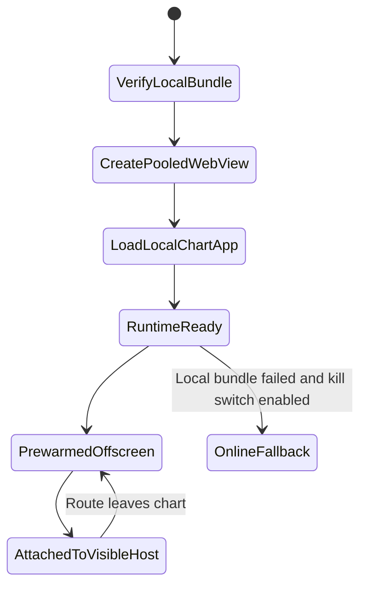
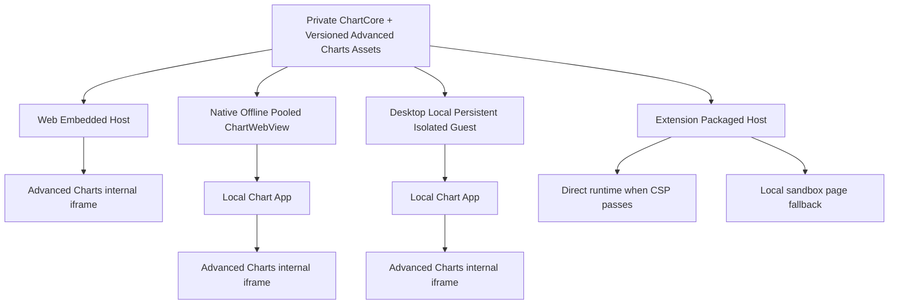

# OneKey TradingView 跨端加载方式优化 Handoff

## 0. 文档定位

本文档只交接 TradingView 的“加载方式”调研，回答以下问题：

- 图表静态资源从哪里加载；
- 宿主是父页面 DOM、iframe、WebView 还是独立 Electron guest；
- 是否加载远程 Chart App；
- 是否使用离线包、同源注入、预热、池化和实例复用；
- Web、iOS、Android、Desktop、Extension 应采用什么不同策略；
- 私有 TradingView 资源如何构建、发布、缓存和回滚；
- 如何验证加载方式优化是否生效。

本文档明确不讨论：

- token detail 等业务前置请求；
- K 线 HTTP/WebSocket 数据链路；
- priceScale、marks、order lines；
- main/bg/chart 的具体消息契约；
- Datafeed 内部实现和服务端性能。

这些内容属于通信链路优化，应在独立方案中处理。本文仅在“避免重新加载图表 document/widget”时提及 symbol 生命周期，不展开通信协议。

调研日期：2026-07-15 至 2026-07-16，Asia/Shanghai。

## 1. 结论摘要

不应让所有平台机械复制 Hyperliquid 的 DOM 拓扑。应统一复用它的加载原则，再为不同平台选择合适宿主：

| 平台 | 推荐加载方式 | 是否完全复制 Hyperliquid 同页挂载 |
| --- | --- | --- |
| Web | 父页面直接加载私有 Embedded Chart Runtime | 是，最合适 |
| iOS/Android | 离线、预热、池化的单例 ChartWebView | 否，宿主必须是 WebView |
| Desktop | 离线、常驻、独立进程的 chart guest/WebContents | 默认否，保留进程隔离 |
| Extension 展开页/侧边栏 | 安装包内的 direct runtime；CSP 不兼容时使用本地 sandbox page | 有条件 |
| Extension Popup | 轻量预览或跳转到稳定页面 | 不建议加载完整 Advanced Charts |

统一的是：

- 同一份私有 ChartCore/Chart Runtime；
- 同一份版本化 Advanced Charts 资源；
- 同一份运行时配置模型；
- 稳定 widget，页面内切标的不重建 document；
- 静态资源本地化或同站化；
- 可观测的 runtime/widget ready 状态；
- 版本锁定、缓存和回滚策略。

不统一的是宿主拓扑。

## 2. 当前真实加载拓扑

### 2.1 Hyperliquid Web

2026-07-15 现场检查结果：

```text
https://app.hyperliquid.xyz/trade
└── div#tv_chart_container
    └── iframe
        src="about:blank"
        title="Financial Chart"
        version="CL v28.5.0"
        ├── TradingView UI DOM / SVG
        └── Canvas rendering layers
```

父页面直接加载：

```text
/charting_library_v28.5/charting_library/charting_library.js
```

随后由 Advanced Charts Library 创建内部 `about:blank` iframe，并通过 `<base>` 把内部 runtime、language、library bundle 和 CSS 指向同站静态目录。

关键点：Hyperliquid 不是完全没有 iframe，而是没有“远程 Chart App 外层 iframe”。页面只承担一次应用启动，Advanced Charts 自己的内部 iframe负责 CSS、DOM、焦点和渲染隔离。

### 2.2 OneKey Web/Extension 当前模式

```text
OneKey App document
└── iframe title="iframe-web"
    src="https://tradingview.onekey.so/?..."
    └── OneKey Chart App document
        ├── Vite/React bootstrap JS + CSS
        └── div#tv_chart_container
            └── iframe
                src="blob:https://tradingview.onekey.so/..."
                version="TT v30.2.0"
                └── Advanced Charts UI/canvas
```

当前比 Hyperliquid 多一层完整 Chart App：

1. 父页面导航到远程 `tradingview.onekey.so`；
2. 远程 document 加载自己的 JS/CSS；
3. Chart App 初始化；
4. Chart App 再创建 Advanced Charts 内部 iframe。

现场代表性样本中，外层 Chart App shell 的两个主要 JS 合计约 235KB 压缩传输、约 800KB 解压后体积。这个数字受部署版本影响，实施前必须复测。

### 2.3 OneKey Desktop 当前模式

```text
Electron wallet renderer
└── Electron <webview>
    src="https://tradingview.onekey.so/?..."
    partition="persist:onekey"
    sandbox/contextIsolation enabled
    └── Remote Chart App
        └── Advanced Charts internal iframe
```

Desktop 多出的外层 guest 提供独立 renderer/process 隔离，但仍受到远程 HTML、静态资源网络、guest 创建和 Chart App bootstrap 的影响。

### 2.4 OneKey Native 当前模式

```text
React Native main UI
└── RN WebView
    src="https://tradingview.onekey.so/?..."
    └── Remote Chart App
        └── Advanced Charts internal iframe
```

当前通用 NativeWebView 还显式设置了 `cacheEnabled={false}`。TradingView 专用离线 ChartWebView 原生模块已作为 mobile 依赖存在，但 app-monorepo 的统一替换、离线决策和生命周期接入仍需完成。

### 2.5 当前与目标图

```mermaid
flowchart TB
    subgraph HL["Hyperliquid Web"]
        H1["App document"] --> H2["Same-origin charting_library.js"]
        H2 --> H3["Advanced Charts internal iframe"]
    end

    subgraph OKWEB["Current OneKey Web / Extension"]
        W1["OneKey App document"] --> W2["Remote tradingview.onekey.so iframe"]
        W2 --> W3["Chart App JS/CSS bootstrap"]
        W3 --> W4["Advanced Charts internal iframe"]
    end

    subgraph OKDESKTOP["Current OneKey Desktop"]
        D1["Electron wallet renderer"] --> D2["Remote Electron webview guest"]
        D2 --> D3["Chart App bootstrap"]
        D3 --> D4["Advanced Charts internal iframe"]
    end

    subgraph OKNATIVE["Current OneKey Native"]
        N1["React Native UI"] --> N2["Remote RN WebView"]
        N2 --> N3["Chart App bootstrap"]
        N3 --> N4["Advanced Charts internal iframe"]
    end
```



## 3. 目标产物模型

建议把私有 chart repository 产出两种消费形态，但共享同一 ChartCore：

```text
@onekeyhq/tradingview-charting-library
├── dist/app/
│   ├── index.html
│   ├── assets/*
│   └── charting_library/*
│
├── dist/embed/
│   ├── chart-runtime.esm.js
│   └── chart-runtime.css
│
└── dist/charting_library/
    └── versioned private vendor assets
```

用途：

- `dist/app`：Native、Desktop、Extension sandbox 的完整本地 Chart App；
- `dist/embed`：Web 和通过 CSP 验证的 Extension 页面直接挂载；
- `dist/charting_library`：两种入口共享的 Advanced Charts 私有资源。

当前 chart package 只发布 `dist`，并以 Vite SPA 为主。Chart repo 已存在 `ChartManager`、runtime config 和 offline protocol，可作为拆分 embedded/app 双入口的基础，无需重写图表业务核心。

### 3.1 授权和供应链约束

Advanced Charts vendor assets 不得进入公开 app-monorepo 或公开 Git 历史。目标流程必须是：

```text
Private chart repository/package
  -> private CI artifact
  -> platform build/deploy injection
  -> Web CDN / Native bundle / Desktop resources / Extension package
```

必须保留：

- 资源版本和哈希；
- 来源校验；
- 完整性校验；
- build manifest；
- app/chart 兼容矩阵；
- 可回滚版本；
- 禁止把 vendor 源码或构建产物提交到公开仓库的检查。

## 4. 分平台目标加载方式

### 4.1 Web：Embedded Direct Runtime

目标结构：

```text
app.onekey.so MarketDetail document
└── #tv_chart_container
    └── Advanced Charts internal iframe
```

父页面按需加载私有 Embedded Runtime：

```ts
const runtime = await loadChartRuntime();
await runtime.mount(container, initialConfig);
```

静态资源部署在同站版本目录：

```text
https://app.onekey.so/chart-assets/<chart-version>/...
```

推荐缓存：

```text
Hashed JS/CSS/assets:
Cache-Control: public, max-age=31536000, immutable

Version manifest / loader entry:
Cache-Control: no-cache 或短 max-age
```

预期收益：

- 外层 Chart App HTML 请求为 0；
- 外层 Chart App React/Vite bootstrap 为 0；
- 删除一次跨站 document 初始化；
- 父页面直接持有 runtime 生命周期；
- symbol 变化时 document/widget reload 为 0；
- 静态资源复用同站连接和缓存。

主要风险：

- Advanced Charts 的解析和执行更接近钱包主 renderer；
- 图表长任务可能与 OneKey UI 争抢同一 renderer thread；
- 图表异常的影响域比跨站 iframe 更大；
- 私有资源必须由部署流程注入，不能进入公开仓库；
- storage origin 从 `tradingview.onekey.so` 变化到 `app.onekey.so`，用户设置需要迁移或明确重置策略。

因此 Web direct 必须用 feature flag 和远程 iframe fallback 做 A/B，不能一次性删除旧路径。

### 4.2 iOS/Android：Offline Pooled ChartWebView

目标结构：

```text
Native main UI
└── Chart host placeholder
    └── One pooled native ChartWebView
        └── Local versioned Chart App
            └── Advanced Charts internal iframe
```

加载来源：

| 平台 | 本地资源机制 | 目标 URL/origin |
| --- | --- | --- |
| Android | WebViewAssetLoader 映射本地 assets | 虚拟 HTTPS origin |
| iOS | WKURLSchemeHandler | `onekey-chart://chart/...` |

加载生命周期：



关键设计：

- 单进程最多一个目标池化实例，或按业务隔离后的严格小数量实例；
- 原生 attach/reparent 走 UI thread，不依赖 JS 首帧调度；
- App 进入可能访问图表的页面前预热；
- 页面切换只搬运宿主，不重新导航；
- static asset 网络请求为 0；
- 本地 bundle 验证失败时可切 online；
- 版本决策在冷启动锁定，本 session 不来回切换；
- 内存压力下允许 snapshot + 销毁，恢复时重新预热。

主要风险：

- iOS custom scheme 下 localStorage 的长期稳定性必须真机验证；
- Android/iOS origin 不同带来的用户设置迁移；
- pool reparent 的生命周期、前后台、旋转和导航竞态；
- WebView renderer crash 后的实例重建；
- 离线 bundle 与 app JS 的兼容版本；
- 在线 kill switch 切换时的 storage 连续性。

### 4.3 Desktop：Local Persistent Isolated Guest

不建议默认把 Advanced Charts 直接注入钱包 renderer。推荐保留独立 renderer/process，但去掉远程加载：

```text
Electron wallet renderer
└── Chart host placeholder
    └── Persistent chart guest / WebContentsView
        └── onekey-chart://local/<version>/index.html
            └── Advanced Charts internal iframe
```

关键设计：

- Chart App 随 Desktop 安装包或安全 bundle update 下发；
- 使用专用持久 partition，例如 `persist:onekey-chart`；
- App 启动或进入 Market/Perps 前创建 chart guest；
- 页面只 attach/detach，不重复 `src` navigation；
- symbol 变化不改变 guest document URL；
- 隐藏后降频，内存压力下才销毁；
- renderer crash 只重建 chart guest，不拖垮钱包主 UI。

当前代码使用 Electron `<webview>`。Electron 官方已提示该标签存在架构稳定性风险，长期可评估迁移到 `WebContentsView`；但此次加载方式优化的核心是“本地、常驻、隔离”，不是必须在同一个变更里替换宿主 API。

Desktop direct renderer 只建议作为性能 PoC。如果 A/B 证明独立本地 guest 已达到目标，就不应为了减少一层 document 而扩大崩溃和权限影响域。

### 4.4 Extension：Packaged Direct 或 Packaged Sandbox

Manifest V3 不允许 Extension page 执行远程托管代码，因此不能把远程 `charting_library.js` 注入 extension UI。Advanced Charts 资源必须进入最终扩展安装包，但仍由私有构建流程注入，不能提交到公开仓库。

#### 路径 A：Packaged Direct Runtime

适用于 Advanced Charts 在当前 Extension CSP 下完全运行：

```text
chrome-extension://<id>/ui-expand-tab.html
└── #tv_chart_container
    └── Advanced Charts internal iframe
```

优点：

- 与 Hyperliquid Web 拓扑接近；
- 无外层 Chart App；
- 无远程静态代码；
- runtime 可由稳定的 expand tab/side panel 持有。

验证门槛：

- Chrome、Edge、Firefox；
- MV3 `script-src 'self' 'wasm-unsafe-eval'`；
- blob URL、dynamic import、worker；
- Advanced Charts 是否依赖 `unsafe-eval/new Function`；
- Chrome Web Store remotely hosted code 审核；
- vendor assets 随 CRX/ZIP 分发的 TradingView 授权确认。

#### 路径 B：Packaged Sandbox Chart Page

如果普通 extension page 的 CSP 无法运行 Advanced Charts：

```text
Extension UI
└── Local sandboxed iframe
    └── Packaged Chart App
        └── Advanced Charts internal iframe
```

Sandbox page 使用独立 CSP、没有 Extension API，通过受控消息与父页面通信。它不是完全去 iframe，但静态资源全本地、Chart App 极简且实例稳定，仍能消除远程网络和大部分重启成本。

#### Popup 策略

Popup document 在关闭时会销毁，无法可靠维持完整 widget。建议：

- Popup 只显示轻量预览；
- 完整图表跳转 expand tab 或 side panel；
- 不把“popup 每次打开冷启动 Advanced Charts”作为性能目标。

## 5. 目标平台图



## 6. Runtime 和资源所有权

### 6.1 Web

- Target：Web；
- App `main`/`background`：单 JS runtime/thread；
- Embedded Runtime：运行在 OneKey page；
- Advanced Charts 内部 iframe：独立 Window/realm，但同源；
- 静态资源：CDN/浏览器缓存资源，不进入多个 app JS heap；
- Timing：chart runtime 可与业务模块并行加载，但会与 OneKey UI 竞争 renderer thread。

### 6.2 Desktop

- Target：Desktop；
- App `main`/`background` 业务代码：单 JS runtime/thread；
- chart guest：Electron 拥有的独立 WebContents/renderer process；
- 静态资源：应用安装目录或本地 bundle update 目录；
- JS heap：钱包 renderer 与 chart guest 不共享对象；
- Timing：guest 可独立预创建，不能假设 attach 时 document 已 ready，必须有明确 ready 状态。

### 6.3 iOS/Android

- Target：iOS/Android；
- Runtime scope：`main-JS`、`bg-JS`、`WebView-JS`；
- Native resource ownership：pooled ChartWebView 是 UI/main 侧管理的共享 native 实例，不是 main/bg 共享 JS 对象；
- 静态资源：App bundle/本地文件资源，由 native WebView host 读取；
- JS heap copies：main、bg、WebView 各自独立；加载配置跨边界时分别反序列化；
- Timing/order：main 与 bg 独立初始化，ChartWebView 预热不能依赖 bg ready；
- 版本：main/bg JS bundle 版本锁定，重点是 native/chart bundle 与 JS 的兼容矩阵。

### 6.4 Extension

- Target：Extension；
- Runtime scope：UI `main`、background service worker `bg`、chart page/iframe；
- JS heap copies：三者独立；
- Native/process resource：打包静态文件由 Extension package 共享，运行对象不共享；
- Timing/order：service worker 可休眠，不能作为 chart static runtime 的常驻宿主；
- Popup、side panel、expand tab 生命周期不同，不能用一个加载策略覆盖所有 surface。

## 7. 方案对比

| 方案 | 结构 | 加载性能 | 隔离性 | 维护成本 | 结论 |
| --- | --- | ---: | ---: | ---: | --- |
| A. 全端继续远程 Chart App | 所有端远程 iframe/WebView | 低至中 | 高 | 低 | 仅作 fallback |
| B. 全端本地/同站独立 Chart App | Web/Ext iframe，Native/Desktop 本地 guest | 高 | 高 | 中 | 保守可行 |
| C. 平台化混合宿主 | Web direct；Native pooled；Desktop isolated；Ext direct/sandbox | 最高综合收益 | 按端最优 | 中至高 | 推荐 |
| D. 所有端都注入主 UI renderer | 全端 direct widget | 理论最高 | 低 | 很高 | 不推荐 |

推荐 C。它统一资源和 ChartCore，但不牺牲 Native/Desktop/Extension 的平台边界。

## 8. 分阶段落地

### Phase 0：建立加载基线和产物契约

1. 为 Web、iOS、Android、Desktop、Extension 分别采集冷/暖加载基线；
2. 定义 `chartVersion`、build manifest、资源哈希和兼容矩阵；
3. chart package 拆分 `app` 与 `embed` 双入口；
4. 定义不依赖业务数据的 runtime ready/widget frame ready 状态；
5. 保留当前远程 Chart App 作为 fallback。

### Phase 1：Native 离线包

1. 接入专用 ChartWebView；
2. Android 虚拟 HTTPS origin；
3. iOS custom scheme；
4. bundle verify + online kill switch；
5. 预热、池化、reparent；
6. storage migration；
7. 真机断网、升级和 renderer crash 验证。

### Phase 2：Web Embedded Direct A/B

1. 发布私有 embedded runtime；
2. Web CDN 注入 versioned vendor assets；
3. 父页面直接 mount；
4. 保留远程 iframe feature flag；
5. 比较冷启动、暖导航、主线程长任务、内存和异常影响域；
6. 达标后逐步扩大流量。

### Phase 3：Desktop Local Persistent Guest

1. Chart App 随安装包/安全 bundle update 下发；
2. 专用 local scheme 和 partition；
3. guest 预创建和常驻；
4. attach/detach 复用；
5. storage migration；
6. 后续单独评估 `<webview>` 到 `WebContentsView` 的迁移。

### Phase 4：Extension Packaged Runtime

1. 私有资源注入 extension build；
2. direct CSP compatibility PoC；
3. CSP 不通过则 sandbox page；
4. expand tab、side panel、popup 分别验证；
5. Chrome/Edge/Firefox 安装和商店审查；
6. popup 明确采用轻量预览或跳转策略。

## 9. 加载方式专属埋点

以下埋点不包含业务数据请求：

```text
chart_host_requested
chart_artifact_manifest_ready
chart_local_bundle_verified
chart_host_created
chart_document_navigation_start
chart_document_dom_ready
chart_runtime_script_start
chart_runtime_script_ready
chart_widget_constructor_start
chart_internal_frame_created
chart_widget_shell_ready
chart_host_prewarmed
chart_host_attached
chart_host_detached
chart_host_reused
chart_host_destroyed
chart_host_fallback_online
chart_renderer_crashed
```

每条记录包含：

```text
platform
surface
chartVersion
loadMode: remote | local-app | embedded
coldOrWarm
hostInstanceId
documentNavigationId
assetCacheState
fallbackReason
```

Native/Extension 埋点必须标明 runtime；Desktop 必须标明 wallet renderer 与 chart guest；Web 必须区分 parent runtime 和 Advanced Charts internal frame。

## 10. 验收指标

### 10.1 跨端共同条件

- symbol 切换产生的 chart document navigation：0；
- symbol 切换产生的 Chart App JS/CSS 重新下载：0；
- 主题/布局等非版本变更不得销毁整个宿主；
- 每个稳定 surface 的 chart host 数量可解释且受限；
- 资源版本可追踪、可回滚；
- fallback 不产生无限 reload loop；
- 用户看见的是真实 widget shell，不以 DOM 节点存在作为通过。

### 10.2 Web

- 外层 `tradingview.onekey.so` document 请求：0；
- 外层 Chart App React/Vite bootstrap：0；
- Advanced Charts internal iframe：1；
- chart assets 全部来自允许的同站 version path；
- Embedded 与远程 iframe A/B 下，主线程长任务不能明显回归；
- 远程 iframe kill switch 可即时恢复旧路径。

### 10.3 Native

- 静态 chart asset 网络请求：0；
- 断网冷启动可出现 widget shell；
- 预热后打开页面不创建第二个 WebView；
- 页面切换只 reparent，不重新 navigation；
- iOS/Android 前后台、旋转、导航栈和 renderer crash 后可恢复；
- 本地 bundle 校验失败会安全 fallback。

### 10.4 Desktop

- 静态 chart asset 网络请求：0；
- chart guest 使用专用 partition；
- 同一个 guest 可跨 Market/Perps host 复用或按明确策略使用小数量池；
- detach/attach 不重载 document；
- chart renderer crash 不导致 wallet renderer 崩溃；
- 安装升级后资源和 storage 状态符合迁移设计。

### 10.5 Extension

- 扩展包内不存在运行时远程 JS/WASM 下载执行；
- direct 模式满足 MV3 CSP；不满足时自动选择构建期 sandbox 方案，而不是运行时猜测；
- expand tab/side panel 的 chart document 不随普通 React rerender 重建；
- popup 关闭后不承诺复用完整 widget；
- Chrome、Edge、Firefox 均完成安装、启动和 CSP 控制台检查。

## 11. 关键风险和决策 Gate

| Gate | 必须确认的问题 | 不通过时的选择 |
| --- | --- | --- |
| Web renderer | Direct runtime 是否导致长任务/内存/崩溃域不可接受 | 退回同站或跨站稳定 iframe |
| Web storage | `tradingview.onekey.so` 用户数据如何迁到 `app.onekey.so` | 保持旧 origin 或执行迁移 |
| iOS storage | custom scheme localStorage 是否跨杀进程/升级稳定 | loopback HTTP 或 online fallback |
| Native pool | reparent 是否覆盖导航、旋转、前后台和 crash | 小数量池或普通本地 WebView |
| Desktop host | 当前 `<webview>` 是否继续维护 | 独立项目迁移 WebContentsView |
| Extension CSP | Advanced Charts 是否能在 MV3 extension page 直接执行 | packaged sandbox page |
| Extension license | vendor assets 是否允许随 CRX/ZIP 分发 | 保留受授权的远程/独立方案 |
| Supply chain | 私有产物是否可能进入公开 Git 历史 | 阻断构建/发布 |

## 12. 源码和文档定位

### app-monorepo

| 主题 | 位置 |
| --- | --- |
| TradingView URL 选择 | `packages/kit/src/components/TradingView/hooks/useTradingViewUrl.ts` |
| Web/Extension iframe host | `packages/kit/src/components/WebView/InpageProviderWebView.tsx` |
| Native WebView host | `packages/kit/src/components/WebView/InpageProviderWebView.native.tsx` |
| Native WebView implementation | `packages/kit/src/components/WebView/NativeWebView.tsx` |
| Desktop host wrapper | `packages/kit/src/components/WebView/InpageProviderWebView.desktop.tsx` |
| Electron guest implementation | `packages/kit/src/components/WebView/DesktopWebView.tsx` |
| Market chart wrapper/remount key | `packages/kit/src/components/TradingView/TradingViewV2/components/tradingViewV2/TradingViewV2.tsx` |
| Perps stable URL lifecycle reference | `packages/kit/src/components/TradingView/TradingViewPerpsV2/TradingViewPerpsV2.tsx` |
| Extension MV3 CSP | `apps/ext/src/manifest/common.js`, `apps/ext/src/manifest/chrome_v3.js` |
| Native chart module dependency | `apps/mobile/package.json` |
| Offline/online and migration research | `docs/plans/2026-06-10-tradingview-offline-online-toggle-and-migration.md` |
| Native ChartWebView research | `docs/plans/2026-06-01-chart-webview-design.md` |

### private chart repository

| 主题 | 位置 |
| --- | --- |
| Runtime bootstrap | `/Users/huhuanming/Project/tradingview-charting-library/src/main.tsx` |
| Chart lifecycle manager | `/Users/huhuanming/Project/tradingview-charting-library/src/widget/ChartManager.ts` |
| Widget construction | `/Users/huhuanming/Project/tradingview-charting-library/src/widget/TradingViewWidget.ts` |
| Library path/configuration | `/Users/huhuanming/Project/tradingview-charting-library/src/widget/managers/ConfigurationManager/ConfigurationManager.ts` |
| Build output | `/Users/huhuanming/Project/tradingview-charting-library/vite.config.ts` |
| Package publish shape | `/Users/huhuanming/Project/tradingview-charting-library/package.json` |

Vendor static asset directory属于授权资源，只作为黑盒输入，不在公开文档中复制内容。

### 官方技术参考

- TradingView `about:blank` iframe compatibility mode：<https://www.tradingview.com/charting-library-docs/latest/troubleshooting/>
- TradingView package content：<https://www.tradingview.com/charting-library-docs/latest/getting_started/Package-Content/>
- Chrome Manifest V3 remotely hosted code：<https://developer.chrome.com/docs/extensions/develop/migrate/remote-hosted-code>
- Chrome Extension CSP：<https://developer.chrome.com/docs/extensions/reference/manifest/content-security-policy>
- Electron `<webview>` 风险和替代建议：<https://www.electronjs.org/docs/latest/api/webview-tag>

## 13. 给接手 AI 的提示词

```text
请完整阅读 TRADINGVIEW_LOADING_MODE_HANDOFF.md。

本任务只处理 TradingView 加载方式：静态资源来源、宿主类型、document 层级、离线包、同源注入、缓存、预热、池化、实例复用、storage origin、版本和 fallback。

禁止把以下内容混入本任务：token detail、K 线 API/WebSocket、priceScale、marks、orders、bridge 消息性能。若发现这些问题，只记录为另一项目，不在本方案实现。

要求：
1. 先逐字复原文档中的三张 Mermaid 图；不要修改节点和方向。
2. 先确认目标平台，再读取对应 platform host 文件。
3. Web、Desktop 的 app main/bg 按单 JS runtime/thread 分析；iOS、Android、Extension 的 main/bg 按隔离 runtime 分析。
4. Native 必须说明 pooled native WebView 的所有权、main/bg/WebView JS heap copies 和独立初始化顺序。
5. 不得把 TradingView Advanced Charts vendor assets 提交到公开 app-monorepo。
6. 实施前重新测量每个平台的冷/暖加载基线和当前 chartVersion。
7. 每个平台都保留安全 fallback；不要在同一个 PR 同时删除旧加载路径。
8. 不把 iframe/host DOM 存在当作通过；必须验证真实 widget shell、资源来源、document navigation 次数和实例复用。

输出顺序：
A. 当前加载拓扑
B. 目标平台和加载模式
C. 资源产物与授权边界
D. 最小实施步骤
E. 加载专属埋点
F. 冷/暖复测结果
G. fallback 验证
```

## 14. 接手检查清单

- [ ] 文档范围没有混入数据/通信链路优化；
- [ ] Hyperliquid 被正确描述为“Library 内部 iframe”，不是完全无 iframe；
- [ ] OneKey Web 当前被正确描述为“远程 Chart App iframe + Library 内部 iframe”；
- [ ] Web 目标只有 Library 内部 iframe；
- [ ] Native 目标仍使用 WebView，但资源本地、实例池化；
- [ ] Desktop 目标保留独立 renderer/process；
- [ ] Extension 没有运行时远程代码；
- [ ] Popup 与 expand tab/side panel 分开处理；
- [ ] 私有 vendor assets 不进入公开仓库；
- [ ] storage origin 变化有迁移或明确决策；
- [ ] symbol 变化不会导致 document/widget reload；
- [ ] 所有平台都有版本和 fallback；
- [ ] 验收只使用加载相关指标。

## 15. 当前状态

- 本文件是调研 handoff，不代表方案已经立项或实施；
- 本次只新增 `TRADINGVIEW_LOADING_MODE_HANDOFF.md`，未修改业务代码；
- 当前工作树已有其他用户改动和未跟踪文件，接手人必须保留，不能 reset 或覆盖；
- 实施时建议按平台拆分独立设计和 PR，避免把 Native、Web、Desktop、Extension 的风险绑在一次发布中。
