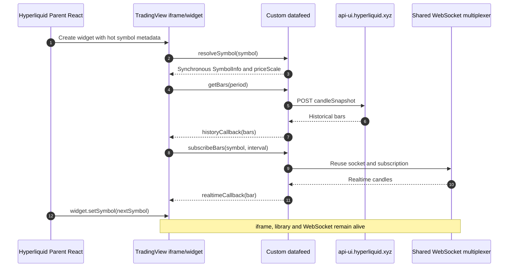
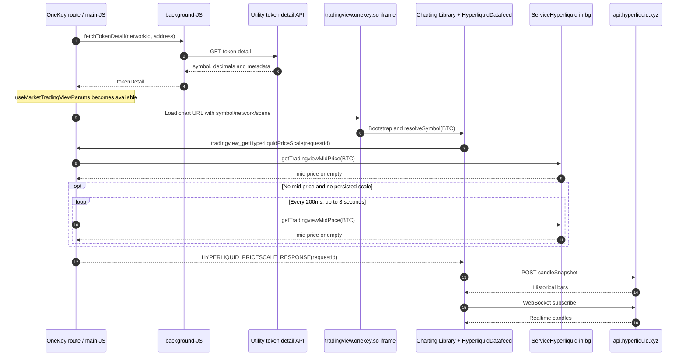
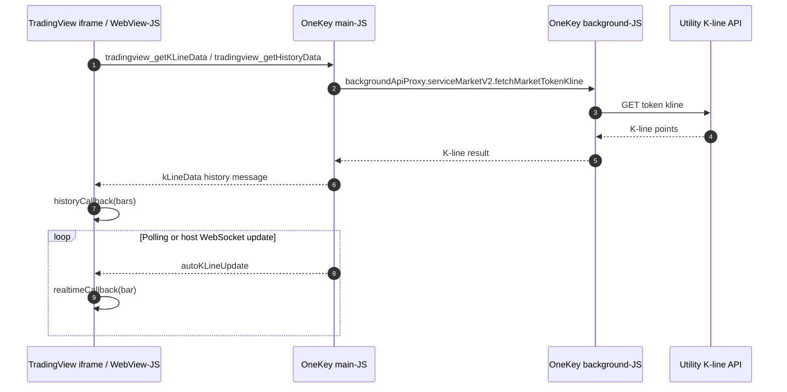
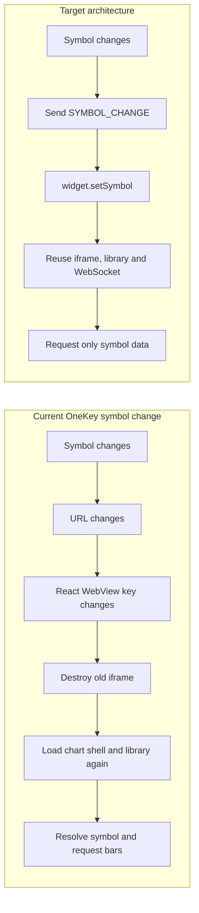

# Hyperliquid vs OneKey TradingView 性能分析 Handoff

## 0. 文档用途

本文档用于把 2026-07-15 的 TradingView 加载性能分析交给下一位同事或下一轮 AI。文档包含：

- 可复核的浏览器实测数据；
- 已确认的源码调用链；
- Hyperliquid、OneKey BTC 和普通 OneKey Market 的通信图；
- Native 多 runtime 的边界说明；
- 优化优先级、验收指标和建议埋点；
- 可直接复制给 AI 的复原提示词。

所有 Mermaid 图的源代码都内嵌在文档中。支持 Mermaid 的 Markdown 阅读器会直接渲染；不支持时，AI 仍可从代码块完整复原图表。

## 1. 一句话结论

OneKey BTC 慢的主要原因不是 TradingView Advanced Charts 本身，而是图表位于过长的串行关键路径后面：

```text
OneKey 大量业务 JS
  -> token detail
  -> 创建远程 TradingView iframe
  -> iframe 向 main 请求 Hyperliquid priceScale
  -> main 等待 background 的 mid price / 持久化值
  -> Hyperliquid candleSnapshot
  -> 首批 K 线渲染
```

Hyperliquid 的关键路径更短：symbol 元数据在内存中同步解析，datafeed 直接请求 candle API，共享 WebSocket，并通过 `setSymbol()` 复用现有 widget，而不是重建 iframe。

## 2. 分析范围与目标页面

### 2.1 页面

- Hyperliquid：<https://app.hyperliquid.xyz/trade>
- 用户原始 OneKey URL：<https://app.onekeytest.com/market/token/btc/?isNative=true>
- 当前可进入 BTC 详情的 OneKey URL：<https://app.onekeytest.com/market/token/btc--0/?isNative=true>

当前代码中的 BTC networkId 是 `btc--0`。`/btc/` 可能落到 Market 列表或异常页，需要兼容映射。

在本次测量中，`/market/token/btc--0/` 的导航响应状态仍是 HTTP 404，但 SPA fallback 最终渲染出详情页。这是 deep-link rewrite/CDN 状态码问题，需要重新验证并修正为 200。

### 2.2 当前实际 iframe

在 `app.onekeytest.com` 上观察到的 iframe 仍指向生产图表域名：

```text
https://tradingview.onekey.so/
  ?timezone=Asia%2FShanghai
  &locale=en-US
  &platform=web
  &theme=dark
  &appVersion=6.6.0
  &decimal=8
  &networkId=btc--0
  &address=
  &symbol=BTC
  &type=market
  &storageNamespace=market-hyperliquid
  &nativeIntervalSelector=1
  &nativeChartControls=1
  &scene=market-hyperliquid
```

原因是本次环境未启用 dev settings；测试站不会自然切换到测试图表域名。

### 2.3 BTC 当前数据源

BTC 命中 `HyperLiquidKlineSourceTokens`，因此使用 `market-hyperliquid` 场景：

- 图表内运行 `HyperliquidDatafeed`；
- 历史 K 线直接请求 Hyperliquid `candleSnapshot`；
- 实时 K 线直接连接 Hyperliquid WebSocket；
- OneKey main/bg 不传输 BTC 的 K 线数组；
- OneKey bridge 仍参与 `priceScale` 获取，这是首批 K 线之前的潜在串行阻塞。

## 3. 浏览器实测基线

### 3.1 测量口径

- 日期：2026-07-15，Asia/Shanghai；
- 场景：Web 冷启动，清浏览器缓存后导航；
- Service Worker：绕过；
- 未设置 CPU/网络限速；
- 下表为代表性样本，不是 RUM p75；
- 网络和 CDN 存在波动，应优先相信请求顺序和依赖关系，不应只用单次绝对耗时判断优化收益。

### 3.2 Hyperliquid 代表性结果

| 指标 | 结果 |
| --- | ---: |
| 主页面 FCP | 约 1.94s |
| TradingView iframe FCP | 约 2.67s |
| 图表有意义内容 | 约 4.19s |
| HYPE -> ETH symbol 切换 | 约 600ms |
| 切换时 candleSnapshot | 约 457ms / 44.9KB |
| 捕获到的图表动态资源 | 约 372KB |

切换 symbol 时没有重新加载 Charting Library 或主应用 bundle。

### 3.3 OneKey BTC 代表性冷启动结果

| 指标 | 结果 |
| --- | ---: |
| HTML TTFB | 138ms |
| 导航响应状态 | 404，随后 SPA fallback 渲染 |
| First Paint | 1.05s |
| FCP | 3.22s |
| DOMContentLoaded | 2.94s |
| load event | 3.15s |
| token detail 开始 | 6.75s |
| token detail 完成 | 7.04s |
| TradingView iframe 请求开始 | 7.58s |
| TradingView iframe HTML 完成 | 8.01s |
| 图表 iframe 前已发起的应用 JS | 155 个 |
| 上述 JS 传输量 | 约 4.20MB |
| 上述 JS 解压后体积 | 约 15.86MB |
| 采集窗口长任务 | 5 个，合计约 663ms |

其中两个最大长任务约为 319ms 和 130ms。155 个应用 JS 请求都早于 iframe 请求发起；部分脚本的响应结束时间晚于 iframe，因此它们还会与图表争抢网络和主线程。

### 3.4 OneKey 暖缓存结果

代表性暖缓存样本中：

- detail chunks 大约在 0.06-0.56s 预取/执行；
- token detail 大约在 0.71-0.88s；
- iframe 大约在 1.21s 开始请求。

暖缓存显著改善说明远程图表页面本身不是唯一主因，冷启动资源调度和挂载 gate 更重要。

### 3.5 不应过度解读的观测

父页面消息探针在一个样本里只捕获到 `tradingview_interactionOverlay`，没有捕获到 priceScale request。源码和当前部署 bundle 均包含 priceScale 协议及超时逻辑，因此更可能是探针注入时机/target 限制，不应据此否定该链路。后续应使用正式埋点或在 iframe/main/bg 三端同时记录关联 requestId。

## 4. 两边通信图

### 4.1 Hyperliquid 当前链路



关键特征：

1. `resolveSymbol` 使用已在内存中的 coin/symbol/priceScale/spot metadata；
2. datafeed 直接获取历史数据；
3. WebSocket 由 multiplexer 复用；
4. symbol 切换只调用 `setSymbol()`；
5. widget、iframe、Charting Library 和连接不重建。

### 4.2 OneKey BTC 当前链路



### 4.3 普通 OneKey Market 数据源链路

非 Hyperliquid allowlist token 使用以下链路：



这条链路比 BTC direct-datafeed 分支多两次 runtime 边界和数据序列化。`fetchTradingViewV2DataWithSlicing` 还可能把一个时间范围拆成多个并发 K 线请求再合并。

### 4.4 当前切币与目标切币



## 5. 已确认的串行瓶颈

### 5.1 token detail gate 阻止 iframe 提前挂载

`useMarketTradingViewParams()` 在 `tokenDetail.symbol` 或 `networkId` 不存在时返回 `undefined`：

```text
packages/kit/src/views/Market/MarketDetailV2/hooks/useTokenDetail.ts
```

因此路由已经包含 `btc--0` 时，图表仍要等待完整 token detail 请求完成。优化方向是从 route/basic network config/navigation preview 立即得到初始 symbol，先挂载图表，detail 数据随后补齐。

### 5.2 图表与非关键重模块同时预加载

`preloadMarketDetailV2BodyModules({ includeHeavyModules: true })` 同时触发：

- TradingView；
- SwapPanel；
- InfoPanel；
- 相应 desktop/mobile layout chunks。

这会让图表与非首帧模块争抢网络、解压和主线程。图表应成为 detail body 的第一优先级，Swap/Info 等在首批 K 线、用户意图或 idle 后加载。

### 5.3 Hyperliquid priceScale 阻塞 resolveSymbol

图表的 `HyperliquidDatafeed.resolveSymbol()` 等待 `getHyperliquidPriceScale(symbol)`。Host 侧顺序为：

1. 请求 bg 的当前 mid price；
2. mid price 不存在时请求持久化 priceScale；
3. 两者都不存在时，每 200ms 轮询 mid price，最长 3 秒；
4. 图表端还有约 5 秒 fallback timeout；
5. 收到 priceScale 后才继续完成 symbol resolve/getBars。

这让 bg readiness 成为首批 K 线的隐式前置条件。

### 5.4 symbol 变化导致 iframe 重建

当前 WebView key 为：

```tsx
key={`${theme}:${tradingViewUrlWithParams}`}
```

URL 包含 symbol、networkId 和 address，因此切币会改变 key，导致 WebView/iframe 重新创建。目标应是稳定的 chart shell URL/key，通过 `SYMBOL_CHANGE` 和 `widget.setSymbol()` 更新标的。

### 5.5 普通 Market datafeed 的额外等待

`OnekeyDatafeed.getBars()` 发送 history request 后仍有：

```ts
await new Promise((resolve) => setTimeout(resolve, 1000));
```

history callback 通常由消息提前触发，因此这 1 秒未必直接阻止图表渲染，但会留下无意义的 pending async work。该分支还会为每个 history request 注册一个 window message listener。

### 5.6 静态资源缓存策略

本次检查中，图表 hash 资源有 ETag/Last-Modified，但响应未观察到明确的长期 `Cache-Control`。建议：

```text
Hashed assets: Cache-Control: public, max-age=31536000, immutable
Root HTML:      Cache-Control: no-cache 或很短的 max-age
```

部署前应重新检查真实 CDN 响应，避免把一次 HEAD 结果当成永久配置。

## 6. Runtime 边界

### 6.1 本次 Web 测量

- Runtime scope：`app.onekeytest.com` parent window 与 `tradingview.onekey.so` iframe 是两个独立 JS Window/realm；
- JS heap copies：`postMessage` 数据需要 structured clone/copy，双方不会共享 JS 对象；
- background scope：Web 下 `backgroundApiProxy` 仍可能跨 worker/background runtime，具体部署形态应通过运行时日志确认；
- Native resource ownership：本次 Web 测量不证明 Native 网络、DB、MMKV 的所有权或初始化耗时。

### 6.2 生产 Native

生产 Native 至少涉及：

- `main-JS`；
- `background-JS`；
- TradingView `WebView-JS`。

三者独立初始化、拥有独立 JS heap。token detail、priceScale、普通 Market K 线跨 runtime 时会分别序列化/反序列化或复制。底层网络、DB、MMKV、文件句柄或 native singleton 可能是进程内共享 native 资源，但其 JS wrapper/cache 仍是每个 runtime 一份。

因此：

- 不能假设 main 挂载图表时 bg 的 Hyperliquid mid price 已准备；
- 不能假设一个 runtime 的内存 cache 对另一个 runtime 可见；
- main/bg 初始化顺序相互独立；
- main/bg bundle 是版本锁定的，本问题不是 main-vs-bg JS 版本偏差。

## 7. 源码证据地图

| 主题 | 路径/位置 |
| --- | --- |
| Market native detail route | `packages/kit/src/routes/Tab/Marktet/router.ts:46` |
| TradingView params token detail gate | `packages/kit/src/views/Market/MarketDetailV2/hooks/useTokenDetail.ts:75` |
| Detail heavy-module preload | `packages/kit/src/views/Market/MarketDetailV2/utils/marketDetailPagePreload.ts:113` |
| 页面触发 body preload | `packages/kit/src/views/Market/MarketDetailV2/MarketDetailV2.tsx:97` |
| Hyperliquid source selection | `packages/kit/src/components/TradingView/TradingViewV2/components/tradingViewV2/hooks/useHyperLiquidKlineSource.ts:11` |
| `market-hyperliquid` URL params | `packages/kit/src/components/TradingView/TradingViewV2/components/tradingViewV2/TradingViewV2.tsx:404` |
| URL composition | `packages/kit/src/components/TradingView/TradingViewV2/components/tradingViewV2/TradingViewV2.tsx:420` |
| WebView URL-based key/remount | `packages/kit/src/components/TradingView/TradingViewV2/components/tradingViewV2/TradingViewV2.tsx:676` |
| Host priceScale polling | `packages/kit/src/components/TradingView/TradingViewV2/components/tradingViewV2/messageHandlers/useTradingViewMessageHandler.ts:67` |
| Regular K-line bridge | `packages/kit/src/components/TradingView/TradingViewV2/components/tradingViewV2/hooks/useTradingViewV2.ts:153` |
| bg Market K-line service | `packages/kit-bg/src/services/ServiceMarketV2.ts:311` |
| Web parent iframe bridge | `packages/kit/src/components/WebView/InpageProviderWebView.tsx:33` |
| Hyperliquid datafeed resolve/getBars | `/Users/huhuanming/Project/tradingview-charting-library/src/hyperliquid-datafeed/HyperliquidDatafeed.ts:111` |
| Hyperliquid candle API | `/Users/huhuanming/Project/tradingview-charting-library/src/hyperliquid-datafeed/api.ts:43` |
| Regular OneKey datafeed getBars | `/Users/huhuanming/Project/tradingview-charting-library/src/onekey-datafeed/OnekeyDatafeed.ts:150` |
| Chart-to-host bridge | `/Users/huhuanming/Project/tradingview-charting-library/src/messaging/core.ts:15` |
| Chart bootstrap | `/Users/huhuanming/Project/tradingview-charting-library/src/main.tsx:113` |
| Chart window stabilization | `/Users/huhuanming/Project/tradingview-charting-library/src/utils/dom.ts:7` |

注意：`tradingview-charting-library` 是相邻私有仓库，不属于 `app-monorepo`。不得把 TradingView Advanced Charts 的源码或构建产物复制到公开仓库；这里只记录 OneKey 自有封装的定位信息。

## 8. 优化建议与验收目标

### P0：缩短 iframe 之前的关键路径

1. 修复 `/btc/` -> `/btc--0/` 映射和 deep-link HTTP 404；
2. 从 route/basic config 得到初始 symbol，iframe 不再等待完整 token detail；
3. token detail、图表 shell、basic config 并行启动；
4. 将 TradingView chunk 设为 detail 页最高优先级；
5. SwapPanel、Info、Portfolio、Transactions 延迟到首批 K 线或 idle；
6. 对 `tradingview.onekey.so`、`api.hyperliquid.xyz` 和 token detail API 做 `dns-prefetch/preconnect`。

### P1：去掉 priceScale readiness gate

建议顺序：

1. 在初始配置/URL 中直接传 decimal 或 priceScale；
2. 没有 mid price 时立即返回 persisted/default scale；
3. 不允许 resolveSymbol 等待 3 秒轮询；
4. 首批 candle 返回后如有必要再校正 scale；
5. bg 可预热 mid price，但图表不能依赖 bg 已 ready。

### P1：复用 widget/iframe

1. WebView key 不包含 symbol/network/address；
2. chart shell 只挂载一次；
3. 使用带 requestId 的 `SYMBOL_CHANGE`；
4. iframe 内调用 `widget.setSymbol()`；
5. 复用 chart library、datafeed 和 WebSocket；
6. Perps 已有的 `SYMBOL_CHANGE` 模式可作为参考。

### P2：缓存、桥和普通 Market 分支

1. 为版本化图表资源增加 immutable cache；
2. 删除 regular datafeed 无条件 1 秒等待；
3. 把 per-request listener 改为统一 requestId dispatcher；
4. `postMessage(..., '*')` 改成明确允许的 origin；
5. 普通 K 线链路增加 main/bg/frame 共享的 correlation id；
6. 评估 host 侧 K 线 cache 和相同请求合并，减少序列化及重复请求。

### 建议性能预算

| 指标 | 目标 |
| --- | ---: |
| 暖导航 iframe request | route start 后 < 500ms |
| 冷启动 iframe request | route start 后 < 1s |
| priceScale response | < 20ms，禁止轮询等待 |
| 暖导航首根 K 线 | < 2s |
| 冷启动首根 K 线 | < 3s |
| symbol switch | < 700ms |
| symbol switch bundle reload | 0 |
| symbol switch iframe reload | 0 |

## 9. 建议埋点

三端使用同一 `traceId`，每个 bridge request 再带 `requestId`：

```text
route_start
route_identity_ready
token_detail_start
token_detail_ready
chart_chunk_start
chart_chunk_ready
iframe_create
iframe_navigation_start
iframe_dom_ready
chart_library_ready
resolve_symbol_start
pricescale_request
pricescale_bg_start
pricescale_bg_ready
pricescale_response
candle_request_start
candle_response
history_callback
first_bar_render
chart_ready
symbol_change_sent
symbol_change_rendered
```

埋点必须标明 runtime：`main`、`bg`、`webview`。Native 使用单调时钟时，应记录各 runtime 的启动基准，或通过握手估算时钟偏移，不能直接把三个 runtime 的 `Date.now()` 当作严格同一时间轴。

## 10. 复测步骤

1. 先确认部署版本、appVersion、chart bundle hash 和 CDN 地区；
2. 验证 `/btc/` 和 `/btc--0/` 的 HTTP 状态及实际渲染路由；
3. 新 browser context，绕过 Service Worker，跑至少 3 次冷启动；
4. 再跑至少 3 次暖导航；
5. 记录 parent document、token detail、iframe document、chart JS、priceScale、candleSnapshot 的 start/end；
6. 记录所有 iframe 前发起的 JS 数量、transferSize、decodedBodySize；
7. 记录主线程长任务；
8. 在 BTC、普通 Market token 各测一次；
9. 连续切换至少 5 个 symbol，检查 iframe document 和 chart bundle 是否产生新请求；
10. Native 必须分别抓 main/bg/WebView 日志，不能用 Web 结果代替 Native 验收。

通过条件不是“iframe DOM 存在”，而是：真实图表可见、首批 K 线完成、实时订阅生效、symbol 与页面标的一致、切币无 iframe reload。

## 11. 给下一位 AI 的复原提示词

把下面整段连同本文档一起交给 AI：

```text
请完整阅读 TRADINGVIEW_PERFORMANCE_HANDOFF.md，不要只读摘要。

任务：
1. 先逐字复原文档第 4 节的四张 Mermaid 图，不要改 participant、消息名、顺序、loop/opt 条件。
2. 如果当前界面不支持 Mermaid，输出可直接粘贴到 Mermaid Live Editor 的独立代码块；不要把图改写成纯文字后丢失边和方向。
3. 用一张对照表解释 Hyperliquid 与 OneKey BTC 在以下阶段的差异：iframe 挂载时机、resolveSymbol、priceScale、getBars、WebSocket、symbol switch。
4. 明确区分三类结论：浏览器实测、源码确认、待复测假设。不得把单次网络耗时写成稳定 SLA。
5. 分析 Native 时必须分别说明 main-JS、background-JS、WebView-JS；说明 native resource ownership、每个 runtime 的 JS heap copies、独立初始化顺序。
6. 修改代码前重新跑至少 3 次冷启动和 3 次暖启动，确认部署 bundle 没有变化。
7. 优先验证三个假设：token detail gate、priceScale 最长 3 秒轮询、URL/key 导致 iframe remount。
8. 不要复制、提交或公开 TradingView Advanced Charts 的源码/构建产物。

输出顺序：
A. 复原图表
B. 当前关键路径
C. 新测量与旧基线差异
D. 根因确认/否定
E. 最小改动方案
F. 验收结果
```

## 12. 图表复原校验清单

AI 或同事复原后应确认：

- Hyperliquid 图中存在 `setSymbol`，且图表/WS 不重建；
- OneKey BTC 图中 token detail 在 iframe 之前；
- OneKey BTC 图中存在 priceScale request/response；
- 轮询条件是“无 mid price 且无 persisted scale”；
- 轮询间隔 200ms，最长 3 秒；
- BTC K 线从 iframe 直接到 `api.hyperliquid.xyz`，没有错误画成经由 ServiceMarketV2；
- 普通 Market token 才经过 main -> bg -> Utility K-line API；
- 当前 symbol change 图中有 URL/key/iframe remount；
- 目标图中是 `SYMBOL_CHANGE` -> `widget.setSymbol()`；
- Native 图解/文字没有把 main/bg/WebView 误画成共享 JS heap。

## 13. 仓库状态说明

- 本次分析和 handoff 没有修改现有业务代码；
- 新增文件只有 `TRADINGVIEW_PERFORMANCE_HANDOFF.md`；
- 工作树在分析开始前已有大量用户改动和未跟踪文件，接手人必须保留，不能 reset、checkout 或覆盖；
- 浏览器实测反映的是当时部署版本，正式实施前必须复测。
