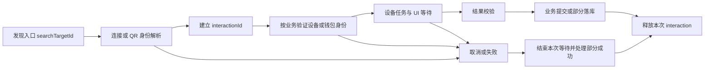

# 硬件 ID 与生命周期：统一审查报告及人工工作单

三轮报告已合并为本文件。前半部分给出逐项存在性核验、影响边界和修复验收；后半部分保留完整的 16 类业务、79 个检查项。无需来回对照三份报告。历史报告仅作为原始证据归档：[round1](round1.md)、[round2](round2.md)、[round3](round3.md)。另有一轮以业务流程与合入条件为轴的独立审查，其不重叠结论并入「合入闸门（第二轮独立审查补充）」一节，重叠项按该节末尾的归属表归一。

## 核验基准

日期：2026-09-12。App 为 `app-monorepo-fix-ledger`，HEAD `f27b196f063fa6265fbdc330bf29184626619ca2`；SDK 为相邻的 `js-sdk-trezor-experiment`，HEAD `fb30dc9641973f130100d865a183a026dc83413b`。本次重新读取 Git 状态与相关源码，两仓 HEAD 未变；App 原有 Ledger 连接页及测试的工作区改动仍在，SDK 工作区干净。未 fetch、未改业务代码、未操作真机。

平台范围：Desktop/Web 的 App main/bg 为单 JS runtime；iOS/Android/extension 的 main/bg 隔离，跨桥数据在各自 heap 反序列化，独立初始化。adapter 与任务状态归后台；Electron main process 的 Noble 是独立资源，extension offscreen 是额外 runtime。原生 BLE manager 是否共享实例需按平台实现核对，不由 JS 对象身份推断。完整所有权表见后文。

“存在”表示代码行为或完整静态路径已确认；不自动表示普通 App UI 已稳定复现。`未证实` 不能写成“不存在”。本轮没有足够反证撤销已确认的代码行为，但修正并保留各项影响范围；尤其不把契约歧义算作 bug。

## 统一问题清单

原 9 条确认记录归并为 **8 类问题**：PIN/passphrase 与 Keystone QR 属于同类请求归属缺口，保留各自独立实现证据。另有 **2 项决策、2 项未证实风险**，不计入确认问题。

| 统一 ID | 结论 | 问题 | 当前证据与影响边界 | 原编号 |
|---|---|---|---|---|
| U01 | 存在（历史行为，非本分支引入） | 旧 UI 答案可满足新请求 | PIN/passphrase registry 和 Keystone public import；后者已证明 SDK 设备表写入，未证明 App DB 误建钱包。改动前 registry 无 requestId 概念，本分支首次装入归属机制并接了 2 条线，故不构成合入阻塞；后果边界与处理顺序见该节「量级校准」 | R1-01、R3-01 |
| U02 | 存在 | Noble 旧 disconnect listener 未释放 | 当前真实连接/断连方法 + 内存 peripheral 重现；Desktop 原生事件实机待验 | R1-02 |
| U03 | 存在（静态路径） | Ledger USB fallback 在身份验证前结束 BLE 绑定 | 错 USB 会被身份校验拒绝，但原绑定已结束；不属于错设备签名绕过 | R1-03 |
| U04 | 存在（SDK 并发场景） | Ledger 并发 connect 破坏单会话淘汰 | public API 交错可留两个 session/interaction；普通 UI 并发入口未证明 | R1-04 |
| U05 | 存在（SDK 过期目标场景） | cancel(旧 interaction) 波及新 session | 过期 ID 解析失败后扩大取消范围；普通 UI 传入旧 ID 的稳定路径未证明 | R2-01 |
| U06 | 存在（SDK 同步取消场景） | 已 abort 后仍派发 installApp | 派发前没有检查；证明派发，不证明设备最终完成安装；普通 UI 同步回调触发未证明 | R2-02 |
| U07 | 存在 | Trezor passphrase 失败未结束 BLE verifying | 设备释放与绑定 UI 终态分离；隐藏钱包入口可达 | R2-03 |
| U08 | 存在（扩展恢复路径） | offscreen reset 后 Trezor 事件订阅丢失 | cached connector 清监听后继续复用；已追到开发工具 THP 恢复入口，不扩大到所有重连 | R2-04 |

### U01：UI 响应缺少原请求归属

**代码**：[UiRequestRegistry:109][ui-registry-line]、[Keystone QR waiter:2485][qr-wait]、[Keystone import:673][qr-import]、[App QR response:969][qr-response]；PIN 输入链见 [DeviceStageBurst:1044][pin-stage]。

**失败时序**：A 取消/超时 → B 等待 → 提交 A 的 PIN/passphrase 或二维码。没有登记 requestId 的 waiter 按类型接受响应。Keystone scan 与 display 还共享 QR response 类型；public import 可以把旧钱包身份写入 SDK `_devices` 并返回成功。

**核验结果**：Keystone 复现脚本本次重跑输出 `success:true`、`deviceId:OLD_WALLET_FIXTURE`、`storedWallets:[OLD_WALLET_FIXTURE]`。真实 public 方法、queue、registry、upsert 执行；UR 解析/身份推导使用夹具，不是密码学伪造或 App DB 误写证明。App 的局部 `isSettled` 和 finally 中 `expectedState` 清理保护，不等于 SDK 对答案归属的验收；签名 UUID 也不补足导入 UI requestId。

**PIN/passphrase 本次结果**：实际 registry 源码分别重跑，两者均 `A cancelled → B waiting → late A accepted=true`；App 当前使用的 DeviceStage 路径未保留请求 ID，legacy 容器 guard 不覆盖它。

**修复/通过条件**：SDK 创建 requestId，逐层传到 UI，成功/取消/失败都回传原 ID，权威端拒绝旧归属。不能提交时读取最新 ID 重标旧输入。覆盖四种 QR scan/display 轮次替换，以及 PIN/passphrase A→B；旧响应无副作用，新正确响应仍能完成。

**量级校准（第二轮补充）**：这段容易被读成「本分支引入了一个认证绕过」，两者都不对，按下列边界理解。

*不是本分支引入的*：改动前的 `UiRequestRegistry` 是 `wait(requestType, {timeoutMs})` + `resolve(responseType, payload)`，**完全没有 requestId 概念**，所有类型一律只按类型匹配。本分支第一次把归属机制装进 registry 并接了两条线（`REQUEST_SELECT_DEVICE`、`REQUEST_SAVE_DEVICE_BINDING`）。U01 的准确表述是「防线已建、其余路径尚未接入」，是未完成的改进，不是新增的风险，因此**不构成合入阻塞**（当前唯一阻塞项是 G01）。两条线为何刻意不铺满，见 SDK `docs/architecture/decisions.md` 的「UI Request Attribution Is Deliberately Opt-In」。

*幽灵答案做不到的*：不能让交易通过——三家的签名都由设备自屏显示交易并要求物理确认，解锁不等于批准该笔交易；不能把 PIN/passphrase 泄露给新的接收方——响应走 app main → bg → SDK 同一条内部链路，送达的仍是同一台设备；不能伪造设备身份——本文各项复现的 UR 解析与身份推导使用夹具，不是密码学伪造。

*幽灵答案做得到的，按后果排序*：① passphrase 被错误请求收下 → 操作落到**错误的隐藏钱包**，后续派生与展示都属于该钱包；若错误钱包的收款地址因此被展示并被用于收款，是真实资金风险，**此链路尚未验证，见 F04/F07**。② Keystone 导入时旧二维码被新请求收下 → SDK `_devices` 写入旧钱包身份（已复现），**App DB 误建钱包未获证明**。③ PIN 被错误请求收下 → 解锁的仍是用户本就在解锁的那台设备，后果最轻。

*当前 App 路径的实际暴露面*：Keystone QR 侧每次 effect run 持有独立的 `isSettled`，旧轮次无法晚发真答案（只会发 cancel），当前 App 路径基本闭合，本文的复现是直接驱动 SDK public API、绕过 App。PIN/passphrase 侧 `sendTrezorPinResponse` / `sendTrezorPassphraseResponse` 仅比对 `uiStateRef.current.action` 的**类型**、不比对身份，因此同类型替换时会放行，App 侧没有提供高于 SDK 的保护。削弱严重性的事实是 App 的 `uiState` 为单条 atom，B 到达即替换 A 的弹窗，不存在两个弹窗并存让用户误输的形态；真实窗口仅剩「用户已提交、响应仍在异步途中，而 A 恰好超时、B 恰好开始」。

*据此的处理顺序*：按后果覆盖，而非按对称性铺满——passphrase 优先，QR 次之（App 侧已有局部保护，但 SDK 契约仍需收口），PIN 最后。迁移方式与禁止事项见本文「修复风险提示」。

### U02：Noble 清理遗漏 disconnect listener

**代码**：[NobleBleHandler:850][noble-connect] 注册监听；[cleanup:1040][noble-cleanup] 仅移除 notify listener；显式 disconnect 只移除当前 entry 的 handler。

**失败时序**：连接 H1 → 物理断开，entry 删除但 H1 留下 → 同 peripheral 重连 H2 → 显式断开移除 H2，H1 仍触发 unexpected disconnect。

**本次执行结果**：真实 `_connectInner`、`disconnect`、`_cleanupDevice` + EventEmitter peripheral：物理断开后 listener=1，重连后=2，显式断开使 unexpected 从1变2。代码问题仍存在；没有连接真实 Noble/native 模块。旧 callback 仅捕获设备 id，也缺少连接实例比较。

**修复/通过条件**：所有 cleanup 都释放对应 disconnect listener；回调比较当前 entry/连接代次。物理断开后 listener=0，旧实例晚到事件不影响新实例，显式断开不报 unexpected。

### U03：Ledger 错误 USB 候选提前结束绑定

**代码**：[LedgerAdapter:2126][ledger-fallback]、[身份校验错误处理:2579][ledger-mismatch]。

**失败时序**：已知 A 的 BLE 绑定等待 → 插入 USB B → fallback 清掉 pending binding 并发 cancelled → 之后指纹校验才发现 B 不匹配 → 当前 transport 是 USB，直接失败。

**边界**：仅 operation-first 自动补绑定、connector 同时支持 USB 的路径可触发；`manual-rebind` 显式禁用此 fallback，手动重绑不属于复现入口。继续扫描的要求来自 [App CONTEXT.md:27][binding-contract]，不是 SDK architecture 的同文条款。App 收 cancelled 后关闭弹窗，没有恢复 scanning 的补偿。身份校验仍拒绝 B。问题是原绑定失去继续扫描/选择 A 的机会，不是绕过身份验证。此条以完整静态路径核验，不标成真机复现。

**修复/通过条件**：候选 USB 验证成功前保留原 binding；mismatch 释放错误候选并继续同一绑定。正确候选成功后才结束原 UI，所有终态带原归属。

### U04：Ledger 并发 acquire 没有整体串行化

**代码**：[LedgerAdapter.connectDevice:481][ledger-connect]、[连接获取:682][ledger-acquire]。

**失败时序**：connect(A)、connect(B) 都在任何 session 写入前执行 eviction；随后两次连接均完成并发布 session/interaction。公开 connect 没有被整体纳入 job queue，reset generation 不区分这两次 acquire。

**边界**：本次保留真实 busy 检查、operation retain/release 和 eviction 仍复现两个 session/interaction。App 带 operationContext 的 wrapper 走队列化 acquireInteraction，不可算成同一问题；真实 DMK/transport 是否进一步限制并发未实测。SDK public API 并发场景成立；不推断 App 普通单页必然能够触发，也不声称产生错设备签名。

**修复/通过条件**：串行化淘汰→连接→发布，或按 acquire generation 丢弃并释放过期结果。两个 deferred connect 逆序完成，最终只保留约定的当前会话；旧 interaction 不能借新连接。

### U05：显式过期 cancel 被扩大为全局副作用

**代码**：[LedgerAdapter.cancel:1433][ledger-cancel]。

**失败时序**：A 已结束 → B 有 active job/UI/session → cancel(A)。代码在校验 A 之前清 UI；解析 A 失败后 connectId 变 undefined，进入取消当前 session 的分支，同时可 abort 新 connect。队列却仍按 A 的 key 取消，导致 B job signal 与真实连接不同步。

**本次结果**：`rawCancels:[session-B]`、`uiCancels:1`、`connectAborted:true`，而 B job `signalAborted:false`。App 按 bindingSessionId 走 `cancelBleBinding` 的分支不属于此复现。

**修复/通过条件**：先验证显式目标，再做取消副作用。未知/已结束的显式 ID 不降级为无参数 global cancel；UI、连接 controller、queue、binding 都按 owner 限定。cancel(A) 后 B 的四层状态不变。

### U06：connector 派发早于 abort 检查

**代码**：[LedgerAdapter._callConnector:2251][ledger-dispatch]、[自动安装 progress:2812][ledger-progress]。

**失败时序**：auto-install 确认 → progress=0 listener 同步取消 → `_callConnector` 先调用 connector，再由 abort 包装器抛取消。调用方看到失败，但 installApp 已被派发。

**本次结果**：`btcSignPsbt alreadyAborted=false` → `installApp alreadyAborted=true` → `UserAborted at progress UI`。

**边界**：该 SDK listener 时序可触发；未证明当前 App 有相同同步 listener，未证明设备安装完成。先前 `cancel` 无法撤销当时尚未派发的未来命令。

**修复/通过条件**：派发前检查 signal；不以包装一个已经执行的 Promise 替代前置检查。取消发生后 connector 不再收到新的 installApp；已派发后才取消属于另一种执行结果不确定场景。

### U07：Trezor 失败返回缺少 binding UI 终态

**代码**：[TrezorAdapter.getPassphraseState:1397][trezor-passphrase]、[App 调用:658][trezor-app-passphrase]、[选择 UI:80][selection-ui-line]。

**失败时序**：已有 Trezor 钱包、无本机 BLE 绑定 → 选择身份正确设备 → `_resolvePassphraseState` 中的钱包会话创建、解锁、口令状态派生或 features 刷新失败。发生在更早 `_ensureSession` 里的连接/握手取消另有终态处理，不应混入。内部返回 `Response.failure`，finally 释放 provisional 连接；没有给原 selectionRequestId 发 failed/cancelled。disconnect 清设备/session 与 CLOSE_UI_WINDOW 不等于清 binding atom。

**本次反证核查**：App `withHardwareProcessingInternal` 仅清普通第三方 UI/AppInstall atom；隐藏钱包 finally 的 hardClose 仅清 OneKey UI atom。独立 binding atom 没有因此被清理，不能用这些 finally 否定问题。前轮执行证据为 failure code10401、statuses仅 `[verifying]`、session/device均归零；本轮重读完整调用链，未重跑该 mock。

**修复/通过条件**：覆盖所有未成功保存的失败出口，以原 requestId 收口 UI。连接资源归零与弹窗结束分别断言；成功保存后迟到失败不能覆盖成功状态。

### U08：offscreen 复用清掉订阅的 Trezor connector

**代码**：[OffscreenApiThirdPartyHardware.reset:222][offscreen-reset]、[getConnector:56][offscreen-get]、[Trezor connector.reset:717][trezor-reset]。

**失败时序**：扩展开发工具清 THP → adapter dispose → offscreen cached connector.reset → connector 清 eventHandlers → 新 adapter 请求 connector，命中缓存而跳过订阅。调用可以继续，PIN/配对/disconnect 事件不再转发。

**本次执行结果**：`sameConnector=true`、`creations=1`、转发事件数 reset 前1、后0、`eventHandlerTypes=0`。

**边界**：扩展 SW 与 offscreen 是独立 runtime；只重建 App adapter 不重建 offscreen connector。已确认恢复入口不等于所有普通重连都受影响。

**修复/通过条件**：明确 reset 后重订阅还是失效缓存重建，reset 完成后才能接受新操作。reset 前后同类事件各发一次，后台都应收到且无重复 listener。

## 不计为确认 bug 的项目

| ID | 是否存在 | 正确结论与下一步 |
|---|---|---|
| D01 Ledger 跨链首次信任 | 行为存在 | `enableCrossChainFingerprintVerification:false` 和现有测试明确允许缺目标链锚时建立指纹；属于产品取舍。决定已有 A 钱包首次扩链时是否必须先验证其他已存锚 |
| D02 release 后在途 QR 签名成功 | 行为存在，是否违约未定义 | 本次重跑确认 interaction ended 后 public 签名仍 success。文档未规定 release 必须 abort 已有 job，不能将 release 等同 cancel；需选择允许已有任务完成或立即失效 |
| C01 Finalize 旧 finally 释放新 ref | 普通失败→重试场景不成立；其他入口未证实 | 普通 catch 后同步进入 finally，先保存/清空旧 ref 才 await，用户随后重试不会被旧 finally 读取新 ref。HD 全局错误事件导致提前重入的第三方可达性未证明 |
| C02 batch 取消 flag 被新流程重置 | 未证实为可触发 bug | 服务级 flag 确实共用；缺 A/B 可达交错和错误写库证据，保留 F06 人工场景 |

D01 依据：[配置:18][ledger-config]、[callLedgerWithFingerprint:283][ledger-fingerprint]。D02 依据：[release:517][keystone-release]、[SDK 生命周期契约:45][lifecycle-contract]。C01/C02 的精确入口和人工时序保留在后文。

## 本次修正与处理顺序

- 不把历史报告的所有 P1 原样继承：U04/U05/U06 已证明 SDK 边界，App 普通触发与原生约束仍有限制，按 SDK 契约修复并补回归，不称 App 必现阻塞。
- U01 优先补请求归属，但按后果排序逐类迁移（passphrase → QR → PIN），不铺满、不把归属校验改成全局强制；U02/U07 处理连接或绑定终态；U03 按 App 绑定契约修复；U08 验证扩展恢复入口。
- 手动 BLE 重绑不触发 U03；更早握手阶段的 PIN 取消不等于 U07；普通失败后重试不足以证明 C01。
- `_callConnector` 的派发位置是 LedgerAdapter:2251，安装 progress 分支是 :2812；统一版纠正旧报告中部分名称与行号反置。

## 核验方式与限制

本轮重新读取当前实现并检查反证；复现使用真实源码配合明确的合成 connector/UR/peripheral 依赖。代码路径成立、SDK public API 可触发、普通 App 用户路径可触发、真机端到端通过是不同证据层级，本报告没有将它们混写。

本轮可复核脚本：[Keystone public 导入与 release](/tmp/onekey-hardware-lifecycle-round3-repro.js)、[Noble listener](/tmp/onekey-noble-revalidate.cjs)、[Ledger 三项边界](/tmp/ledger-review-reconfirm.js)。临时脚本不是长期回归套件，修复时应移植为对应模块测试。前轮 5 suites / 59 tests 通过不覆盖这些新增时序；未因重复审查重跑无变化的套件。没有运行全量 lint/TypeScript/打包/真机，不能当作合入批准。本轮缺的门禁证据由第二轮独立审查补上，见「[合入闸门（第二轮独立审查补充）](#合入闸门第二轮独立审查补充)」——结论是当前分支门禁不通过，但原因与本文 8 项缺陷无关。

## 合入闸门（第二轮独立审查补充）

补充轮次日期 2026-09-12，两仓 HEAD 与本文一致（App `f27b196f06`，SDK `fb30dc964`）。该轮以业务流程与合入条件为轴，实际执行了 `yarn agent:check --profile commit` 与定向测试。本节只收录本文未覆盖的门禁与厂商口径结论，与 U01–U08 无重叠；重叠项的归属见本节末尾。

### G01 分支当前无法通过类型检查，责任全在一个与需求无关的 commit

`yarn agent:check --profile commit` 结果：lint / format / third-party-native-storage / agent-context / background-api-contract / lint-staged 六项通过，**`tsc-staged` FAIL —— 27 个错误分布在 21 个文件**。

逐条溯源全部来自 `f27b196f06`（commit message 自述 `Backup only, not reviewed`，97 个与硬件无关的文件）：`Type 'boolean | null' is not assignable to type 'boolean'` ×20 来自该 commit 把 `A && B` 机械改写成 `A ? B : null`；其余 7 个来自测试文件删 `as` 断言后留下的 `implicitly has an 'any' type` 与 `Property 'value' does not exist on type 'HTMLElement'`。

**硬件、Keystone、绑定、生命周期相关文件零类型错误。** 其中至少一处不只是类型问题而是行为回归：`OuterTabPagerView.tsx:429` 的 `scrollEnabled` 收到 `null` 时 RN 回退到组件默认值 `true`，原本「非 Discovery 页禁止横滑」变成「允许横滑」。

处理：把该 commit 从本分支摘除或单独成 PR，再重跑门禁。它不影响 U01–U08 的判定，但在它进入 x 之前本分支不具备合入条件。完整清单见 `node_modules/.cache/agent-checks/2026-09-12T05-22-31-450Z/tsc-staged.log`。

### G02 供应链：新增 Ledger resolutions 有一条发布龄不足，且全部未按作用域限定

`@ledgerhq/device-signer-kit-zcash@0.7.1` 发布于 2026-09-07，距审查日 5 天，低于既有「≥7 天」门槛；且本分支 app 侧没有 Ledger Zcash 流程在用它。其余新增项发布龄过关（DMK 1.9.0 / 2026-09-02、bitcoin 1.3.3、ethereum 1.16.0、solana 1.10.0、context-module 2.2.0、signer-utils 1.3.0）。

另外这 7 条 `resolutions` 均为无作用域写法，会覆盖全仓所有请求方；既有约定是 range-scoped，避免跨大版本误升。

### G03 删除面：app 侧 Trezor BLE 回退阶梯已整体移除，判定责任转移到 SDK

本分支删除了 `getCompatibleConnectId` 中第三方厂商的 BLE 偏好分支（现直接返回原值）、`resolveTrezorPreferredBleConnectId`，以及 `callTrezorWithBleFallback` 全家（含 `isTrezorTransportDownFailure` 与 `unreachable while discovering services` 启发式），只保留 40 行的 `callTrezorWithDevice`。判定逻辑迁入 SDK 的 `knownConnections` + `_resolveConnection`。

这块历史上是「桌面 BLE 卡 31 秒」的高发区，单测覆盖不到。**桌面 BLE Trezor 的签名、批量建户、唤醒后首连必须真机回归**，对应本文 F15。

### G04 厂商行为口径（代码成立，产品口径缺书面确认）

| ID | 结论 | 内容 |
|---|---|---|
| G04-a | 存在 | Trezor `_resolveConnection` 先枚举 USB；只要有 USB Trezor 在场且身份对不上即抛 `DeviceMismatch`（「蓝牙绑定要求 USB 发现为空」），不退到已绑定 BLE。即「插着别的 Trezor 就用不了蓝牙 Trezor」 |
| G04-b | 存在 | 保存的 USB locator 匹配不上时，会对每台在场 Trezor 建会话读 Features 做身份比对；Safe 7 会因此触发 THP 握手 |
| G04-c | 存在 | `bindBleDevice` 计算链指纹时带 `autoInstallApp: true`，手动蓝牙重绑可能触发在设备上安装 App |
| G04-d | 存在 | `bindBleDevice` 的 `for(;;)` 重选循环靠 `rejectedConnectIds` 过滤与用户取消退出，无次数上限 |
| G04-e | 存在 | `filterWalletsByHardwareVendorSupport` 会让 vendor profile 未注册的设备所关联钱包整体不显示（数据仍在库）。灰度/回滚场景需确认 |
| G04-f | 存在 | 桌面 Trezor 传输仍由 `localStorage['debug.trezor.transport']` 选择，无产品 UI；而 `vendorProfile` 注释声称走 force-transport 设置 |
| G04-g | 存在 | `appManagesTransportSwitching` 全仓无读取方（仅 `vendorProfile.ts` 内 1 处定义 + 4 处赋值），但注释写成强约束。要么接上消费点，要么删字段 |
| G04-h | 存在 | `hwk-ledger-connector-electron-ble` 固定 `FRAME_SIZE = 20`，无 MTU 协商 |
| G04-i | 存在 | 桌面 `desktopApi.thirdPartyBle` 背后是 `initTrezorBleSupport` 的单个 `NobleBleHandler`，Trezor 与 Ledger 共用。扫描已按 vendor 过滤，但 `stopScan` / `cancelPairing` / 空闲停扫仍是全局。与 U02 同文件但不同问题：U02 是 listener 归属，G04-i 是跨厂商资源共享 |
| G04-j | 存在 | Keystone 头像与引导图为占位素材（`others-external.png` / `pick-others.png`）；不显示固件版本、无设备设置页；`getWebUsbConnectedDeviceKey` 对 Keystone 返回 undefined 故不亮连接指示 |

### G05 契约脆弱点：绑定保存缺 `dbDeviceId` 会打掉整个业务调用

`registerBleBindingUi` 在 `extra.dbDeviceId` 缺失时返回 `{saved:false, reason:'skipped'}`，SDK 据此抛 `UnknownError(origin: host)`，失败的是整个业务调用而非仅绑定。`extra` 只在 `thirdPartyConnectionContextFromDevice`（要求 `device.id`）与 `rebindBleDevice` 中填充。

静态看 onboarding 走显式 `connectDevice`、不产生 `selectedConnection`，因而不会触发保存请求——但这是靠「恰好不发生」成立的约束，非契约保证。并入本文 F10 的保存失败用例一起真机验证。

### G06 已通过的基线项

生成物未手改（locale json / translations / injected / preload / patches 均无改动）；`@onekeyfe/hd-*` 与 `hwk-*` 全部对齐 `1.2.3-alpha.1`，root 与 apps/cli 一致；包间分层无新增违规；`LOCAL_DB_VERSION` 未动且确实无需变动（Keystone 仅新增 `settingsRaw` 内的 vendor 枚举值，Realm / IndexedDB schema 未变）。定向测试：硬件相关 27 suites / 314 tests 通过，UI 侧 21 suites / 128 tests 通过（含工作区未提交的 `ConnectionFlowLedger.test.tsx`）。

分支状态：基线 `c6c5462716` 落后 `origin/x` 142 个 commit，提 PR 前需 rebase。

### 与本文重叠项的归属

两轮审查各自独有的部分不重复收录，重叠部分按下表归一，避免同一问题两处维护：

| 重叠内容 | 归属 | 说明 |
|---|---|---|
| ID 与状态模型 | 本文「ID 与状态模型」 | 本文更全，含 `bindingSessionId`、`passphraseState`、UR UUID 与 DB 主键层 |
| 平台与运行时所有权 | 本文「平台与所有权」 | 第二轮不再另列 |
| Ledger 跨链首次信任 | 本文 D01 | 第二轮原有的同名待确认项已撤销，指向 D01 |
| Ledger USB fallback 提前结束绑定 | 本文 U03 | 第二轮原将其仅记为特性，已按 U03 更正 |
| `manual-rebind` 禁用 USB fallback | 本文 F10 | — |
| release / cancel 语义 | 本文 U05、D02、F15 | 第二轮另有一条不同的点：`withNewLedgerInteraction` 的 `finally` 未 catch，可能以 `InteractionNotFound` 掩盖原始错误，见 `ledgerFingerprintUtils.ts:91` |
| Keystone BTC account 0 上限 | 第二轮（产品口径） | 本文 F05 保留为验收项 |
| Keystone 人工地址校验 | 第二轮（产品口径） | 本文 F07 保留为验收项 |

### 修复风险提示（第二轮对 U01–U03 的补充核验）

U01–U03 的存在性与本文一致，以下为「修法」层面的补充，用于避免修复引入新的回归：

- **U01**：app 侧当前不存在承载 SDK registry requestId 的通道——`BaseAdapter.publishUiState` 的 `uiRequestId` 是 app 自行 `generateUUID()` 生成、仅用于 atom 归属比较，与 registry 无关。修复须逐个请求类型连同其 UI 路径一起迁移；`UiRequestRegistry.resolve` 现有的 `entry.requestId !== undefined` 判定本身即 opt-in，未登记的 waiter 行为不变，因此增量迁移是安全的。**禁止先把归属校验改成全局强制**：那会使尚未带回 ID 的 PIN / passphrase / 二维码响应被静默丢弃，表现为用户输入后无反应直至超时。另需单独处理 `REQUEST_PASSPHRASE_ON_DEVICE`（无 host 答案）、既有抢占语义（`UI_REQUEST_PREEMPTED_TAG` 已 reject 旧 waiter），以及 Keystone QR 的 display → scan 两步（`RECEIVE_QR_RESPONSE` 动态映射到两种请求类型，归属需区分步骤而非仅区分轮次）。严格归属还会把「被抢占的对话框中输入被静默接受」变为「被拒绝」，须配重新输入的出口。
- **U02**：显式 `disconnect` 已先摘除当前 entry 的 handler，随后 `await disconnectAsync()`；此时残留的旧 handler 触发且 entry 尚未清理，因此实际危害是**一次主动断开被上报为 unexpected 断开**，而非无界资源泄漏（handler 仅随同一 peripheral 的重连逐次累加）。修复须限定为移除该 entry 自身的 handler，并在 handler 内加 `this._connected.get(id) !== entry` 的 no-op 判定；**不得使用 `removeAllListeners('disconnect')`**，否则迟到的旧 cleanup 会摘掉新连接的 handler。该文件现已同时承载 Ledger 桌面 BLE，bug 与错误修法都会同时影响两家。
- **U03**：`allowUsbFallback` 要求 `connector.availableTransports.includes('usb')`，原生端 Ledger 为纯 BLE connector，故该路径**仅桌面成立**，而桌面 Ledger BLE 是本分支新增能力，不存在需要保留的历史行为。另需修正候选匹配的可达性判断：Ledger `hasPersistentConnectId('usb') === false`，`createHwWallet` 从不为 Ledger 写 `usbConnectId`，BLE onboarding 产生的行 `connectId === bleConnectId` 也不会被提升为 USB locator，因此 `usbDevices.find(d => d.connectId === usbConnectId)` 对 Ledger 实际上不会命中，每次都落到「唯一一台 USB 设备」分支——桌面上只要插着一台 Ledger（包括另一台）即可短路 BLE 绑定，可达性高于按已知 locator 匹配的设想。修复会使绑定 UI 需要维持到 USB 身份验证返回，须补「正在验证 USB 设备」的中间态，否则表现为卡住。

## 人工 Review 工作单

下列检查项初始都未完成。它们用于逐项读代码和真机验收，检查项存在不代表实现已经通过。范围集中于 Ledger、Trezor、Keystone 的身份与生命周期，不代表所有链的密码学或交易逻辑均已审完。

## 如何使用

每个适用的「平台 × vendor × transport × 业务」独立留记录。先读入口并标出 ID 的创建与结束位置，再跑正常路径，然后在每个异步等待点注入下面的边界。代码审查和真机结果分别填写；不能以弹窗存在、Promise 返回或连接资源已释放代替整个流程通过。

| 记录字段 | 填写内容 |
|---|---|
| Case / reviewer / 日期 | 如 F02-Trezor-BLE-Android / 姓名 / 日期 |
| 版本与环境 | 两仓 SHA、App build、设备型号/固件、平台、transport |
| 初始状态 | 冷启动/已连接/已配对/已有钱包/已有链指纹/隐藏钱包 |
| 入口和精确时序 | 哪个 await 前后取消、拔线、返回或发回旧事件 |
| 归属 | 用合成标签 A/B 记录 wallet、interaction、session、UI request 的对应关系 |
| UI / SDK / 资源 / DB | 四层分别写预期和实际，记录部分成功；不可只写「正常」 |
| 结论与证据 | Pass / Fail / Blocked / N/A；测试名、脱敏事件顺序、截图或 issue |

只记录合成 ID 或必要的脱敏关联信息，不记录 PIN、口令、种子、私钥或真实签名输入。N/A 必须说明产品能力或平台原因。不要为完成矩阵而打开当前未开放的产品功能。

## 平台与所有权

| 平台 | JS runtime / heap | 资源与初始化边界 |
|---|---|---|
| Desktop | App main/bg 为单 JS runtime；没有两份 main/bg 反序列化对象的假设 | Electron main process 中 Noble/USB/BLE 桥是另一个资源所有者；检查 listener、session 与进程关闭 |
| Web | App main/bg 为单 JS runtime | 浏览器设备权限与 WebUSB/WebHID handle 独立于页面组件；刷新会重建 JS 状态 |
| iOS / Android | main 与 bg 为独立 runtime；跨桥数据各自在所属 heap 反序列化 | adapter/queue 在 bg，UI 在 main，二者独立初始化；原生 BLE manager 是否共享由具体 native 实现核实，不能从 JS 单例推断 |
| Extension MV3 | main、bg service worker 隔离；offscreen 另有独立 runtime 和数据副本 | connector 与浏览器 handle 在 offscreen；popup 关闭、SW 重启、offscreen 重建是三个不同事件 |

平台入口：`packages/shared/src/hardware/connector-loader/`；原生 BLE：`packages/shared/src/hardware/bleManager/index.native.ts`；扩展桥：[offscreenHardwareBridgeClient][bridge]、[OffscreenApiThirdPartyHardware][offscreen]。每个 case 写明涉及 main、bg 或两者，以及实际原生资源是共享实例还是独立实例。移动端原生资源归属尚需平台实测，不以本次静态审查当作已确认。

## ID 与状态模型

| 标识 | 所有者与含义 | 人工要检查的结束/持久化规则 |
|---|---|---|
| `dbDeviceId`、`walletId`、`accountId`、`indexedAccountId` | App DB 记录及关联；这里的 walletId 指 App 钱包主键 | 删除/覆盖/事务失败保持引用完整；不与 SDK wallet identity 混用 |
| `deviceId` / SDK wallet identity | vendor 定义身份：Trezor 设备；Keystone 由固定身份 xpub 推导的钱包 | 换 seed/隐藏钱包不能仅按 transport locator 认同一身份 |
| Ledger `chainFingerprint` | 每链身份锚 | 缺指纹如何建立信任是明确决策；已有锚不得被错误设备覆盖 |
| `connectId`、`usbConnectId`、`bleConnectId` | vendor 定义路由/定位提示；Keystone connectId 含钱包身份语义 | Ledger USB 持久 connectId 可以为空；不要套用一种 vendor 的规则 |
| `searchTargetId` | 当前发现轮次的可选入口，可能只是 QR 入口 | 不证明物理设备或钱包；不得落库或过期后自动选首个设备 |
| `interactionId` | adapter runtime 内一次选择与 session/channel 的关联 | reset/restart 后失效；新选择不能借用旧 ID；不得落库 |
| connector `sessionId` | 实际连接实例 | 旧 disconnect 回调不得清除同设备新 session |
| `bindingSessionId` / selection `requestId` | 一次绑定全过程 / 本轮设备选择 | mismatch、保存 ACK、取消必须归属同一绑定尝试 |
| UI `requestId` / `uiRequestId` | 一次问题和一次回答 | 从发问端一直带回 SDK 权威校验；清 atom 的比较不等于答案归属校验 |
| Trezor `passphraseState` / App session | 隐藏钱包会话状态 | 不等于设备身份；切口令、锁定、设置变更需核对缓存失效 |
| UR signing request UUID | QR 签名协议请求与响应 | 与 UI requestId 分层；匹配签名 UUID 不补足导入二维码的 UI 归属 |

这是人工核对模型，不声称所有实现已遵守；operation-first 调用可以没有 interaction，必须单独核查身份验证。`cancel` 结束 job 不隐式结束 interaction；owner 仍负责 release。`release` 是否允许正在执行的 job 排空完成，当前契约未明确，见 D02。空闲 TTL 在活跃任务 retain 期间暂停；超时测试要区分空闲 TTL 和请求超时。

## 每个流程都要覆盖的边界

| 边界 | 注入位置 | 通过条件 |
|---|---|---|
| 正常完成 | 一次完整操作 | UI、SDK job、连接/缓存、DB 各自达到约定终态 |
| 用户取消 | 选择前、连接中、身份验证中、UI 等待中、写库前后 | 本次等待结束；部分成功按规则保留；后续新流程可用 |
| 设备异常 | 锁定、拒绝、物理断开、超时 | 错误携带真实阶段；不能错误显示成功或永久等待 |
| 重入与替换 | A 未完成启动 B；A 晚到成功/失败/finally | A 不清 B 的 UI、session、DB 或 interaction |
| 旧响应 | A 取消/超时后 B 等待，返回 A 的输入/ACK/二维码 | 权威端拒绝旧归属；不把旧内容重新标成 B 的 requestId |
| runtime 变化 | 页面卸载、popup 关闭、SW 重启、adapter reset | 不能把 UI 消失当 bg 已停止；旧任务与新实例隔离 |
| 部分落库 | 钱包已创建、账户已写一部分、绑定保存待 ACK | 不误删既有钱包/成功账户；重试不产生重复和孤立记录 |
| 未知执行结果 | 签名/修改命令已发出但响应丢失 | 不自动重放不可重放操作；保留 `operationMayHaveCompleted` 语义 |

## 逐业务工作单

### F01 发现、权限与选择

入口：[Ledger 连接页][ledger-page]、[Trezor 连接页][trezor-page]、[Keystone 连接页][keystone-page] → [ServiceThirdPartyHardware][service] 的 `searchDeviceTargets:832` → vendor adapter。

- [ ] USB/BLE/QR 的可用入口与平台权限一致；Keystone QR 只是待解析入口。
- [ ] 无设备、一个设备、多个设备、权限拒绝、扫描中切 tab/返回分别验；旧扫描结果不更新新页面。
- [ ] 选中后立即断开、旧 searchTargetId 再提交、USB 枚举变化时，不能悄悄打开另一候选。
- [ ] 并发 connect A/B 并逆序完成；过期结果被释放，已结束 interaction 不借新 session。关联 R1-04。

正常终态：产生可验证的本次 interaction 或明确失败；扫描与选择不向 DB 写入 runtime ID。

### F02 初次导入和创建默认钱包

入口：[FinalizeWalletSetup][finalize] `:583`，第三方 `connectDevice:594/744/815`、创建 `:914`、release `:1011` → [账户 actions][actions] `:2129` → [ServiceAccount][account] `createHWWallet:3972` / `createHWWalletBase:4028`。Keystone 特例是 [ServiceThirdPartyHardware][service] `createKeystoneWalletWithDefaultAccounts:973`。

- [ ] 按 search target → interaction → 实际连接 → 已验证身份 → dbDevice/wallet 逐步标注，三家分别核查。
- [ ] 在连接、安装 Ledger App、创建钱包、创建首个账户四阶段取消/拔线/返回。
- [ ] DB 创建已成功而自动选中/去掉临时状态失败；核对可见性、选中钱包和重试结果。
- [ ] 已有钱包重复导入、覆盖流程、新钱包零账户失败分别核查，不误删已有数据。
- [ ] UI 显示 Ready 必须有正确钱包及约定默认账户；旧 finally 只释放旧 attempt 的 interaction。

正常终态：可见且归属正确的钱包和账户，本次 interaction 释放；失败时保留或回收记录有明确规则。

### F03 Keystone QR 首次导入与再次同步

入口：[Keystone 连接页][keystone-page] `startQrConnection:300` → [KeystoneAdapter][keystone-sdk] `connectDevice:443/importFromQr:652`；实际 HWK QR UI 是 [ThirdPartyHardwareUiStateContainer][thirdparty-ui] `:949`。

- [ ] scan 和 request 两种导入模式分别验证；导出二维码解析后建立的是预期钱包身份。
- [ ] A 扫码超时/取消，B 开始；再提交 A 的二维码、关闭回调和错误回调。应在 SDK 拒绝旧归属。关联 R3-01。
- [ ] QR 展示→相机扫描→UR 解码每一步关闭、返回、重复确认，只有一次结果生效。
- [ ] 已有钱包换 seed/passphrase 后扫描另一钱包，不能更新成原 wallet 的账户；纯 QR 缓存只保存身份/transport 元数据。
- [ ] 不把旧 `ServiceQrWallet` 路径的 qrSessionId guard 当作本 HWK 路径已受保护的证据；同时检查 main/bg 延迟。

正常终态：本次请求获得且仅获得本次响应；导入成功与 App 钱包落库分别验证。

### F04 隐藏钱包、口令和会话切换

当前普通产品入口仅 Trezor 开启隐藏钱包创建能力；Ledger/Keystone 为 N/A。入口：[useAddHiddenWallet][hidden] `:188/267` → [ServiceAccount][account] `:3737/3824` → [ServiceThirdPartyHardware][service] `getTrezorPassphraseState:636` → [TrezorAdapter][trezor-sdk] `:2404–2557`。

- [ ] 标准→隐藏 A→隐藏 B→标准，核对 deviceId、passphraseState、App session、walletId 的对应关系。
- [ ] 空口令、同口令重复创建、设备输入口令、host 输入口令、PIN 拒绝及设备锁定。
- [ ] 等待输入时取消/超时，再开始 B，旧 PIN/passphrase 不可完成 B。关联 R1-01。
- [ ] 无本机 BLE 绑定时进入此流程，选择并通过物理身份校验后，钱包会话/解锁/状态派生失败，绑定弹窗也达到终态；更早握手取消另测。关联 R2-03。
- [ ] 隐藏钱包落库前后返回、修改设置后再进入；标准壳钱包与隐藏账户归属、缓存和清理正确。

正常终态：选中预期口令钱包；设备身份验证与隐藏钱包状态验证均完成。

### F05 单链添加账户与派生索引

入口：[ServiceAccount][account] `addHDOrHWAccountsFn:1449/addHDOrHWAccounts:1500` → [ServiceBatchCreateAccount][batch] `startBatchCreateAccountsFlow:392` → 各链 `KeyringHardware{Ledger,Trezor,Keystone}.prepareAccounts`。

- [ ] 已有账户、重复索引、不同派生路径、地址格式及网络，返回账户均属于目标 wallet/indexedAccount。
- [ ] Ledger 已有链锚与首次扩另一链分别测；A 有 EVM 指纹，换 B 添加 BTC 的预期由 D01 决策。
- [ ] 设备换 seed/账户路径不支持/链不支持时，在写库前拒绝；Keystone BTC 不受支持的 account index 不可产生不可花费账户。
- [ ] 设备已返回、写库前取消；部分成功再重试不重复、不丢失已创建账户。

正常终态：身份和路径都通过验证才关联账户，不能仅以设备返回地址判断成功。

### F06 默认账户与多链批量创建

入口：[ServiceBatchCreateAccount][batch] `:758/923/1076/1406/1735`；结果管理：[HardwareAllNetworkGetAddressResponse][batch-response]。

- [ ] 每链 bundle 参数、path/index/useTweak 与结果 key 对齐，乱序、缺项、单项失败不永久等待。
- [ ] 不同链 App 缺失、不支持、第一链成功第二链失败；成功账户保留且进度准确。
- [ ] 整批和链内重试保持正确 interaction/身份；自动批量 `autoInstallApp:false` 不误弹安装。
- [ ] A 取消后立即开始 B，A 晚到结果/进度/finally 不写入 B，也不重置 B 的进度。共享取消 flag 风险为待实测 C02。
- [ ] 结果容器 destroy 后不再接收旧回调并重新创建等待；请求结束/缺项/全失败都有终态。

正常终态：整批进度结束，每一项可解释为成功、明确失败或取消，部分成功有可重试语义。

### F07 收款地址显示与验证

入口：`Receive/pages/ReceiveToken.tsx:350` → [ServiceAccount][account] `verifyHWAccountAddresses:6155` → `prepareAccounts(showOnOneKey:true)`。

- [ ] 当前 account/network/path、本地地址、设备返回地址及身份一致；切账号后旧返回不更新新账号。
- [ ] Ledger/Trezor 的设备确认、拒绝、锁定、断连和页面退出均验证。
- [ ] Keystone 当前是 manual address verification，无 confirm-on-device；文案与实际能力一致。
- [ ] 连点验证、返回再进入、确认事件晚到，不把旧确认当作当前地址已验证。

正常终态：UI 准确区分地址显示、人工比对与设备确认。

### F08 交易签名与发送

入口：[ServiceSend][send] `signTransaction:340` → `ServiceHardwareUI.withHardwareProcessing:1120` → `VaultBase.signTransaction:1209` → 各链 vendor keyring。

- [ ] 分别读 EVM、BTC/UTXO、Solana、Tron 的构建及返回校验，不把 EVM 成功推广到全部链。
- [ ] wallet/account/network/path、待签交易、interaction 和身份锚一致；连接恢复先验证原身份。
- [ ] 发送前失败与已派发后响应丢失分开测，不自动重放不可重放签名，保留可能已完成状态。
- [ ] 设备拒绝、拔线、页面返回、取消后晚到签名；签名结果不能误交给另一交易请求。
- [ ] 签名成功、广播成功、广播失败、链上确认分别呈现；重试广播不能无故重新签名。

正常终态：签名属于本次请求；未知执行结果不能伪装为「肯定未执行」。

### F09 消息、typed data 和 DApp 签名

入口：`SignatureConfirm/.../MessageConfirmActions.tsx:214`、`DAppConnection/.../SignMessageModal.tsx:206` → [ServiceSend][send] `signMessage:1599` → 各链 keyring。

- [ ] 普通消息、typed data、各链支持分支分别核对；DApp request ID 与 hardware interaction 不混同。
- [ ] 同账号连续 A/B、切账号、DApp 请求撤销、关闭路由；旧设备/QR 响应不能完成 B。
- [ ] 核对 Ledger 签名 `allowFingerprintBootstrap:false` 与全局跨链配置的实际组合，不按名称推断强约束。
- [ ] Keystone 匹配/不匹配签名 UUID、等待时 release 与 cancel 分开测；release 后允许 drain 与否由 D02 明确。

正常终态：用户授权、协议请求与签名返回属于同一业务；不将 mock 签名夹具视为密码学校验结果。

### F10 BLE 手动重绑及业务自动补绑定

适用 Ledger/Trezor，Keystone 无 BLE。入口：`DeviceSectionDeviceConnect.tsx:40` → [ServiceThirdPartyHardware][service] `rebindBleDevice:434` → adapter `bindBleDevice`；UI：[选择对话框][selection-ui]；保存：[registerBleBindingUi][binding]。

- [ ] 从 dbDevice 取得正确 expected identity；无 Ledger 指纹时拒绝，Trezor 比对 deviceId。
- [ ] selection → verifying → save request → DB commit → ACK，bindingSession/request/selectionRequestId 一致。
- [ ] 选择错设备、旧选择响应、重复保存、旧 ACK、保存失败、保存后 ACK 丢失分别测。
- [ ] 在 operation-first 自动补绑定中等待 BLE 时插入正确/错误 USB，错误身份不结束原可继续的绑定。手动 `manual-rebind` 禁用此 fallback，单独核验其保持 BLE 的行为。关联 R1-03。
- [ ] 取消/超时/PIN 失败/设备拒绝均有 UI 终态；保存成功后迟到错误不得回滚到失败。关联 R2-03。

正常终态：仅把已验证 locator 写到仍存在且归属匹配的 DB device；连接释放与 UI 完成分别验。

### F11 Ledger App 管理和自动安装

入口：[LedgerInstallCoreAppsDialog][install-ui] `ensureLedgerCoreAppsReady:209` → [ServiceThirdPartyHardware][service] `:1172–1228` → [LedgerAdapter][ledger-sdk] `:1246–1278`。Gallery 开发入口另记，不算生产可达证明。

- [ ] 缺 App、切 App、安装成功、空间不足、设备拒绝、断线；进度和已安装列表更新一致。
- [ ] 确认后取消、progress=0 回调中取消、关闭弹窗，不再派发新的安装命令。关联 R2-02。
- [ ] 已派发安装后的取消与结果未知单独处理，不能仅凭取消错误认定安装没发生。
- [ ] 安装后业务续跑只使用原 interaction 与身份；A 的安装完成不自动恢复 B。

正常终态：安装目标和进度归属明确，后续业务是否继续有确定状态。

### F12 Trezor 设置、PIN、passphrase 与 THP 恢复

入口：[DeviceSettingsManager][settings] `:429/542/890`；开发 THP 恢复：[ServiceThirdPartyHardware][service] `devClearTrezorThpState:510/disposeTrezorAdapterCache:412/resetThirdPartyAdapter:352`。

- [ ] 设置目标 DB/device 与实际设备一致；设置成功、features 更新、缓存失效、UI 完成分开验。
- [ ] PIN/passphrase 开关变更中取消、锁定、断连；后续钱包状态不可复用错误缓存。
- [ ] THP 凭据完整替换，不合并已被设备拒绝的旧凭据；配对与 passphrase session 分层。
- [ ] 扩展清除 THP → reset → 重建 adapter → 重新配对，PIN/配对/disconnect 事件仍转发。关联 R2-04。
- [ ] Ledger/Keystone 本地改名称不误声称修改设备；三家未接 OneKey 固件更新/真实性验证的入口记 N/A。

正常终态：设置确实作用于目标设备，缓存与事件订阅和新状态一致。

### F13 页面返回、弹窗关闭、失败与重试

入口：[FinalizeWalletSetup][finalize] `finally:1006/unmount:1045/retry:1096`、[ThirdPartyHardwareUiStateContainer][thirdparty-ui]。

- [ ] 在每个等待点返回并重新进入；尤其 mobile/extension main 退出后 bg 仍执行的情形。
- [ ] 区分普通失败后 Retry 与全局错误事件提前允许 Retry：前者已静态排除所述 old-finally 交错；后者若能在旧调用待定时触发，验证旧 cleanup 不读取新 ref。关联 C01。
- [ ] 旧组件 cleanup 发出的 cancel/clear 不影响新 UI；只保护 atom clear 仍不够。
- [ ] 设备选择 UI、PIN UI、安装 UI、QR toast、扫码页分别验，不假设共享一套取消逻辑。

正常终态：每个 attempt 只完成和清理自己的状态，新流程可继续。

### F14 删除、覆盖、孤儿清理与并发落库

入口：[LocalDbBase][db] `removeWallet:7628`、[ServiceAccount][account] Ledger cleanup `:5780`、[账户 actions][actions] `:1707`。

- [ ] 仅新建、非覆盖、指定中断错误且所有 indexed account 均无账户时回收 Ledger 空钱包。
- [ ] 任一账户已成功、重复导入既有钱包、隐藏钱包关联存在时，不误删有效数据。
- [ ] 派生/绑定保存/隐藏钱包创建等待中删除父钱包，再返回设备结果；不得复活已删除记录或留下孤立账户。
- [ ] 事务中再次验证目标存在/身份/绑定归属；删除后选择器、设备详情、临时钱包状态一致。

正常终态：保留有价值的部分成功，删除后的迟到任务不能重新写回失效关系。

### F15 断连、重连、cancel、release 与 TTL

入口：[ServiceThirdPartyHardware][service] `releaseInteraction:1121/thirdPartyHardwareCancel:1143` → 三家 adapter；核心 [InteractionRegistry][interactions]、[DeviceJobQueue][queue]、[UiRequestRegistry][ui-registry]。

- [ ] 正常 release 两次、未知 ID、已结束 ID、A 结束后 B 活跃再 cancel(A)，不得退化成取消全部。关联 R2-01。
- [ ] idle TTL、活跃 retain、UI timeout 分别测；长等待不被误判为空闲，释放后 timer/retain 无残留。
- [ ] Noble 物理断连→同设备重连→显式断连→旧 peripheral 晚到事件，listener 不累积且不伤新 session。关联 R1-02。
- [ ] Ledger 瞬断恢复仍是原身份，USB 临时 target 更换需验证锚；不可恢复才结束 interaction。
- [ ] Keystone strict interaction 保持选定 QR/USB channel；只有允许的 operation-first 路径可自动选 transport。
- [ ] release 与正在执行 job 的关系按 D02 决策实现并文档化，不能用「连接没了」推断「所有任务已停止」。

正常终态：终止原因可解释；旧 handle 不再拥有新资源，后续新业务能启动。

### F16 reset、dispose、应用退出与跨 runtime 重建

入口：[ServiceThirdPartyHardware][service] `resetThirdPartyAdapter:352` → adapter dispose/reset → connector；扩展 [offscreen][offscreen]。

- [ ] reset 前有排队 job、活跃 connector call、UI waiter、保存 ACK；旧任务全部按 teardown barrier 收口后才启动新实例。
- [ ] 延迟完成的旧 reset 不清新 session，旧 connector event 不写新 adapter 状态。
- [ ] Extension popup 关闭、SW restart、offscreen recreation 各自测试；reset 后事件转发仍存在。关联 R2-04。
- [ ] Desktop 原生 BLE 资源、mobile native manager、Web 权限 handle 各自检查 listener 和连接，不以 JS Map 清空替代原生清理。
- [ ] 应用冷启动只恢复持久身份/允许的凭据；不能恢复 interaction/search target/旧 UI request。

正常终态：runtime ID 全部失效，持久数据按约定保留，新实例没有旧实例仍在运行的设备任务。

## 问题、决策与待证实场景索引

| ID | 分类 | 内容 | 对应工作单 |
|---|---|---|---|
| R1-01 | 确认 / 历史 | PIN/passphrase 旧答案满足新 waiter | F04/F13 |
| R1-02 | 确认 / 历史，扩展到 Ledger | Noble 旧 disconnect listener 未释放 | F15/F16 |
| R1-03 | 确认 / 新增 | Ledger 错误 USB fallback 在身份验证前结束绑定 | F10 |
| R1-04 | 确认 / SDK 历史 | 并发 Ledger connect 留下两个活跃 session/interaction | F01/F15 |
| R2-01 | 确认 / 新增 | 旧 interaction targeted cancel 扩大到当前 session | F13/F15 |
| R2-02 | 确认 / 历史 | 已 abort 后仍派发 installApp | F11 |
| R2-03 | 确认 / 新增 | Trezor passphrase 失败未结束 BLE verifying UI | F04/F10 |
| R2-04 | 确认 / 历史 | 扩展 cached connector reset 后事件转发丢失 | F12/F16 |
| R3-01 | 确认 / 新增 Keystone 栈 | 旧二维码被新 public import 接收并落 SDK 设备表 | F03/F13 |
| D01 | 产品取舍 | Ledger 缺目标链指纹是否允许重新建立信任 | F05/F09 |
| D02 | 契约待明确；行为已复现 | release 后已有 QR 签名仍可成功，是否允许 drain | F09/F15 |
| C01 | 普通重试已排除；其他入口未证实 | 全局错误事件提前重入时旧 finally 是否读取新 ref | F02/F13 |
| C02 | 未证实用户入口竞态 | batch 共用取消 flag；B 启动重置后 A 是否继续 | F06 |
| G01 | 合入阻塞 | `tsc-staged` 27 错误 / 21 文件，全部来自无关 commit `f27b196f06` | 合入闸门 |
| G02 | 供应链 | Ledger resolutions 发布龄与作用域 | 合入闸门 |
| G03 | 回归风险 | app 侧 Trezor BLE 回退阶梯已删，判定转移到 SDK | F15 |
| G04 | 产品口径 | 10 项厂商行为待书面确认（含 G04-i 桌面 noble 跨厂商共用） | F01/F10/F12/F15 |
| G05 | 契约脆弱点 | 绑定保存缺 `dbDeviceId` 会打掉整个业务调用 | F10 |

G01–G05 来自第二轮独立审查，判定依据与执行记录见「合入闸门」一节；G01 是当前唯一的合入阻塞项，与 U01–U08 无因果关系。C01/C02 是定向人工场景，不计入确认缺陷。R1-03 为完整静态调用链，其余确认项有合成依赖的源码执行证据；所有真机行为仍待验证。SDK API 可触发不等于普通 App UI 已证明可稳定触发，详见各轮影响边界。

## 人工收口

- [ ] F01–F16 每个适用组合有 reviewer、结果和证据，N/A 有理由。
- [ ] 确认问题修复后覆盖原失败时序，同时验证下一次操作成功。
- [ ] D01/D02 的预期已由负责人决定并进入文档/回归验证。
- [ ] C01/C02 已补足可达性证据或记录排除理由。
- [ ] G01 已处理（无关 commit 摘除或独立成 PR）并重跑 `agent:check`，`tsc-staged` 通过。
- [ ] G02–G05 已按归属分派；G04 的 10 项产品口径有负责人书面结论。
- [ ] U01–U03 的修复按「修复风险提示」执行：U01 逐类迁移未全局强制、U02 未使用 `removeAllListeners`、U03 补验证中间态。
- [ ] 后续若修改代码，按仓库规定运行对应 `agent:check` 和必要定向测试；现有 59 项测试通过不能替代新时序回归。

[service]: /Volumes/DevVault/Dev/Projects/OnekeyWork/app-monorepo-fix-ledger/packages/kit-bg/src/services/ServiceThirdPartyHardware/index.ts
[finalize]: /Volumes/DevVault/Dev/Projects/OnekeyWork/app-monorepo-fix-ledger/packages/kit/src/views/Onboardingv2/pages/FinalizeWalletSetup.tsx
[ledger-page]: /Volumes/DevVault/Dev/Projects/OnekeyWork/app-monorepo-fix-ledger/packages/kit/src/views/Onboardingv2/pages/ConnectionFlowLedger.tsx
[trezor-page]: /Volumes/DevVault/Dev/Projects/OnekeyWork/app-monorepo-fix-ledger/packages/kit/src/views/Onboardingv2/pages/ConnectionFlowTrezor.tsx
[keystone-page]: /Volumes/DevVault/Dev/Projects/OnekeyWork/app-monorepo-fix-ledger/packages/kit/src/views/Onboardingv2/pages/ConnectKeystoneDevice.tsx
[actions]: /Volumes/DevVault/Dev/Projects/OnekeyWork/app-monorepo-fix-ledger/packages/kit/src/states/jotai/contexts/accountSelector/actions.tsx
[account]: /Volumes/DevVault/Dev/Projects/OnekeyWork/app-monorepo-fix-ledger/packages/kit-bg/src/services/ServiceAccount/ServiceAccount.ts
[batch]: /Volumes/DevVault/Dev/Projects/OnekeyWork/app-monorepo-fix-ledger/packages/kit-bg/src/services/ServiceBatchCreateAccount/ServiceBatchCreateAccount.ts
[batch-response]: /Volumes/DevVault/Dev/Projects/OnekeyWork/app-monorepo-fix-ledger/packages/kit-bg/src/services/ServiceHardware/HardwareAllNetworkGetAddressResponse.ts
[hidden]: /Volumes/DevVault/Dev/Projects/OnekeyWork/app-monorepo-fix-ledger/packages/kit/src/views/AccountManagerStacks/pages/AccountSelectorStack/WalletDetails/hooks/useAddHiddenWallet.tsx
[thirdparty-ui]: /Volumes/DevVault/Dev/Projects/OnekeyWork/app-monorepo-fix-ledger/packages/kit/src/provider/Container/ThirdPartyHardwareUiStateContainer/index.tsx
[selection-ui]: /Volumes/DevVault/Dev/Projects/OnekeyWork/app-monorepo-fix-ledger/packages/kit/src/components/Hardware/ThirdPartyDeviceSelectionDialog.tsx
[binding]: /Volumes/DevVault/Dev/Projects/OnekeyWork/app-monorepo-fix-ledger/packages/kit-bg/src/services/ServiceHardware/adapters/registerBleBindingUi.ts
[bridge]: /Volumes/DevVault/Dev/Projects/OnekeyWork/app-monorepo-fix-ledger/packages/kit-bg/src/services/ServiceHardware/adapters/offscreenHardwareBridgeClient.ts
[offscreen]: /Volumes/DevVault/Dev/Projects/OnekeyWork/app-monorepo-fix-ledger/packages/kit-bg/src/offscreens/OffscreenApiThirdPartyHardware.ts
[send]: /Volumes/DevVault/Dev/Projects/OnekeyWork/app-monorepo-fix-ledger/packages/kit-bg/src/services/ServiceSend.ts
[install-ui]: /Volumes/DevVault/Dev/Projects/OnekeyWork/app-monorepo-fix-ledger/packages/kit/src/provider/Container/ThirdPartyHardwareUiStateContainer/LedgerInstallCoreAppsDialog.tsx
[settings]: /Volumes/DevVault/Dev/Projects/OnekeyWork/app-monorepo-fix-ledger/packages/kit-bg/src/services/ServiceHardware/DeviceSettingsManager.ts
[db]: /Volumes/DevVault/Dev/Projects/OnekeyWork/app-monorepo-fix-ledger/packages/kit-bg/src/dbs/local/LocalDbBase.ts
[ledger-sdk]: /Volumes/DevVault/Dev/Projects/OnekeyWork/js-sdk-trezor-experiment/packages/hwk-ledger-adapter/src/adapter/LedgerAdapter.ts
[trezor-sdk]: /Volumes/DevVault/Dev/Projects/OnekeyWork/js-sdk-trezor-experiment/packages/hwk-trezor-adapter/src/adapter/TrezorAdapter.ts
[keystone-sdk]: /Volumes/DevVault/Dev/Projects/OnekeyWork/js-sdk-trezor-experiment/packages/hwk-keystone-adapter/src/adapter/KeystoneAdapter.ts
[interactions]: /Volumes/DevVault/Dev/Projects/OnekeyWork/js-sdk-trezor-experiment/packages/hwk-adapter-core/src/utils/InteractionRegistry.ts
[queue]: /Volumes/DevVault/Dev/Projects/OnekeyWork/js-sdk-trezor-experiment/packages/hwk-adapter-core/src/utils/DeviceJobQueue.ts
[ui-registry]: /Volumes/DevVault/Dev/Projects/OnekeyWork/js-sdk-trezor-experiment/packages/hwk-adapter-core/src/utils/UiRequestRegistry.ts

[ui-registry-line]: /Volumes/DevVault/Dev/Projects/OnekeyWork/js-sdk-trezor-experiment/packages/hwk-adapter-core/src/utils/UiRequestRegistry.ts:109
[qr-wait]: /Volumes/DevVault/Dev/Projects/OnekeyWork/js-sdk-trezor-experiment/packages/hwk-keystone-adapter/src/adapter/KeystoneAdapter.ts:2485
[qr-import]: /Volumes/DevVault/Dev/Projects/OnekeyWork/js-sdk-trezor-experiment/packages/hwk-keystone-adapter/src/adapter/KeystoneAdapter.ts:673
[qr-response]: /Volumes/DevVault/Dev/Projects/OnekeyWork/app-monorepo-fix-ledger/packages/kit/src/provider/Container/ThirdPartyHardwareUiStateContainer/index.tsx:969
[pin-stage]: /Volumes/DevVault/Dev/Projects/OnekeyWork/app-monorepo-fix-ledger/packages/kit-bg/src/services/ServiceHardwareUI/DeviceStageBurst.ts:1044
[noble-connect]: /Volumes/DevVault/Dev/Projects/OnekeyWork/js-sdk-trezor-experiment/packages/hwk-trezor-connector-electron-ble/src/NobleBleHandler.ts:850
[noble-cleanup]: /Volumes/DevVault/Dev/Projects/OnekeyWork/js-sdk-trezor-experiment/packages/hwk-trezor-connector-electron-ble/src/NobleBleHandler.ts:1040
[ledger-fallback]: /Volumes/DevVault/Dev/Projects/OnekeyWork/js-sdk-trezor-experiment/packages/hwk-ledger-adapter/src/adapter/LedgerAdapter.ts:2126
[ledger-mismatch]: /Volumes/DevVault/Dev/Projects/OnekeyWork/js-sdk-trezor-experiment/packages/hwk-ledger-adapter/src/adapter/LedgerAdapter.ts:2579
[ledger-connect]: /Volumes/DevVault/Dev/Projects/OnekeyWork/js-sdk-trezor-experiment/packages/hwk-ledger-adapter/src/adapter/LedgerAdapter.ts:481
[ledger-acquire]: /Volumes/DevVault/Dev/Projects/OnekeyWork/js-sdk-trezor-experiment/packages/hwk-ledger-adapter/src/adapter/LedgerAdapter.ts:682
[ledger-cancel]: /Volumes/DevVault/Dev/Projects/OnekeyWork/js-sdk-trezor-experiment/packages/hwk-ledger-adapter/src/adapter/LedgerAdapter.ts:1433
[ledger-dispatch]: /Volumes/DevVault/Dev/Projects/OnekeyWork/js-sdk-trezor-experiment/packages/hwk-ledger-adapter/src/adapter/LedgerAdapter.ts:2251
[ledger-progress]: /Volumes/DevVault/Dev/Projects/OnekeyWork/js-sdk-trezor-experiment/packages/hwk-ledger-adapter/src/adapter/LedgerAdapter.ts:2812
[trezor-passphrase]: /Volumes/DevVault/Dev/Projects/OnekeyWork/js-sdk-trezor-experiment/packages/hwk-trezor-adapter/src/adapter/TrezorAdapter.ts:1397
[trezor-app-passphrase]: /Volumes/DevVault/Dev/Projects/OnekeyWork/app-monorepo-fix-ledger/packages/kit-bg/src/services/ServiceThirdPartyHardware/index.ts:658
[selection-ui-line]: /Volumes/DevVault/Dev/Projects/OnekeyWork/app-monorepo-fix-ledger/packages/kit/src/components/Hardware/ThirdPartyDeviceSelectionDialog.tsx:80
[offscreen-reset]: /Volumes/DevVault/Dev/Projects/OnekeyWork/app-monorepo-fix-ledger/packages/kit-bg/src/offscreens/OffscreenApiThirdPartyHardware.ts:222
[offscreen-get]: /Volumes/DevVault/Dev/Projects/OnekeyWork/app-monorepo-fix-ledger/packages/kit-bg/src/offscreens/OffscreenApiThirdPartyHardware.ts:56
[trezor-reset]: /Volumes/DevVault/Dev/Projects/OnekeyWork/js-sdk-trezor-experiment/packages/hwk-trezor-connector/src/index.ts:717
[ledger-config]: /Volumes/DevVault/Dev/Projects/OnekeyWork/app-monorepo-fix-ledger/packages/shared/src/hardware/config/ledger.ts:18
[ledger-fingerprint]: /Volumes/DevVault/Dev/Projects/OnekeyWork/app-monorepo-fix-ledger/packages/kit-bg/src/vaults/base/ledgerFingerprintUtils.ts:283
[keystone-release]: /Volumes/DevVault/Dev/Projects/OnekeyWork/js-sdk-trezor-experiment/packages/hwk-keystone-adapter/src/adapter/KeystoneAdapter.ts:517
[lifecycle-contract]: /Volumes/DevVault/Dev/Projects/OnekeyWork/js-sdk-trezor-experiment/docs/architecture/decisions.md:45
[binding-contract]: /Volumes/DevVault/Dev/Projects/OnekeyWork/app-monorepo-fix-ledger/CONTEXT.md:27
