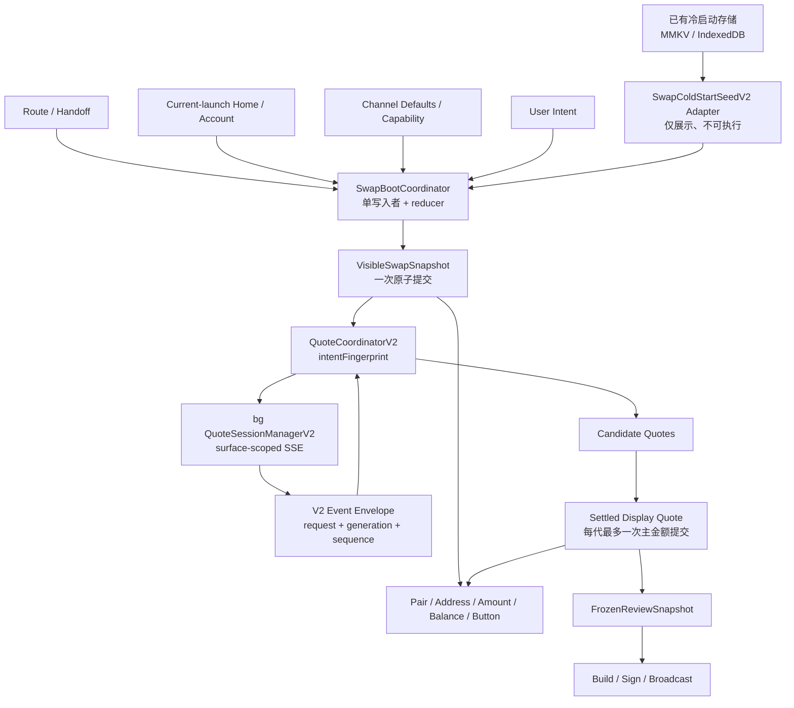

# Swap V2 冷启动、报价稳定性与状态机重构方案

> 状态：**核心稳定性保护已在当前 Draft PR 候选中实现；Release Gates 尚未完成**<br>
> 审计日期：2026-07-15<br>
> 审计范围：Swap / Bridge / Limit / Stock、Swap Modal、跨模块兑换入口、冷启动缓存、账户与收款地址就绪、报价 SSE、Review / Build / Send 交接<br>
> 目标：消除交易对乱闪、金额与骨架屏反复切换、报价来回跳动、旧报价串入新意图、冷启动错误账户或错误收款地址参与询价等问题，同时保持既有跨平台能力和交易流程不回归。本文同时记录本次实际改动、尚未落地的目标架构、86 个逻辑 case、自动化证据与发布门槛；任何未验证项都不得解释为已通过。

## 1. 执行结论

这次不能只修几个 `loading` 条件，也不能推翻现有冷启动。当前 Draft 候选采用“先封住高风险竞态，再逐步收敛架构”的增量方案：

1. 保留当前已经具备的同步预读、Jotai 冷启动缓存、Home 快照、自动挂载 Swap Provider、构建版本失效和图片预热能力。
2. 已实现冷启动完整 pair 的原子展示选择，以及 `network selector → initial token sync → account storage init → active account init → from/to address resolution` 的询价硬门闩；冷缓存可帮助首帧展示，但不能绕过本次启动的账户和地址就绪。
3. 已将普通 SSE、Private Send 与 speed quote 封装为 surface-scoped V2 session，使用 `requestId + intentRevision`，普通 SSE 再叠加 `fingerprint + bgGeneration + sequence` 做端到端归属和有序提交；取消必须精确命中 `surfaceId + requestId`。
4. 已把 Provider 流式候选与主展示 / 可执行报价分离：候选可以多次更新，主金额只在当前请求的终止 settlement 提交；相同 `displayIntentFingerprint` 刷新可保留旧展示，但每次新请求都会立即失效旧执行报价。SELL 的展示意图只绑定 from 主动输入，BUY 只绑定 to 主动输入；派生输出、AUTO 建议滑点和 approval block 更新不会触发重新骨架化，execution fingerprint 仍保留两侧金额、精确滑点和 block 的严格校验。
5. 已在原始语义意图变化时、网络防抖开始前立即失效旧请求，并在金额投影时复核 token、quote kind 与当前输入金额，堵住 A→B 防抖窗口内旧 A 报价回写 B 的竞态。
6. 已为 balance / token detail 引入按方向、token、账户、派生路径、地址与网络归属的 request key / revision；不同 owner 立即隐藏旧值，同 owner 也只有在已有 committed balance 时才保留显示，首次加载或当前 owner 的空终态收敛到 `0.0`，旧请求和旧 `finally` 不得改写新状态。
7. 已引入冻结的 Review execution snapshot 与 `reviewRevision`，并把主要 build / approve / wrap / sign / send 异步回调绑定到发起时 revision；signed-no-send 尾部分支已完成审计：过期请求只允许服务端已创建 Cow / 1inch Fusion order 的终态补写历史，裸签名提示不能误建历史。
8. `SwapBootCoordinator`、composite Seed V2、`VisibleSwapSnapshot`、quiet / hard-deadline settlement、自动重连、完整 expiry / bg fingerprint / confirm 幂等校验、遥测和 feature flags 是目标架构，**本 Draft 候选没有实现，不能据此宣称完成**。

一句话概括：**本次先让冷启动 pair 不混拼、询价必须等本次启动身份就绪、网络结果必须有 owner、展示与执行分离、Review 绑定 revision；单写入 Boot / Visible Snapshot 是后续收敛方向。**

### 1.1 当前交付边界

| 能力                                   | 当前状态                          | 本次实际交付                                                                                                                                  | 仍需完成 / 不得误报                                                                            |
| -------------------------------------- | --------------------------------- | --------------------------------------------------------------------------------------------------------------------------------------------- | ---------------------------------------------------------------------------------------------- |
| 冷启动完整 pair                        | Auto-core PASS；Desktop 样本 PASS | 只从同一候选接受完整 pair；live pair 就绪后原子切换，禁止 cold/live 半对混拼                                                                  | composite `SwapColdStartSeedV2`、TTL / provenance 全量迁移和五平台样本未实现                   |
| 本次启动身份门闩                       | Auto-core PASS                    | 网络选择、初始 token 同步、账户存储、active account、from/to 地址解析全部 ready 后才可询价；无钱包但解析完成是合法 ready                      | 全局 `SwapBootCoordinator`、统一 launchId 时间线和切账户 runtime 未实现                        |
| 普通 SSE Quote Session V2              | Auto-core PASS                    | main session identity、bg per-surface registry、先 reserve 后 await、严格事件接收、精确取消、V1 接口保留                                      | transport 自动重连、Provider 去重、quiet / hard settlement 未实现                              |
| 报价展示稳定性                         | Auto-core + Desktop SELL PASS     | candidate / display / executable 分层；终止后提交；同展示意图刷新保留 display、清 executable；zero-provider 与手选 Provider 审计通过          | “每代最多一次”目前是 terminal settlement，不等于完整 quiet / hard 策略                         |
| 原始语义意图失效                       | Auto-core + Desktop SELL PASS     | SELL、LIMIT BUY、token、账户、receiver、slippage 变化在 debounce 前立即取消旧请求；输出投影复核当前意图                                       | property-based 全排列、LIMIT BUY 和五平台真实快速输入未完成                                    |
| Balance / Token Detail owner           | Auto-core PASS                    | FROM / TO 独立 key + revision；目标 derive / address 纳入 key；同 key 仅在已有 committed balance 时保值；空终态收敛 0.0；旧完成不得写新 owner | 五平台首帧与切账户 runtime 证据未完成                                                          |
| Private Send / Market Speed / Swap Pro | Auto-core PASS                    | Private Send 使用普通 V2 envelope；speed quote 使用独立 V2 owner / exact cancel，Market 与 Swap Pro 接入                                      | 跨入口真实并发、完整 Frozen Review 交接未完成                                                  |
| Frozen Review                          | 部分实现；P0/P1 静态审计 PASS     | 深冻结 execution snapshot、provenance / fingerprint、reviewRevision；主要异步步骤检查发起 revision；signed-order 终态归属已核对               | quote expiry、bg executionFingerprint 二次校验、Confirm 幂等键、所有 legacy adapter 收口未实现 |
| 统一 Boot / Visible state              | 目标，未实现                      | 本次只增加 pair adapter、readiness 和 keyed-resource 保护                                                                                     | `SwapBootCoordinator`、`VisibleSwapSnapshot`、canonical single writer、V1→V2 composite seed    |
| 发布治理                               | 目标，未实现                      | 本文给出指标、case、灰度与回滚要求                                                                                                            | telemetry、feature flags、五平台 benchmark、发布观察窗均未实现 / 未执行                        |

### 1.2 本文状态术语

- **Auto-core PASS**：代码路径存在，并已纳入本次最终 diff 的统一 Jest / 静态检查；它证明相应纯函数、Hook、Jotai 或 bg 合同，不等同于五平台 Release PASS。
- **部分实现**：安全边界只覆盖明确列出的路径，未覆盖项继续按阻断发布处理。
- **目标，未实现**：用于下一阶段设计和验收，当前代码、测试与 PR 不得引用为已交付能力。
- **Desktop 样本 PASS**：仅证明第 16.4 节列出的具体 Desktop 环境和具体场景；未列出的账户类型、模式、入口、平台和网络条件继续视为 Pending。

## 2. 范围、非目标与风险等级

### 2.1 本轮范围

- App 进程冷启动、页面首次挂载、运行时重载、切换账户、切换网络、切换交易对。
- Swap、Bridge、Limit、Stock 四种语义模式，以及 UI Tab 与内部执行类型之间的映射。
- 普通 Swap 页面、Swap Modal、Wallet / Home / Token Detail / Send / Earn / Borrow / Market 等入口的兑换交接。
- 来源账户、目标链账户、默认收款地址、自定义收款地址、Incognito / Private Send 的就绪与失效。
- Token detail、余额、价格、法币值、Provider capability 的加载和展示。
- 报价输入防抖、SSE 建连、事件乱序、刷新、重连、Provider 选择、零报价和错误展示。
- Review、授权、构建交易、签名、广播前的状态冻结。
- main / bg 双 JS runtime，以及共享原生存储的所有权和初始化时序。

### 2.2 非目标

- 不重构账户体系本身，也不改变账户派生规则。
- 不改变后端聚合器的报价算法、路由算法或 Provider 商业策略。
- 不在第一阶段重写 Limit、Stock、Swap Pro 的业务实现；先接入共同的 revision、fingerprint、可见快照和 Review 合同。
- 不把所有 REST 报价强制改成 SSE。Market speed swap 可继续 REST，但必须遵守相同的意图指纹和冻结 Review 合同。
- 不用“增加更多骨架屏”掩盖竞态，也不以延长 debounce 作为根治方案。

### 2.3 风险分级

| 等级 | 问题                                                  | 风险                                 |
| ---- | ----------------------------------------------------- | ------------------------------------ |
| P0   | 错误账户、错误收款地址或旧意图进入可执行报价 / Review | 可能导致用户确认与实际构建语义不一致 |
| P0   | 旧 SSE 事件写入新请求，或两个 surface 互相取消        | 报价归属错误、交易失败或错误路由     |
| P1   | 冷启动交易对、Tab、渠道默认值来回覆盖                 | 首屏错误、用户输入被异步初始化覆盖   |
| P1   | 主报价逐 Provider 更新、金额与 skeleton 往返          | 用户无法稳定判断价格，误触概率上升   |
| P1   | Review 继续读取可变页面状态                           | 确认页与 Build 参数发生漂移          |
| P2   | 余额加载先清空、旧请求回写                            | 视觉闪烁、Max 与可用余额短暂错误     |
| P2   | 重复询价、隐藏页面持有流                              | QPS、耗电、内存和后台连接数上升      |

## 3. 当前代码审计结论

### 3.1 已有冷启动能力应保留

当前冷启动不是“没有方案”，而是缺少一个统一的执行边界。下列资产应复用：

表中“V2 处理”是完整目标；当前 Draft 只实施了完整 pair 展示、current-launch readiness 和 keyed balance owner，其他条目以第 1.1 节交付矩阵为准。

| 现有能力                                      | 当前位置                                                                                                                                                                                                                                 | V2 处理                                                        |
| --------------------------------------------- | ---------------------------------------------------------------------------------------------------------------------------------------------------------------------------------------------------------------------------------------- | -------------------------------------------------------------- |
| Mobile 在 React 与大模块加载前同步读取 MMKV   | [`apps/mobile/index.ts`](../apps/mobile/index.ts)                                                                                                                                                                                        | 保留；读取后转换为 V2 Boot Seed                                |
| Web / Desktop 冷启动 hydration                | [`packages/kit-bg/src/hydration/hydrate.ts`](../packages/kit-bg/src/hydration/hydrate.ts)                                                                                                                                                | 保留；统一走相同 adapter                                       |
| contextAtom L2 快照、2 秒防抖写入、后台 flush | [`packages/kit-bg/src/states/jotai/utils/index.ts`](../packages/kit-bg/src/states/jotai/utils/index.ts)                                                                                                                                  | 保留基础设施；Swap 不再把可变执行字段逐 atom 持久化            |
| Swap / Swap Modal context store 与同步准备    | [`jotaiContextStore.ts`](../packages/kit/src/states/jotai/utils/jotaiContextStore.ts)                                                                                                                                                    | 保留；每个 store 获得独立 surfaceId                            |
| 检测冷快照并自动挂载 SwapRootProvider         | [`JotaiContextStoreMirrorTracker.tsx`](../packages/kit/src/states/jotai/utils/JotaiContextStoreMirrorTracker.tsx)、[`JotaiContextRootProviderRenderer.tsx`](../packages/kit/src/states/jotai/utils/JotaiContextRootProviderRenderer.tsx) | 保留；只负责启动 provider，不直接赋予执行就绪                  |
| 账户 / 网络 / swapType 匹配、归一化、失效     | [`swapColdStartCacheSnapshotUtils.ts`](../packages/shared/src/utils/swapColdStartCacheSnapshotUtils.ts)                                                                                                                                  | 保留为 V1 adapter 输入；补充版本、完整 pair 与 provenance 校验 |
| 首帧展示 token 的 fallback                    | [`useSwapColdStartDisplayTokens.ts`](../packages/kit/src/views/Swap/hooks/useSwapColdStartDisplayTokens.ts)                                                                                                                              | 迁移为只读取一个完整 V2 pair，禁止跨候选拼半对                 |
| build hash、损坏数据、过大数据保护和资源预热  | 现有 cold-start 基础设施                                                                                                                                                                                                                 | 原样保留并增加 Swap V2 schema version                          |

### 3.2 已确认的结构性根因

| ID   | 根因                                                                                                                  | 当前表现                                                                                     | V2 修复边界                                                                                     |
| ---- | --------------------------------------------------------------------------------------------------------------------- | -------------------------------------------------------------------------------------------- | ----------------------------------------------------------------------------------------------- |
| R-01 | 冷启动按多个 atom 持久化，不是版本化的完整 Swap 快照                                                                  | 可能读取到不同时间生成的 from / to / tab / context 组合                                      | 一个 `SwapColdStartSeedV2` 原子读写，pair 整体接受或拒绝                                        |
| R-02 | token atom 后续被补入 balance、price、fiatValue、accountAddress，且同一 atom 参与冷缓存                               | 上次会话的易变数据可进入新进程首帧                                                           | 持久化前剥离所有账户敏感和行情字段                                                              |
| R-03 | `SwapRootProvider`、`SwapProviderMirror`、`useSwapGlobal`、冷缓存同步、Header timer 和渠道 hooks 都可连续 `store.set` | 页面出现中间帧；当前 10 ms / Extension 100 ms timer 只能碰运气避开 default-token race        | reducer + 单写入者 + 原子 snapshot commit；最终删除基于时间的协调                               |
| R-04 | `swapInitialSelectedTokensSyncedAtom` 一个 boolean 同时表达多种就绪语义                                               | 无法判断是 Home 同步、pair 就绪还是账户已确认                                                | 拆成正交 phase 与 revision                                                                      |
| R-05 | 冷缓存 token 已展示时，来源 / 目标地址仍可在解析；询价未统一等待 current-launch account gate 与 `isAddressInfoReady`  | 冷启动可能用持久化的旧 `ready=true`、错误账户或未最终确认 receiver 发起 quote                | 复用 AccountSelector 当前启动 gate；Boot Seed 永不触发 quote                                    |
| R-06 | `loadSwapSelectTokenDetail` 先清余额，再异步加载，结果仅按 token 粗略防旧                                             | 余额、Max、骨架屏来回跳；切账户时旧结果可回写                                                | 以 revision + account + address + token 作为结果键，同 key 刷新保留旧值                         |
| R-07 | `useSwapQuote` 多个 effect 都能触发或取消报价，tuple lock 不是统一意图版本                                            | 同一用户动作产生多个生命周期，状态反复清空                                                   | 唯一 `QuoteCoordinatorV2` 从 Visible Snapshot 派生 intent                                       |
| R-08 | bg `ServiceSwap` 只有全局 EventSource 和无 owner 的 cancel                                                            | Tab、Modal、隐藏预加载页、Private Send 可能互相取消                                          | 每 surface 一个 session；cancel 必须携带完整 owner key                                          |
| R-09 | 普通 Swap 缺少与 Stock 同等强度的 current-request guard；server eventId 不能代表客户端意图                            | 相同 amount 但不同账户 / receiver / slippage 的旧 quote 仍可能被保留，甚至被改写为新 eventId | 删除 eventId 改写；客户端 requestId / fingerprint / revision / generation / sequence 全链路校验 |
| R-10 | quote list 按 Provider 流式写入，当前最佳报价随列表重算                                                               | 主金额在不同 Provider 结果间来回跳                                                           | 候选区流式更新，主报价在 settlement point 原子提交一次                                          |
| R-11 | 各组件独立解释 loading、error、quote、balance                                                                         | 金额、旧金额、横线、skeleton 反复切换                                                        | 统一 display policy，从同一 snapshot 投影                                                       |
| R-12 | Review 虽已构造 preSwapData，但 build 链路仍有读取 live hook closure / 可变状态的路径                                 | Review 打开后账户、receiver、slippage 或 wallet type 可能影响实际 build                      | 深冻结 execution snapshot；build 响应也要校验指纹；过期或漂移必须重新报价                       |
| R-13 | `fetchQuotesEvents` 在真正创建 EventSource 前还有多段异步准备                                                         | 两次并发 start 可按相反顺序恢复，旧调用反过来关闭 / 覆盖新 source                            | start 时先分配 generation；每个 await 后复核 generation，再接触 socket                          |
| R-14 | 部分跨模块消费者和 speed quote 使用全局 cancel / AbortController                                                      | Private Send、Swap Tab、Modal、Speed Swap / Swap Pro 可能跨入口干扰                          | 所有网络 owner 都 session scoped；迁移矩阵逐入口证明隔离                                        |

### 3.3 不是问题的解释

- 这不是单纯的 SSE 网络慢。网络慢只放大了“多个 writer、无端到端 request ownership、非原子渲染”的问题。
- 这不是通过给 skeleton 加最短展示时长就能解决。最短时长只能降低频率，不能阻止错误 revision 或错误地址进入询价。
- 这也不应通过把所有异步请求串行化解决。账户无关的 metadata、图片、网络配置仍应并行预取；只需阻止它们在未经 revision 校验时修改可见和可执行状态。

## 4. Runtime 与资源所有权

OneKey Native 同一进程内有 `main` 与 `bg` 两个独立 JS runtime。文件位于 `kit-bg` 不等于一定在 bg 执行；如果被 main bundle 直接导入，它仍运行在 main JS heap。

| 对象 / 行为                                                                    | Runtime                      | 原生资源                                       | JS heap / 时序要求                                                   |
| ------------------------------------------------------------------------------ | ---------------------------- | ---------------------------------------------- | -------------------------------------------------------------------- |
| 同步读取 Mobile 冷启动快照                                                     | main                         | MMKV 是进程共享的原生资源                      | main 独立反序列化一份；不得假设 bg 已初始化                          |
| Web / Desktop hydration                                                        | main                         | IndexedDB / 平台存储                           | main 完成后才可生成 Boot Seed                                        |
| 目标 `SwapBootCoordinator` / Visible Snapshot（未实现）、当前 Jotai / 展示报价 | main                         | 无共享 JS 对象                                 | 每个 surface/store 独立状态；当前 quote / resource 只接受匹配 owner  |
| SSE 连接、Provider 事件归一化；目标自动重连（未实现）                          | bg                           | 网络 socket / native networking 可能由平台共享 | bg 独立初始化；为每个 surface 维护 bgGeneration                      |
| main 与 bg 关联                                                                | 两者                         | 通过序列化 RPC / event bus                     | 只能依靠 envelope；不得依靠对象引用或“启动顺序”                      |
| MMKV wrapper / cache object                                                    | 两者可能各有                 | 底层 MMKV 可能共享                             | wrapper 与反序列化数据各 runtime 一份，写入要有 schema / generation  |
| Review、Build 参数冻结                                                         | main 创建；bg 消费序列化副本 | 无共享 JS 对象                                 | 当前 main 检查 reviewRevision；目标 bg 重新校验 fingerprint / expiry |

main / bg JS bundles 随版本锁定；实际要防的是 native 与 JS 协议版本不兼容，而不是假设 main 与 bg 会部署不同业务版本。V2 envelope 必须带 `protocolVersion`，未知版本失败关闭并回退到受控 V1 路径。

## 5. 长期目标架构（本 Draft 不整体实现）

本节是状态收敛的最终蓝图，不是当前代码现状。当前 Draft 只落地了图中的 **完整 pair adapter / readiness barrier、Quote Session V2、candidate-display-executable 分层、keyed balance owner 与 Frozen Review 的 main 侧保护**。`SwapBootCoordinator`、composite Seed V2、`VisibleSwapSnapshot`、全量单写入者、bg 执行指纹复核和统一 telemetry 均未实现；Release 与 PR 描述必须沿用这个边界。



### 5.1 目标核心不变量

以下 15 条是完整架构的实现和 Review 硬合同。当前覆盖情况以第 1.1、16.5 和 20 节为准；不能因为目标被写入本文就勾选完成：

1. **单写入者**：初始化、异步 reconcile 和用户意图只由 coordinator 改写 canonical snapshot。
2. **禁止混代**：同一可见帧的 pair、账户、receiver、amount、balance、quote 必须属于同一 compatible revision。
3. **Seed 仅展示**：持久化冷启动数据不得直接触发余额、地址敏感请求、报价、Review 或交易构建。
4. **完整 Pair**：from / to 必须作为一个整体接受或拒绝，禁止从多个快照候选拼接半对。
5. **晚到结果丢弃**：所有异步完成、计时器和 bg 事件都必须验证 owner key 与 revision。
6. **账户敏感结果有完整键**：余额和 token detail 至少绑定 revision、accountKey、address、tokenKey。
7. **展示报价与可执行报价分离**：可继续显示兼容旧值，但按钮只能使用当前、未过期、已验证的 executable quote。
8. **Review 冻结**：Review / Build / Sign / Send 不读取实时页面 atoms。
9. **收款地址生命周期明确**：原始自定义地址不进入进程冷启动 seed；同会话保留与进程冷启动恢复是两套策略。
10. **渠道拥有默认值**：Stock、Limit、Market handoff 等渠道的默认值不能被普通 Swap 默认 effect 覆盖。
11. **断网不销毁已验证展示值**：连接状态与业务值正交；断网时禁用执行并提示刷新。
12. **Runtime 独立**：main 不假设 bg ready，bg 不假设 main 仍存在；每个消息必须可独立验证。
13. **迁移期禁止双向镜像**：只允许 V2 单向投影到 legacy atoms，禁止 V1 ↔ V2 相互写回。
14. **每 surface 最多一个 active quote session**：新请求先逻辑失效旧 generation，再异步关闭旧连接。
15. **提交后不重新骨架化**：相同 semantic key 已有值后，刷新只能显示原值 + refreshing，不得回到 skeleton。

## 6. 状态与数据合同

### 6.0 当前代码中的实际状态与合同

本表是当前 Draft 可审计的真实状态，不把第 6.1 之后的目标状态机伪装成已实现状态。

| 层                      | 实际状态 / 枚举                                                              | 转移与 UI / 执行语义                                                                                                                                                                                                                                               |
| ----------------------- | ---------------------------------------------------------------------------- | ------------------------------------------------------------------------------------------------------------------------------------------------------------------------------------------------------------------------------------------------------------------ |
| main 普通 quote session | `idle → preparing → streaming → settled`；终态另有 `cancelled`、`error`      | `prepare` 生成新 request 与 revision；terminal 后拒绝任何 start ack / event 复活；invalidate 增 revision 并清 active session                                                                                                                                       |
| main quote commit       | `idle → requesting → settled`；失败为 `error`                                | `requesting` 只收 candidates；相同 `displayIntentFingerprint` 可保留已验证的 `displayQuote`，但 `executableQuote` 必须清空；只有当前 request 的 settlement 可同时发布 display / executable                                                                         |
| main UI projection      | `idle`、`waiting`、`hasQuote`、`zeroProvider`、`error`、`staleRefreshing`    | `zeroProvider` 只在权威 completed 后出现；刷新或 transport error 可保留旧 display，但旧值不自动恢复可执行资格                                                                                                                                                      |
| main focus lifecycle    | `tab focused`、`overlay hidden`、`real tab exit`、`ready refresh pending`    | Root modal / 锁屏遮挡保留 V2 listener 与 session；真实 Tab 退出才精确 invalidate / off；重新进入时先挂 listener，再恢复 readiness 期间保留的输入询价                                                                                                               |
| bg 普通 SSE lease       | `preparing → open → terminal`；替换 / 取消为 `cancelled`                     | 每个 surface 最多一个 registry lease；新 revision 同步 reserve；旧 async prepare 恢复后无法 attach；sequence 单调递增                                                                                                                                              |
| main speed quote owner  | `activeSession` 存在 / 不存在 + 单调 `intentRevision`                        | 新请求创建 owner；settle / invalidate 只清匹配 owner；过时 REST 返回不接受                                                                                                                                                                                         |
| bg speed quote lease    | `preparing → inflight → settled`；替换 / 取消为 `cancelled`                  | 每 surface 一个 AbortController owner；精确取消不影响其他 surface                                                                                                                                                                                                  |
| token detail / balance  | FROM、TO 各自 `{ key, revision }`                                            | key 包含 token、wallet / indexed / account / dbAccount / derive、resolved address / network；TO 还含目标 owner / derive / address readiness。只有当前 key + revision 可写；同 key 且已有 committed balance 才保留；否则空 / error 终态写 `0.0`；owner 变化隐藏旧值 |
| Review / execution      | `executionSnapshot` 不存在 / 已冻结；每个 snapshot 有字符串 `reviewRevision` | Review mount 深冻结 detached snapshot；build / approve / wrap / sign / send 的主要异步操作捕获发起 revision，返回时不匹配则停止 UI 推进；legacy snapshot 缺失路径仍兼容，因此不是完整状态机                                                                        |

#### 6.0.1 实际 readiness blockers

询价门闩按下列顺序返回第一个 blocker；全部消失后才允许生成 quote intent：

1. `network-selector`
2. `initial-token-sync`
3. `account-storage-init`
4. `active-account-init`
5. `from-address-resolution`
6. `to-address-resolution`

“无连接钱包但地址解析流程已经完成”是合法 ready；门闩判断 resolution readiness，不用“地址字符串是否为空”替代。冷缓存中的旧 `ready`、旧 account address 或旧 receiver 不能跳过上述 current-launch blockers。

#### 6.0.2 实际普通 SSE V2 envelope

```ts
type SwapQuoteSessionIdentity = {
  surfaceId: string;
  requestId: string;
  fingerprint: string;
  intentRevision: number;
};

type SwapQuoteSessionEventV2 = {
  version: 2;
  session: SwapQuoteSessionIdentity;
  bgGeneration: number;
  sequence: number;
  emittedAt: number;
  params: IFetchQuotesParams;
  accountId?: string;
  tokenPairs: { fromToken: ISwapToken; toToken: ISwapToken };
} & (
  | { kind: 'open' }
  | { kind: 'message'; data: string | null; lastEventId: string | null }
  | { kind: 'done' }
  | { kind: 'transportError'; error: TransportError }
  | { kind: 'cancelled' }
);
```

main 只接受同时满足以下条件的事件：active identity 四字段完全相等、`bgGeneration` 等于已绑定 generation（首次有效事件可完成绑定）、`sequence > lastSequence`、session 尚未进入 `settled / cancelled / error`。JSON malformed 只忽略，不允许清空当前页面。

取消合同是 `cancelSwapQuoteEventsV2({ surfaceId, requestId })`。它必须精确命中当前 lease；旧 request 的 cancel 返回“不匹配”，不能关闭新 request。`fingerprint` 与 `intentRevision` 不放在 cancel payload，是因为 `requestId` 已在 surface registry 内唯一标识 lease；事件接收仍必须校验完整 identity。

#### 6.0.3 实际 terminal settlement

- Provider message 只进入当前 event 的候选区，不直接改主卡金额。
- `done` 或当前 event 的权威完成触发一次 terminal settlement，才从 settled candidates 选择主报价。
- 手选 Provider 以 Provider identity 表达选择意图；terminal settlement 只在当前候选中继续匹配可执行 Provider。手选项失效时先清选择，再提交当前有效 fallback，避免“主卡显示 B、Review 仍锁在 A”。
- zero-provider 必须满足当前 event 已权威完成且数量为 0；reset、尚未收到 meta 或旧 event 不能提前显示“不支持”。该路径已纳入统一自动化。
- 相同 `displayIntentFingerprint` 的 replacement request 可以保留旧 `displayQuote + StaleRefreshing`，但旧 `executableQuote` 在 request start 即清空。
- display intent 与 execution fingerprint 有意分离：SELL 展示只认 from 主动输入，BUY 展示只认 to 主动输入；派生输出、AUTO 建议百分比与 approval block 变化不清 display。execution fingerprint 仍精确包含两侧金额、滑点和 block，任何新请求都 fail-close 撤销旧执行资格。
- 当前没有 quiet window、hard deadline、自动重连与跨重连 Provider 去重；因此“terminal settlement 已实现”不能改写成“完整稳定窗口策略已实现”。

### 6.1 为什么不用一个巨型 enum

本节以下内容描述长期目标状态模型。Boot / Identity 的完整 enum、canonical reducer 与统一 `VisibleSwapSnapshot` 尚未进入当前 Draft；当前真实状态以第 6.0 节为准。

启动、身份、报价和执行是正交维度。把它们合成一个巨型状态会产生大量无意义组合。V2 使用四个子状态，但共享 `surfaceId`、`visibleRevision` 和 `intentFingerprint`。

| 维度               | 主路径与终态                                                                                                  |
| ------------------ | ------------------------------------------------------------------------------------------------------------- |
| Boot               | `unhydrated` → `seeded` → `reconciling` → `committed`；安全降级为 `degraded`，非法意图为 `invalid`            |
| Identity           | `unknown` → `resolving` → `ready`；不可支持为 `unsupported`，解析失败为 `error`                               |
| Quote              | `idle` → `debouncing` → `connecting` → `streaming` → `settling` → `committed`；另有 `refreshing` 和各终止状态 |
| Review / Execution | `none` → `frozen` → `building` → `signing` → `broadcasting` → `pending`；终止为 `failed` 或 `cancelled`       |

各状态的用户可见和可执行语义如下：

| 状态                         | 含义                                                     | 允许展示 seed / 旧值  | 允许 Quote / Confirm |
| ---------------------------- | -------------------------------------------------------- | --------------------- | -------------------- |
| Boot `unhydrated`            | 尚未读取任何本地输入                                     | 否                    | 否                   |
| Boot `seeded`                | 完整 seed 已通过结构校验，但尚未与本次启动账户对账       | 是                    | 否                   |
| Boot `reconciling`           | 并行解析账户、Home、route、capability、receiver          | 是                    | 否                   |
| Boot `committed`             | current-launch coherent snapshot 已原子提交              | 是                    | 可进入下一门闩       |
| Boot `degraded`              | 展示安全，但远程依赖或 bg transport 暂不可用             | 是                    | 否                   |
| Boot `invalid`               | pair、route、recipient 或能力不合法，需要修正            | 仅稳定错误 / fallback | 否                   |
| Identity `unknown/resolving` | source / target / receiver 尚未对应当前 revision         | 可展示非敏感字段      | 否                   |
| Identity `ready`             | current-launch account 和 effective receiver 均已验证    | 是                    | 是                   |
| Quote `debouncing`           | 等待稳定输入；尚未创建网络 request                       | 可保留兼容旧值        | 否                   |
| Quote `connecting/streaming` | 当前 generation 已建立或正在收候选                       | 可保留兼容旧值        | 否                   |
| Quote `settling`             | 已有候选，等待 quiet / all-terminal / hard deadline      | 可保留兼容旧值        | 否                   |
| Quote `committed`            | 主报价已一次性提交，且 executable 校验通过               | 是                    | 是                   |
| Quote `refreshing`           | 同 fingerprint 的新 request 正在刷新                     | 保留旧 displayQuote   | 仅当旧 quote 仍有效  |
| Quote `zeroProvider`         | 权威完成后确认无可用 Provider                            | 明确空状态            | 否                   |
| Quote `error/cancelled`      | terminal error 或 owner 主动取消                         | 兼容旧值可只读展示    | 否                   |
| Review `frozen`              | execution snapshot 已深冻结                              | Review 固定值         | 可 Confirm           |
| Execution `building+`        | Build / Sign / Broadcast / Pending 只属于 reviewRevision | 固定值                | 禁止重复 Confirm     |

### 6.2 目标合同：`SwapColdStartSeedV2`（未实现）

```ts
type SwapColdStartSeedV2 = {
  schemaVersion: 2;
  buildHash: string;
  savedAt: number;
  ownerKey: string;
  homeContextKey: string | null;
  visibleTab: 'swapBridge' | 'limit' | 'stock';
  executionType: 'swap' | 'bridge' | 'limit' | 'stock';
  pair: {
    from: PersistableTokenIdentity;
    to: PersistableTokenIdentity;
  } | null;
  channel: 'swap' | 'stock' | 'market' | 'wallet' | 'tokenDetail';
};
```

`PersistableTokenIdentity` 只保留稳定显示和定位字段，例如 networkId、contract/address、symbol、name、logo URI、decimals、isNative、tokenType。具体字段以现有 token schema adapter 为准。

严禁持久化到 Boot Seed：

- 输入金额、输出金额、quote、provider、route、fee、slippage 计算结果。
- balance、price、fiatValue、allowance、approval 状态。
- accountAddress、effective receiver、原始自定义 receiver。
- quoteId、eventId、requestId、build payload、signed tx。
- loading、error、isReady 等进程内瞬时状态。

### 6.3 目标合同：`VisibleSwapSnapshot`（未实现）

```ts
type VisibleSwapSnapshot = {
  surfaceId: string;
  visibleRevision: number;
  phase: 'seeded' | 'reconciling' | 'committed' | 'degraded' | 'invalid';
  authority: IntentAuthority;
  visibleTab: 'swapBridge' | 'limit' | 'stock';
  executionType: 'swap' | 'bridge' | 'limit' | 'stock';
  pair: CompletePair | null;
  sourceIdentity: ResolvedAccountIdentity | null;
  targetIdentity: ResolvedAccountIdentity | null;
  recipient: RecipientSnapshot;
  amount: AmountDraft;
  capability: SwapCapabilitySnapshot;
  channel: SwapChannelSnapshot;
};
```

只有同时满足以下条件才进入 `committed` 并允许产生 execution intent：

- pair 完整、网络和 token 仍受支持。
- 当前 launch 的来源账户已解析，地址与 accountId 对应。必须复用 AccountSelector 已有的 `storageInitDone && activeAccountInitDone[num]`，并确认 `activeAccount.ready` 与 selected / active accountKey 一致；不能只信可能从上次进程恢复的 `ready=true`。
- 目标链身份已解析；receiver policy 已得到唯一有效地址。
- visibleTab 与 executionType 映射合法。
- 渠道默认值已完成 ownership 决策。
- 当前没有更高优先级、更新 revision 的用户或 route intent。

`degraded` 表示本地展示仍安全，但当前依赖（例如网络 capability 或 bg transport）暂不可用；它可以保留 coherent display，却不能产生 executable intent。`invalid` 表示当前 pair / route / recipient 本身不合法，需要用户修正或一次明确的整体 fallback。

### 6.4 目标合同：`QuoteIntentV2`（部分由实际 fingerprint / session 覆盖）

```ts
type QuoteIntentV2 = {
  surfaceId: string;
  visibleRevision: number;
  requestId: string;
  intentFingerprint: string;
  executionType: 'swap' | 'bridge' | 'limit' | 'stock';
  pair: CompletePair;
  amountMode: 'exactIn' | 'exactOut';
  normalizedAmount: string;
  sourceAccountKey: string;
  sourceAddress: string;
  receiverAddress: string;
  slippage: SlippageIntent;
  providerIntent: ProviderIntent;
  incognito: IncognitoIntent;
  limitConfig?: LimitIntent;
  stockConfig?: StockIntent;
};
```

`intentFingerprint` 使用稳定序列化后的执行语义生成；不得包含 loading、时间戳、展示文案或 eventId。地址必须按各链既有 canonicalization 规则处理，禁止把所有非 EVM 地址统一 `toLowerCase()`。敏感地址不得以明文写入日志，日志只记录不可逆短 hash 或布尔匹配结果。

### 6.5 目标合同：`FrozenReviewSnapshot`（main 侧部分实现）

```ts
type FrozenReviewSnapshot = {
  reviewRevision: number;
  executionFingerprint: string;
  quoteId: string;
  requestId: string;
  expiresAt: number;
  pair: CompletePair;
  sourceIdentity: ResolvedAccountIdentity;
  receiver: VerifiedRecipient;
  amount: ExecutableAmount;
  provider: ExecutableProvider;
  route: ExecutableRoute;
  fee: FrozenFeeBreakdown;
  slippage: FrozenSlippage;
  approval: FrozenApprovalPlan;
  buildSemantics: FrozenBuildSemantics;
};
```

Review 打开后，任何账户、网络、交易对、receiver、金额、slippage、provider 或 executionType 变化都创建新 revision；旧 Review 不得静默合并新状态。

### 6.6 目标事件字典（统一 reducer 未实现）

所有 main 状态机事件都使用统一 header：`launchId + surfaceId + eventId + source + sourceRevision + emittedAt`。异步事件还必须带 request key；reducer 先验证 header，再执行 transition。

| 事件                          | 生产者                                | 必要 guard                                       | 允许的 canonical effect                                           |
| ----------------------------- | ------------------------------------- | ------------------------------------------------ | ----------------------------------------------------------------- |
| `BOOT_SEED_LOADED`            | 冷启动 adapter                        | schema / build / TTL / full-pair                 | 进入 `seeded`，只写 display seed                                  |
| `BOOT_SEED_REJECTED`          | 冷启动 adapter                        | reject reason 可审计                             | 进入 bounded fallback，不拼接部分字段                             |
| `ACCOUNT_STORAGE_INIT_DONE`   | AccountSelector                       | 当前 launchId                                    | 只推进 account barrier                                            |
| `ACTIVE_ACCOUNT_RESOLVED`     | AccountSelector                       | initDone、accountKey、ready 一致                 | 更新 identity candidate，不直接 quote                             |
| `HOME_CONTEXT_RESOLVED`       | Home / Account reconcile              | current launch、authority 未落后                 | 更新当前账户 / network candidate                                  |
| `ROUTE_INTENT_RECEIVED`       | Router / handoff                      | intentId 未消费                                  | 新 intentRevision，按一次性 route owner 写入                      |
| `CHANNEL_DEFAULTS_READY`      | Swap / Limit / Stock / Market channel | channel 仍为当前 owner                           | 仅补全该 channel 拥有的字段                                       |
| `NETWORK_CAPABILITIES_READY`  | capability loader                     | requestId + pairRevision                         | 更新 capability candidate；必要时整体 invalid/fallback            |
| `RECIPIENT_RESOLVE_SUCCEEDED` | account / address resolver            | resolveKey + accountKey + revision               | 原子提交 effective receiver readiness                             |
| `RECIPIENT_RESOLVE_FAILED`    | account / address resolver            | 同上                                             | 进入 identity error；禁止 quote                                   |
| `TOKEN_DETAIL_SUCCEEDED`      | token detail loader                   | requestId + account + address + token + revision | 更新当前 keyed resource                                           |
| `TOKEN_DETAIL_FAILED`         | token detail loader                   | 同上                                             | 只更新当前 keyed error；旧 finally 不可写                         |
| `USER_TAB_CHANGED`            | UI                                    | surface active                                   | 新 intentRevision；用户 authority 接管                            |
| `USER_PAIR_CHANGED`           | UI                                    | surface active、完整 pair                        | 新 intentRevision；pair 原子替换                                  |
| `USER_AMOUNT_CHANGED`         | UI                                    | surface active                                   | 新 intentRevision；只更新 draft，启动 debounce                    |
| `USER_RECIPIENT_CHANGED`      | UI                                    | surface active                                   | 新 intentRevision；旧 quote 立即 non-actionable                   |
| `USER_SETTING_CHANGED`        | UI                                    | 设置适用于当前 executionType                     | 新 intentRevision；slippage/provider/incognito 等归属当前 channel |
| `QUOTE_DEBOUNCE_ELAPSED`      | main timer                            | timerRevision === current                        | 创建唯一 QuoteIntent / requestId                                  |
| `QUOTE_SESSION_ACKED`         | bg RPC                                | request + fingerprint + generation               | 进入 connecting / streaming                                       |
| `QUOTE_EVENT_RECEIVED`        | bg event bus                          | 六项 current-event 条件 + sequence               | 更新 candidates / transport；不得越权改 boot                      |
| `QUOTE_SETTLEMENT_REACHED`    | main quote reducer                    | current request、settlement 未提交               | 一次提交 display / executable quote                               |
| `APP_BACKGROUND`              | lifecycle                             | current surface                                  | flush seed；取消 / 暂停 scoped session                            |
| `APP_FOREGROUND`              | lifecycle                             | current launch / surface                         | 重新校验 fingerprint 后最多刷新一次                               |
| `SURFACE_VISIBILITY_CHANGED`  | navigation                            | visibility lease generation                      | 隐藏释放 lease；显示后按当前 intent 决定是否 quote                |
| `REVIEW_FROZEN`               | Review initializer                    | current executable quote                         | 创建深冻结 reviewRevision，暂停 quote lease                       |
| `REVIEW_INVALIDATED`          | expiry / drift validator              | reviewRevision 匹配                              | 禁止 Confirm；要求返回或 re-quote                                 |
| `EXECUTION_STAGE_CHANGED`     | build / sign / send owner             | snapshotId + executionFingerprint                | 只推进该 reviewRevision 的 execution state                        |
| `SURFACE_DISPOSED`            | provider lifecycle                    | surfaceId 匹配                                   | 清 timer、listener、session、candidate；不污染 history            |

禁止使用“某 effect 依赖变化了”作为隐式业务事件。effect 只能 dispatch 上表事件，canonical reducer 决定是否接受。

## 7. 状态设置、持久化与所有权清单

本节是最终所有权规范。当前 Draft 已落实 quote session、raw semantic intent、balance / token detail owner 与 Review snapshot 的部分；可见 Tab、executionType、完整 pair、receiver 与各 channel 尚未统一到单一 coordinator，仍由现有 atoms / hooks 管理。表中“coordinator”表示后续目标 owner，不代表当前已存在该实现。

### 7.1 状态生命周期

| 状态 / 设置                        | 进程冷启动持久化             | 同会话保留                   | 变更 owner            | 失效条件                                                |
| ---------------------------------- | ---------------------------- | ---------------------------- | --------------------- | ------------------------------------------------------- |
| 可见 Tab                           | 是，带 channel / owner       | 是                           | coordinator           | route 强制语义、能力不支持、schema 失效                 |
| 内部 executionType                 | 与 Tab 一起持久化            | 是                           | coordinator           | Tab / pair / capability 改变                            |
| 完整 token pair                    | 是，原子且最小字段           | 是                           | coordinator           | account/network 不匹配、token 下架、channel 不兼容      |
| 输入金额                           | 否                           | 可保留于当前 surface         | 用户                  | pair、account、route、mode 变化；按产品规则决定是否清空 |
| 输出金额                           | 否                           | 只属于 display quote         | QuoteCoordinator      | fingerprint、request、expiry 变化                       |
| 余额 / fiatValue                   | 否                           | 同 semantic key 刷新保留     | keyed resource cache  | account/address/token/revision 变化                     |
| slippage 设置                      | 现有用户设置策略保留         | 是                           | 用户 / channel policy | 不同 executionType 不兼容                               |
| 手选 Provider                      | 不进入 Boot Seed             | 当前 intent 可固定           | 用户                  | Provider terminal invalid、pair 不支持、用户清除        |
| Stock pay token / 偏好             | 可按 Stock 独立 owner 持久化 | 是                           | Stock channel         | 离开 Stock 不删除；普通 Swap 不覆盖                     |
| Limit rate / expiry / partial fill | 不进入通用 Boot Seed         | Limit 会话内                 | 用户 / Limit channel  | executionType 或 pair 变化                              |
| 自定义 receiver 原始文本           | 否                           | 仅兼容 pair/account 的同会话 | 用户                  | 进程重启、network/account/provider 不兼容               |
| receiver mode=`self`               | 默认策略，无需保存原始地址   | 是                           | coordinator           | 明确 handoff 或用户改为 custom                          |
| quote candidates                   | 否                           | 当前 request 内              | QuoteCoordinator      | 新 request / cancel / dispose                           |
| displayQuote                       | 否                           | 兼容刷新时可保留             | settlement reducer    | fingerprint 不兼容或过期策略要求隐藏                    |
| executableQuote                    | 否                           | 仅当前 request               | quote validator       | revision / fingerprint / expiry 不一致                  |
| Review snapshot                    | 否                           | Review 生命周期内            | Review initializer    | 任一执行字段变化或过期                                  |

### 7.2 意图优先级

优先级必须按字段所有权判断，不能用一个全局“最后写入覆盖”顺序：

| 字段组                            | 从高到低的 authority                                                                                   |
| --------------------------------- | ------------------------------------------------------------------------------------------------------ |
| account / source / target network | **本次启动 AccountSelector + Home 已验证结果**；seed 和 channel 永远无权覆盖                           |
| pair / visibleTab / executionType | 本次用户操作 → 一次性 route / handoff → 当前 channel owner → 与当前账户兼容的 seed → Home / 产品默认值 |
| receiver                          | 本次用户输入 → 一次性 route receiver → current-launch self / target account；Boot Seed 永不提供地址    |
| amount                            | 本次用户输入 → 一次性 route amount；进程冷启动无 amount authority                                      |
| Stock / Limit 专属设置            | 本次用户设置 → 对应 channel 持久化偏好 → 对应 channel 默认；普通 Swap 无权覆盖                         |
| quote / balance / review          | 只有当前 revision 的对应 coordinator / validator；任何启动源都无直接写入权                             |

共同规则：

1. 当前会话已经发生的显式用户操作始终高于 boot-only 事件。
2. route / handoff 在消费后必须记录 `consumedIntentId`，重渲染不得重复应用。
3. 较低 authority 的异步事件只能补全自己拥有且仍为空的字段，不能覆盖更高 authority 或更新 revision。
4. current-launch account readiness 是 commit barrier，不是一个可被 Stock / route / seed 比较并覆盖的普通默认值。

### 7.3 可见 Tab 与执行语义

`Swap & Bridge` 可以是一个可见 Tab，但内部 `swap` 和 `bridge` 是不同执行语义。不得用 Tab 文案推导唯一 executionType。

| 可见 Tab      | 可能 executionType | 决策依据                                                |
| ------------- | ------------------ | ------------------------------------------------------- |
| Swap & Bridge | `swap`、`bridge`   | network pair、token pair、capability、显式 route intent |
| Limit         | `limit`            | Limit capability 与渠道状态                             |
| Stock         | `stock`            | Stock channel、市场状态、pay token                      |

### 7.4 技术配置与初始值

当前实际生效的只有：输入 debounce 500 ms、每 surface 最多一个 active ordinary / speed lease、普通 quote event `version: 2`。fingerprint 尚无独立 version 字段；quiet / hard、自动重连、四类 timeout、Seed V2、display TTL、replay buffer、全局 lease limit 与 rollout / kill switch 均是后续配置，当前不得远程调整或宣称已有默认保护。

| 配置                                                      | 初始策略                                                 | 性质                                |
| --------------------------------------------------------- | -------------------------------------------------------- | ----------------------------------- |
| `inputDebounceMs`                                         | 500 ms，第一阶段保持当前行为                             | 回归保护；有 baseline 后再调整      |
| `settlementQuietMs`                                       | 250 ms 实验起点                                          | provisional，shadow telemetry 校准  |
| `settlementHardMs`                                        | 1,200 ms 实验起点                                        | provisional，shadow telemetry 校准  |
| `activeRequestPerSurface`                                 | 1                                                        | 硬合同                              |
| `maxReconnectsPer30s`                                     | 3，指数退避 + jitter                                     | 发布停止线                          |
| connect / first-event / inactivity / hard-session timeout | 四个独立配置，Stage B 按现网分位数和后端合同批准         | 必须有界，不能合成单一长 timeout    |
| `seedSchemaVersion`                                       | 2                                                        | 硬合同；未知版本拒绝                |
| `quoteProtocolVersion`                                    | 2                                                        | 硬合同；未知协议失败关闭 / 受控回退 |
| `fingerprintVersion`                                      | 独立版本字段，从 1 开始                                  | 规范化规则变化必须升版              |
| `seedTTL`                                                 | 延续现有安全失效策略，Stage B 显式记录实际命中年龄后批准 | 不允许 `updatedAt` 只写不校验       |
| `quoteDisplayTTL`                                         | 不超过服务端 expiresAt；仅决定能否只读显示               | 不等于 executable TTL               |
| `eventReplayBuffer`                                       | 必须有界，只覆盖 subscribe → start 竞态窗口              | 大小和时间由 bg 压测批准            |
| `foregroundQuoteLeaseLimit`                               | 每 surface 1；全局上限按平台压测批准                     | 隐藏 surface 永远为 0               |
| rollout / kill switch                                     | 按平台、surface、executionType、账户类型、百分比         | 必须可独立关闭 Boot、Quote、Review  |

provisional 参数只能在 shadow / canary 中调整；硬合同不能被远程配置放宽。

## 8. 冷启动融合流程

当前实现边界：完整 cold pair 只能整体显示，live pair 同步完成后也整体切换；`getSwapQuoteReadiness` 复用本次启动账户初始化与 from/to 地址解析状态作为 quote gate；balance 还需要当前 token-detail owner key 才显示。下述 composite V2 seed、coordinator、authority reducer、一次性 `VisibleSwapSnapshot`、custom receiver 生命周期统一管理尚未实现，属于后续架构收敛。

### 8.1 首帧时序

```text
main 同步预读
  → V1 snapshot adapter / V2 schema 校验
  → seeded frame：展示完整 pair，但不可询价、不可执行
  → 并行解析：当前账户 / Home context / route / network metadata / capability
  → coordinator 一次性提交 current-launch VisibleSwapSnapshot
  → 地址敏感 balance / token detail / SSE quote 才能启动
  → quote candidates settle 后一次性提交主报价
  → 用户进入 Frozen Review

bg 独立初始化并管理 session；main 从不假设 bg 已先 ready。
```

### 8.2 Seed 接受条件

全部满足才接受：

- schemaVersion、buildHash、TTL、数据大小和解析校验通过。
- ownerKey 与当前可验证的用户范围兼容。
- pair 的 from / to 同时存在，字段完整，没有半对。
- visibleTab、executionType、channel 组合合法。
- All Networks、BTC、Stock 等特殊语义通过现有 normalization 和 V2 capability 校验。
- 不包含应被剥离的账户、余额、行情、quote、amount、receiver 字段。

失败时整体拒绝，不尝试从其他候选补齐另一个 token。可以直接使用当前 launch Home context 或产品默认 pair 生成下一 revision。

### 8.3 收款地址策略

| 场景                          | 策略                                                                                           |
| ----------------------------- | ---------------------------------------------------------------------------------------------- |
| App 进程冷启动                | 默认 `self`；不恢复原始 custom receiver；从当前已验证来源账户与目标网络派生 effective receiver |
| 同会话 Tab / Modal 重访       | custom receiver 可在兼容的 account + network + pair 下保留                                     |
| 明确 route / handoff receiver | 作为新的、一次性高优先级 intent；必须重新验证                                                  |
| 切账户 / 网络 / Provider      | 若兼容性无法证明，原子失效 receiver，并阻止 quote                                              |
| Incognito / Private Send      | 独立 channel policy；地址就绪是硬门闩，不得回退到旧 self 地址询价                              |

这里必须区分“进程冷启动恢复”和“同会话状态保留”。前者不能恢复敏感执行地址，后者可按兼容性保存用户刚输入的草稿。

### 8.4 用户操作与 late boot event

一旦用户点击 Tab、切 token、切账户、输入金额或修改 receiver，coordinator 立即生成新 revision，并把 boot phase 标记为已被用户接管。之后到达的 Home、默认 pair、网络配置或 route fallback 结果只能补充 metadata，不得再改写用户选择。

## 9. Quote Session V2、主报价提交与后续 Coordinator

### 9.1 Quote 门闩

长期目标只有以下条件全部满足才创建 `QuoteIntentV2`：

- Visible Snapshot 为 `committed`。
- source / target identity 和 effective receiver 都为 `ready`。
- pair、amount、executionType、capability 合法。
- 当前 surface 可见并持有 quote lease；预加载或隐藏 surface 不发起 quote。
- 没有 Review 正在使用另一个 frozen revision。

当前 Draft 没有统一 `VisibleSwapSnapshot` / visibility lease；实际已落地的是第 6.0.1 节六项 readiness blocker、输入合法性、原始 semantic intent 立即失效，以及 Review 页面现有生命周期约束。隐藏预加载 surface 的统一零请求证明仍是 Runtime / 后续 coordinator gate。

### 9.2 bg Session 合同：核心已实现，增强项待后续

当前已增加 `ServiceSwapQuoteSession` registry，并由现有 `ServiceSwap` 委托；V1 接口继续保留，build、history 等无关服务没有被整体重写。实际 envelope 见第 6.0.2 节。下面是长期目标的业务级事件展开；当前 transport 仍以 `open / message / done / transportError / cancelled` 传递原始 SSE message。

```ts
type SwapQuoteEventEnvelopeV2 = {
  protocolVersion: 2;
  surfaceId: string;
  storeName: 'swap' | 'swapModal' | string;
  requestId: string;
  intentRevision: number;
  intentFingerprint: string;
  bgGeneration: number;
  sequence: number;
  emittedAt: number;
  kind:
    | 'opened'
    | 'meta'
    | 'providerQuote'
    | 'providerError'
    | 'autoSlippage'
    | 'completed'
    | 'transportError'
    | 'cancelled';
  payload: unknown;
};
```

Session Manager 规则（标注“后续”的条目未在当前 Draft 实现）：

1. 使用 `Map<surfaceId, QuoteSession>`，每个 surface 最多一个 active generation。
2. `start` 先同步增加 generation 并逻辑失效旧 session，再异步关闭旧 EventSource。
3. 当前 `cancel` 必须携带 `surfaceId + requestId`，且只能命中 registry 内该 surface 的当前 request；旧 request cancel 不得关闭新 lease。event acceptance 仍校验 fingerprint / revision；如果未来允许 requestId 复用，cancel 合同必须再加入 fingerprint。
4. sequence 在 bg 对每个 generation 单调递增。main 丢弃重复、倒序、缺号后的不安全 terminal 更新。
5. server eventId 仅是供应商 / 服务端事件标识，不能替代 client ownership，也不得把旧 quote 的 eventId 改写成新 request 的归属。
6. 解析失败、未知事件和单 Provider 错误只记录并忽略，不清空整屏报价。
7. 只有权威 `completed` 才能判定 zero provider；早到的 provider error 不是 terminal error。
8. **后续**：transport reconnect 使用有界退避和 generation guard；重连期间不得重复提交同一 provider quote。当前没有自动重连与跨重连 Provider 去重。
9. surface dispose、登出、App 进入受限后台状态时释放 session；Map 不得泄漏。
10. **后续**：全局连接上限和前台 lease 由配置控制；默认只允许实际可交互的 surface 持有连接。
11. **后续**：main 必须通过明确的订阅就绪握手或 bg 短生命周期 replay buffer 消除 subscribe / start 竞态。当前路径需在真实 runtime 证明首事件不丢，不能把静态调用顺序当作证据。
12. **后续**：connect、first-event、inactivity、hard-session 使用独立超时；不能用一个长总超时同时表达首包慢和流中断。

### 9.3 main 接收条件

当前每个事件必须同时通过：

```text
event.surfaceId          === current.surfaceId
event.requestId          === current.requestId
event.intentRevision     === current.intentRevision
event.intentFingerprint  === current.intentFingerprint
event.bgGeneration       === current.bgGeneration
event.sequence           >  current.lastAcceptedSequence
```

任何一项失败都不能改 quote list、progress、loading、error、auto-slippage 或主金额。`stale_event_dropped` 遥测尚未实现，因此当前只有代码拒绝与自动化断言，不能宣称已有线上计数。

### 9.4 报价稳定提交策略

当前 quote state 分为三份：

- `candidateQuotes`：当前 request 内按 Provider 收集，可供 Provider 列表增量展示。
- `displayQuote`：主页面稳定展示值。
- `executableQuote`：当前 request、当前 fingerprint 且已完成 settlement 的值；完整 expiresAt 校验尚未落地，所以当前 Draft 不能把“未过期”列为已实现条件。

当前实现的 settlement point 是当前 request 的权威终止；Provider candidates 在此之前不发布成主金额。长期目标再扩展为满足任一项：

1. `meta` 声明的所有预期 Provider 已进入成功或 terminal 状态；或
2. 已有可用候选并达到 quiet window；或
3. 到达 hard settlement deadline。

初始参数建议沿用现有输入 debounce，quiet window 和 hard deadline 先通过 shadow telemetry 校准；建议起始实验值分别为 250 ms 和 1,200 ms。它们是后续可配置实验值，不是当前实现、不是已验证预算，也不是公开竞品事实。

提交规则：

- 当前 terminal settlement 设计要求每个 request generation 的主金额最多提交一次；最终命令与 Runtime 证据待回填。
- settlement 之后到达的更优结果可更新 Provider 详情列表，但不重新跳动主金额；若已选 Provider 变为不可执行，触发一次明确的重新报价，不静默替换。
- 用户手选 Provider 后保持 pinned，直到用户取消、Provider terminal invalid 或 intent 改变。
- 周期刷新使用新 requestId；若 fingerprint 相同且旧 quote 未过展示 TTL，保留旧 displayQuote 并显示 `Refreshing`，但执行按钮依当前 quote 有效性决定是否禁用。
- fingerprint 改变时，旧金额不伪装成新交易对的金额。主输出稳定进入 `— / Updating`，等待新 generation 一次性提交。
- 进入 Review 后释放或暂停该 surface 的 quote lease；从 Review 返回编辑时，按当前 fingerprint 创建新 request，不复活旧 socket。

### 9.5 UI 展示规则

| 场景                                        | 主金额                           | Skeleton                   | 按钮                                    |
| ------------------------------------------- | -------------------------------- | -------------------------- | --------------------------------------- |
| 首次无任何值，Boot Seed 正在生成首帧        | 可使用一次 skeleton              | 允许一次                   | 禁用                                    |
| 已有同 key 余额，后台刷新                   | 保留旧余额 + 轻量 refreshing     | 不重新显示                 | 根据最新可执行状态                      |
| 同 fingerprint 周期刷新                     | 保留旧 displayQuote + Refreshing | 不重新显示                 | 旧 quote 有效且策略允许时可用，否则禁用 |
| pair / account / receiver / amount 语义改变 | 输出显示稳定 `— / Updating`      | 不在金额与 skeleton 间往返 | 禁用                                    |
| 首个新 generation settled                   | 一次切换到新金额                 | 不显示                     | 启用（通过 executable 校验后）          |
| transport 断开但有兼容旧值                  | 保留旧值并提示连接问题           | 不显示                     | 禁用，要求刷新                          |
| authoritative zero provider                 | 显示明确无报价状态               | 不显示                     | 禁用                                    |
| terminal error                              | 保留可解释的兼容展示或错误占位   | 不反复切换                 | 禁用                                    |

## 10. Balance 与 Token Detail

当前实际资源归属不是一个裸 `visibleRevision`，而是 **FROM / TO 独立的 semantic key + 每方向单调 request revision**。key 包含：

```text
{
  direction,
  token: { networkId, contractAddress },
  owner: { walletId, indexedAccountId, accountId, dbAccountId,
           deriveType, accountAddress, resolvedNetworkId },
  targetOwner: { walletId, indexedAccountId, accountId, dbAccountId,
                 deriveType, accountAddress, networkId, isAddressInfoReady }
}
```

每次 start 在对应方向递增 revision；完成、失败与 `finally` 都必须同时匹配 key 与 revision。TO key 特别包含目标派生 owner / 地址，避免“token 相同但收款账户已经变化”仍被误判为同资源。

实现规则：

- 相同 key 刷新：保留旧余额，状态变为 `refreshing`。
- key 改变：原子切换到新的稳定 placeholder，只发生一次；旧结果完成后因 key 不匹配被丢弃。
- Max 只读取当前 key 的 confirmed balance；refreshing 时若允许使用旧值，必须标记并在提交前再次校验。
- token metadata、logo、network/provider capability 可在 reconcile 期间并行预取。
- accountAddress、allowance、balance、effective receiver 等地址敏感数据必须等 current-launch readiness；当前 balance 显示还必须匹配当前 display token 与 owner key。
- `fiatValue` 与 balance / price 同版本投影仍是目标约束；当前 Draft 没有实现统一 versioned fiat snapshot，相关 runtime case 未通过前不得宣称完成。

## 11. Review、Build、Sign 与 Send

当前实现边界：进入 Review 时创建深冻结的 detached `ISwapExecutionSnapshot`，记录 `reviewRevision`、账户 / sender / receiver、pair、amount、provider、slippage、Limit 设置和 quote provenance；主要 build / approve / wrap / sign / batch / send 异步结果在写 UI 前检查发起 revision。以下 expiry、bg executionFingerprint 回显校验与 Confirm 幂等属于 Release 目标，尚未完整实现。

### 11.1 进入 Review

进入前一次性冻结 `FrozenReviewSnapshot`，并校验：

- executableQuote 属于当前 visibleRevision 和 intentFingerprint。
- quoteId、provider、route、fee、slippage、receiver、amount 完整。
- `expiresAt` 仍满足最小确认窗口。
- account / network / token capability 没有在冻结过程中变化。

### 11.2 Review 生命周期

- 页面外层任何 atom 变化都不修改已打开的 Review。
- 若用户返回编辑，旧 reviewRevision 作废；重新进入必须创建新 snapshot。
- 到期时不允许继续 Build，显示“报价已更新”并回到刷新流程。
- Approval、wrap / unwrap、中间链步骤和最终 swapSteps 都属于 snapshot 的 build semantics。
- quote result context 与嵌套 route 必须深 clone / immutable；禁止浅拷贝后原地修改。
- bg Build API 接收完整 snapshot 摘要和 executionFingerprint，并再次验证 quote / expiry，不从全局 Swap 状态补字段；响应必须回显或由 request wrapper 校验同一 executionFingerprint。
- Confirm 使用 reviewRevision / snapshotId 作为幂等键，连点不得重复 build、签名或广播。

### 11.3 执行中状态

`building → signing → broadcasting → pending` 只属于 reviewRevision。页面新开的 Swap intent 不得改变正在执行的状态；执行失败也不得把错误写回新 intent 的 quote error。

## 12. 功能与入口矩阵

| 功能 / 入口                   | 默认 owner / 通道                   | 当前 Draft 实际覆盖                                                                                                   | 未覆盖 / Runtime gate                                        |
| ----------------------------- | ----------------------------------- | --------------------------------------------------------------------------------------------------------------------- | ------------------------------------------------------------ |
| 普通 Swap                     | Swap channel / SSE                  | 标准 `useSwapQuote` 接入普通 Quote Session V2、raw intent 失效、terminal settlement、readiness 与 balance owner       | 真实账户切换、弱网、周期刷新、手选 Provider 全程录屏待回填   |
| 跨链 Bridge                   | Swap / Bridge capability / SSE      | 复用标准 V2 session 与冻结 Review 主路径                                                                              | BTC / EVM 多链实际 build、receiver 与 expiry 未完整证明      |
| Swap Modal                    | modal surface / SSE                 | 每个 hook instance 生成独立 surface；bg registry 按 surface 隔离                                                      | 主 Tab + Modal 同时活跃的 main-bg runtime 证据待回填         |
| Limit                         | Limit channel / SSE                 | 标准 V2 identity 覆盖；LIMIT BUY raw input / projection 有专门测试；Limit settings 进入 frozen snapshot               | expiry / partial-fill 的 bg 复核与 runtime 未完成            |
| Stock                         | Stock channel / SSE / market state  | 现有 Stock event current-input guards 保留，标准 quote path使用 V2；selected token owner 竞态有现有 actions tests     | Stock 冷启动单写入 owner 与五平台 runtime 未完成             |
| Market speed swap             | Market handoff / REST               | 独立 speed session V2、per-surface AbortController、过时响应拒绝；Market hook 已迁移                                  | 一次性 handoff 与完整 Frozen Review 交接未统一               |
| Swap Pro                      | Swap Pro channel / REST speed quote | speed session V2 owner / exact cancel 已接入                                                                          | UI state 与 Frozen Review 未统一；并发 runtime 待回填        |
| Wallet / Home 快捷入口        | 上游 handoff → 标准 Swap            | 进入标准 Swap 后受 readiness / session / balance / Review 保护                                                        | handoff 一次消费与 late Home 统一 authority reducer 未实现   |
| Token Detail                  | Token Detail handoff → 标准 Swap    | 进入标准 Swap 后受相同保护；token / account owner key 防旧余额                                                        | from / to handoff 方向协议未统一重构                         |
| Send / Private Send           | Send / Incognito channel / SSE      | `SendAmountInputContainer` 迁移到组件级 V2 surface / revision / fingerprint / exact cancel；参数 matcher 作为额外门闩 | 与标准 Swap 真实并发、receiver 变更、退出恢复 runtime 待回填 |
| Earn / Borrow / DeFi 兑换入口 | 上游 handoff → 标准 Swap            | 进入标准 Swap 后继承核心保护                                                                                          | 序列化 handoff 与跨模块 owner 没有在本 Draft 重构            |

入口协议原则仍是：**入口只拥有 handoff，Swap 挂载并消费后由 Swap 拥有状态。** 当前 Draft 没有完成所有入口的 handoff 协议重构，因此第 13.5 节仍是必须执行的 P0 spine，而不是已覆盖列表。

入口协议原则：**入口只拥有 handoff，Swap 挂载并消费后由 Swap 拥有状态。** 上游不得在页面已经被用户接管后继续推送默认值。

## 13. 逻辑 Case 清单

本节共 **86 个 case**（27 个冷启动 / 账户 / pair，24 个 Quote / SSE，13 个 Balance / Review / Execution，10 个入口 / 平台，12 个跨模块入口 Spine）。它是完整验收库存，不是“86 个均已 PASS”的声明。每组当前自动化证据、真实 Runtime 要求与未实现阻断项见第 16.5 节；未被明确映射到自动化测试的 case 一律按 `Pending` 处理。

### 13.1 冷启动、账户与交易对

| Case ID                        | 场景                                 | 期望                                                          |
| ------------------------------ | ------------------------------------ | ------------------------------------------------------------- |
| SWAP-AN-001                    | All Networks 进入普通 Swap           | pair、Tab、executionType 一次性确定，无 Select Token 中间闪动 |
| SWAP-AN-PERSISTED-001          | All Networks 上次 pair 命中 seed     | 首帧展示完整 pair；校验后保持，不回退默认 pair                |
| SWAP-SINGLE-001                | 单链账户冷启动                       | 当前账户和网络 committed 后才询价                             |
| SWAP-BTC-ETH-001               | BTC ↔ ETH 语义需要 Bridge            | UI Tab 稳定，内部 executionType 正确为 bridge                 |
| SWAP-PRESERVE-001              | 上次普通 Swap pair 可继续使用        | 保留完整 pair，不被 Home late event 覆盖                      |
| SWAP-PRESERVE-BTC-001          | 上次包含 BTC 的有效 pair             | 按 capability 保留；不因 BTC 特判清空半边                     |
| SWAP-PRESERVE-RACE-001         | seed、Home、route 异步顺序互换       | 最终结果只由优先级与 revision 决定，顺序不影响                |
| BRIDGE-BTC-001                 | 直接进入 BTC Bridge                  | 使用 Bridge channel 默认值，不先显示普通 Swap 默认值          |
| HOME-BTC-001                   | Home BTC 进入普通不支持场景          | 明确稳定的 Select Token / unsupported 状态；Tab 不漂移        |
| LIMIT-TRON-001                 | TRON 进入 Limit                      | capability 不支持时稳定提示，不短暂展示可交易状态             |
| LIMIT-STABLE-001               | Limit 有效 pair 冷启动               | Limit channel 拥有 pair 和配置，普通 Swap effect 不覆盖       |
| STOCK-COLD-START-001           | Stock 冷启动                         | 股票 token、pay token、市场状态保持 coherent                  |
| STOCK-DEFAULT-OWNER-001        | Stock 默认值与普通默认值同时完成     | Stock owner 获胜，结果不依赖完成顺序                          |
| SWAP-FAST-TAP-001              | 首帧后立即切 Tab / token             | 用户 revision 获胜，所有 boot late result 被丢弃              |
| SWAP-PERPS-CACHE-001           | 不相关 Perps / channel cache 存在    | 不污染 Swap seed 或 executionType                             |
| SWAP-IOS-KILL-BTC-001          | iOS kill 后从 BTC 上下文重启         | seed 只展示；当前 launch 账户验证后再询价                     |
| SWAP-ALLNETWORK-BTC-BRIDGE-001 | All Networks + BTC + Bridge 组合     | pair、tab、executionType、receiver 一次原子提交               |
| TOKEN-SWITCH-001               | 快速 A→B→C 切 token                  | 只显示 C revision 的 balance / quote                          |
| TAB-STABILITY-001              | Swap / Limit / Stock 快速切换        | late channel effect 不改变当前 Tab 和 pair                    |
| RUNTIME-RELOAD-001             | Desktop / Web runtime reload         | hydration 与 Mobile seed 语义一致，不恢复执行字段             |
| BOOT-CORRUPT-001               | 冷缓存 JSON 损坏                     | 整体拒绝并使用当前默认值；不崩溃、不半恢复                    |
| BOOT-PARTIAL-001               | seed 只有 from 或 to                 | 整体拒绝，不从另一个候选补齐                                  |
| BOOT-VERSION-001               | schema / build hash 不兼容           | 安全失效并重新生成 V2 seed                                    |
| BOOT-ACCOUNT-SWITCH-001        | 上次账户 A，启动后当前账户 B         | seed 可短暂展示非敏感 pair；A 的余额、地址、quote 永不出现    |
| BOOT-RECIPIENT-001             | 上次使用 custom receiver 后冷启动    | 不恢复 raw receiver；重新派生 self 或等待明确 handoff         |
| BOOT-RUNTIME-ORDER-001         | main 先 ready / bg 先 ready 两种顺序 | 结果完全一致；ready 前不丢首事件、不发非法 quote              |
| BOOT-ROUTE-ONCE-001            | seed、Home 和 route 同时到达         | route 一次性胜出；重渲染和 late event 不重放                  |

### 13.2 Quote 与 SSE

| Case ID                       | 场景                                      | 期望                                                  |
| ----------------------------- | ----------------------------------------- | ----------------------------------------------------- |
| QUOTE-RAPID-INPUT-001         | 快速输入 1→10→100                         | 防抖后只为最终稳定 intent 建 session；旧 timer 不启动 |
| QUOTE-ABA-001                 | 金额 A→B→A                                | 第一次 A 的迟到结果不能进入第二次 A request           |
| QUOTE-STALE-NORMAL-001        | 普通 Swap 旧事件晚到                      | request / fingerprint / revision 不匹配，零可见写入   |
| QUOTE-STALE-STOCK-001         | Stock 旧事件晚到                          | 与普通 Swap 使用同一 ownership 强度                   |
| QUOTE-ERROR-THEN-SUCCESS-001  | 某 Provider 先错、其他 Provider 后成功    | 不提前进入全局 Error；最终可提交成功报价              |
| QUOTE-OUT-OF-ORDER-001        | sequence 4 先于 3 到达                    | 3 被丢弃或按协议缓冲；不得回滚状态                    |
| QUOTE-DUPLICATE-001           | 重连重复发送 Provider 结果                | 去重，主报价和统计只提交一次                          |
| QUOTE-DISCONNECT-001          | 已有报价后 transport 断开                 | 保留 displayQuote，禁用执行并提示；不回 skeleton      |
| QUOTE-RECONNECT-001           | 有界重连成功                              | 同 generation / 新 generation 按合同恢复，不重复候选  |
| QUOTE-ZERO-001                | 所有 Provider 权威完成且零可用            | 只在 completed 后进入 zeroProvider                    |
| QUOTE-REFRESH-001             | fingerprint 相同的周期刷新                | 保留旧显示，主金额最多更新一次                        |
| QUOTE-FINGERPRINT-CHANGE-001  | pair / amount / account / receiver 改变   | 旧金额不伪装为新意图，立即禁用执行                    |
| QUOTE-MANUAL-PROVIDER-001     | 用户手选 Provider                         | 保持 pinned；新候选不得自动抢占                       |
| QUOTE-EXPIRED-001             | quote 在点击 Review 前到期                | 失败关闭并刷新，不继续使用旧 quote                    |
| QUOTE-TAB-MODAL-001           | 主 Tab 与 Modal 同时存在                  | session owner 隔离；互不 cancel、互不接收事件         |
| QUOTE-HIDDEN-SURFACE-001      | 预加载隐藏 Swap 页面                      | 不持有 quote lease，不增加 QPS                        |
| QUOTE-BACKGROUND-001          | App 后台 / 前台恢复                       | 旧 generation 失效；恢复后新 request，旧事件被丢弃    |
| QUOTE-AUTO-SLIPPAGE-001       | auto slippage 晚于 Provider quote         | 仅更新当前 request；不触发旧主金额复活                |
| QUOTE-MALFORMED-001           | SSE 未知类型或解析失败                    | metric + ignore；不清空页面                           |
| QUOTE-SURFACE-DISPOSE-001     | surface 卸载时流仍有消息                  | session 释放；后续消息零写入、Map 零泄漏              |
| QUOTE-LEGACY-V2-001           | 灰度期 legacy 与 V2 同时打开              | 只发一个底层请求并 fan-out，不重复询价                |
| QUOTE-MESSAGE-BEFORE-META-001 | Provider quote 早于 provider count / meta | 正常收集首条结果，不丢弃、不误判完成                  |
| QUOTE-PRIVATE-SEND-001        | Swap 与 Private Send 并发                 | 不互相 cancel、event 不串 surface                     |
| QUOTE-SPEED-PRO-001           | Market Speed 与 Swap Pro 并发             | AbortController scoped；任何一方不取消另一方          |

### 13.3 Balance、Review 与执行

| Case ID                   | 场景                                       | 期望                                                   |
| ------------------------- | ------------------------------------------ | ------------------------------------------------------ |
| BALANCE-SAME-KEY-001      | 同账户同 token 刷新                        | 保留旧值 + refreshing，不回 skeleton                   |
| BALANCE-ACCOUNT-001       | 请求期间切账户                             | A 结果不能写入 B；Max 使用 B 的 confirmed balance      |
| BALANCE-TOKEN-001         | 请求期间切 token                           | 旧 token 结果不修改新 token UI                         |
| BALANCE-OLD-FINALLY-001   | 旧 token detail 请求在新请求后执行 finally | 不能关闭当前 loading 或覆盖当前 error                  |
| FIAT-REVISION-001         | balance 与 price 不同代完成                | 不拼接；只展示版本兼容 fiatValue                       |
| REVIEW-DRIFT-001          | Review 打开后页面账户 / pair 变化          | Review 保持冻结；继续执行前发现 drift 并失败关闭       |
| REVIEW-EXPIRY-001         | Review 停留到报价过期                      | Build 前重新校验，要求 re-quote                        |
| REVIEW-PROVIDER-001       | Review 后 Provider 设置改变                | 已冻结 Provider 不变；返回编辑后新建 revision          |
| REVIEW-APPROVAL-001       | allowance 在 Review 后变化                 | Build 按 snapshot + 最新安全校验决定，不静默改变步骤   |
| REVIEW-WRAP-001           | route 含 wrap / unwrap                     | 步骤顺序冻结，外层 quote 更新不改写                    |
| EXECUTION-NEW-INTENT-001  | 广播中用户新开 Swap                        | 新 intent 与执行状态隔离，错误 / pending 不串写        |
| EXECUTION-DUP-CONFIRM-001 | 连续点击 Confirm                           | 幂等键保证 build / send 仅一次                         |
| EXECUTION-LATE-BUILD-001  | build 返回前 Review 被作废                 | 响应因 snapshot / fingerprint 不匹配被拒绝，不进入签名 |

### 13.4 入口与平台

| Case ID              | 场景                                | 期望                                                  |
| -------------------- | ----------------------------------- | ----------------------------------------------------- |
| HANDOFF-WALLET-001   | Wallet 快捷 Swap                    | handoff 一次消费；Wallet 后续更新不覆盖用户操作       |
| HANDOFF-TOKEN-001    | Token Detail 带 token 进入          | from / to 方向明确，账户验证后询价                    |
| HANDOFF-SEND-001     | Send / Private Send 进入兑换        | receiver ready 前不 quote；退出不取消其他 surface     |
| HANDOFF-EARN-001     | Earn / Borrow 传入兑换意图          | 使用序列化 intent，不共享可变 atom                    |
| HANDOFF-MARKET-001   | Market speed swap                   | REST 也使用 fingerprint 和 frozen Review              |
| PLATFORM-DESKTOP-001 | Desktop 冷启动、窗口隐藏 / 恢复     | hydration、lease、session dispose 正确                |
| PLATFORM-WEB-001     | Web reload、多 Tab                  | store / surface 隔离；不共享内存 ownership 假设       |
| PLATFORM-EXT-001     | Extension popup 关闭再打开          | session 清理、seed 恢复、无旧事件写入                 |
| PLATFORM-IOS-001     | iOS kill、后台恢复、弱网            | 同步 seed 快；地址和 quote 严格等当前 launch identity |
| PLATFORM-ANDROID-001 | Android process death、低端机、弱网 | 无混代帧、无重复 session、内存释放                    |

### 13.5 跨模块入口 P0 Spine

以下入口至少都要验证“打开 → 身份确认 → 报价 → Review → 返回原页面”；如入口不支持完整交易，也必须验证 handoff 的 source、from/to、network、deriveType、amount、swapType、account、recipient 和 surface owner。

| Case ID                 | 入口                                     |
| ----------------------- | ---------------------------------------- |
| ENTRY-HOME-WALLET-001   | Home Wallet Action Swap                  |
| ENTRY-HOME-TOKEN-001    | Home Token Actions                       |
| ENTRY-ASSET-DETAIL-001  | Asset / Token Detail Header              |
| ENTRY-SEND-BALANCE-001  | Send 余额不足 / Private Send             |
| ENTRY-RECEIVE-001       | Receive Selector                         |
| ENTRY-EARN-001          | Earn / Staking FAQ 与操作入口            |
| ENTRY-MARKET-DETAIL-001 | Market Detail Swap Panel                 |
| ENTRY-MARKET-SPEED-001  | Market Speed Swap                        |
| ENTRY-BORROW-001        | Borrow / Supply Alert                    |
| ENTRY-NOTIFICATION-001  | In-App Notification / Approval Success   |
| ENTRY-TAB-SWITCH-001    | Stock / Limit / Bridge Tab 互切          |
| ENTRY-EXT-SURFACE-001   | Extension popup / side panel / full page |

## 14. 验收指标与发布门槛

以下是 Release Gates，不是当前测量结果。当前 Draft 尚未实现第 15 节 telemetry，也尚未完成五平台统一 harness；因此所有数值指标均为“待 baseline / runtime 回填”，不能用单元测试替代。

### 14.1 零容忍正确性门槛

以下任一出现即阻断发布：

- `cross_revision_visible_commit > 0`。
- `stale_quote_event_visible_commit > 0`。
- 当前账户与 quote / receiver / Review 的 owner mismatch > 0。
- 有效完整 seed 被拆成半对，或最终退回一次 Select Token 后又恢复 > 0。
- ownerless SSE cancel > 0。
- 每 surface 同时 active generation > 1。
- Review fingerprint / quoteId / expiry 校验绕过 > 0。
- 迁移期间同一 intent 触发 legacy 和 V2 两次底层 quote 请求 > 0。

### 14.2 视觉稳定性门槛

| 指标                                                                | 发布门槛                                     |
| ------------------------------------------------------------------- | -------------------------------------------- |
| 已显示 committed amount / balance 后，同 semantic key skeleton 重入 | 0                                            |
| 每个 quote request 的主输出数值提交次数                             | ≤ 1                                          |
| 冷启动 valid seed 的 pair 可见切换次数                              | 0；seed → committed 内容相同时不得重绘成空值 |
| 用户操作后的 late boot 覆盖次数                                     | 0                                            |
| fingerprint 变化后旧金额仍标记为当前可执行                          | 0                                            |
| 断网时金额 → skeleton → 金额循环                                    | 0                                            |

### 14.3 性能指标

先在相同设备、构建和网络下记录 V1 baseline，再批准最终预算。以下为第一轮内部目标，不代表竞品公开数据：

| 指标                                 | 起始目标                                            | 测量起点 / 终点                                             |
| ------------------------------------ | --------------------------------------------------- | ----------------------------------------------------------- |
| TTSeed P95                           | Desktop / Web / Extension ≤ 300 ms；Native ≤ 500 ms | Swap surface mount → 有效 seed / 默认 pair 首帧             |
| App cold first semantic frame P95    | ≤ 1.2 s                                             | 冷进程启动 → 首个正确 Swap 语义帧；全局 shell 耗时单列      |
| TTCommitted P95                      | ≤ 1,500 ms                                          | 本地账户加载完成 → 当前账户、receiver、pair coherent commit |
| TTFQ P75 / P95                       | ≤ 2.0 s / 4.0 s                                     | 请求实际发出 → 首个可执行 quote；受控网络                   |
| TTStableQuote P75 / P95              | ≤ 3.0 s / 6.0 s                                     | 请求实际发出 → 主金额 settlement commit                     |
| Quote 请求数                         | 不高于 V1 baseline                                  | 每个稳定 intent 1 次，明确刷新除外                          |
| 首屏 React semantic commits          | 不高于 baseline，且无跨 revision commit             | 通过 instrumentation 记录                                   |
| session / timer / candidate Map 泄漏 | 0                                                   | surface dispose 后检查                                      |

除绝对目标外，目标是灰度版本的 P95 不比同环境 V1 baseline 回退超过 5%，quote success rate 与 QPS 不回退。达到以下任一统计阈值立即停止扩大灰度：TTFQ P95 恶化超过 10%、quote success rate 下降超过 1 个百分点、SSE 请求 / session 增加超过 10%、关联 crash / ANR 增加超过 0.1 个百分点，或 30 秒内同 session 重连超过 3 次。若 baseline 表明绝对时间受后端或平台限制，可以重新批准时间预算，但零容忍正确性和视觉稳定性门槛不可放宽。

### 14.4 Benchmark 环境

- 平台：Desktop、Web、Extension、iOS、Android。
- 设备至少覆盖：当前高端机、iPhone 13 级别、中低端 Android、常用 Desktop。
- 网络：本地稳定网络；80 ms RTT / 10 Mbps / 1% loss；250 ms RTT / 1.5 Mbps / 2% loss；offline → online。
- 数据：有 / 无 seed、单链 / All Networks、BTC / EVM / TRON、普通 Swap / Bridge / Limit / Stock。
- 每个核心场景至少 30 次 warm launch 和 30 次 process cold launch；报告 P50、P95、最大值和状态转移次数。
- 录制屏幕与结构化事件时间线，人工视频不作为唯一证据。

## 15. 可观测性

**当前状态：未实现。** 本节事件与时间线是发布前后续工作，不在当前 Draft 代码中。没有这些事件时只能证明纯函数 / hook / bg registry 的拒绝逻辑，无法证明线上 `cross_revision_visible_commit`、QPS、重连率或 skeleton re-entry 为 0。

### 15.1 必需事件

| 事件                           | 关键字段（脱敏）                                           |
| ------------------------------ | ---------------------------------------------------------- |
| `swap_boot_seed_read`          | platform、schema、hit、rejectReason、duration              |
| `swap_boot_revision_committed` | surface、revision、authority、phase、duration              |
| `swap_boot_late_event_dropped` | eventType、eventRevision、currentRevision                  |
| `swap_identity_ready`          | sourceReady、targetReady、receiverMode、duration           |
| `swap_quote_session_started`   | surface、requestHash、revision、generation                 |
| `swap_quote_event_dropped`     | reason、kind、sequenceDelta                                |
| `swap_quote_settled`           | providerCount、settleReason、duration、headlineCommitCount |
| `swap_quote_refresh`           | compatibleDisplayRetained、executableRetained              |
| `swap_skeleton_reentry`        | field、semanticKeyHash、revision                           |
| `swap_review_frozen`           | reviewRevision、fingerprintHash、ttlBucket                 |
| `swap_review_rejected`         | expiry、driftField、fingerprintMismatch                    |
| `swap_surface_disposed`        | activeSessionCount、timerCount、candidateCount             |

不得记录 raw account address、receiver、输入金额、完整 fingerprint、签名数据或交易私密字段。

### 15.2 调试时间线

开发构建应能按 surface 导出只包含脱敏字段的时间线：

```text
timestamp | runtime | surface | revision | request | generation | event | accepted/dropped | reason
```

这条时间线是复现“金额为什么闪”“谁覆盖了交易对”“哪个流取消了谁”的首要证据，不能只依靠散落 console log。

## 16. 测试与严格复测

### 16.1 纯函数与 reducer 测试

当前 Draft 已有的自动化保护：

- cold display pair：All Networks fallback、partial pair reject、不同候选不混拼、cold → live 原子切换。
- quote readiness：六项 blocker 顺序、全部 ready、合法 no-wallet resolution。
- semantic intent：SELL / LIMIT BUY 输入 owner、auto-slippage 非用户 intent、token / kind / input amount 投影 guard。
- fingerprint / event acceptance：稳定序列化；surface、request、revision、fingerprint、generation、sequence、terminal phase 失配拒绝；malformed payload 忽略。
- bg ownership：reserve-before-await、不同 surface 隔离、旧 revision / 重复 revision 拒绝、exact cancel、terminal cleanup、late attach / callback 拒绝。
- quote display：streaming candidates 不发布主金额、settled candidate / executable 分层、意图变化清旧显示、同 display intent 失败刷新保留 display 但不可执行、AUTO / approval block / 派生输出不误清显示、zero-provider / manual-provider 终止语义。
- focus lifecycle：Root modal / lock overlay 保持 listener，真实 Tab exit 才 invalidate，重新进入时 listener-before-refresh。
- balance / token detail：FROM / TO 独立 owner、account / address / derive 变化、同 key refresh、旧 `finally`、冷启动同 token 换 owner、同 key 重叠且尚无 committed balance 的空终态收敛。
- Review / execution：detached deep freeze、execution fingerprint、EVM / 非 EVM signer guard、revision drift、risk callback、mutable signing copy、signed-no-send 结果归属。
- Private Send / speed quote：组件 / surface owner、单调 revision、exact cancel、stale response / event 拒绝。

尚未有自动化的目标：V1 → composite Seed V2 schema / TTL / strip、Boot authority reducer、统一 Visible Snapshot、quiet / hard deadline、重连 / Provider 去重、quote expiry、bg executionFingerprint 二次校验、Confirm 幂等、telemetry、feature flags。property-based / permutation 测试也尚未引入。

Case 跟踪表使用以下覆盖层标记：`U`（纯函数 / reducer）、`H`（Hook / Jotai）、`B`（bg EventSource 合同）、`I`（main-bg 集成）、`R`（真实 runtime）。所有 P0 case 至少具备 `U/H/B` 中适用的自动化层、`I` 和 `R`；不能把最终截图当成 `R` 的完整证据。

### 16.2 当前实际测试清单

最终 diff 在依赖对齐后的临时 worktree 中执行一条显式 Jest 命令，逐个列出下表 21 个测试文件并使用 `--runInBand`。结果为 **21 suites / 300 tests / 0 failed / exit code 0**；没有使用模糊的根 `yarn test`，也没有把子 Agent 的历史数字相加。

| 责任                                | 实际测试文件                                                                                                                                                                                                                                                                                                                                                           | 当前结果                 |
| ----------------------------------- | ---------------------------------------------------------------------------------------------------------------------------------------------------------------------------------------------------------------------------------------------------------------------------------------------------------------------------------------------------------------------- | ------------------------ |
| cold pair / 既有 cold cache         | [`useSwapColdStartDisplayTokens.test.ts`](../packages/kit/src/views/Swap/hooks/useSwapColdStartDisplayTokens.test.ts)、[`swapColdStartTokenCacheUtils.test.ts`](../packages/kit/src/views/Swap/utils/swapColdStartTokenCacheUtils.test.ts)、[`swapColdStartCacheSnapshotUtils.test.ts`](../packages/shared/src/utils/swapColdStartCacheSnapshotUtils.test.ts)          | PASS，纳入 21 / 300      |
| readiness                           | [`swapQuoteReadiness.test.ts`](../packages/kit/src/views/Swap/utils/swapQuoteReadiness.test.ts)                                                                                                                                                                                                                                                                        | PASS，纳入 21 / 300      |
| raw intent / projection             | [`quoteSemanticIntent.test.ts`](../packages/kit/src/states/jotai/contexts/swap/quoteSemanticIntent.test.ts)                                                                                                                                                                                                                                                            | PASS，纳入 21 / 300      |
| main quote identity                 | [`quoteSessionV2.test.ts`](../packages/kit/src/states/jotai/contexts/swap/quoteSessionV2.test.ts)                                                                                                                                                                                                                                                                      | PASS，22 tests           |
| bg ordinary session                 | [`ServiceSwapQuoteSession.test.ts`](../packages/kit-bg/src/services/ServiceSwapQuoteSession.test.ts)                                                                                                                                                                                                                                                                   | PASS，纳入 21 / 300      |
| commit / UI phase / action wiring   | [`quoteCommittedState.test.ts`](../packages/kit/src/states/jotai/contexts/swap/quoteCommittedState.test.ts)、[`quoteProgress.test.ts`](../packages/kit/src/states/jotai/contexts/swap/quoteProgress.test.ts)、[`actions.test.tsx`](../packages/kit/src/states/jotai/contexts/swap/actions.test.tsx)                                                                    | PASS，`actions` 44 tests |
| balance / token detail owner        | [`tokenDetailRequest.test.ts`](../packages/kit/src/states/jotai/contexts/swap/tokenDetailRequest.test.ts)、[`actions.test.tsx`](../packages/kit/src/states/jotai/contexts/swap/actions.test.tsx)                                                                                                                                                                       | PASS，含同 key overlap   |
| focus / overlay lifecycle           | [`swapQuoteFocusLifecycle.test.ts`](../packages/kit/src/views/Swap/hooks/swapQuoteFocusLifecycle.test.ts)                                                                                                                                                                                                                                                              | PASS，3 tests            |
| Private Send                        | [`privateSendQuoteSession.test.ts`](../packages/kit/src/views/Send/pages/SendAmountInput/privateSendQuoteSession.test.ts)                                                                                                                                                                                                                                              | PASS，纳入 21 / 300      |
| speed quote main / bg / Market hook | [`speedQuoteSessionV2.test.ts`](../packages/kit/src/states/jotai/contexts/swap/speedQuoteSessionV2.test.ts)、[`ServiceSwapSpeedQuoteSession.test.ts`](../packages/kit-bg/src/services/ServiceSwapSpeedQuoteSession.test.ts)、[`useSpeedSwapActions.test.tsx`](../packages/kit/src/views/Market/MarketDetailV2/components/SwapPanel/hooks/useSpeedSwapActions.test.tsx) | PASS，纳入 21 / 300      |
| Frozen Review                       | [`buildSwapReviewState.test.ts`](../packages/kit/src/views/Swap/utils/buildSwapReviewState.test.ts)、[`swapExecutionSnapshotGuard.test.ts`](../packages/kit/src/views/Swap/utils/swapExecutionSnapshotGuard.test.ts)、[`SwapReviewInitializer.test.tsx`](../packages/kit/src/views/Swap/pages/components/SwapReviewInitializer.test.tsx)                               | PASS，纳入 21 / 300      |
| signed-order build settlement       | [`swapBuildExecutionResult.test.ts`](../packages/kit/src/views/Swap/utils/swapBuildExecutionResult.test.ts)                                                                                                                                                                                                                                                            | PASS，11 tests           |
| Market Review store isolation       | [`MarketSwapReviewInitializer.test.tsx`](../packages/kit/src/views/Market/MarketDetailV2/components/SwapPanel/MarketSwapReviewInitializer.test.tsx)                                                                                                                                                                                                                    | PASS，2 tests            |

不存在 `swapBootCoordinator.test.ts` 或 `quoteCoordinatorV2.test.ts`；它们对应的完整 coordinator 尚未实现，不得写入测试报告。最终回填必须记录实际命令、suite / test 数、退出码和失败原因，不能只写“targeted tests passed”。

### 16.3 组件与集成测试

- 当前 hook / Jotai 自动化已覆盖 start RPC reject、bg lease reject、exact close、reset 后 late event、Tab 切换、SELL / LIMIT BUY debounce 前失效、当前 V2 session terminal commit、balance owner 竞态与 Stock current-input guard。
- 当前 Review 组件测试覆盖 snapshot mount / unmount，纯函数测试覆盖 live state drift 不改 frozen inputs；真实 TxConfirm、硬件钱包、QR、batch、wrap、Limit 与 signed-order 全链路仍需 Runtime / 集成证明。
- 待补：quiet / hard deadline（当前未实现）、自动重连（当前未实现）、同时挂载 Tab + Modal 的 main-bg 集成、统一 Visible Snapshot 投影（当前未实现）、expiry / bg fingerprint / duplicate Confirm。

### 16.4 真机 / Runtime 复测

本轮已完成一个**受限但真实**的 Desktop 样本：macOS Apple M4 Pro、开发构建、`x` 当前依赖、独立 `3002 / 9223` 端口、独立 `/tmp` 用户目录、测试时新建助记词钱包，网络使用 Desktop harness 的 Slow 4G（562.5 ms latency、180,000 B/s download、84,375 B/s upload）。测试结束后已关闭本轮进程并删除整个临时用户目录；未读取或复用真实钱包，也未记录助记词。

| 场景                      | 观测到的状态序列                                                                                        | 结果 / 边界                                                                                    |
| ------------------------- | ------------------------------------------------------------------------------------------------------- | ---------------------------------------------------------------------------------------------- |
| 冷启动后尽早进入 Swap     | route `/swap` 后先无 Swap 内容；约 18.1 s 后一次性出现完整 `ETH / USDC`，没有 partial pair 或其他交易对 | 视觉 owner PASS；该时延来自开发构建 + Slow 4G，只能说明生产性能 gate **未通过 / 待生产包基准** |
| 首次 SELL `0.01`          | output 空白等待；输入后约 4.49 s 一次性出现当前终态报价                                                 | 没有金额 → skeleton → 金额往返；真实 Provider / SSE 成功                                       |
| 已有报价后手动刷新        | 旧 output `19.146547` 在请求期保留；终态一次更新为 `19.13648`，全过程没有空白                           | `display` 保留、`executable` 在代码层撤销；视觉刷新 PASS                                       |
| 快速 `0.01 → 0.02 → 0.03` | 三次输入期间 output 始终空；约 4.36 s 后只为最终 `0.03` 发布 `57.398091`                                | 旧输入没有产生可见报价；SELL A→B→C 样本 PASS                                                   |
| 余额 / 行为               | 新钱包余额为 0，报价完成后操作按钮稳定为“ETH 余额不足”                                                  | 没有发送或签名交易；不能替代有余额、Max、Review / Build 样本                                   |

本机审计截图未入库，保存在：

- `/Users/fanzhao/.codex/visualizations/2026/07/15/019f6401-c563-76f1-8b19-b41d58fc7b72/swap-v2-cold-ready.png`
- `/Users/fanzhao/.codex/visualizations/2026/07/15/019f6401-c563-76f1-8b19-b41d58fc7b72/swap-v2-quote-settled.png`

本轮 Runtime **没有覆盖**：账户 A→B、receiver 改变、token A→B→C、LIMIT BUY、Bridge / Stock、Root modal / 锁屏、Tab + Modal 并发、Private Send、Market Speed、Review drift、硬件 / QR / batch / wrap，以及 Web / Extension / iOS / Android。开发控制台观察到 `User-Agent` unsafe-header 警告和本地 Agentation 连接失败，没有把它们归因为 Swap；发布前仍需生产包、干净 console 与结构化 main-bg timeline。

每个平台执行第 13 节核心 case，并保留：

- 启动方式、build / commit、账户类型、network、入口、网络条件。
- 屏幕录制和结构化状态时间线。
- main 与 bg 两侧的 request / generation 对齐证据。
- quote 请求数量、SSE active count、取消 owner、React commit count。
- “什么不算通过”：只看到组件存在、最终值正确但中间闪过错误值、只跑 warm navigation、只验证一个 Provider，都不算通过。
- “最终通过”：全过程无混代帧、无旧事件写入、无重复请求、Review 与 build 指纹一致。

### 16.5 Coverage Appendix：86 case 审计映射

状态含义：`Auto-core PASS` 表示有直接相关自动化且已进入 21 / 300 最终批次；`Desktop sample` 仅表示第 16.4 节具体样本；`Partial` 表示只覆盖了其中一个竞态层；`Pending-R` 表示仍需真实 Runtime；`Not implemented` 表示所需生产能力尚未实现，Release 必须阻断。下表覆盖第 13 节全部 86 个 case；没有任何一组在本文版本中被误标为完整 Release PASS。

| Case 分组                                     | Case IDs                                                                                                                                                                                                                                                                                       | 自动化证据                                                                                                                                 | 必需 Runtime 证据                                                                                | 当前状态 / 缺口                                                   |
| --------------------------------------------- | ---------------------------------------------------------------------------------------------------------------------------------------------------------------------------------------------------------------------------------------------------------------------------------------------- | ------------------------------------------------------------------------------------------------------------------------------------------ | ------------------------------------------------------------------------------------------------ | ----------------------------------------------------------------- |
| 完整 cold pair / All Networks                 | `SWAP-AN-001`、`SWAP-AN-PERSISTED-001`、`SWAP-PRESERVE-001`、`SWAP-PRESERVE-BTC-001`、`BOOT-PARTIAL-001`                                                                                                                                                                                       | `useSwapColdStartDisplayTokens.test.ts`：complete candidate、partial reject、no-mix、cold→live atomic switch                               | process cold launch 录屏 + pair transition timeline                                              | Auto-core PASS + Desktop ETH/USDC sample；其他模式 / 平台 Pending |
| current-launch identity / balance owner       | `SWAP-SINGLE-001`、`SWAP-IOS-KILL-BTC-001`、`BOOT-ACCOUNT-SWITCH-001`、`TOKEN-SWITCH-001`                                                                                                                                                                                                      | `swapQuoteReadiness.test.ts`、`tokenDetailRequest.test.ts`、`actions.test.tsx`                                                             | A 账户冷缓存 → B 账户启动；A→B→C token；旧地址 / 余额 / quote 为零帧                             | Auto-core + Pending-R                                             |
| channel / tab / capability                    | `SWAP-BTC-ETH-001`、`BRIDGE-BTC-001`、`HOME-BTC-001`、`LIMIT-TRON-001`、`LIMIT-STABLE-001`、`STOCK-COLD-START-001`、`STOCK-DEFAULT-OWNER-001`、`TAB-STABILITY-001`、`SWAP-ALLNETWORK-BTC-BRIDGE-001`                                                                                           | `actions.test.tsx` 仅覆盖部分 Stock / Limit owner 与 Tab 切换回归                                                                          | Swap / Bridge / Limit / Stock 逐入口冷启动与快速 Tab 录屏                                        | Partial；统一 authority / Boot coordinator 未实现                 |
| boot late event / route authority             | `SWAP-PRESERVE-RACE-001`、`SWAP-FAST-TAP-001`、`BOOT-ROUTE-ONCE-001`                                                                                                                                                                                                                           | 无统一 authority reducer 测试                                                                                                              | seed / Home / route / user action 全排列时间线                                                   | Not implemented：Boot coordinator / authority reducer             |
| boot schema / runtime 边界                    | `RUNTIME-RELOAD-001`、`BOOT-CORRUPT-001`、`BOOT-VERSION-001`、`BOOT-RUNTIME-ORDER-001`                                                                                                                                                                                                         | 现有 `swapColdStartCacheSnapshotUtils.test.ts` 只能证明 V1 损坏 / 版本基础保护                                                             | Desktop / Web reload；main-first / bg-first；损坏 seed 注入                                      | Partial；composite Seed V2、launch handshake 未实现               |
| receiver cold policy / unrelated cache        | `BOOT-RECIPIENT-001`、`SWAP-PERPS-CACHE-001`                                                                                                                                                                                                                                                   | 无新 V2 policy 自动化                                                                                                                      | custom receiver 重启；带 Perps cache 冷启动                                                      | Pending-R；统一 receiver / channel seed owner 未实现              |
| raw input / ABA / stale normal                | `QUOTE-RAPID-INPUT-001`、`QUOTE-ABA-001`、`QUOTE-STALE-NORMAL-001`、`QUOTE-FINGERPRINT-CHANGE-001`、`QUOTE-AUTO-SLIPPAGE-001`                                                                                                                                                                  | `quoteSemanticIntent.test.ts`、`quoteSessionV2.test.ts`、`actions.test.tsx`                                                                | rapid 1→10→100、A→B→A 录屏与 network request trace                                               | Auto-core PASS + Desktop SELL A→B→C sample；ABA / BUY Pending     |
| Stock stale quote                             | `QUOTE-STALE-STOCK-001`                                                                                                                                                                                                                                                                        | `actions.test.tsx` current-input / event guards                                                                                            | Stock 输入快速变化 + Provider late event                                                         | Auto-core + Pending-R；不是统一 Boot owner                        |
| event order / malformed / early meta          | `QUOTE-OUT-OF-ORDER-001`、`QUOTE-MALFORMED-001`、`QUOTE-MESSAGE-BEFORE-META-001`                                                                                                                                                                                                               | `quoteSessionV2.test.ts`、`quoteProgress.test.ts`、`actions.test.tsx`                                                                      | 可控 SSE 注入 sequence / malformed / quote-before-meta                                           | Auto-core + Pending-R                                             |
| Provider failure / zero / manual selection    | `QUOTE-ERROR-THEN-SUCCESS-001`、`QUOTE-ZERO-001`、`QUOTE-MANUAL-PROVIDER-001`                                                                                                                                                                                                                  | `quoteProgress.test.ts`、`quoteCommittedState.test.ts`、`actions.test.tsx`                                                                 | 多 Provider success/error/zero 与用户 pin 全程录屏                                               | Auto-core PASS + Pending-R                                        |
| refresh / disconnect                          | `QUOTE-DISCONNECT-001`、`QUOTE-REFRESH-001`                                                                                                                                                                                                                                                    | `quoteProgress.test.ts`、`quoteCommittedState.test.ts` 覆盖保留 display / 清 executable                                                    | 已有报价时断网、周期刷新；金额 / skeleton commit 计数                                            | Desktop refresh sample PASS；disconnect / expiry / TTL Pending    |
| reconnect / duplicate                         | `QUOTE-RECONNECT-001`、`QUOTE-DUPLICATE-001`                                                                                                                                                                                                                                                   | sequence duplicate 仅覆盖 envelope 重复                                                                                                    | transport 断连重连、Provider 重放                                                                | Not implemented：自动重连、Provider-level 去重                    |
| quote expiry                                  | `QUOTE-EXPIRED-001`                                                                                                                                                                                                                                                                            | 无完整 expiresAt guard                                                                                                                     | 点击 Review 前到期                                                                               | Not implemented：quote expiry gate                                |
| surface isolation / lifecycle                 | `QUOTE-TAB-MODAL-001`、`QUOTE-HIDDEN-SURFACE-001`、`QUOTE-BACKGROUND-001`、`QUOTE-SURFACE-DISPOSE-001`                                                                                                                                                                                         | `ServiceSwapQuoteSession.test.ts` 覆盖不同 surface、exact cancel、terminal cleanup                                                         | Tab + Modal 并发；隐藏页；后台 / 前台；unmount 后 active session=0                               | Partial + Pending-R；统一 visibility / app lifecycle lease 未实现 |
| V1 / V2 migration                             | `QUOTE-LEGACY-V2-001`                                                                                                                                                                                                                                                                          | V1 API 保留、V2 registry tests；无 fan-out 证明                                                                                            | 同 intent 网络抓包必须只有一次底层请求                                                           | Not implemented：受控双 consumer fan-out / flags                  |
| Private Send / speed concurrency              | `QUOTE-PRIVATE-SEND-001`、`QUOTE-SPEED-PRO-001`                                                                                                                                                                                                                                                | `privateSendQuoteSession.test.ts`、`speedQuoteSessionV2.test.ts`、`ServiceSwapSpeedQuoteSession.test.ts`                                   | 标准 Swap + Private Send；Market + Swap Pro 同时请求 / 取消                                      | Auto-core + Pending-R                                             |
| balance owner                                 | `BALANCE-SAME-KEY-001`、`BALANCE-ACCOUNT-001`、`BALANCE-TOKEN-001`、`BALANCE-OLD-FINALLY-001`                                                                                                                                                                                                  | `tokenDetailRequest.test.ts`、`actions.test.tsx`；含同 key 未 commit overlap / late completion                                             | cold A balance → current B；same-key refresh；Max 可点击全过程                                   | Auto-core PASS + Pending-R                                        |
| fiat projection                               | `FIAT-REVISION-001`                                                                                                                                                                                                                                                                            | 无统一 versioned fiat snapshot 测试                                                                                                        | balance 与 price 反序完成                                                                        | Not implemented：统一 fiat revision projection                    |
| frozen Review drift / provider / wrap         | `REVIEW-DRIFT-001`、`REVIEW-PROVIDER-001`、`REVIEW-APPROVAL-001`、`REVIEW-WRAP-001`、`EXECUTION-NEW-INTENT-001`、`EXECUTION-LATE-BUILD-001`                                                                                                                                                    | `buildSwapReviewState.test.ts`、`swapExecutionSnapshotGuard.test.ts`、`SwapReviewInitializer.test.tsx`、`swapBuildExecutionResult.test.ts` | Review 后改 account / pair / provider；approve / wrap / hardware / QR / signed-order；late build | Partial（main revision guard）+ Pending-R；bg fingerprint 未实现  |
| Review expiry / duplicate Confirm             | `REVIEW-EXPIRY-001`、`EXECUTION-DUP-CONFIRM-001`                                                                                                                                                                                                                                               | 无完整自动化                                                                                                                               | Review 停留过期；连续双击 Confirm，抓 build / sign / send 次数                                   | Not implemented：expiry、Confirm 幂等键                           |
| Wallet / Token / Send / Earn / Market handoff | `HANDOFF-WALLET-001`、`HANDOFF-TOKEN-001`、`HANDOFF-SEND-001`、`HANDOFF-EARN-001`、`HANDOFF-MARKET-001`                                                                                                                                                                                        | Send / Market 仅有 session-owner 层测试；其他 handoff 无统一测试                                                                           | 每入口打开 → identity → quote → Review → return                                                  | Partial / Pending-R；统一 serialized handoff 未实现               |
| 五平台                                        | `PLATFORM-DESKTOP-001`、`PLATFORM-WEB-001`、`PLATFORM-EXT-001`、`PLATFORM-IOS-001`、`PLATFORM-ANDROID-001`                                                                                                                                                                                     | 无法由 unit tests 替代                                                                                                                     | 第 14.4 节统一设备 / 网络 / cold-warm harness                                                    | Desktop 单样本；五平台 benchmark 仍 Pending                       |
| P0 跨模块入口 Spine                           | `ENTRY-HOME-WALLET-001`、`ENTRY-HOME-TOKEN-001`、`ENTRY-ASSET-DETAIL-001`、`ENTRY-SEND-BALANCE-001`、`ENTRY-RECEIVE-001`、`ENTRY-EARN-001`、`ENTRY-MARKET-DETAIL-001`、`ENTRY-MARKET-SPEED-001`、`ENTRY-BORROW-001`、`ENTRY-NOTIFICATION-001`、`ENTRY-TAB-SWITCH-001`、`ENTRY-EXT-SURFACE-001` | 仅标准 Swap、Private Send、Market speed 的底层 owner 保护；无 12 入口 E2E                                                                  | 每入口验证 source、pair、network、derive、amount、type、account、recipient、surface；返回原页    | Pending-R；任何入口缺证据都不能关闭 Release DoD                   |

当前验证账本：

| Gate                            | 命令 / 场景                                 | Suite / Test / 样本数              | 结果         | 证据路径 / 失败说明                                                                                              |
| ------------------------------- | ------------------------------------------- | ---------------------------------- | ------------ | ---------------------------------------------------------------------------------------------------------------- |
| Target Jest                     | 21 个显式路径，`--runInBand`                | 21 suites / 300 tests              | PASS         | exit 0；依赖对齐后最终 diff 重跑                                                                                 |
| Type-aware oxlint               | 53 个改动 TS / TSX，`--deny-warnings`       | 53 files                           | PASS         | 0 warning / 0 error                                                                                              |
| `git diff --check`              | 当前最终 diff                               | n/a                                | PASS         | 无 whitespace error                                                                                              |
| `agent:check --profile commit`  | 最终 staged diff                            | 4 local gates                      | PASS         | lint-worktree-ts、agent-context、lint-staged、tsc-staged 全部通过；首次 tsc 暴露的 16 个确定类型错误已修复并清零 |
| `agent:check --profile pr`      | 最终 staged diff、创建 PR 前                | 4 local + 2 GitHub discovery gates | Local PASS   | local gates 通过；branch 检查通过；尚无 PR，因此远端 checks 按工具合同 SKIP，创建 Draft 后必须复核               |
| Desktop real-surface            | cold pair、首次 SELL、刷新、快速 SELL A→B→C | 1 隔离钱包 / Slow 4G / 4 场景      | Partial PASS | 第 16.4 节 timeline + 2 张本机截图                                                                               |
| Web / Extension / iOS / Android | 第 14.4 节 harness                          | 每核心场景 cold / warm 各 30 次    | Pending      | 五平台发布报告                                                                                                   |

## 17. 后续发布阶段、灰度与回滚

### Stage A：收口当前 Draft（正在进行）

- 已完成：zero-provider、manual-provider、signed-order / late build、active-input fingerprint、同 key balance overlap 的最终 P0 / P1 交叉审计。
- 已完成：第 16.2 节统一 21 suites / 300 tests、53 文件 type-aware oxlint、`git diff --check`。
- 已部分完成：真实 Desktop cold pair、首次 SELL、同意图刷新和快速 SELL A→B→C；账户 / token owner、LIMIT BUY、Tab + Modal、Private Send、Review drift 与其余平台仍 Pending。
- 已完成：最终 staged diff 的 `agent:check --profile commit` 与 `agent:check --profile pr` 本地门禁；PR profile 在创建前按合同跳过远端 checks。
- 待当前 PR 交付阶段完成：创建 / 推送 Draft PR，并在 PR 存在后复核远端 checks 与 Draft 状态。
- 当前阶段只允许创建 Draft PR。测试或 runtime 未通过时不得改成 Ready，也不得以“V1 仍存在”为理由忽略 active path 回归。

当前已知的非 P0 / P1 residual：

- bg 普通 quote registry 为阻止旧 revision 复活而保留每个 surface 的最新 revision tombstone；当前没有 surface 生命周期回收，长进程下是微量 Map 增长的 P2。
- token detail 底层取消器仍按 FROM / TO 方向共享，不是完整 per-surface transport owner；main 的 key / revision 已阻止错误可见写入，但跨 surface 的无效传输取消仍应在后续收口。
- 当前没有远程 feature flag；发生回归只能按第 17.2 节 revert / hotfix，不能把“V1 API 仍保留”描述成一键切换。

### Stage B：补齐完整 V2 的发布阻断能力

- quote expiry、bg executionFingerprint 二次校验、Confirm 幂等键。
- transport reconnect + generation guard + Provider 去重、connect / first-event / inactivity / hard-session 超时。
- telemetry、baseline harness、P0 指标自动阻断与 feature flags。
- composite Seed V2 / `SwapBootCoordinator` / `VisibleSwapSnapshot` 可独立 PR 推进；在这些完成前，本文不得宣称“Swap V2 状态机重构完成”。

### Stage C：五平台灰度

- 按 Desktop → Web / Extension → iOS / Android 小流量逐步扩大；Swap / Bridge → Modal / Private Send → Limit / Stock → Market / Swap Pro 分 surface 验证。
- 每步同时比较 V1 baseline 的 QPS、TTFQ、TTStableQuote、success rate、crash / ANR、active session 和 skeleton re-entry。
- 任一第 14.1 节 P0 指标非零，或性能超过第 14.3 节停止阈值，立即停止扩大并回滚该 surface。

### Stage D：收口 legacy writer

- 指标稳定至少一个完整发布观察窗后，才删除 legacy 直接 writer 和 Swap 易变 atom 的冷缓存。
- V1 read adapter 至少保留一个版本；确认旧 seed、旧 native / JS 协议和升级路径都可安全降级后再移除。

### 17.1 Feature Flags（建议，当前未实现）

- `swapBootCoordinatorV2`
- `swapVisibleSnapshotV2`
- `swapQuoteSessionV2`
- `swapFrozenReviewV2`
- `swapV2SurfaceAllowlist`
- `swapV2RolloutPercentage`

Flag 最终应支持按平台、版本、surface、executionType 和账户类型灰度。**当前 Draft 没有这些 flag，也没有远程 kill switch**；PR / Release 描述不得写“可一键回滚”。

### 17.2 回滚策略

当前可用回滚边界：

- V1 RPC / event 接口仍保留，旧数据 schema 未迁移、未删除，代码级 revert 不需要迁移用户账户数据。
- 当前 active call sites 已切到 V2，且没有 flag；若合入后发生 P0，只能通过 revert / hotfix 恢复相应 consumer，不能远程瞬时切换。
- 回滚必须以完整 Review 生命周期为单位，禁止 build / sign 中途切换 snapshot 合同。

目标回滚边界（Stage B 完成后）：

- Quote V1 / V2 必须选择一个 consumer owner；如做 shadow，只允许共享一个底层请求并 fan-out，禁止 QPS 翻倍。
- Boot、Quote、Review flags 独立关闭；V2 seed 与 legacy seed schema 独立，关闭 V2 不破坏 V1 启动。
- 任一 P0 指标触发自动停止扩大灰度，并保留脱敏时间线供定位。

## 18. 文件级实施地图

### 18.1 当前 Draft 实际改动

| 责任                                  | 实际文件                                                                                                                                                                                                                                                                                                                                                                                                                                                                                                                                                                      | 已实现边界                                                                                                             |
| ------------------------------------- | ----------------------------------------------------------------------------------------------------------------------------------------------------------------------------------------------------------------------------------------------------------------------------------------------------------------------------------------------------------------------------------------------------------------------------------------------------------------------------------------------------------------------------------------------------------------------------- | ---------------------------------------------------------------------------------------------------------------------- |
| shared V2 contract / event            | [`packages/shared/types/swap/types.ts`](../packages/shared/types/swap/types.ts)、[`appEventBusNames.ts`](../packages/shared/src/eventBus/appEventBusNames.ts)、[`appEventBus.ts`](../packages/shared/src/eventBus/appEventBus.ts)                                                                                                                                                                                                                                                                                                                                             | ordinary / speed session types，`SwapQuoteEventV2`                                                                     |
| bg ordinary SSE owner                 | [`ServiceSwapQuoteSession.ts`](../packages/kit-bg/src/services/ServiceSwapQuoteSession.ts)、[`ServiceSwap.ts`](../packages/kit-bg/src/services/ServiceSwap.ts)                                                                                                                                                                                                                                                                                                                                                                                                                | per-surface lease、generation、sequence、exact cancel、V2 RPC / event；V1 保留                                         |
| bg speed owner                        | [`ServiceSwapSpeedQuoteSession.ts`](../packages/kit-bg/src/services/ServiceSwapSpeedQuoteSession.ts)、[`ServiceSwap.ts`](../packages/kit-bg/src/services/ServiceSwap.ts)                                                                                                                                                                                                                                                                                                                                                                                                      | per-surface AbortController、stale result reject、exact cancel                                                         |
| main quote identity / semantic intent | [`quoteSessionV2.ts`](../packages/kit/src/states/jotai/contexts/swap/quoteSessionV2.ts)、[`quoteSemanticIntent.ts`](../packages/kit/src/states/jotai/contexts/swap/quoteSemanticIntent.ts)、[`useSwapQuote.ts`](../packages/kit/src/views/Swap/hooks/useSwapQuote.ts)                                                                                                                                                                                                                                                                                                         | exact execution fingerprint + active-input display intent、revision、raw change immediate invalidation、terminal guard |
| focus / overlay lifecycle             | [`swapQuoteFocusLifecycle.ts`](../packages/kit/src/views/Swap/hooks/swapQuoteFocusLifecycle.ts)、[`useSwapQuote.ts`](../packages/kit/src/views/Swap/hooks/useSwapQuote.ts)                                                                                                                                                                                                                                                                                                                                                                                                    | overlay 保持 listener/session、真实 Tab exit 精确失效、listener-before-refresh                                         |
| candidate / display / executable      | [`quoteCommittedState.ts`](../packages/kit/src/states/jotai/contexts/swap/quoteCommittedState.ts)、[`quoteProgress.ts`](../packages/kit/src/states/jotai/contexts/swap/quoteProgress.ts)、[`actions.ts`](../packages/kit/src/states/jotai/contexts/swap/actions.ts)、[`atoms.ts`](../packages/kit/src/states/jotai/contexts/swap/atoms.ts)                                                                                                                                                                                                                                    | terminal commit、refresh display retention、zero / manual-provider state、exact reset / cancel                         |
| cold pair / readiness                 | [`useSwapColdStartDisplayTokens.ts`](../packages/kit/src/views/Swap/hooks/useSwapColdStartDisplayTokens.ts)、[`swapQuoteReadiness.ts`](../packages/kit/src/views/Swap/utils/swapQuoteReadiness.ts)、[`useSwapQuote.ts`](../packages/kit/src/views/Swap/hooks/useSwapQuote.ts)                                                                                                                                                                                                                                                                                                 | complete pair only、cold→live atomic switch、current-launch blockers                                                   |
| balance / token detail                | [`tokenDetailRequest.ts`](../packages/kit/src/states/jotai/contexts/swap/tokenDetailRequest.ts)、[`actions.ts`](../packages/kit/src/states/jotai/contexts/swap/actions.ts)、[`useSwapTokens.ts`](../packages/kit/src/views/Swap/hooks/useSwapTokens.ts)、[`SwapInputContainer.tsx`](../packages/kit/src/views/Swap/pages/components/SwapInputContainer.tsx)                                                                                                                                                                                                                   | per-direction owner + revision、已有值才 same-key 保留、空终态 0.0、visible owner gate                                 |
| stable UI projection                  | [`useSwapState.ts`](../packages/kit/src/views/Swap/hooks/useSwapState.ts)、[`SwapQuoteResult.tsx`](../packages/kit/src/views/Swap/pages/components/SwapQuoteResult.tsx)、[`SwapInputContainer.tsx`](../packages/kit/src/views/Swap/pages/components/SwapInputContainer.tsx)                                                                                                                                                                                                                                                                                                   | 当前 quote / input compatibility、cold balance visibility、统一 quote phase 消费                                       |
| Private Send                          | [`privateSendQuoteSession.ts`](../packages/kit/src/views/Send/pages/SendAmountInput/privateSendQuoteSession.ts)、[`SendAmountInputContainer.tsx`](../packages/kit/src/views/Send/pages/SendAmountInput/SendAmountInputContainer.tsx)                                                                                                                                                                                                                                                                                                                                          | component surface、V2 ordinary SSE identity、exact cancel、params guard                                                |
| Market speed / Swap Pro               | [`speedQuoteSessionV2.ts`](../packages/kit/src/states/jotai/contexts/swap/speedQuoteSessionV2.ts)、[`useSpeedSwapActions.tsx`](../packages/kit/src/views/Market/MarketDetailV2/components/SwapPanel/hooks/useSpeedSwapActions.tsx)、[`useSwapPro.ts`](../packages/kit/src/views/Swap/hooks/useSwapPro.ts)                                                                                                                                                                                                                                                                     | scoped speed request / cancel、stale completion reject                                                                 |
| Frozen Review / execution             | [`swapReviewState.ts`](../packages/kit/src/views/Swap/utils/swapReviewState.ts)、[`buildSwapReviewState.ts`](../packages/kit/src/views/Swap/utils/buildSwapReviewState.ts)、[`swapExecutionSnapshotGuard.ts`](../packages/kit/src/views/Swap/utils/swapExecutionSnapshotGuard.ts)、[`SwapReviewInitializer.tsx`](../packages/kit/src/views/Swap/pages/components/SwapReviewInitializer.tsx)、[`useSwapBuiltTx.ts`](../packages/kit/src/views/Swap/hooks/useSwapBuiltTx.ts)、[`swapBuildExecutionResult.ts`](../packages/kit/src/views/Swap/utils/swapBuildExecutionResult.ts) | detached deep freeze、reviewRevision、signer / async guard、signed-no-send history / UI ownership                      |

### 18.2 后续文件 / 能力（当前不存在）

| 目标责任                | 建议落点                                                                                  | 交付条件                                                                |
| ----------------------- | ----------------------------------------------------------------------------------------- | ----------------------------------------------------------------------- |
| composite Seed V2       | shared serializable schema + V1 adapter；Mobile / Web / Desktop 预读入口只调用纯 adapter  | schema / build / TTL / strip / corrupt / migration 测试                 |
| Boot single writer      | `swapBootCoordinator.ts` / reducer；现有 RootProvider / Mirror / global hooks 只 dispatch | authority permutation、late event、route-once、user takeover            |
| atomic Visible Snapshot | swap atoms / selectors 增加 canonical snapshot，legacy atoms 只做单向投影                 | pair / identity / receiver / amount / balance / quote 同 revision proof |
| settlement / reconnect  | quote coordinator + bg session transport                                                  | quiet / hard deadline、Provider terminal set、retry / dedupe / timeout  |
| execution fail-close    | bg build wrapper + main Confirm owner                                                     | expiry、executionFingerprint echo、idempotency、legacy adapter audit    |
| telemetry / flags       | Swap performance collector / rollout config                                               | 第 15 节事件、脱敏审查、按平台 / surface 灰度、远程 kill switch         |

包依赖必须继续遵守：`shared` 不导入其他 OneKey 包；`kit-bg` 不导入 `kit` 或 `components`；UI 投影留在 `kit`。

## 19. 公开 Benchmark 参考与使用方式

公开资料能证明主流产品的功能和交互合同，但多数钱包没有公开“首帧闪烁次数、TTStableQuote、跨 revision 写入”等工程指标。因此本方案不编造竞品时延：MetaMask、OKX Wallet、Phantom、Trust Wallet 只做 **定性交互 / API 分层参考**；Coinbase 公开的 `<500 ms median response` 只做 **服务 API 延迟参考**，不能外推成钱包冷启动、UI 首报或稳定报价速度。OneKey 的定量结论只能来自第 14.4 节同设备、同网络、同脚本实测。

| 产品 / 公开资料                                                                                                              | 可确认的参考                                                                    | 对 OneKey 的启示                                                    |
| ---------------------------------------------------------------------------------------------------------------------------- | ------------------------------------------------------------------------------- | ------------------------------------------------------------------- |
| [MetaMask Swaps 官方指南](https://support.metamask.io/manage-crypto/move-crypto/swap/user-guide-swaps)                       | 聚合路由、输入金额、获取报价、Review 后提交                                     | “编辑意图 → 报价 → Review”应有清晰边界                              |
| [MetaMask 报价过期说明](https://support.metamask.io/manage-crypto/move-crypto/swap/error-expiry_passed-after-a-swap)         | 报价刷新时提交可能触发 expiry                                                   | Review / Build 必须冻结并复核 quote expiry                          |
| [OKX Build Swap Applications 官方指南](https://web3.okx.com/onchainos/dev-docs/trade/dex-use-swap-quick-start)               | Quote、allowance / approval、swap data、签名 / 广播按阶段展开                   | 每一阶段都应携带同一冻结执行语义；API 分层不等于 OKX Wallet UI 性能 |
| [Phantom Swap 官方帮助](https://help.phantom.com/hc/en-us/articles/5985106844435-Swap-crypto-in-Phantom)                     | 选择 pay / receive、输入金额、Review quote / slippage / fees 后确认             | 编辑、报价、Review 必须有清晰边界                                   |
| [Phantom 跨链 Swap 官方帮助](https://help.phantom.com/hc/en-us/articles/51384804802195-Bridge-crypto-in-Phantom)             | 跨链执行与后续活动状态是独立用户阶段                                            | Bridge 不能只靠同一 Tab 的隐式 loading 表达                         |
| [Trust Wallet Swap 官方页](https://trustwallet.com/swap)                                                                     | select asset → amount → review → confirm；强调 best rates / slippage protection | 表单意图、报价详情与确认门闩应稳定、可预测                          |
| [Trust Wallet 2026 Swap 体验说明](https://trustwallet.com/blog/announcements/swapping-tokens-in-trust-wallet-got-way-faster) | 单屏编辑、详情可展开、确认后明确 success；文章没有公开 UI 时延分布              | OneKey 可对标信息层级和完成反馈，不能引用为毫秒级性能事实           |
| [Coinbase Trade API](https://www.coinbase.com/developer-platform/products/trade-api)                                         | 页面公开 `<500 ms median response` 的 API 指标                                  | 仅作为 API 延迟上限的公开参考，不可当作钱包 UI 冷启动或稳定时延对标 |

真正的五平台视觉 Benchmark 应由同一设备、网络和录屏脚本分别测量 MetaMask、OKX Wallet、Phantom、Trust Wallet 与 OneKey：首次有意义帧、输入后首次报价、稳定报价、刷新时数值跳变次数、断网恢复和切账户行为。结果必须记录 App 版本、测试日期、账户类型、链 / pair、Provider 状态和网络 profile，避免把版本或后端差异当成产品恒定能力。

**当前状态：五平台 Benchmark 尚未执行，也没有可审计的 P50 / P95 数据。** 在实测报告生成前，只能引用上表的定性产品合同与 Coinbase 的单一 API 指标；不得在 PR、周报或发布说明中写“OneKey 已达到 / 超过主流钱包性能”。

## 20. Definition of Done

### 20.1 当前 Draft PR DoD

下列勾选表示当前证据已经完成；任何未勾选项都要求 PR 保持 Draft，并阻止 Ready / Release：

- [x] zero-provider、manual-provider、signed-order、late build、active-input display intent、balance overlap 最终审计无未解决 P0 / P1。
- [x] 第 16.2 节全部目标 Jest 以当前最终 diff 运行，通过数、失败数、退出码已回填。
- [x] `yarn agent:check --profile commit` 与 `yarn agent:check --profile pr` 已运行；首次 staged TypeScript 失败的 16 个错误已逐项修复，最终本地门禁通过；PR 创建前远端检查按合同 SKIP。
- [x] `git diff --check`、Markdown 本地链接检查通过，未修改 generated translations、秘密信息或包依赖层级。
- [ ] 真实 Desktop surface 至少完成 cold pair、快速 SELL / LIMIT BUY 输入、账户 / token owner、Tab + Modal / Private Send 隔离、Review drift 最小 spine，并保存 screenshot + console + network / event timeline。
- [ ] 代码 / PR 描述明确列出未实现能力：Boot coordinator、composite seed、Visible Snapshot、quiet / hard settlement、reconnect、expiry、bg fingerprint、idempotency、telemetry、flags、五平台 benchmark。
- [x] V1 RPC / event 合同保留，回滚边界写清；没有 feature flag 时不得宣称远程 kill switch。
- [x] 本文第 16.5 节已回填真实结果，所有未覆盖项明确保留为 Pending 并阻止 Ready。

### 20.2 完整 Release DoD

以下全部满足，才允许称为“Swap V2 冷启动与报价稳定性方案完成并可发布”：

- [ ] 第 5.1 节 15 条不变量均有生产代码约束、自动化测试与适用的 runtime 证据。
- [ ] 第 13 节全部 86 个 case 有逐项状态；所有 P0 / P1 通过，五平台关键 case 有可追溯 runtime 证据。
- [ ] cold seed、current-launch identity、receiver、balance、quote、Review / Build revision 可在一条脱敏时间线中对齐。
- [ ] 有效 seed 不再出现交易对乱闪；账户切换不出现旧余额、旧 receiver 或旧 quote 的任何中间帧。
- [ ] terminal / quiet / hard settlement、周期刷新、断线重连、zero-provider、manual-provider 均满足主金额提交与 skeleton re-entry 门槛。
- [ ] Tab、Modal、隐藏页、Private Send、Market Speed 与 Swap Pro 的 quote ownership 可证明隔离；同一 intent 无双请求。
- [ ] Review 与 bg Build 使用同一 executionFingerprint；expiry、drift、duplicate Confirm 全部失败关闭 / 幂等。
- [ ] composite Seed V2、Boot single writer / Visible Snapshot 或经评审批准的等价架构完成，不再依赖多个 writer 的时间竞争。
- [ ] Quote QPS、P50 / P95、success rate、crash / ANR、内存、重连率不劣于批准 baseline，五平台 benchmark 报告完成。
- [ ] telemetry、feature flags、协议降级、seed 回退和完整 legacy rollback 均经过演练并有记录。

## 21. 已锁定的设计决策与落实状态

后续实施如要偏离，必须在 PR 中显式说明理由和新的回归证明：

1. **已部分落实**：不推翻现有冷启动基础设施；当前先以完整 pair adapter + readiness gate 收编，composite V2 Boot Seed 后续实现。
2. **目标锁定，未完整落实**：Boot Seed 永远不可直接执行，且不保存 amount、quote、balance、账户地址和 custom receiver；当前依赖 readiness / owner gate 阻止旧敏感值参与询价，尚未有 composite seed strip schema。
3. **已落实核心保护**：pair 只能完整接受 / 拒绝，不允许跨候选拼接；统一 visible revision 尚待 coordinator。
4. **目标锁定，未实现**：coordinator 是 canonical state 的唯一 writer。
5. **已落实 Quote 层**：main 与 bg 通过版本化、可验证的 V2 quote envelope 通信；Build / execution envelope 尚未统一。
6. **已落实 Quote 层**：server eventId 不承担 client request ownership。
7. **已落实核心保护**：每 surface 一条 active quote generation；普通 / speed cancel 都必须精确命中 surface + request owner。
8. **已落实 terminal 版本**：candidate、display、executable quote 分层，当前在 terminal settlement 提交；quiet / hard 策略未实现。
9. **已落实 quote / balance 核心**：同 semantic key 刷新保留已展示值，不重新 skeleton 化；五平台 runtime 尚待证明。
10. **已部分落实**：main Review / Build 主要路径消费冻结 snapshot 并检查 reviewRevision；expiry、bg fingerprint、Confirm 幂等尚未实现。
11. **目标锁定，未实现**：迁移最终采用 shadow、单向镜像、按 surface 灰度；当前没有 flags / shadow fan-out，不得形成两个网络请求或两个真相源。
12. **已落实网络 owner 核心、业务交接待补**：Stock、Limit、Market、Private Send 保留各自 channel owner，通过共同合同接入，不做大爆炸式重写。
