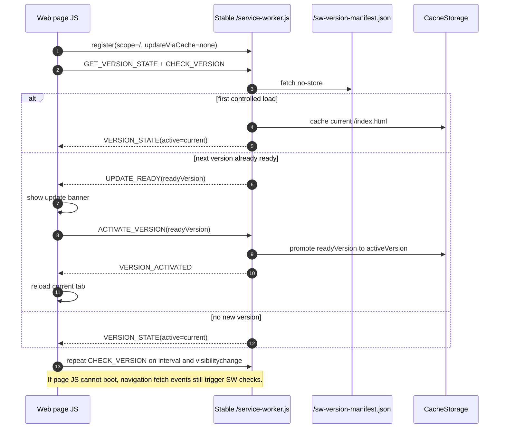
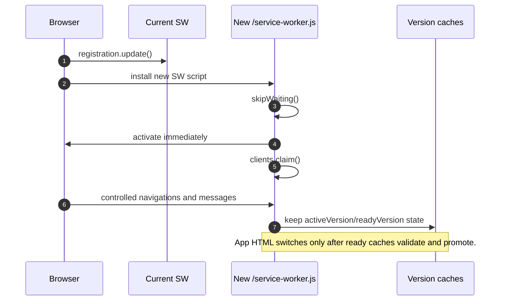
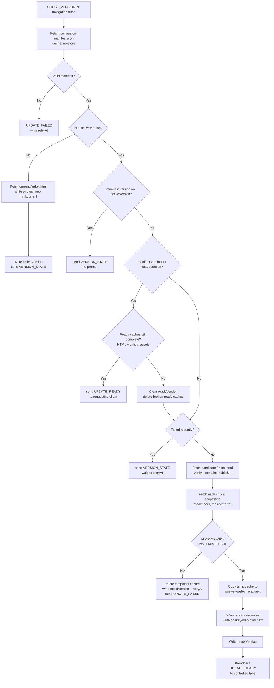
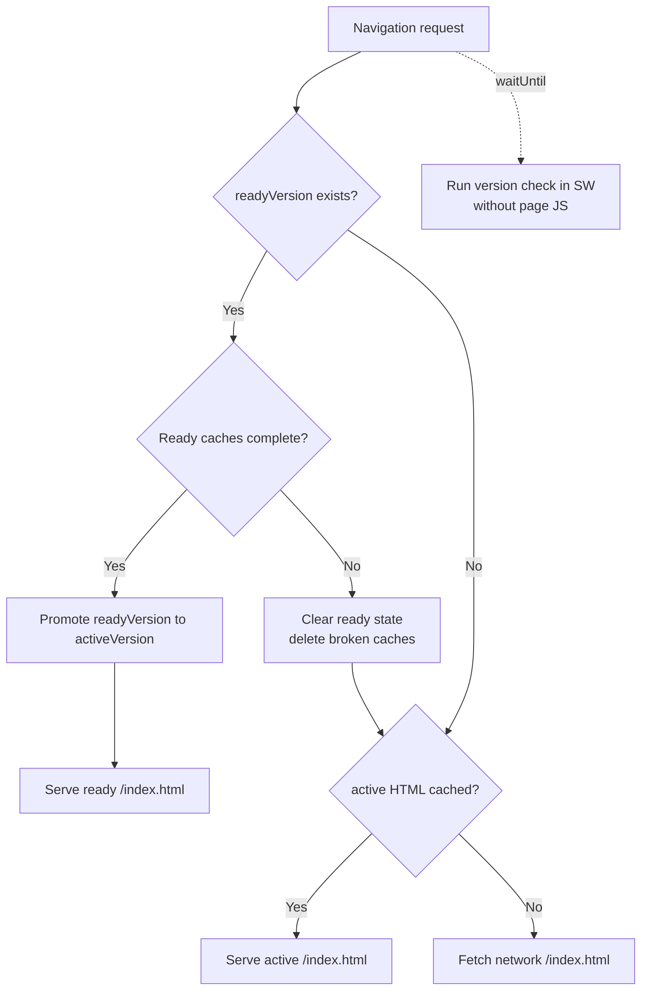
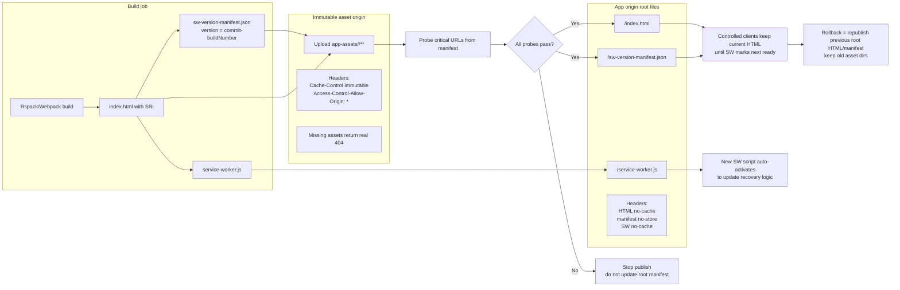

# Web Service Worker Version Preload Plan

## Background

The web app currently registers the service worker from `PUBLIC_URL`. In
production, `PUBLIC_URL` points to a versioned asset directory such as
`https://app-assets.onekey.so/<commit>-<build>/`, so the service worker path can
change on each release.

The current service worker also uses `NetworkFirst` for navigations and caches
all navigations as `/index.html`. That means a refresh can fetch the latest HTML
before the next version's critical resources are ready, which turns the update
into another cold start.

The desired behavior is:

1. First cold load is still served by the network. The service worker cannot
   improve a page it does not yet control.
2. For controlled repeat visits, the service worker detects the next version.
3. It preloads only the next version's critical page resources.
4. It prompts the user only after the critical resource set is ready.
5. A user refresh or the next accepted navigation switches HTML to the ready
   version instead of starting from an unprepared network HTML response.
6. If the old page JS fails to boot, browser navigations still let the service
   worker discover and prepare the next version, then the following navigation
   promotes the prepared HTML automatically.

## Runtime Boundary

This is a web runtime issue, not a native `main`/`bg` Hermes issue.

- Page JS runs in each browser tab.
- Service worker JS runs in a separate browser service worker context.
- Page JS heaps and service worker JS heaps are not shared.
- `CacheStorage`, HTTP disk cache, and IndexedDB are browser-managed storage
  resources available through APIs.
- Version state must be synchronized through `postMessage`, CacheStorage,
  IndexedDB, or BroadcastChannel.

## Deployment Contract

The service worker must be stable and same-origin with the app page:

```text
https://app.onekey.so/service-worker.js
https://app.onekey.so/sw-version-manifest.json
https://app.onekey.so/index.html
https://app-assets.onekey.so/<commit>-<build>/static/js/...
```

Required headers:

```text
/service-worker.js
  Content-Type: application/javascript
  Cache-Control: no-cache, must-revalidate

/sw-version-manifest.json
  Content-Type: application/json
  Cache-Control: no-store

/index.html and /404.html
  Cache-Control: no-cache, must-revalidate

https://app-assets.onekey.so/<commit>-<build>/**
  Cache-Control: public, max-age=31536000, immutable
  Access-Control-Allow-Origin: *
```

The asset origin must return a real 404 for missing JS/CSS/wasm/font/image
resources. It must not fall back to HTML for asset URLs.

## Release Ordering

Publishing must be two-phase:

1. Upload immutable assets to the versioned asset directory.
2. Probe critical assets from the CDN and verify they are globally readable.
3. Publish root HTML and `sw-version-manifest.json`.
4. Invalidate only mutable root files if needed.
5. Retain previous immutable asset directories for old tabs and rollback.

The service worker optimization only protects controlled repeat visits. New
users and uncontrolled pages still require atomic deployment ordering.

## Web Main Update Flow

The page is responsible for registering the stable service worker, asking it to
check the app version, showing the update prompt, and reloading only the current
tab after activation.



## Service Worker Update Flow

The service worker script should update as soon as the browser sees a newer
`/service-worker.js`. This only updates recovery logic and fetch handling. It
does not automatically serve new app HTML.



The app-version flow only announces `UPDATE_READY` after the next version HTML
and critical resources have been fetched, validated, and written to versioned
caches.



Navigation has one additional recovery path:



## Operations Workflow

Operations must treat the root app files and immutable asset directories as two
different deployment surfaces. The mutable root files move users to a version;
the immutable asset directory provides the bytes for that version.



## Build Manifest

The build emits `sw-version-manifest.json` after the final HTML and SRI tags are
generated.

Minimal schema:

```json
{
  "schema": 1,
  "version": "<commit>-<buildNumber>",
  "appVersion": "6.5.0",
  "bundleVersion": "99999999",
  "buildNumber": "07051234-dev",
  "commit": "<git sha>",
  "buildTime": 1783260000000,
  "publicUrl": "https://app-assets.onekey.so/<commit>-<build>/",
  "htmlUrl": "/index.html",
  "critical": [
    {
      "url": "https://app-assets.onekey.so/<commit>-<build>/main.hash.bundle.js",
      "as": "script",
      "integrity": "sha384-...",
      "size": 123456
    }
  ]
}
```

The critical list is generated from the final `index.html` script and stylesheet
tags, not guessed from chunk names.

`version` is the immutable asset directory identity: `<commit>-<buildNumber>`.
`bundleVersion` is retained as release metadata, but it does not participate in
the service worker version comparison unless the asset directory naming contract
also changes.

## Service Worker State Machine

Persistent state:

```text
UNINITIALIZED
  -> CACHE_CURRENT_HTML
  -> IDLE(current)

IDLE(current)
  -> CHECKING
  -> PREFETCHING(next)
  -> READY(next)
  -> SERVING(next)

PREFETCHING(next)
  -> FAILED(next, retryAt)
```

Page to service worker messages:

```text
GET_VERSION_STATE
CHECK_VERSION
ACTIVATE_VERSION
SKIP_WAITING
```

Service worker to page messages:

```text
VERSION_STATE
UPDATE_CHECKING
UPDATE_READY
UPDATE_FAILED
VERSION_ACTIVATED
```

## Prefetch Rules

Critical prefetch must be atomic:

1. Fetch `sw-version-manifest.json` with `cache: 'no-store'`.
2. Reject invalid schema, downgrade candidates, or missing critical assets.
3. Fetch candidate HTML with `cache: 'no-store'`.
4. Ensure candidate HTML contains the manifest `publicUrl`.
5. Fetch each critical asset with `mode: 'cors'`.
6. Reject opaque responses, redirects, non-2xx status, wrong MIME, and integrity
   mismatch.
7. Store resources in a temporary version cache.
8. Mark `readyVersion` only after every critical asset succeeds.
9. Delete temporary caches on failure and retry with backoff.

The first implementation may use SRI metadata when available and should keep the
state machine conservative if integrity metadata is missing.

When there is no persisted active version yet, the service worker only caches
the current HTML and records it as `activeVersion`. It does not re-download the
current version's critical assets; those are already handled by the browser HTTP
cache and the normal runtime `CacheFirst` route once the page is controlled.

## Navigation Policy

Navigation requests are no longer `NetworkFirst`.

- Every navigation schedules a service worker version check with
  `event.waitUntil()`. This check does not block the HTML response, and it does
  not require page JS to boot.
- If an active version HTML is cached, serve it for app navigations.
- If a ready version exists, validate its cached HTML and every critical asset.
- If the ready caches are complete, promote it to `activeVersion` and serve the
  ready HTML. This is the second-refresh recovery path.
- If the ready caches are incomplete, delete the broken ready caches, clear
  `readyVersion`, and continue serving the current active HTML.
- After `ACTIVATE_VERSION`, serve the ready version HTML.
- If no versioned HTML exists, fall back to network `/index.html`.

This prevents the browser from switching to a new HTML document before the next
version's critical resources are ready.

## Anti-Bricking Invariants

The update path must keep working even when the currently cached page cannot run
its JS bundle.

- Updated service worker scripts auto-activate with `skipWaiting()` and
  `clients.claim()` so recovery logic can be replaced without a page prompt.
- App HTML activation is still version-state controlled. A new SW script does
  not directly serve new HTML.
- Navigation fetch events trigger version checks independently from page JS.
- `UPDATE_READY` is sent only if ready HTML and critical assets still exist in
  CacheStorage.
- `ACTIVATE_VERSION` and navigation auto-promotion both revalidate the ready
  caches before switching `activeVersion`.
- A broken ready cache is deleted and rebuilt instead of being promoted.

## Cache Policy

Cache names:

```text
onekey-web-html:<version>
onekey-web-critical:<version>
onekey-web-critical-temp:<version>
static-assets
static-resources
```

Cleanup policy:

- Keep active version.
- Keep ready version.
- Keep at least one previous version.
- Do not delete caches for a version that may still be used by open clients.
- CDN must retain old immutable asset directories longer than the browser cache
  retention window.

## UX Policy

The page shows the update banner only after `UPDATE_READY`.

Clicking refresh should:

1. Send `ACTIVATE_VERSION` to the service worker.
2. Wait for `VERSION_ACTIVATED`.
3. Reload the current tab only.

Other tabs receive update-ready state but are not forced to reload.

If the page JS cannot boot and the banner is unavailable, users can still
recover by refreshing twice after a new version is published:

1. The first controlled refresh is served from the active HTML cache while the
   service worker prefetches the next version in the background.
2. The second controlled refresh validates and promotes the ready version, then
   serves the new HTML.

## Observability

The implementation should report:

- service worker registration failure
- manifest fetch failure
- invalid manifest
- prefetch start/success/failure
- integrity mismatch
- quota failure
- update ready
- user activation
- chunk-load terminal failure

Console-only logging is not enough because production builds drop console calls.

## Implementation Phases

### P0

- Register `/service-worker.js` with `scope: '/'` and `updateViaCache: 'none'`.
- Generate `sw-version-manifest.json` in Rspack and Webpack web builds.
- Replace `updatefound` app-version flow with explicit service worker messages.
- Replace navigation `NetworkFirst` with versioned HTML serving.
- Add atomic critical prefetch with conservative validation.

### P1

- Add release signing or a rollback directive trust model.
- Add telemetry events through the app logger.
- Add CDN deployment checks in CI/CD.
- Add quota-aware cleanup and richer old-client detection.
